# AI Job Agent 技术架构与面试复习手册

> 项目：`ai-job-agent`<br>
> 定位：一个从 Day 1 到 Day 70 逐步完成的 AI Agent 全栈项目，覆盖 Python、FastAPI、LLM、RAG、ReAct、多 Agent、MCP、安全、异步后端、可观测性、Docker 与 CI/CD 部署。<br>
> 用途：面向 AI Agent 应用工程师、AI 应用工程师、大模型应用开发工程师的面试复习和技术复盘。

这份 README 不是简单的启动说明，而是一张可追溯的技术地图。你既可以先看主体架构，也可以根据“主题节点”反向打开对应代码和 `docs/` 学习笔记，把 70 天做过的内容串成面试可讲的完整故事。

---

## 0. 如何使用这份文档

建议按三层复习：

1. **先看主体**：阅读第 1 到第 5 节，弄清楚项目边界、系统架构和 Agent 核心闭环。
2. **再按节点深挖**：从第 6 到第 16 节，按 RAG、工具、记忆、多 Agent、MCP、安全、异步、生产化、部署这些节点追踪到具体文件。
3. **最后按时间复习**：使用第 17 节的 Week 1 到 Week 10 逐天表，结合 `docs/day1.md` 到 `docs/day70.md` 回看每天遇到的问题和设计决策。

面试前重点复述四个闭环：

- RAG 闭环：切分 -> Embedding -> 混合检索 -> 重排 -> 上下文注入 -> 生成 -> 引用来源。
- Agent 闭环：理解目标 -> 决策工具 -> 执行工具 -> 观察结果 -> 更新上下文 -> 再次决策。
- 多 Agent 闭环：Supervisor 路由 -> Worker 执行 -> Handoff -> LangGraph checkpoint。
- 生产闭环：代码提交 -> CI 测试 -> 镜像构建 -> GHCR -> 服务器 pull -> Compose 启动 -> 公网访问。

---

## 1. 项目定位与目标

### 1.1 业务目标

项目解决的问题是：

- 解析招聘 JD，提取结构化岗位信息。
- 从本地知识库检索岗位相关技能和学习主题。
- 生成岗位分析、技能差距和学习建议。
- 用 Agent 自动决定调用哪些工具，而不是写死流程。
- 通过多 Agent、MCP、安全和生产化能力，把 Demo 推进到可部署系统。

### 1.2 学习目标

这个项目的目标不是训练模型，而是成为一名能设计、开发、评估、上线 AI Agent 产品的应用工程师。

需要覆盖的能力面：

| 能力面 | 项目对应内容 |
|---|---|
| Python 工程 | `uv`、`venv`、类型标注、`async/await`、Pydantic |
| 后端 API | FastAPI、依赖注入、认证、异常处理、流式响应 |
| LLM 调用 | DeepSeek OpenAI 兼容接口、Prompt、结构化输出、Function Calling |
| RAG | 切分、Embedding、向量库、混合检索、重排、查询改写、评估 |
| Agent | ReAct、工具注册表、状态、Human-in-the-loop、护栏 |
| 多 Agent | Plan-and-Execute、Supervisor、Handoff、LangGraph |
| MCP | Server、Client、Tool、Resource、Prompt、动态发现、权限 |
| 安全 | 提示注入、工具参数清洗、敏感数据脱敏、红队测试 |
| 后端工程 | PostgreSQL、Redis、arq、JWT、RBAC、租户隔离 |
| 稳定性 | 重试、熔断、降级、超时、背压、限流、压力测试 |
| 可观测性 | 结构化日志、Request ID、Prometheus、OpenTelemetry、成本追踪 |
| 部署 | Docker、Compose、Nginx、GHCR、GitHub Actions、单机部署 |

---

## 2. 技术栈全景

### 2.1 后端

- Python 3.12
- `uv` 管理 Python 版本和依赖
- FastAPI
- Pydantic v2
- OpenAI Python SDK，对接 DeepSeek 的 OpenAI 兼容接口
- LangGraph
- MCP SDK
- arq
- psycopg
- Redis
- Chroma / Qdrant
- sentence-transformers
- OpenTelemetry
- Prometheus client

### 2.2 前端

- React 19
- TypeScript
- Vite
- pnpm
- lucide-react
- 原生 `fetch` + SSE 流式渲染
- Vitest

### 2.3 基础设施

- Docker 多阶段构建
- Docker Compose
- Nginx
- PostgreSQL
- Redis
- Qdrant
- GitHub Actions
- GHCR

---

## 3. 系统架构总览

### 3.1 总体架构图

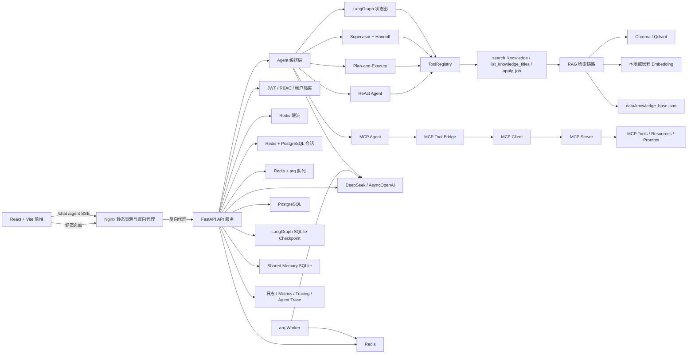

### 3.2 架构分层

```text
浏览器 / 前端
  -> Nginx
    -> FastAPI
      -> 认证、限流、会话、队列、可观测性
        -> Agent 编排层
          -> ReAct / Plan-and-Execute / Supervisor / LangGraph / MCP
            -> ToolRegistry / MCP Bridge
              -> RAG / 工具执行 / MCP Server
                -> DeepSeek / Chroma / Qdrant / PostgreSQL / Redis
```

### 3.3 部署形态

`docker-compose.yml` 是本地或完整开发形态，包含：

- `postgres`
- `redis`
- `qdrant`
- `backend`
- `worker`
- `frontend`

`docker-compose.2gb.yml` 是低内存服务器形态，后端使用远程 Embedding，关闭 Rerank，服务只保留 `postgres`、`redis`、`backend`、`frontend`。

---

## 4. AI Agent 工作原理

### 4.1 核心定义

AI Agent 不是只回答一次问题的聊天机器人，而是让 LLM 作为推理核心，在循环中：

```text
理解目标
  -> 拆解任务
  -> 选择工具
  -> 调用工具
  -> 获取观察结果
  -> 更新上下文
  -> 继续推理
  -> 最终交付
```

普通 LLM 应用和 Agent 的区别：

| 维度 | 普通 LLM 应用 | AI Agent |
|---|---|---|
| 执行模式 | 一次问答 | 多步循环 |
| 输出 | 主要生成文本 | 能调用工具并执行动作 |
| 上下文 | 相对固定 | 有状态、观察、记忆和轨迹 |
| 外部世界 | 通常不操作 | 可检索、执行、审批和修改外部状态 |

### 4.2 核心工作流程图

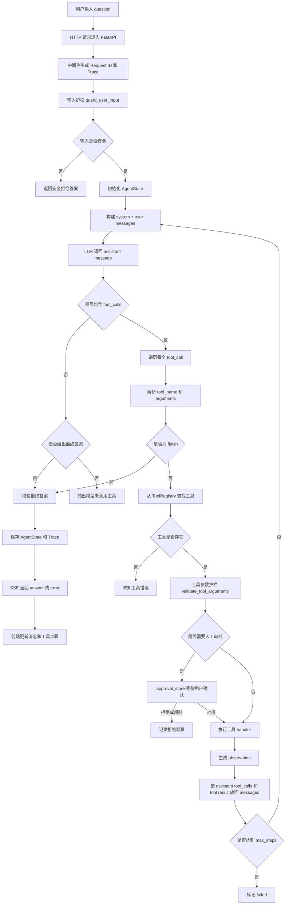

### 4.3 ReAct 具体解释

项目当前最基本的 Agent 是 `app/react.py` 中的 ReAct 循环：

- **Reasoning**：LLM 根据 system prompt、用户问题和历史 tool result 决定下一步。
- **Acting**：LLM 返回 `tool_calls`，Python 代码负责真正执行工具。
- **Observation**：工具执行结果被包成 `observation`，作为 `role=tool` 消息回填给模型。
- **Finish**：当模型调用 `finish` 时，任务结束。

关键点：

- 模型只负责“建议调用什么工具”，不直接执行工具。
- `ToolRegistry` 负责把工具名映射到真实 Python 函数。
- `assistant` 消息的 `tool_calls` 和 `tool` 消息的 `tool_call_id` 必须对齐，这是 Function Calling 协议的关键。
- `max_steps` 防止死循环。
- 工具异常不会让整个循环直接崩掉，而是转为“工具执行失败”的观察结果回传给模型。
- `apply_job` 需要审批，属于 Human-in-the-loop。

### 4.4 SSE 事件

前后端通过 SSE 通信：

```text
event: chunk
event: step
event: approval
event: answer
event: error
event: done
event: trace
```

含义：

- `chunk`：普通问答模式下的增量文本。
- `step`：Agent 的单个工具步骤。
- `approval`：需要用户审批的工具。
- `answer`：最终答案。
- `error`：错误信息。
- `done`：流结束。
- `trace`：可观测性 trace id。

---

## 5. 主要请求链路

### 5.1 `/jd/parse`

```text
用户提交 JD
  -> build_jd_parse_messages
  -> Function Calling 强制调用 save_job_description
  -> JSON / Pydantic 校验
  -> JobDescription
```

### 5.2 `/jd/analyze`

```text
解析 JD
  -> 用 keywords 构造检索 query
  -> RAG 检索 top_k
  -> format_context
  -> 岗位分析 Prompt
  -> Function Calling 输出 JobAnalysis
```

### 5.3 `/chat` 和 `/chat/stream`

```text
读取历史会话
  -> RAG 检索
  -> build_sources
  -> build_chat_messages
  -> ContextBudget 裁剪上下文
  -> LLM 回答
  -> 保存本轮问答
  -> 返回 reply + sources 或 SSE chunks
```

### 5.4 `/agent/stream`

```text
输入
  -> guard_user_input
  -> stream_react_loop
  -> ToolRegistry
  -> approval
  -> trace_stream
  -> ObservabilityStore
```

### 5.5 多 Agent 请求

- `/agent/plan/stream`：先 `plan_task`，再 `execute_plan`。
- `/agent/supervisor/stream`：Supervisor 路由到 Worker，支持 Handoff。
- `/agent/graph/stream`：LangGraph 状态图流式执行。
- `/agent/graph/start`、`/agent/graph/resume`、`/agent/graph/state/{run_id}`：长任务、检查点、恢复和状态查询。

---

## 6. 代码模块分层

### 6.1 API 与入口

| 文件 | 作用 |
|---|---|
| `app/main.py` | FastAPI 应用、lifespan、全部路由 |
| `app/auth_router.py` | 注册、登录、当前用户、管理员用户 |
| `app/day1.py` | Day 1 基础语法练习 |

### 6.2 数据模型

| 文件 | 作用 |
|---|---|
| `app/models.py` | 所有 Pydantic 模型：JD、分析、聊天、ReAct、Plan、Supervisor、GraphRunStatus、Memory |
| `app/auth_models.py` | 注册、登录、Token、TokenPayload、用户公开模型 |
| `app/agent_state.py` | ReAct Agent 状态和 JSON checkpoint |

### 6.3 LLM 与结构化输出

| 文件 | 作用 |
|---|---|
| `app/config.py` | Pydantic Settings 配置中心 |
| `app/llm.py` | 同步 OpenAI client、懒加载、JD 解析 |
| `app/async_llm.py` | 异步 LLM 调用、重试、信号量、fallback、成本记录 |
| `app/async_function_calling.py` | 异步 Function Calling |
| `app/function_calling.py` | 同步 Function Calling、结构化输出修复 |
| `app/structured_output.py` | JSON 解析、代码围栏去除、Pydantic 校验、Schema 生成 |
| `app/model_registry.py` | 模型注册表、任务选型、成本估算 |
| `app/model_fallback.py` | 备用模型列表 |
| `app/llm_cache.py` | LLM 结果缓存 key 和 Redis 缓存封装 |
| `app/cost_tracker.py` | Token、成本、延迟记录和预算控制 |

### 6.4 Prompt 工程

| 文件 | 作用 |
|---|---|
| `app/prompts.py` | 所有业务 Prompt 与消息构造 |
| `app/prompt_library.py` | 可注册、可版本化 Prompt 库 |
| `app/prompt_evaluate.py` | Prompt 离线评估 |

### 6.5 RAG

| 文件 | 作用 |
|---|---|
| `app/chunking.py` | 文本切分、token 统计、内容指纹、chunk 元数据 |
| `app/embedding_registry.py` | Embedding 模型注册与场景选择 |
| `app/remote_embedding.py` | 远程 Embedding，适配低内存部署 |
| `app/vector_store.py` | Chroma / Qdrant 向量库适配层 |
| `app/bm25.py` | 中文 tokenize 和 BM25 词法检索 |
| `app/rag.py` | RAGRetriever、HybridRetriever、PersistentHybridRetriever、HybridRerankRetriever |
| `app/query_rewriter.py` | Query Rewriting、多查询检索、结果合并 |
| `app/rag_evaluate.py` | RAG 端到端评估 |
| `app/evaluate.py` | 检索指标和引用覆盖率 |
| `app/agent_evaluate.py` | Agent 工具调用评估 |

### 6.6 Agent 编排

| 文件 | 作用 |
|---|---|
| `app/tools.py` | Tool、ToolRegistry、默认工具注册表 |
| `app/tool_executor.py` | 统一工具执行结果 |
| `app/react.py` | ReAct 循环、同步和流式 |
| `app/plan_execute.py` | Plan-and-Execute |
| `app/supervisor.py` | Supervisor + Handoff |
| `app/workers.py` | WorkerSpec、WorkerRegistry、knowledge 和 jd_analysis |
| `app/supervisor_graph.py` | LangGraph 状态图、checkpoint、幂等、租户、超时 |

### 6.7 MCP

| 文件 | 作用 |
|---|---|
| `app/mcp_server.py` | MCP Server，注册 Tool、Resource、Prompt |
| `app/mcp_tools.py` | MCP 知识库工具和资源 |
| `app/mcp_client.py` | MCP Client，工具发现和调用 |
| `app/mcp_agent_bridge.py` | MCP 工具转 OpenAI Function Schema、权限和脱敏 |
| `app/mcp_agent.py` | MCP Agent 流式 ReAct 循环 |

### 6.8 安全与记忆

| 文件 | 作用 |
|---|---|
| `app/memory.py` | 早期内存态 Memory 和 SessionStore |
| `app/postgres_session_store.py` | PostgreSQL 会话持久化 |
| `app/redis_session_cache.py` | Redis 缓存 + PostgreSQL 回源 |
| `app/shared_memory.py` | 多 Agent 共享记忆 |
| `app/prompt_guard.py` | 用户输入和工具参数护栏 |
| `app/guards.py` | 早期提示注入、最终答案和工具参数校验 |
| `app/tool_policy.py` | 工具权限策略 |
| `app/approval.py` | Human-in-the-loop 审批队列 |
| `app/sensitive_data.py` | 敏感信息脱敏和审计日志 |
| `app/red_team.py` | 红队测试与安全报告 |

### 6.9 异步、存储和稳定性

| 文件 | 作用 |
|---|---|
| `app/async_agent.py` | 异步 JD、聊天和流式业务链路 |
| `app/postgres.py` | 异步 PostgreSQL 连接池 |
| `app/user_repository.py` | 用户数据访问 |
| `app/redis_client.py` | Redis 客户端 |
| `app/redis_cache.py` | 通用 Redis 缓存 |
| `app/redis_rate_limiter.py` | 分布式限流 |
| `app/job_store.py` | Redis 任务状态存储 |
| `app/queue.py` | arq 队列 |
| `app/tasks.py` | Worker 任务定义 |
| `app/worker.py` | arq Worker 配置 |
| `app/resilience.py` | 重试、熔断、超时、降级、背压 |

### 6.10 可观测性

| 文件 | 作用 |
|---|---|
| `app/request_context.py` | ContextVar Request ID |
| `app/logging_config.py` | 结构化 JSON 日志 |
| `app/http_observability.py` | ASGI 中间件、W3C Trace Context、请求指标 |
| `app/metrics.py` | Prometheus HTTP 指标 |
| `app/tracing.py` | OpenTelemetry Provider 和 Tracer |
| `app/observability.py` | Agent Trace、事件记录、脱敏 |

---

## 7. API 接口清单

| 方法 | 路径 | 说明 | 主要模型或响应 |
|---|---|---|---|
| GET | `/health` | 服务健康检查 | `{"status":"ok"}` |
| GET | `/metrics` | Prometheus 指标 | text/plain |
| GET | `/health/db` | PostgreSQL 健康检查 | `{"status":"ok"}` |
| GET | `/health/redis` | Redis 健康检查 | `{"status":"ok"}` |
| GET | `/health/queue` | arq 队列健康检查 | `{"status":"ok"}` |
| POST | `/jd/parse` | 解析 JD | `JobDescription` |
| POST | `/jd/analyze` | 解析并分析 JD | `JobAnalysis` |
| POST | `/chat` | 普通多轮问答 | `ChatResponse` |
| POST | `/chat/stream` | 流式问答 | SSE |
| POST | `/jobs/analyze` | 创建异步任务 | 202 + 任务状态 |
| GET | `/jobs/{job_id}` | 查询任务状态 | 任务状态对象 |
| POST | `/agent/stream` | ReAct Agent 流式执行 | SSE |
| POST | `/agent/approve` | 审批 Agent 工具 | `{"status":"ok"}` |
| GET | `/agent/traces/{trace_id}` | 查询 Agent Trace | `AgentTrace` |
| POST | `/agent/plan/stream` | Plan-and-Execute | SSE |
| POST | `/agent/supervisor/stream` | Supervisor + Handoff | SSE |
| POST | `/agent/graph/stream` | LangGraph 流式执行 | SSE |
| POST | `/agent/graph/start` | 启动 LangGraph run | `GraphRunStatus` |
| POST | `/agent/graph/resume` | 恢复 LangGraph run | `GraphRunStatus` |
| GET | `/agent/graph/state/{run_id}` | 查询 LangGraph 状态 | `GraphRunStatus` |
| GET | `/agent/memory/{run_id}` | 列出共享记忆 | `list[MemoryRecord]` |
| GET | `/agent/memory/{run_id}/{key}` | 读取共享记忆 | `MemoryRecord` |
| DELETE | `/agent/memory/{run_id}/{key}` | 删除共享记忆 | `{"status":"ok"}` |
| POST | `/agent/mcp/stream` | MCP Agent 流式执行 | SSE |
| POST | `/auth/register` | 注册 | `TokenResponse` |
| POST | `/auth/login` | 登录 | `TokenResponse` |
| GET | `/auth/me` | 当前用户 | `UserPublic` |
| GET | `/auth/admin/users` | 管理员用户列表 | `list[UserPublic]` |

---

## 8. RAG 检索链路

### 8.1 完整流程

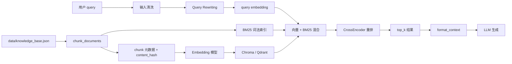

### 8.2 切分

`app/chunking.py` 支持：

- `fixed`：固定长度加重叠。
- `semantic`：先按空行和句号、感叹号、问号、分号切分，再合并短片段。
- `paragraph`：按段落切分。

每个 chunk 包含：

- `chunk_id`
- `doc_id`
- `title`
- `text`
- `chunk_index`
- `source_uri`
- `source_type`
- `section`
- `language`
- `char_count`
- `token_count`
- `content_hash`
- `chunking_version`
- `prev_chunk_id`
- `next_chunk_id`

`content_hash` 是内容指纹，为后续增量更新、失效判断和去重打基础。

### 8.3 Embedding

早期直接使用 `BAAI/bge-small-zh-v1.5`。生产化后通过 `app/embedding_registry.py` 管理模型 Profile：

- 维度
- 最大序列长度
- 是否支持中文
- 是否多语言
- 是否归一化
- 延迟等级
- 质量等级

低内存服务器使用远程 Embedding，避免本地加载大模型。

### 8.4 向量库适配

`app/vector_store.py` 定义统一 `VectorStore` 协议，支持：

- Chroma `PersistentClient`
- Qdrant `QdrantClient`

支持 `upsert`、`load_embeddings`、`has_chunks`、`query`。

### 8.5 混合检索和重排

`HybridRerankRetriever` 的检索步骤：

1. 对 query 做 Embedding。
2. 从向量库取 `candidate_top_k` 个候选。
3. 用 BM25 取词法候选。
4. 合并候选集合。
5. 分别归一化向量分和 BM25 分。
6. 使用 `hybrid_alpha` 加权。
7. 可选使用 `CrossEncoder` 做精排。
8. 返回 `top_k`。

### 8.6 Query Rewriting

`app/query_rewriter.py`：

- 把自然语言问题改写为更利于检索的关键词。
- 可生成最多 3 个 `sub_queries`。
- 对多个查询分别检索并合并去重。
- 改写失败时降级使用原始 query。

### 8.7 评估

检索评估指标：

- Recall@K
- Precision@K
- MRR
- NDCG@K
- citation_coverage
- answer_keyword_coverage

端到端评估不只检查“检索到哪个 chunk”，还检查：

- 必调工具召回率
- 禁止工具违规
- 最终答案关键词覆盖

---

## 9. 记忆、会话与上下文

### 9.1 短期记忆

LLM 本身无状态，每轮对话都要显式把历史消息重新传给模型。

项目实现多层会话存储：

```text
RedisSessionCache
  -> 命中 Redis，直接返回
  -> 未命中，从 PostgresSessionStore 读
  -> 回填 Redis
```

写入时：

```text
先写 PostgreSQL
  -> 删除 Redis 缓存
  -> 下一轮重新回源并缓存
```

### 9.2 上下文预算

`app/context.py`：

- 用 `tiktoken` 估算 token。
- 保留系统消息。
- 从最旧的对话组开始裁剪。
- 预留输出 token，避免历史消息挤爆上下文。

### 9.3 Agent 状态和 Checkpoint

`app/agent_state.py` 定义：

```text
running
  -> finished
  -> failed
```

支持保存 JSON checkpoint，记录：

- 当前问题
- 已完成步骤
- 最终答案或失败状态

### 9.4 LangGraph Checkpoint

`app/supervisor_graph.py` 使用 `langgraph-checkpoint-sqlite`：

- 保存 `thread_id=run_id` 对应的图状态。
- 支持 `interrupt_before=["finalize"]`。
- 可查询 `next_nodes` 和 `interrupts`。
- 可恢复执行。

### 9.5 共享记忆

`app/shared_memory.py` 用 SQLite 存储多 Agent 共享状态：

- namespace 隔离。
- key-value JSON。
- 支持 list、get、delete。
- namespace 使用 `tenant:{tenant_id}:run:{run_id}`，实现租户隔离。

---

## 10. 工具系统与 Function Calling

### 10.1 Tool 数据结构

`app/tools.py` 中：

```text
Tool:
  name
  description
  parameters
  handler
  input_field
  requires_approval
```

默认工具：

- `search_knowledge`：知识库检索。
- `list_knowledge_titles`：列出知识库标题。
- `apply_job`：模拟投递岗位，需要审批。
- `finish`：由 `ToolRegistry.to_openai_tools()` 自动追加，表示结束。

### 10.2 ToolRegistry

`ToolRegistry` 解决“新增工具要改 ReAct 循环”的问题：

- `register`
- `get_tool`
- `tool_names`
- `list_tools`
- `to_openai_tools`

Agent 循环不再依赖工具名硬编码，而是：

```text
从 model tool_calls 拿到 name
  -> registry.get_tool(name)
  -> 调用 handler
  -> 把 observation 回填
```

### 10.3 结构化输出

`app/structured_output.py`：

- 清理 Markdown 代码块。
- `json.loads` 解析。
- Pydantic `model_validate` 校验。
- 统一抛 `StructuredOutputError`。
- 从 Pydantic 模型生成 JSON Schema，避免手写 Schema 和数据模型不一致。

### 10.4 Function Calling 修复

`app/function_calling.py`：

- 网络异常和结构化输出异常都进入重试。
- 找不到期望工具时给出明确错误。
- 参数解析失败时，把原 `assistant tool_calls` 和一条 `tool` 错误消息放回上下文，让模型看到自己错在哪里并重新调用。

### 10.5 Human-in-the-loop

`app/approval.py`：

- 每个 `request_id` 对应一个队列。
- `/agent/stream` 中 Agent 需要审批时调用 `approval_store.wait(request_id)`。
- 用户通过 `/agent/approve` 把结果放入队列。
- 超时默认返回拒绝，避免请求永久卡住。

---

## 11. 多 Agent 架构

### 11.1 演进顺序

```text
固定步骤 JD 分析
  -> ReAct
  -> ToolRegistry
  -> Human-in-the-loop
  -> Plan-and-Execute
  -> Supervisor
  -> Handoff
  -> LangGraph
  -> Checkpoint / Resume
  -> Shared Memory
  -> 租户隔离 / 幂等 / 超时
```

### 11.2 Plan-and-Execute

`app/plan_execute.py`：

1. 规划器读取用户问题和工具目录。
2. Function Calling 强制输出 `Plan`。
3. 校验步骤结构、工具是否存在、依赖是否合法。
4. 执行器按依赖关系执行步骤。
5. 记录 `pending/running/completed/failed/skipped` 状态。
6. 最后根据步骤轨迹生成最终答案。

好处：

- 先规划后执行，任务轨迹更稳定。
- 便于中断、恢复和审计。
- 执行器可以做依赖判断，不依赖模型按顺序生成。

### 11.3 Supervisor + Handoff

`app/supervisor.py` 和 `app/workers.py`：

- Supervisor 只做路由，不直接回答。
- `knowledge` Worker 处理知识库问答。
- `jd_analysis` Worker 处理 JD 分析。
- Worker 可以 Handoff 给另一个 Worker。
- `MAX_HANDOFFS` 防止无限交接。

流程图：

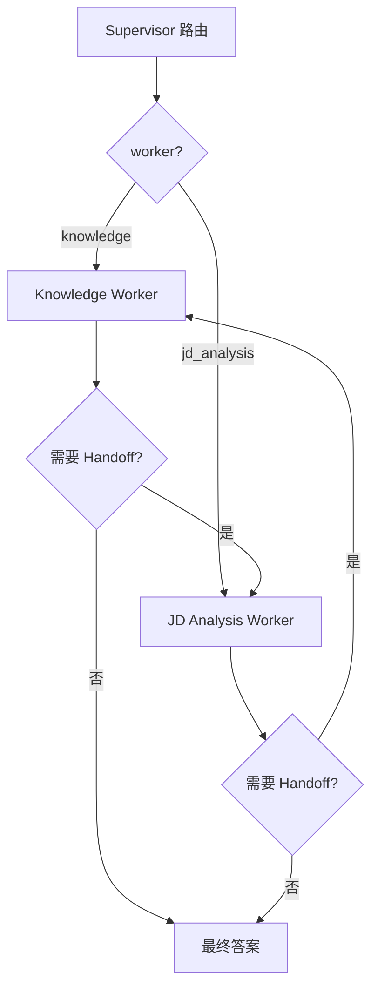

### 11.4 LangGraph 状态图

`app/supervisor_graph.py` 的节点：

```text
supervisor
  -> worker
    -> handoff or finalize
      -> worker or END
```

图状态：

- `question`
- `current_decision`
- `worker_result`
- `handoffs`
- `handoff_count`
- `result`

生产能力：

- checkpoint 持久化
- 中断和恢复
- 租户 namespace
- request_id 幂等
- 超时
- 状态查询

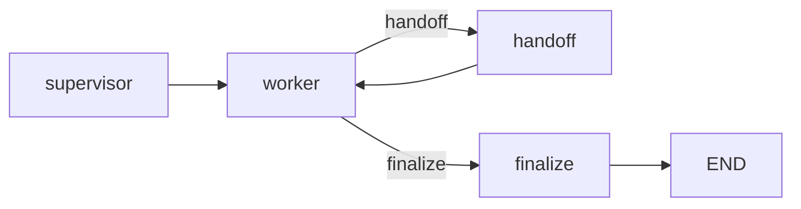

---

## 12. MCP 体系

### 12.1 MCP 是什么

MCP，Model Context Protocol，是模型连接外部工具、资源和数据源的标准化协议。

本项目把 MCP 理解为工具和 Agent 之间的标准接口：

```text
Agent
  -> MCP Client
  -> MCP Server
  -> Tools / Resources / Prompts
```

### 12.2 MCP Server

`app/mcp_server.py` 注册：

- Tool：`search_knowledge`、`list_knowledge_titles`、`get_knowledge_document`
- Resource：`knowledge://titles`、`knowledge://docs/{title}`
- Prompt：`analyze_jd`

支持 transport：

- `stdio`
- `sse`
- `streamable-http`

### 12.3 MCP Client

`app/mcp_client.py`：

- 启动 stdio 子进程。
- 建立 `ClientSession`。
- `initialize`。
- `list_tools`。
- `call_tool`。
- 支持超时。

### 12.4 MCP Agent Bridge

`app/mcp_agent_bridge.py`：

- 动态发现 MCP 工具。
- 把 MCP `input_schema` 转成 OpenAI Function Schema。
- 工具调用前做参数护栏。
- 工具调用前做权限策略检查。
- 返回结果做敏感信息脱敏。

### 12.5 MCP 安全链路

```text
用户输入
  -> guard_user_input
  -> Agent
  -> guard_tool_arguments
  -> ToolPermissionPolicy
  -> MCP Client
  -> MCP Server
```

关键原则：

- MCP 工具返回的数据是不可信内容，不是系统指令。
- 只允许注册在权限策略中的工具。
- 危险工具必须审批。
- 所有工具结果在进入日志、Trace 和上下文前脱敏。

---

## 13. 安全设计

### 13.1 输入护栏

`app/prompt_guard.py`：

- 去除非换行、非 tab 控制字符。
- 限制最大长度。
- 检测常见提示注入关键词。
- 检测 `system:`、`role: system`、`<|im_start|>`、`[system]` 等模式。

### 13.2 工具参数护栏

递归处理：

- string
- dict
- list
- int / float / bool
- None

拒绝不支持的参数类型和注入内容。

### 13.3 工具权限

`app/tool_policy.py` 定义风险等级：

- `read`
- `write`
- `dangerous`

默认策略：

- `search_knowledge`：read，允许。
- `list_knowledge_titles`：read，允许。
- `get_knowledge_document`：read，允许。
- `apply_job`：dangerous，需要审批。

### 13.4 敏感数据脱敏

`app/sensitive_data.py` 识别并替换：

- 邮箱
- 手机号
- 身份证号
- API Key / Secret / Token

同时提供 `AuditLogger`，导出 JSONL。

### 13.5 红队测试

`app/red_team.py` 覆盖：

- 直接提示注入
- 角色伪装
- 工具参数注入
- 未知工具
- 危险工具审批
- 控制字符清洗

输出：

- 总用例数
- 通过率
- 失败用例

---

## 14. 异步、数据库、缓存与任务队列

### 14.1 异步化

- FastAPI 异步接口。
- `AsyncOpenAI` 异步 LLM 调用。
- `asyncio.Semaphore` 控制 LLM 并发。
- `asyncio.to_thread` 把同步向量检索放入线程池。

### 14.2 PostgreSQL

职责：

- 用户表。
- 会话消息持久化。
- 通过 `psycopg` 异步连接池访问。

相关文件：

- `app/postgres.py`
- `app/user_repository.py`
- `app/postgres_session_store.py`
- `migrations/`

### 14.3 Redis

职责：

- 会话缓存。
- 限流。
- 任务状态。
- arq 队列。

限流使用 Lua 脚本实现原子 `INCR + EXPIRE`。

### 14.4 任务队列

`/jobs/analyze` 的流程：

```text
API 创建 job_id
  -> JobStore 记录 queued
  -> arq enqueue
  -> 立即返回 202
```

Worker：

```text
领取任务
  -> 标记 running
  -> 调用 analyze_job_async
  -> 标记 completed 或 failed
```

客户端：

```text
GET /jobs/{job_id}
  -> 轮询状态
```

---

## 15. 认证、授权与租户隔离

### 15.1 认证

- 注册：密码用 `pwdlib[argon2]` 哈希。
- 登录：校验密码，签发 JWT。
- JWT 包含 `sub`、`roles`、`tenant_id`、`iat`、`exp`。
- FastAPI 使用 `HTTPBearer` 提取 Token。

### 15.2 授权

- RBAC：`require_roles("user")` 或 `require_roles("admin")`。
- `/jobs/analyze` 需要 user 角色。
- `/auth/admin/users` 需要 admin 角色。

### 15.3 租户隔离

- 创建任务时把 `tenant_id` 写入 payload。
- 查询任务时校验 payload 的 `tenant_id` 是否等于当前用户。
- 多 Agent 共享记忆使用 `tenant:{tenant_id}:run:{run_id}` namespace。
- LangGraph run 也用 `tenant_id` 隔离。

---

## 16. 可观测性、成本与稳定性

### 16.1 可观测性

四层能力：

1. 结构化 JSON 日志。
2. Request ID 关联日志。
3. Prometheus 指标。
4. OpenTelemetry Trace。

`app/http_observability.py`：

- 提取 W3C Trace Context。
- 生成或透传 `x-request-id`。
- 创建 HTTP Server Span。
- 记录异常。
- 注入响应头。
- 记录请求量、耗时和 in-flight 请求。

`app/observability.py`：

- Agent Trace。
- 记录 step、approval、answer、error、done。
- 数据脱敏。
- 可通过 `/agent/traces/{trace_id}` 查询。

### 16.2 LLM 成本

`app/cost_tracker.py`：

- 记录模型、输入 token、输出 token、成本、延迟。
- 使用 Prometheus Counter 和 Histogram。
- 支持成本预算。

`app/async_llm.py`：

- 指数退避 + jitter。
- fallback 模型。
- 并发信号量。
- 自动成本记账。

`app/llm_cache.py`：

- 基于请求内容的 SHA256 cache key。
- 默认 TTL。

### 16.3 稳定性组件

`app/resilience.py`：

- `async_retry`：重试和指数退避。
- `CircuitBreaker`：CLOSED / OPEN / HALF_OPEN。
- `with_timeout`：超时。
- `run_with_fallback`：降级。
- `BackpressureGate`：并发背压。

---

## 17. 10 周逐天主题追溯

下面每个表用于快速定位某一天做了什么、对应哪些代码和文档。

### Week 1：Python、FastAPI、LLM、基础 RAG

| 天 | 主题 | 关键代码 | 文档 |
|---|---|---|---|
| Day 1 | Python 环境、类型、async、pytest | `app/day1.py` | `docs/day1.md` |
| Day 2 | FastAPI、Pydantic、路由、请求体 | `app/main.py`、`app/models.py` | `docs/day2.md` |
| Day 3 | DeepSeek JSON 输出与结构化解析 | `app/llm.py` | `docs/day3.md` |
| Day 4 | Function Calling、tool_calls | `app/llm.py` | `docs/day4.md` |
| Day 5 | 基础向量检索、Embedding | `app/rag.py`、`app/rag_cli.py` | `docs/day5.md` |
| Day 6 | 多步 JD 分析流程 | `app/agent.py` | `docs/day6.md` |
| Day 7 | 第 1 周复盘与测试 | README、tests | `docs/day7-week1.md` |

### Week 2：RAG 进阶

| 天 | 主题 | 关键代码 | 文档 |
|---|---|---|---|
| Day 8 | 文本切分 | `app/chunking.py` | `docs/day8.md` |
| Day 9 | BM25、混合检索、重排 | `app/bm25.py`、`app/rag.py` | `docs/day9.md` |
| Day 10 | Chroma 持久化 | `app/vector_store.py`、`app/rag.py` | `docs/day10.md` |
| Day 11 | 会话记忆 | `app/memory.py`、`app/agent.py` | `docs/day11.md` |
| Day 12 | 引用来源 | `app/models.py`、`app/agent.py` | `docs/day12.md` |
| Day 13 | 检索评估 | `app/evaluate.py` | `docs/day13.md` |
| Day 14 | 第 2 周复盘 | tests、README | `docs/day14-week2.md` |

### Week 3：ReAct Agent

| 天 | 主题 | 关键代码 | 文档 |
|---|---|---|---|
| Day 15 | ReAct 循环 | `app/react.py`、`app/models.py` | `docs/day15.md` |
| Day 16 | ToolRegistry 抽离工具 | `app/tools.py` | `docs/day16.md` |
| Day 17 | 一次响应多个 tool_calls | `app/react.py` | `docs/day17.md` |
| Day 18 | 错误处理和重试 | `app/react.py` | `docs/day18.md` |
| Day 19 | Human-in-the-loop | `app/approval.py`、`app/tools.py` | `docs/day19.md` |
| Day 20 | 基础安全护栏 | `app/guards.py`、`app/react.py` | `docs/day20.md` |
| Day 21 | Agent 状态与 checkpoint | `app/agent_state.py` | `docs/day21-week3.md` |

### Week 4：流式、前端、可观测性与 Docker MVP

| 天 | 主题 | 关键代码 | 文档 |
|---|---|---|---|
| Day 22 | SSE 事件格式与流式基础 | `app/streaming.py` | `docs/day22.md` |
| Day 23 | `/chat/stream` 后端流式接口 | `app/agent.py`、`app/main.py` | `docs/day23.md` |
| Day 24 | React 聊天前端 | `frontend/src/App.tsx`、`frontend/src/lib/sseParser.ts` | `docs/day24.md` |
| Day 25 | Agent 前端、审批和 step 事件 | `frontend/src/App.tsx`、`app/react.py` | `docs/day25.md` |
| Day 26 | Agent 端到端评估 | `app/agent_evaluate.py` | `docs/day26.md` |
| Day 27 | 本地 Agent 可观测性 | `app/observability.py` | `docs/day27.md` |
| Day 28 | Docker Compose MVP | `Dockerfile`、`docker-compose.yml`、`frontend/nginx.conf` | `docs/day28.md` |

### Week 5：Prompt、上下文、结构化输出和模型注册表

| 天 | 主题 | 关键代码 | 文档 |
|---|---|---|---|
| Day 29 | Token 统计和上下文预算 | `app/context.py` | `docs/day29.md` |
| Day 30 | Prompt 集中管理与 CoT | `app/prompts.py` | `docs/day30.md` |
| Day 31 | Pydantic 生成 Schema、统一结构化输出 | `app/structured_output.py` | `docs/day31.md` |
| Day 32 | Function Calling 错误修复 | `app/function_calling.py` | `docs/day32.md` |
| Day 33 | 模型注册表与任务选型 | `app/model_registry.py` | `docs/day33.md` |
| Day 34 | Prompt 离线评估 | `app/prompt_evaluate.py` | `docs/day34.md` |
| Day 35 | Prompt Library 版本化 | `app/prompt_library.py` | `docs/day35.md` |

### Week 6：RAG 工程化

| 天 | 主题 | 关键代码 | 文档 |
|---|---|---|---|
| Day 36 | Chunk 元数据、内容指纹和 token | `app/chunking.py` | `docs/day36.md` |
| Day 37 | Embedding 注册表 | `app/embedding_registry.py` | `docs/day37.md` |
| Day 38 | Chroma / Qdrant 向量库适配 | `app/vector_store.py` | `docs/day38.md` |
| Day 39 | 粗排 + 精排接入主流程 | `app/rag.py` | `docs/day39.md` |
| Day 40 | Query Rewriting | `app/query_rewriter.py` | `docs/day40.md` |
| Day 41 | RAG 端到端评估 | `app/rag_evaluate.py` | `docs/day41.md` |
| Day 42 | Query Rewriting 接入 Agent 工具 | `app/tools.py` | `docs/day42.md` |

### Week 7：多 Agent 与 LangGraph

| 天 | 主题 | 关键代码 | 文档 |
|---|---|---|---|
| Day 43 | Plan-and-Execute | `app/plan_execute.py` | `docs/day43.md` |
| Day 44 | Supervisor 模式 | `app/supervisor.py`、`app/workers.py` | `docs/day44.md` |
| Day 45 | Handoff | `app/supervisor.py`、`app/workers.py` | `docs/day45.md` |
| Day 46 | LangGraph 状态图 | `app/supervisor_graph.py` | `docs/day46.md` |
| Day 47 | Checkpoint、中断、恢复 | `app/supervisor_graph.py` | `docs/day47.md` |
| Day 48 | 多 Agent 共享记忆 | `app/shared_memory.py` | `docs/day48.md` |
| Day 49 | 租户隔离、幂等、超时 | `app/supervisor_graph.py` | `docs/day49.md` |

### Week 8：MCP 与安全

| 天 | 主题 | 关键代码 | 文档 |
|---|---|---|---|
| Day 50 | MCP 原理、只读 Server、Client | `app/mcp_server.py`、`app/mcp_client.py` | `docs/day50.md` |
| Day 51 | MCP Tool、Resource、Prompt、Transport | `app/mcp_server.py`、`app/mcp_tools.py` | `docs/day51.md` |
| Day 52 | Agent 动态发现 MCP 工具 | `app/mcp_agent_bridge.py`、`app/mcp_agent.py` | `docs/day52.md` |
| Day 53 | MCP 权限、审批、最小权限 | `app/tool_policy.py` | `docs/day53.md` |
| Day 54 | 提示注入防御、参数清洗 | `app/prompt_guard.py` | `docs/day54.md` |
| Day 55 | 敏感数据脱敏、审计日志 | `app/sensitive_data.py` | `docs/day55.md` |
| Day 56 | 红队测试、安全回归 | `app/red_team.py` | `docs/day56.md` |

### Week 9：异步后端、性能与稳定性

| 天 | 主题 | 关键代码 | 文档 |
|---|---|---|---|
| Day 57 | 异步 FastAPI 和异步 LLM | `app/async_agent.py`、`app/async_llm.py` | `docs/day57.md` |
| Day 58 | PostgreSQL、事务、迁移 | `app/postgres.py`、`migrations/` | `docs/day58.md` |
| Day 59 | Redis 缓存、会话、限流 | `app/redis_*`、`app/postgres_session_store.py` | `docs/day59.md` |
| Day 60 | arq 任务队列 | `app/queue.py`、`app/worker.py`、`app/tasks.py` | `docs/day60.md` |
| Day 61 | JWT、密码哈希、RBAC、租户 | `app/auth_*`、`app/user_repository.py` | `docs/day61.md` |
| Day 62 | 压力测试、Locust | `benchmarks/` | `docs/day62.md` |
| Day 63 | 重试、熔断、降级、超时、背压 | `app/resilience.py` | `docs/day63.md` |

### Week 10：容器、配置、可观测性、成本与 CI/CD

| 天 | 主题 | 关键代码 | 文档 |
|---|---|---|---|
| Day 64 | 生产级 Dockerfile、非 root、懒加载 | `Dockerfile`、`app/llm.py` | `docs/day64.md` |
| Day 65 | 生产级 Compose、健康检查、Named Volume | `docker-compose.yml` | `docs/day65.md` |
| Day 66 | 配置中心化、SecretStr、磁盘清理 | `app/config.py`、`app/config_cli.py` | `docs/day66.md` |
| Day 67 | 结构化日志、Request ID、Prometheus | `app/logging_config.py`、`app/http_observability.py`、`app/metrics.py` | `docs/day67.md` |
| Day 68 | OpenTelemetry、Trace、Span、W3C | `app/tracing.py`、`app/http_observability.py` | `docs/day68.md` |
| Day 69 | LLM 成本、Token、预算、缓存、降级 | `app/cost_tracker.py`、`app/async_llm.py` | `docs/day69.md` |
| Day 70 | CI/CD、GHCR、单机部署、公网访问 | `.github/workflows/`、`docker-compose.2gb.yml` | `docs/day70.md` |

---

## 18. 面试主题追溯矩阵

| 面试主题 | 最可能被问 | 代码入口 | 对应天数 |
|---|---|---|---|
| Agent 定义 | Agent 与普通 LLM 应用区别 | `app/react.py`、`app/supervisor_graph.py` | Day 15、Day 46 |
| ReAct | 为什么需要循环，如何防死循环 | `app/react.py` | Day 15、Day 18 |
| Function Calling | 模型调用和真实执行的区别 | `app/tools.py`、`app/function_calling.py` | Day 4、Day 16、Day 32 |
| Tool Registry | 如何让新增工具不侵入 Agent 循环 | `app/tools.py` | Day 16 |
| RAG | 为什么需要 RAG，完整链路 | `app/rag.py`、`app/chunking.py` | Day 5、Day 39 |
| 混合检索 | BM25 与向量检索互补 | `app/bm25.py`、`app/rag.py` | Day 9、Day 39 |
| 重排 | 粗排和精排区别 | `app/rag.py` | Day 9、Day 39 |
| 向量库 | Chroma 与 Qdrant 选型 | `app/vector_store.py` | Day 10、Day 38 |
| Embedding | 生成模型与 Embedding 模型的区别 | `app/embedding_registry.py` | Day 5、Day 37 |
| Query Rewriting | 为什么用户 query 不等于检索 query | `app/query_rewriter.py` | Day 40、Day 42 |
| 记忆 | 短期记忆、长期记忆、工作记忆 | `app/memory.py`、`app/postgres_session_store.py` | Day 11、Day 48 |
| 上下文预算 | 长会话如何裁剪 | `app/context.py` | Day 29 |
| 流式输出 | SSE 与 WebSocket 区别 | `app/streaming.py` | Day 22、Day 23 |
| Human-in-the-loop | 危险工具为什么需要审批 | `app/approval.py`、`app/tools.py` | Day 19、Day 25 |
| Plan-and-Execute | 与 ReAct 的区别 | `app/plan_execute.py` | Day 43 |
| Supervisor | 路由、Worker、Handoff | `app/supervisor.py`、`app/workers.py` | Day 44、Day 45 |
| LangGraph | 为什么用状态图，checkpoint 是什么 | `app/supervisor_graph.py` | Day 46、Day 47 |
| 多 Agent 记忆 | 不同 Agent 如何共享状态 | `app/shared_memory.py` | Day 48 |
| 幂等 | 重复请求如何不重复创建 run | `app/supervisor_graph.py` | Day 49 |
| 租户隔离 | SaaS 多租户如何隔离 | `app/auth_*`、`app/supervisor_graph.py` | Day 49、Day 61 |
| MCP | MCP 解决什么问题 | `app/mcp_server.py`、`app/mcp_client.py` | Day 50 到 Day 52 |
| 提示注入 | 如何防御直接和间接注入 | `app/prompt_guard.py` | Day 54 |
| 敏感数据 | 日志中如何脱敏 | `app/sensitive_data.py` | Day 55 |
| 红队测试 | 如何证明安全防线有效 | `app/red_team.py` | Day 56 |
| 异步后端 | 为什么异步能提高吞吐 | `app/async_llm.py`、`app/main.py` | Day 57 |
| PostgreSQL | 会话为什么落到数据库 | `app/postgres_session_store.py` | Day 58、Day 59 |
| Redis | 缓存和限流的应用 | `app/redis_*` | Day 59 |
| 任务队列 | 长任务为什么用队列 | `app/queue.py`、`app/worker.py` | Day 60 |
| JWT / RBAC | 认证与授权区别 | `app/auth_security.py`、`app/auth_dependencies.py` | Day 61 |
| 压力测试 | 如何看吞吐、延迟、错误率 | `benchmarks/http_benchmark.py` | Day 62 |
| 稳定性 | 熔断和重试的区别 | `app/resilience.py` | Day 63 |
| 可观测性 | 日志、指标、Trace 三者区别 | `app/http_observability.py`、`app/tracing.py` | Day 67、Day 68 |
| LLM 成本 | 如何估算和追踪成本 | `app/cost_tracker.py` | Day 69 |
| 部署 | 本地 Compose 与服务器部署差异 | `Dockerfile`、`docker-compose.2gb.yml` | Day 64、Day 65、Day 70 |
| CI/CD | 提交后到公网访问的完整链路 | `.github/workflows/` | Day 70 |

---

## 19. 面试高频问题与回答线索

### 19.1 Agent 基础

**1. 什么是 AI Agent？**

回答线索：

- LLM 是推理核心。
- Agent 在循环中理解目标、选择工具、执行工具、观察结果、更新上下文。
- 与聊天机器人相比，Agent 能操作外部系统，具备多步执行和状态。
- 本项目从固定步骤演进到 ReAct，再演进到 Plan、Supervisor 和 LangGraph。

**2. ReAct 的 Reason、Act、Observe 分别由谁完成？**

回答线索：

- Reason 和 Act 建议由 LLM 完成。
- Act 的真正执行由 Python `ToolRegistry` 完成。
- Observe 是工具返回值，通过 `role=tool` 回填。

**3. Agent 如何避免死循环？**

回答线索：

- `max_steps`。
- `finish` 工具。
- 工具异常转 observation。
- Supervisor 中 `MAX_HANDOFFS`。

### 19.2 Function Calling

**4. 模型返回 tool_calls 后发生了什么？**

回答线索：

- 解析 `tool_call.function.name` 和 `arguments`。
- 从 registry 查找工具。
- 参数护栏。
- 审批判断。
- 执行 handler。
- 回填 assistant tool_calls 和 tool result。

**5. 如何保证结构化输出稳定？**

回答线索：

- Pydantic 生成 JSON Schema。
- 统一 `parse_and_validate`。
- 清理代码围栏。
- 参数错误时构造修复消息让模型重试。

### 19.3 RAG

**6. RAG 的完整链路是什么？**

回答线索：

- 文档切分、Embedding、向量库。
- query 清洗和改写。
- 向量 + BM25 混合。
- 可选重排。
- 上下文注入 Prompt。
- 生成并返回来源。

**7. 为什么需要混合检索？**

回答线索：

- 向量检索擅长语义相似。
- BM25 擅长精确词法匹配。
- 两者归一化后加权，互补。

**8. 为什么要重排？**

回答线索：

- 混合检索粗排快速召回候选。
- CrossEncoder 精排更准确地判断 query 和 chunk 的关系。
- 粗排控制候选规模，精排控制最终质量。

**9. 如何评估 RAG？**

回答线索：

- Recall@K、Precision@K、MRR、NDCG。
- citation coverage。
- 端到端答案关键词覆盖。

### 19.4 多 Agent

**10. ReAct 与 Plan-and-Execute 的区别？**

回答线索：

- ReAct 逐步动态决策。
- Plan-and-Execute 先规划，再按依赖执行。
- Plan 更适合复杂、可拆解、可审计任务。

**11. Supervisor 的职责是什么？**

回答线索：

- 只负责路由到 Worker。
- 不直接回答用户。
- 输出结构化 `SupervisorDecision`。

**12. Handoff 解决什么问题？**

回答线索：

- Worker 发现自己不适合当前任务时，把任务交给更合适的 Worker。
- 需要限制最大交接次数。

**13. LangGraph 的价值？**

回答线索：

- 显式状态图。
- checkpoint。
- 中断和恢复。
- 可查询 next nodes。
- 可加超时、幂等和租户隔离。

### 19.5 MCP 与安全

**14. MCP 和传统 Function Calling 的关系？**

回答线索：

- Function Calling 是模型调用工具的协议。
- MCP 是模型连接外部工具、资源和数据源的标准化协议。
- MCP Client 可以把 Server 的 tool schema 转成 OpenAI Function Schema。

**15. 如何防御提示注入？**

回答线索：

- 输入关键词和模式检测。
- 工具参数递归清洗。
- 把外部数据视为不可信内容。
- 日志和 Trace 脱敏。
- 红队测试验证。

**16. 危险工具如何控制？**

回答线索：

- Tool 标记 `requires_approval`。
- 权限策略标记 risk。
- Agent 暂停并等待 `/agent/approve`。

### 19.6 生产化

**17. 为什么要异步化？**

回答线索：

- LLM 调用主要是 I/O。
- 异步可以并发等待多个外部请求。
- 使用信号量控制并发上限，防止打爆 LLM 和上游。

**18. Redis 在项目中承担哪些职责？**

回答线索：

- 会话缓存。
- 分布式限流。
- arq 队列。
- JobStore 任务状态。

**19. 长任务为什么使用任务队列？**

回答线索：

- API 快速返回 202。
- 长任务不阻塞请求线程。
- Worker 可独立扩展。
- 任务状态可查询。

**20. 如何做多租户隔离？**

回答线索：

- JWT 中带 tenant_id。
- 资源 payload 带 tenant_id。
- 查询时校验归属。
- 共享记忆和 LangGraph run 使用 tenant namespace。

**21. 日志、指标、Trace 分别解决什么？**

回答线索：

- 日志：单次请求发生了什么。
- 指标：系统整体趋势和告警。
- Trace：一次请求跨服务、跨 Agent 步骤的完整路径。

**22. 如何估算 LLM 成本？**

回答线索：

- 记录 input/output token。
- 模型注册表保存单价。
- `estimate_cost` 计算。
- `CostTracker` 汇总，并用预算限制。

**23. 重试、熔断、降级、背压有什么区别？**

回答线索：

- 重试：瞬时错误再试。
- 熔断：依赖持续失败时快速拒绝。
- 降级：主路径失败时返回兜底结果。
- 背压：限制并发，避免系统过载。

**24. CI/CD 完整链路是什么？**

回答线索：

- push 触发 CI 和 Release。
- lint、test、build。
- 构建镜像并推 GHCR。
- 服务器 pull。
- Compose 启动。
- Nginx 暴露公网。

---

## 20. 快速启动

### 20.1 环境变量

复制 `.env.example` 为 `.env`，至少配置：

```text
OPENAI_API_KEY=你的DeepSeek密钥
OPENAI_MODEL=deepseek-chat
OPENAI_BASE_URL=https://api.deepseek.com
JWT_SECRET=至少32字符的随机字符串
```

### 20.2 安装依赖

```bash
uv sync --all-groups
```

### 20.3 运行测试

```bash
uv run pytest
```

### 20.4 启动后端

```bash
uv run uvicorn app.main:app --reload
```

### 20.5 启动前端

```bash
cd frontend
pnpm install
pnpm dev
```

### 20.6 Docker Compose

```bash
docker compose up -d --build
```

---

## 21. 部署链路

### 21.1 镜像构建

后端 `Dockerfile`：

- builder 阶段安装依赖。
- runtime 阶段只复制 `.venv`、代码、迁移和知识库。
- 创建非 root 用户。
- 健康检查。

前端 `frontend/Dockerfile`：

- Node 阶段执行 `pnpm build`。
- Nginx 阶段只复制 `dist` 和 `nginx.conf`。

### 21.2 Compose 服务

`docker-compose.yml`：

- PostgreSQL 使用 named volume。
- Redis 开启 AOF。
- backend 启动前执行迁移。
- worker 独立运行 arq。
- frontend 通过 Nginx 反向代理 `/chat` 和 `/agent`。

### 21.3 CI/CD

`.github/workflows/ci.yml`：

- backend lint 和 test。
- frontend lint、test、build。
- Compose config 校验和镜像构建。

`.github/workflows/release.yml`：

- 构建 backend 和 frontend 镜像。
- 推送到 GHCR。

`.github/workflows/deploy.yml`：

- SSH 到服务器。
- git pull。
- pull 镜像。
- Compose 启动。

---

## 22. 当前已知限制与可继续深挖方向

面试时可以主动说明当前边界，体现工程判断：

- 会话消息当前是 Redis 缓存 + PostgreSQL 持久化，但缺少 Refresh Token 和令牌吊销。
- `apply_job` 是模拟动作，没有接真实外部招聘系统。
- Agent 可观测性 Store 目前是内存态，生产可替换为 Langfuse、Phoenix 或数据库。
- 稳定性组件已经单元化，但部分还未接入所有真实外部调用。
- 压力测试主要覆盖健康检查和部分接口。
- 单机部署满足当前项目规模，规模化可演进到 Kubernetes、GitOps、云托管和自动伸缩。
- LLM 成本追踪基于注册表单价，真实生产可接入账单或网关统一计量。

可继续深挖方向：

- 接真实浏览器、搜索、数据库工具。
- 引入长期记忆和向量化用户画像。
- 接入 Langfuse / LangSmith 做生产级 Agent 观测。
- 增加 A/B 评测和 Prompt 回归。
- 使用 Kafka / Redis Streams 处理更复杂异步流。
- 使用 Kubernetes、ArgoCD、Terraform 做云原生部署。
- 增加自动评测、多语言 RAG 和更完整的权限模型。

---

## 23. 推荐面试复述顺序

建议准备一段 5 到 8 分钟的项目自述：

1. 项目目标：解析 JD、知识库问答、岗位分析。
2. 技术栈：FastAPI、React、DeepSeek、RAG、LangGraph、MCP、Docker。
3. 核心架构：从 API 到 Agent 编排层，再到工具、RAG、外部服务和数据层。
4. 重点讲 Agent：ReAct 循环、ToolRegistry、审批、状态、Plan、Supervisor、LangGraph。
5. 重点讲 RAG：切分、Embedding、混合检索、重排、查询改写、评估。
6. 讲生产化：异步、PostgreSQL、Redis、任务队列、认证、安全、可观测性、CI/CD。
7. 主动讲一个最有价值的踩坑或设计决策，并说明如何用测试验证。

面试时尽量用“问题 -> 方案 -> 取舍 -> 验证”的结构回答，而不是只背概念。

---

## 24. 追加专题：Agent 模式选型、LangChain 生态、多租户与 LangGraph 深度解析

本节是后续补充内容，只追加在原 README 末尾，不改变前面章节。

### 24.1 单 ReAct Agent 和 Plan-and-Execute 是否冲突

它们不是竞品，而是 Agent 的两种控制流策略。

```text
ReAct：
  每一步都让模型根据当前观察结果动态决定下一步。

Plan-and-Execute：
  先让模型生成完整计划，再由执行器按计划执行。
```

两者可以解决同一类“用户提问后由 Agent 完成任务”的问题，但侧重点不同。

| 维度 | ReAct | Plan-and-Execute |
|---|---|---|
| 决策时机 | 每步动态决策 | 开始前集中规划 |
| 灵活性 | 高，能根据观察调整 | 中等，计划生成后相对固定 |
| 轨迹清晰度 | 有步骤，但路径可能较发散 | 计划明确，步骤和依赖清楚 |
| 实现复杂度 | 较低 | 较高，需要计划校验和状态管理 |
| 审计能力 | 一般 | 更好 |
| LLM 调用次数 | 可能更多，逐步推理 | 规划一次，执行阶段按计划推进 |
| 适合任务 | 探索性强、工具少、路径不固定 | 可拆解、步骤明确、需要稳定执行 |

实际选择：

- 工具较少、问题开放、需要根据检索结果临时判断下一步时，ReAct 更自然。
- 任务可以拆成固定步骤、有依赖关系、需要审计和恢复时，Plan-and-Execute 更合适。
- 两者也可以组合：先用 Plan 生成步骤，再在执行某个步骤时允许局部 ReAct。

项目中的演进不是“ReAct 被 Plan 替代”，而是增加了新的编排能力，让不同任务可以使用不同模式。

### 24.2 Supervisor 和 Plan-and-Execute 的关系

Supervisor 和 Plan-and-Execute 也不是同一层概念。

```text
Supervisor：
  负责“把任务交给谁”。

Plan-and-Execute：
  负责“拿到任务后怎么拆、怎么做”。
```

更准确地说：

- Supervisor 是多 Agent 的路由与协调层。
- Plan-and-Execute 是单个任务内部的执行策略。
- Worker 可以是 knowledge、jd_analysis，也可以是一个内部使用 Plan-and-Execute 的复杂 Agent。

真实业务选择：

| 场景 | 更适合 |
|---|---|
| 明确只有一种任务，例如只做知识库问答 | 单个 ReAct 或 Plan-and-Execute |
| 有多种异构任务，例如客服、工单、订单、知识库 | Supervisor + Worker |
| 单个任务较复杂，需要稳定拆解和追踪 | Worker 内部使用 Plan-and-Execute |
| 需要跨领域交接，例如知识库 Worker 把 JD 交给分析 Worker | Supervisor + Handoff |
| 需要审计、人工确认、断点恢复 | LangGraph 状态图 |

推荐组合：

```text
Supervisor 选择 Worker
  -> Worker 使用 Plan-and-Execute 拆解自身任务
  -> 必要时通过 Handoff 交给另一个 Worker
  -> LangGraph 负责 checkpoint、恢复和状态追踪
```

### 24.3 LangChain 生态中除了 LangGraph 还有什么

LangChain 不是单一库，而是一组工具和框架。

| 工具或框架 | 主要解决什么问题 |
|---|---|
| LangChain Core | 基础抽象，例如 Runnable、消息、Prompt、工具、输出解析器 |
| LangChain / LangChain Community | 提供大量模型、文档加载器、向量库、工具、Retriever 的集成 |
| LCEL | LangChain Expression Language，用管道方式组合 Runnable |
| LangGraph | 用图结构实现有状态、可恢复、可分支的多步 Agent |
| LangSmith | 开发、调试、评估、监控 LLM 应用和 Agent Trace |
| LangServe | 把 LangChain Runnable 快速部署成 REST API |
| LangChain Hub | 分享、查找、复用 Prompt 模板 |
| LangChain Templates | 常见场景的可复用项目模板 |
| LangChain CLI | 创建、管理、运行 LangChain 项目和模板 |

用途区分：

- 写 Prompt、调模型、加载文档、做简单 RAG：LangChain Core + Community。
- 需要多步 Agent、分支、循环、checkpoint：LangGraph。
- 需要线上调试、评估、观测：LangSmith。
- 需要把 Agent 快速发布为服务：LangServe。

本项目没有重度依赖 LangChain 高层封装，而是主要使用 LangGraph 做状态图和 checkpoint，同时保留更直接的 OpenAI SDK 调用。这样能更清楚地理解底层发生什么。

### 24.4 SaaS、IaaS 和多租户隔离

#### 24.4.1  IaaS

常见云服务分层：

```text
IaaS：基础设施即服务
PaaS：平台即服务
SaaS：软件即服务
```

| 层 | 含义 | 产品示例 |
|---|---|---|
| IaaS | 提供服务器、网络、存储等基础设施 | AWS EC2、阿里云 ECS、腾讯云 CVM |
| PaaS | 提供应用运行平台、数据库、中间件 | Heroku、Vercel、阿里云函数计算 |
| SaaS | 直接提供可用的软件服务 | Salesforce、Slack、Notion、Google Workspace |

#### 24.4.2 SaaS 多租户是什么

多租户指的是：

```text
一个应用实例同时服务多个客户或组织。
每个客户或组织称为一个 tenant。
不同 tenant 的数据在逻辑上隔离，彼此不能访问。
```

类比：

- 一栋写字楼有多家公司。
- 大楼、电梯、前台是共享的。
- 每家公司有自己的门禁和办公室。

在软件中，一个 SaaS 服务可能服务多家公司：

```text
tenant-a：A 公司用户和数据
tenant-b：B 公司用户和数据
```

#### 24.4.3 为什么要租户隔离

原因：

- 防止 A 公司读到 B 公司数据。
- 满足安全和合规要求。
- 避免一个租户的错误影响其他租户。
- 方便按租户统计用量、计费和配置权限。
- 支持不同租户有不同角色、配置和资源额度。

#### 24.4.4 常见的隔离级别

| 隔离级别 | 实现方式 | 成本 | 安全性 |
|---|---|---|---|
| 字段级隔离 | 每条记录加 `tenant_id` | 低 | 中 |
| Schema 隔离 | 每个租户独立数据库 schema | 中 | 较高 |
| 数据库隔离 | 每个租户独立数据库 | 高 | 高 |
| 集群或实例隔离 | 每个租户独立部署 | 最高 | 最高 |

本项目的租户隔离主要是字段级或 namespace 级：

```text
JWT 带 tenant_id
任务 payload 带 tenant_id
共享记忆 namespace 使用 tenant:{tenant_id}:run:{run_id}
```

#### 24.4.5 实际互联网产品

SaaS 多租户产品：

- Salesforce
- Slack
- Notion
- Shopify
- 飞书
- 钉钉
- Google Workspace
- 企业微信

IaaS 产品：

- AWS
- 阿里云
- 腾讯云
- Azure

在这些产品中，你注册一个组织或账号，通常就是一个 tenant。

### 24.5 `app/supervisor_graph.py` 逐段梳理与运行机制

#### 24.5.1 文件整体目标

`app/supervisor_graph.py` 负责把 Supervisor、Worker 和 Handoff 组织成 LangGraph 状态图，并增加生产化能力：

- checkpoint
- run 状态查询
- 中断和恢复
- 幂等
- 租户隔离
- 超时
- 共享记忆

#### 24.5.2 状态结构

```python
class SupervisorGraphState(TypedDict, total=False):
    question: str
    current_decision: dict
    worker_result: dict
    handoffs: list[dict]
    handoff_count: int
    result: dict
```

解释：

- `question`：用户问题。
- `current_decision`：Supervisor 当前做出的路由决策。
- `worker_result`：Worker 当前执行结果。
- `handoffs`：已经发生的交接记录。
- `handoff_count`：交接次数，用于防止无限交接。
- `result`：最终 `SupervisorResult`。

`total=False` 表示字段不要求全部出现，适合图执行过程中状态逐步更新。

#### 24.5.3 四个节点

`supervisor_node`：

```text
读取 state["question"]
  -> decide_worker 调用 LLM 做路由
  -> 把 SupervisorDecision 转成 dict
  -> 返回 {"current_decision": ..., "handoff_count": ...}
```

`worker_node`：

```text
从 current_decision 恢复 SupervisorDecision
  -> 从 WorkerRegistry 找到 Worker
  -> 不存在则构造 failed WorkerResult
  -> 存在则调用 worker.run()
  -> 返回 {"worker_result": ...}
```

`handoff_node`：

```text
从 current_decision 和 worker_result 构造 next_decision
  -> 追加 handoff 记录
  -> handoff_count 加 1
```

`finalize_node`：

```text
根据 worker_result.status 生成最终 SupervisorResult
  -> completed 时返回答案
  -> handoff 且超出限制时返回失败
  -> 其他错误状态返回失败
```

#### 24.5.4 条件分支

`build_should_handoff(max_handoffs)` 返回一个条件函数：

```text
如果 worker_result.status == "handoff"
并且 handoff 对象存在
并且 handoff_count < max_handoffs
  -> 返回 "handoff"
否则
  -> 返回 "finalize"
```

#### 24.5.5 StateGraph 是什么

`StateGraph` 来自 `langgraph.graph`，用于描述一个有状态的计算图。

```python
graph = StateGraph(SupervisorGraphState)
```

这里传入 `SupervisorGraphState`，表示图的状态结构。

每个节点接收当前 state，返回部分状态更新。LangGraph 会把节点返回的 dict 合并进当前 state。

常用方法：

| 方法 | 作用 |
|---|---|
| `add_node(name, action)` | 注册一个节点，name 是节点名，action 是函数 |
| `set_entry_point(name)` | 指定起始节点 |
| `add_edge(from_node, to_node)` | 添加固定边 |
| `add_conditional_edges(source, condition, mapping)` | 根据条件函数返回值选择下一个节点 |
| `compile(...)` | 把图编译成可执行对象 |

`compile()` 常用参数：

- `checkpointer`：状态持久化器，例如 `SqliteSaver`。
- `interrupt_before`：指定在这些节点前暂停。

编译后的 graph 有：

- `invoke(state, config)`：同步执行一次。
- `stream(state, config, stream_mode=...)`：流式返回节点更新。
- `get_state(config)`：读取 checkpoint 状态。

本项目配置：

```python
graph.set_entry_point("supervisor")
graph.add_edge("supervisor", "worker")
graph.add_conditional_edges("worker", should_handoff, {
    "handoff": "handoff",
    "finalize": "finalize",
})
graph.add_edge("handoff", "worker")
graph.add_edge("finalize", END)
```

完整流程：

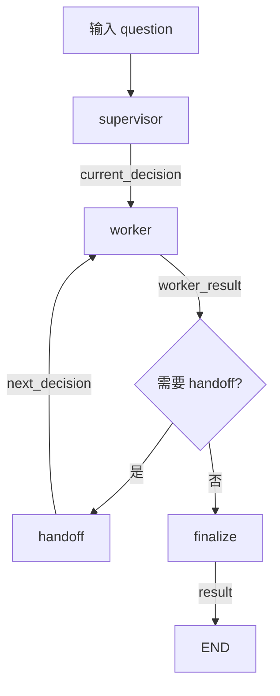

#### 24.5.6 Checkpoint 和 thread_id

```python
def _run_config(run_id: str) -> dict:
    return {"configurable": {"thread_id": run_id}}
```

LangGraph 使用 `thread_id` 作为 checkpoint 的标识。

同一个 `thread_id` 可以：

- 写入状态。
- 读取状态。
- 在中断后继续执行。

项目使用：

```python
DEFAULT_CHECKPOINTER = get_default_checkpointer()
```

底层是 `SqliteSaver`，保存到 `data/langgraph_checkpoints.sqlite`。

#### 24.5.7 幂等

幂等表示同一个请求执行一次和多次，业务结果应该一致。

`start_graph_run()` 中：

```python
if request_id and memory_store:
    idempotency_key = _idempotency_namespace(tenant_id)
    existing = memory_store.get(idempotency_key, request_id)

    if existing and existing.value.get("run_id"):
        run = get_graph_run(...)
        run.request_id = request_id
        return run
```

流程：

```text
第一次收到 request_id
  -> 创建 run_id
  -> 保存 request_id -> run_id

再次收到同一个 request_id
  -> 直接返回已有 run
```

这能处理：

- 网络超时后客户端重试。
- 用户重复点击。
- 消息队列重复投递。

#### 24.5.8 租户隔离

```python
def _run_namespace(tenant_id: str, run_id: str) -> str:
    return f"tenant:{tenant_id}:run:{run_id}"


def _idempotency_namespace(tenant_id: str) -> str:
    return f"tenant:{tenant_id}:idempotency"
```

不同 tenant 使用不同 namespace，即使 `run_id` 相同也不会互相覆盖。

#### 24.5.9 超时

`_invoke_with_timeout()`：

```python
if timeout_seconds is None:
    return graph.invoke(input_state, config=config)

executor = concurrent.futures.ThreadPoolExecutor(max_workers=1)
future = executor.submit(graph.invoke, input_state, config=config)
return future.result(timeout=timeout_seconds)
```

解释：

- `graph.invoke()` 在这个场景中是同步阻塞调用。
- 如果直接在主线程执行，可能无法中途取消。
- 把它提交到线程池，主线程通过 `future.result(timeout=...)` 限制等待时间。
- 超时后抛 `TimeoutError`，调用方把 run 标记为失败。

注意：

- 这里每个带超时的调用会创建一个 `max_workers=1` 的线程池。
- 它适合当前项目说明超时原理，但在高并发生产系统中，通常应该复用全局线程池或任务队列，避免线程数量失控。

#### 24.5.10 进程、线程、协程和多用户请求

```text
进程：
  操作系统分配资源的基本单位，隔离最强。

线程：
  进程内部并发执行的单位，共享进程内存。

协程：
  用户态协作式并发，在单线程内通过 await 让出执行权。
```

类比：

```text
进程 = 多个独立办公室
线程 = 同一个办公室里的多个员工
协程 = 一个员工在多个任务之间快速切换
```

在 FastAPI 线上场景：

- FastAPI 使用事件循环处理大量 I/O 请求。
- `async def` 路由遇到网络 I/O 时可以让出控制权。
- 如果遇到 CPU 密集或阻塞任务，应避免阻塞事件循环。
- `ThreadPoolExecutor` 把阻塞调用放进线程执行。
- 如果任务非常重，可以使用独立 Worker 进程或任务队列。

多用户请求发生时：

```text
用户 A 请求 -> 创建 run A
用户 B 请求 -> 创建 run B
```

LangGraph 通过 `thread_id` 区分不同 run，通过共享记忆的 namespace 区分不同租户。

真正的生产系统还需要：

- 全局并发限制。
- 分布式锁。
- 请求超时。
- 队列和 Worker。
- 数据库连接池。
- Redis 限流。
- 监控和告警。

当前代码是一个可理解的单机实现，面试时可以主动说明这些生产演进点。

---

## 25. MCP 概念、整体流程与相关概念关系补充

### 25.1 MCP 是什么

MCP 是 Model Context Protocol，模型上下文协议。

它是一套标准化协议，用来解决：

```text
大模型或 Agent 如何连接外部工具、资源、数据源
```

不要把 MCP 理解成 Agent 框架。它更像一个“工具连接的 USB-C 接口”。

| 概念 | 类比 |
|---|---|
| MCP | USB-C 协议 |
| MCP Server | 支持 USB-C 的外设 |
| MCP Client / Host | 电脑、手机或 Agent |
| Tool / Resource / Prompt | 外设提供的能力 |

MCP 解决的问题是“连接标准”，不是“Agent 怎么推理、怎么循环、怎么规划”。

### 25.2 MCP 是不是 Agent 框架

不是。

Agent 框架通常负责：

- Agent 循环。
- 状态管理。
- 任务规划。
- 工具编排。
- 多 Agent 协作。
- 记忆和 checkpoint。

MCP 只负责：

- 定义客户端和服务端如何通信。
- 暴露工具、资源和 Prompt。
- 让模型或 Agent 能发现和调用外部能力。

所以：

```text
LangGraph = Agent 编排框架
MCP = 外部工具和数据源的连接协议
```

两者可以一起用：

```text
LangGraph 负责“怎么思考和编排”
MCP 负责“怎么连接外部能力”
```

### 25.3 MCP 的核心角色

```text
MCP Host：
  运行 Agent 或应用的一方，例如 Claude Desktop、IDE、FastAPI 服务。

MCP Client：
  代表 Host 与某个 MCP Server 建立连接。

MCP Server：
  暴露具体工具、资源、Prompt 的一方。
```

一次标准交互：

```text
Host 启动 Client
  -> Client 连接 Server
  -> Client 初始化会话
  -> Client 获取工具列表
  -> Agent 决定调用某个工具
  -> Client 发起 call_tool
  -> Server 执行工具
  -> Server 返回结果
  -> Client 把结果交给 Agent
```

### 25.4 MCP 整体流程图

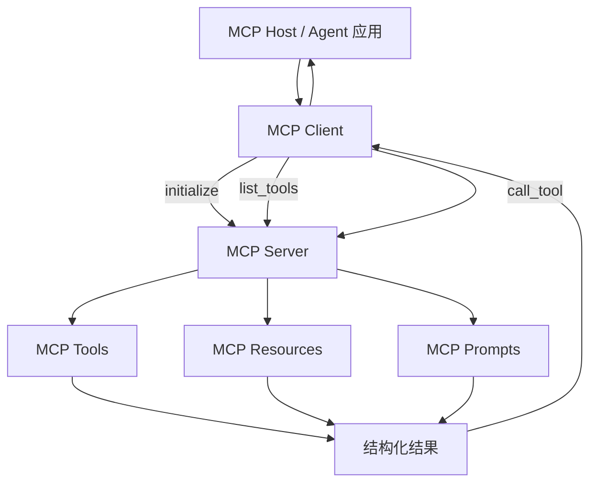

### 25.5 项目中的 MCP 实现

当前项目里：

| 文件 | 角色 |
|---|---|
| `app/mcp_server.py` | MCP Server，注册知识库工具、资源和 Prompt |
| `app/mcp_client.py` | MCP Client，负责连接、发现和调用 |
| `app/mcp_agent_bridge.py` | 把 MCP 工具转成 OpenAI Function Schema，并加安全和权限 |
| `app/mcp_agent.py` | 让 ReAct Agent 使用 MCP 工具 |

具体能力：

- Tool：`search_knowledge`、`list_knowledge_titles`、`get_knowledge_document`
- Resource：`knowledge://titles`、`knowledge://docs/{title}`
- Prompt：`analyze_jd`

### 25.6 MCP 和 Function Calling 的关系

两者不是同一个层级。

```text
Function Calling：
  模型返回“我想调用什么工具、参数是什么”。

MCP：
  客户端如何连接服务端、如何发现工具、如何传输调用和结果。
```

可以理解为：

- Function Calling 是模型侧协议。
- MCP 是工具系统侧的通信协议。
- 项目中的 `mcp_agent_bridge.py` 会把 MCP 工具转换成 OpenAI Function Schema，让模型能够理解这些工具。

### 25.7 MCP 和 Tool 的关系

Tool 是一个具体能力，MCP 是暴露这些能力的标准方式。

```text
Tool = 功能本身，例如查询天气、检索知识库。
MCP = 描述这个 Tool 如何被远程发现和调用。
```

一个 MCP Server 可以有多个 Tool：

```text
MCP Server
  -> Tool A
  -> Tool B
  -> Resource C
  -> Prompt D
```

### 25.8 MCP 和 ReAct 的关系

ReAct 是 Agent 的推理与行动循环：

```text
Reason
  -> Act
  -> Observe
  -> Reason
```

MCP 只是 ReAct 在 Act 阶段可能调用的一种工具来源。

```text
ReAct Agent
  -> 决定调用 search_knowledge
  -> MCP Client 发起调用
  -> MCP Server 返回结果
  -> Agent 拿到 Observation
  -> 继续推理
```

因此它们可以协作：

- ReAct 决定“做什么”。
- MCP 解决“怎么连接外部工具”。

### 25.9 四者分层关系

```text
Agent 层：
  ReAct / Plan-and-Execute / LangGraph

工具注册层：
  ToolRegistry / MCP Tool Registry

模型调用层：
  Function Calling

外部能力连接层：
  MCP Client / MCP Server
```

| 概念 | 主要问题 | 层次 |
|---|---|---|
| ReAct | Agent 如何循环推理和执行 | Agent 编排 |
| Tool | 一个可执行能力是什么 | 工具抽象 |
| Function Calling | 模型如何表达工具调用 | 模型协议 |
| MCP | 外部工具如何被标准化连接 | 工具互联协议 |

### 25.10 实际业务场景分别解决什么问题

#### ReAct

适合：

- 用户问题开放。
- 工具数量不多。
- 需要根据中间结果动态决定下一步。
- 快速构建单个 Agent。

例如：

```text
用户问“我适合补什么技能”
  -> Agent 先查知识库
  -> 再根据结果决定是否继续查
  -> 最后生成答案
```

#### Tool

适合：

- 把业务能力封装成可调用单元。
- 统一参数、权限、错误处理和审计。

例如：

- `search_knowledge`
- `apply_job`
- `create_ticket`
- `send_email`

#### Function Calling

适合：

- 让模型结构化地选择工具。
- 让模型按 JSON Schema 输出参数。
- 把自然语言转成可执行动作。

例如：

```text
用户说“帮我查一下 FastAPI”
  -> 模型调用 search_knowledge(query="FastAPI")
```

#### MCP

适合：

- 企业里有多个内部服务，希望统一接入 Agent。
- 不同团队提供不同工具，希望遵守同一套协议。
- 希望工具可以被多个 Agent、IDE、平台复用。
- 希望动态发现工具，而不是把工具写死在 Agent 代码里。

例如：

```text
企业 Agent 平台统一接入：
  - 工单系统 MCP Server
  - CRM MCP Server
  - 知识库 MCP Server
  - 数据库查询 MCP Server
```

Agent 不需要为每个系统写专门代码，只需要通过 MCP Client 发现和调用。

### 25.11 一句话总结

```text
ReAct 是思考方式。
Tool 是能力单元。
Function Calling 是模型表达调用的方式。
MCP 是让外部能力可以被标准化接入的协议。
```

面试时可以强调：MCP 不是 Agent 框架，而是连接层协议；它和 Agent 框架是互补关系，不是替代关系。

---

## 26. 数据库、连接池、硬件资源与线上并发专题

### 26.1 异步连接池是什么，业务中负责什么

#### 26.1.1 为什么需要连接池

数据库连接不是免费的。每次建立连接通常要：

```text
建立 TCP 连接
  -> 数据库认证
  -> 分配服务端资源
  -> 执行 SQL
  -> 关闭连接
```

如果每个请求都新建连接，高并发时会出现：

- 连接建立延迟大。
- CPU 和内存被反复创建连接消耗。
- 数据库连接数很快达到上限。
- 请求排队甚至失败。

连接池的做法是：

```text
提前维护一批可复用连接
  -> 请求来了借用一个连接
  -> 用完归还
  -> 其他请求继续使用
```

类比：

```text
每次新建连接 = 每接待一个客户就新开一家门店
连接池 = 一家门店里固定安排若干收银台，轮流服务客户
```

#### 26.1.2 项目中的异步连接池

`app/postgres.py`：

```python
AsyncConnectionPool(
    conninfo=dsn,
    min_size=1,
    max_size=10,
    open=False,
)
```

解释：

- `AsyncConnectionPool`：异步连接池。
- `min_size`：启动后最少保持的连接数。
- `max_size`：最多允许的连接数。
- `open=False`：先创建配置，再显式 `await pool.open()`。

`min_size=1` 表示至少有一个连接可供快速响应。

`max_size=10` 表示最多同时借出 10 个连接，超过后请求需要等待连接归还。

#### 26.1.3 连接池在项目中的位置

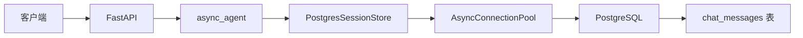

#### 26.1.4 一次聊天请求如何使用连接池

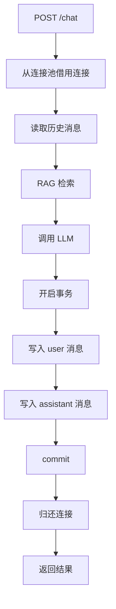

如果事务失败：

```text
写入 user 消息
  -> 写入 assistant 消息失败
  -> rollback
  -> 两条消息都不保存
```

这保证不会出现“只有用户问题，没有助手回答”的半成品状态。

#### 26.1.5 实际业务负责什么

连接池负责：

- 降低数据库连接成本。
- 提高请求响应速度。
- 限制数据库最大连接数。
- 支持多个请求复用连接。
- 为异步 FastAPI 提供异步数据库访问。

### 26.2 内存与磁盘的区别，以及内存、磁盘、CPU、GPU 的关系

#### 26.2.1 数据写入内存

```text
内存：
  速度快
  容量相对小
  断电或进程退出后数据消失
```

项目早期 `SessionStore` 使用 Python 字典保存聊天消息，就是内存数据。

优点：

- 读写极快。
- 不需要网络和磁盘 I/O。

缺点：

- 服务重启丢失。
- 多进程部署时无法共享。
- 用户可能被负载均衡到不同进程，导致历史不一致。

#### 26.2.2 数据写入磁盘

```text
磁盘：
  速度比内存慢
  容量更大
  断电后数据仍然保留
```

PostgreSQL、SQLite、向量库的持久化文件最终都会写入磁盘。

优点：

- 数据持久化。
- 适合长期保存和大数据量。

缺点：

- 读写延迟更高。
- 查询需要索引、缓存和数据库优化。

#### 26.2.3 内存和磁盘的关系

```text
CPU 需要数据时，优先找内存。
内存没有时，从磁盘读取。
磁盘数据进入内存后，CPU 才能快速计算。
```

类比：

```text
内存 = 办公桌，能快速拿到文件
磁盘 = 文件柜，容量大，但拿文件慢
```

#### 26.2.4 CPU 负责什么

CPU 适合：

- 通用逻辑。
- 条件判断。
- 数据库查询。
- HTTP 处理。
- 普通 Python 代码。

影响：

- CPU 核数影响可同时执行的计算任务。
- CPU 使用率过高会导致请求处理变慢。

#### 26.2.5 GPU 负责什么

GPU 适合：

- 大量并行矩阵运算。
- 深度学习模型推理。
- Embedding 模型计算。
- 大模型训练。

影响：

- 本地运行 Embedding 或 LLM 时，GPU 显存和算力直接影响吞吐和延迟。
- 没有 GPU 时通常使用远程模型 API，例如 DeepSeek。

#### 26.2.6 各资源配置在实际业务中影响什么

| 资源 | 主要影响 |
|---|---|
| 内存 | 缓存大小、连接数、Embedding 模型加载、进程和线程数量 |
| 磁盘 | 数据库容量、向量库持久化、日志、备份、镜像 |
| CPU | 请求逻辑处理、数据库查询、JSON 解析、普通计算 |
| GPU | 本地模型推理、Embedding、大规模并行计算 |

例如：

- 内存不足：数据库连接池小、缓存命中低、本地 Embedding 加载失败。
- 磁盘不足：PostgreSQL 无法写入、Docker 构建失败、日志无法落盘。
- CPU 不足：请求处理慢、连接池资源竞争。
- GPU 显存不足：本地模型无法加载，必须改用远程 API。

项目中低内存服务器采用远程 Embedding，就是为了减少内存和 CPU 压力。

### 26.3 PostgreSQL 和其他数据库类型

#### 26.3.1 PostgreSQL 属于关系型数据库

关系型数据库把数据组织成：

```text
Database
  -> Table
  -> Row
  -> Column
```

适合：

- 强一致事务。
- 结构化数据。
- 复杂 SQL 查询。
- 用户、订单、消息、权限等业务。

常见产品：

- PostgreSQL
- MySQL
- SQLite
- SQL Server

#### 26.3.2 其他数据库类型

| 类型 | 代表产品 | 解决什么问题 |
|---|---|---|
| 关系型数据库 | PostgreSQL、MySQL | 结构化数据、事务、复杂关系查询 |
| KV 数据库 | Redis | 高速缓存、限流、队列、会话 |
| 文档数据库 | MongoDB | 半结构化 JSON 文档、快速迭代 |
| 向量数据库 | Chroma、Qdrant、Milvus、pgvector | Embedding 相似度检索 |
| 搜索数据库 | Elasticsearch | 全文搜索、日志分析 |
| 时序数据库 | InfluxDB、TimescaleDB | 监控指标、IoT、按时间聚合 |
| 图数据库 | Neo4j | 关系网络、推荐、社交图谱 |
| 对象存储 | S3、OSS、MinIO | 文件、图片、视频、模型产物 |

#### 26.3.3 本项目如何组合

```text
PostgreSQL：
  用户、聊天消息、会话持久化。

Redis：
  缓存、限流、任务状态、arq 队列。

Chroma / Qdrant：
  Embedding 向量检索。

SQLite：
  LangGraph checkpoint、多 Agent 共享记忆。
```

这说明真实系统通常不是只选一个数据库，而是根据数据形态组合使用。

### 26.4 请求并发量、请求数、用户、租户、namespace、进程、内存等资源的关系

#### 26.4.1 先区分几个词

```text
请求数：
  一段时间内总共来了多少请求。

并发量：
  同一时刻正在处理中的请求数量。

用户：
  使用系统的真实人或账号。

租户：
  使用同一 SaaS 服务的组织或业务空间。

namespace：
  逻辑隔离空间，用来把不同租户、不同 run 的数据分开。

进程：
  操作系统分配资源的独立单位。

线程：
  进程内并发执行的单位。

协程：
  单线程内通过 await 切换的轻量并发单元。
```

#### 26.4.2 一个请求从进入到消耗资源

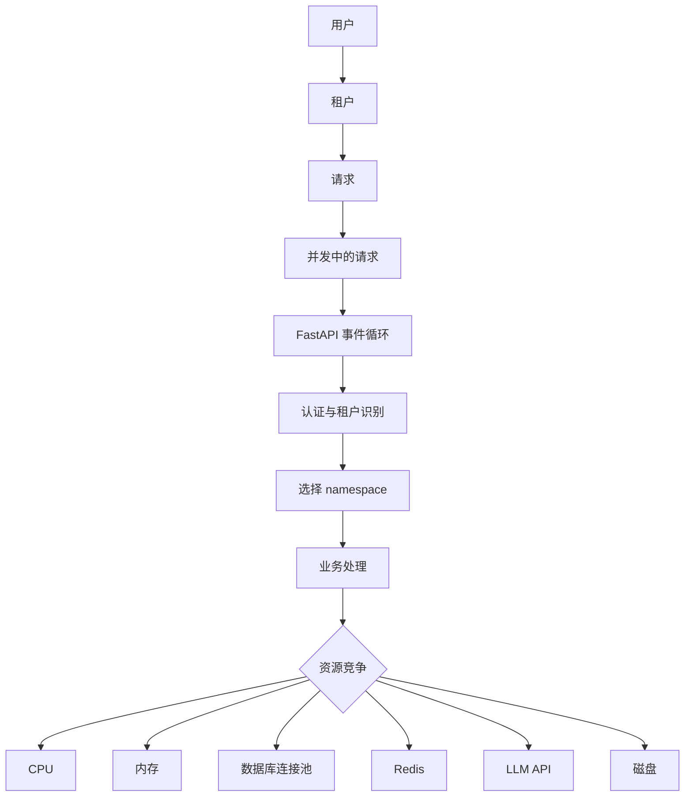

关系解释：

```text
用户属于租户。
一个用户可以发起很多请求。
请求不一定会同时到达。
并发量只看同一时刻正在处理的请求。
租户和 namespace 负责逻辑隔离。
进程、线程、协程负责并发执行。
内存、CPU、连接池、磁盘决定系统能承载多少并发。
```

#### 26.4.3 多租户 namespace 示例

```text
tenant-a:
  tenant:tenant-a:run:run-1
  tenant:tenant-a:run:run-2

tenant-b:
  tenant:tenant-b:run:run-1
  tenant:tenant-b:run:run-2
```

即使 `run-1` 相同，namespace 前缀不同，也不会互相读取。

#### 26.4.4 进程、线程、协程和资源的关系

```text
进程：
  隔离最强，内存不共享，适合 Worker 或重计算。

线程：
  共享进程内存，适合阻塞 I/O 或需要限制等待时间的场景。

协程：
  内存占用低，切换快，适合大量网络 I/O。
```

FastAPI 中：

- 普通 `async def` 路由运行在事件循环中。
- 网络 I/O 通过 `await` 让出控制权。
- 阻塞同步任务通过线程池执行。
- 重任务通过独立 Worker 进程执行。

#### 26.4.5 高并发生产系统如何处理

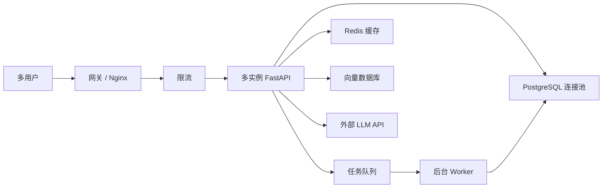

生产处理思路：

1. 用 Nginx 或 API Gateway 做入口限流。
2. 用 Redis 做会话缓存和分布式限流。
3. 用连接池限制数据库并发。
4. 用队列承接耗时任务，避免 API 长时间等待。
5. 用多实例横向扩展，由负载均衡分发请求。
6. 用 namespace 或 tenant_id 做数据隔离。
7. 用监控指标观察请求量、并发、CPU、内存、连接数和错误率。
8. 用熔断、降级、超时和背压防止依赖故障拖垮整个系统。

#### 26.4.6 面试表达公式

```text
用户 -> 租户 -> 请求 -> 并发 -> 资源

并发高时：
  先限流和缓存
  再用连接池、队列、异步化
  再横向扩展进程或实例
  同时保证租户隔离、幂等和可观测性
```
