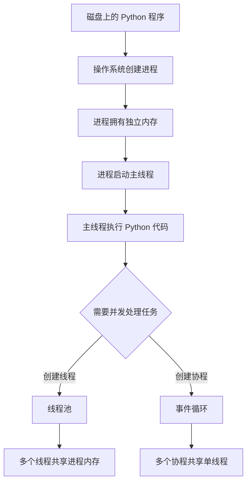
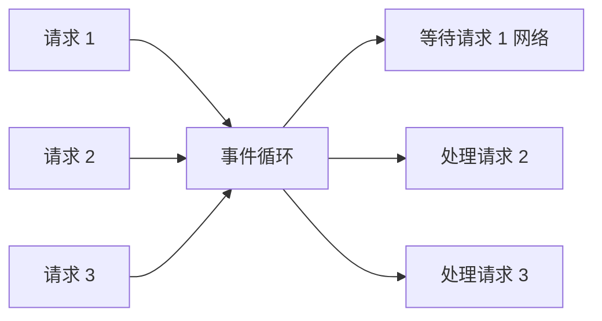
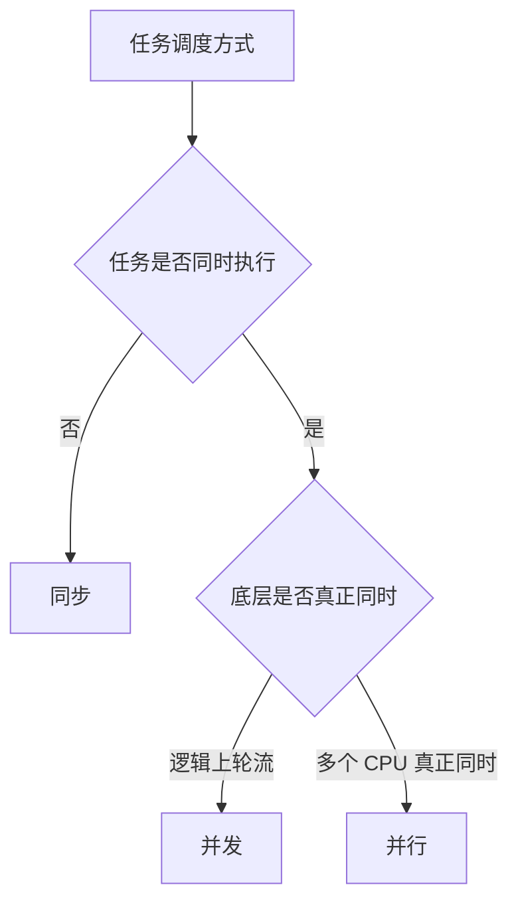
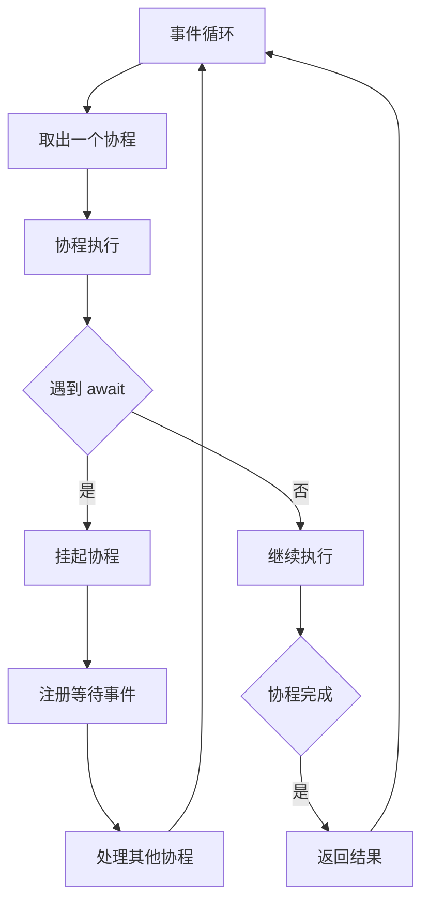
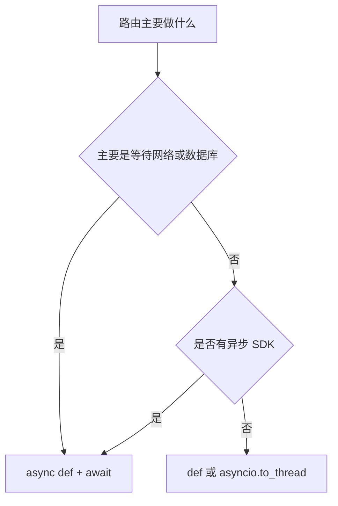
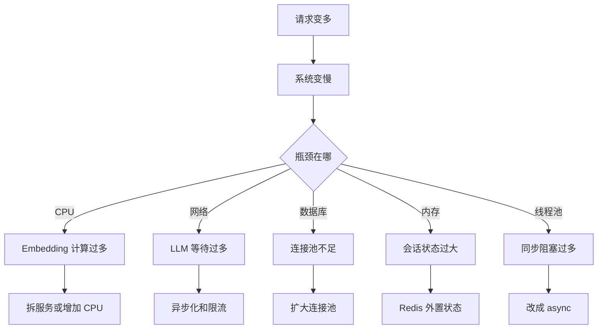
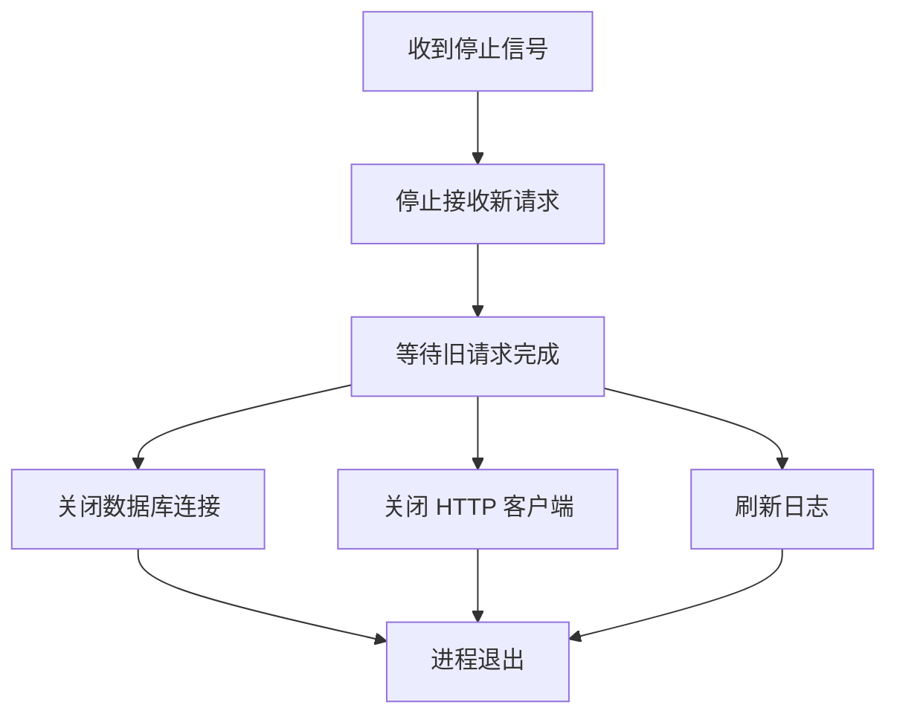
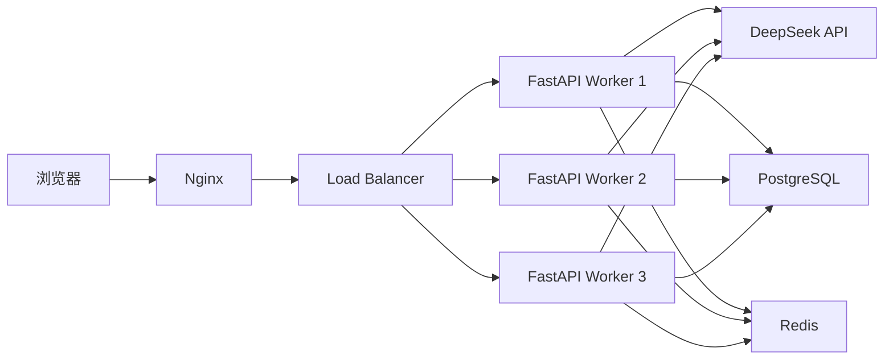
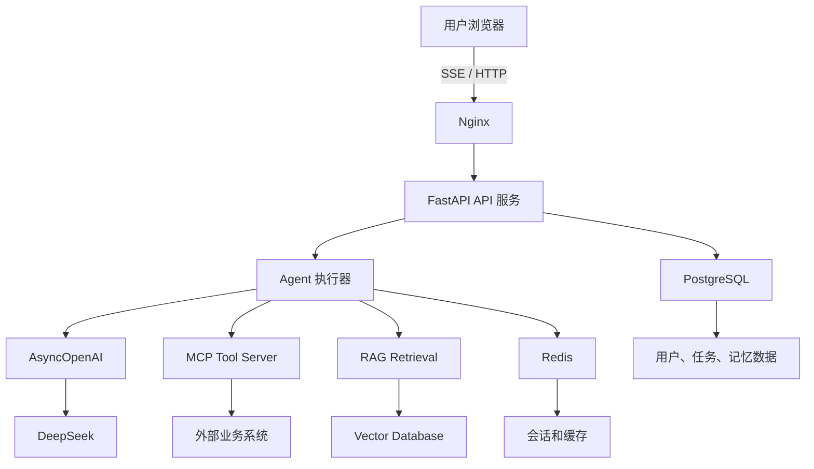

# 后端生产基础：进程、线程、异步、并发与部署

日期：2026-09-17

目标：补齐 AI Agent 后端工程师需要的操作系统、Python 并发、网络服务和部署基础知识。

## 0. 为什么前端背景需要补这一块

前端工程师通常理解：

```text
浏览器
  ->
JavaScript
  ->
Promise / async await
  ->
接口请求
  ->
渲染
```

后端 AI Agent 服务还需要理解：

```text
操作系统如何运行 Python
  ->
进程和线程
  ->
事件循环
  ->
网络 I/O
  ->
多用户并发
  ->
部署和扩容
```

前端里的 Promise 和后端里的 async/await 有相似之处，但后端还涉及进程、线程、CPU、网络连接、连接池、多 Worker、负载均衡等。

本文尽量用餐厅、浏览器标签页、电话客服等类比解释。

## 1. 程序、进程、线程

### 1.1 程序

程序是保存在磁盘上的代码文件。

例如：

```text
app/main.py
```

程序本身不运行，只是一份静态文件。

### 1.2 进程

进程是操作系统加载程序后创建的一个运行实例。

运行：

```bash
uvicorn app.main:app
```

会创建一个 Python 进程。

进程有：

- 独立内存空间。
- 独立文件描述符。
- 独立 PID。
- 进程崩溃通常不会直接破坏其他进程。

### 1.3 线程

线程是进程内部的执行单元。

一个进程可以有多个线程。

同一个进程内的线程共享：

- 内存。
- 全局变量。
- 文件句柄。

线程之间通信比进程之间更方便，但也更容易出现数据竞争。

### 1.4 类比

```text
程序：
一本菜谱。

进程：
一家已经开业的餐厅。

线程：
餐厅里的多个厨师。

厨师共享厨房和食材，但每个厨师可以同时做不同的菜。
```

### 1.5 流程图



## 2. CPU 密集任务和 I/O 密集任务

### 2.1 CPU 密集任务

CPU 密集任务主要消耗 CPU 计算资源。

例子：

- Embedding 向量计算。
- 大模型本地推理。
- 图片处理。
- 大数组计算。
- 排序和加密。

CPU 密集任务需要更多的 CPU 核心或独立计算服务。

### 2.2 I/O 密集任务

I/O 密集任务主要等待外部设备或网络。

例子：

- 调用 DeepSeek API。
- 查询 PostgreSQL。
- 读写 Redis。
- 发送邮件。
- 读取对象存储。

等待期间 CPU 很空闲。

### 2.3 餐厅类比

```text
CPU 密集：
厨师在案板上切菜，手和刀一直在工作。

I/O 密集：
厨师把菜送进烤箱，然后等待烤熟。
等待期间厨师可以做其他事情。
```

AI Agent 服务通常是：

```text
模型调用：I/O 密集
RAG Embedding：CPU 密集
工具调用：I/O 密集或 CPU 密集
```

## 3. 阻塞与等待

### 3.1 阻塞

阻塞表示当前执行单元停下来等待一个操作完成。

同步 LLM 调用就是阻塞：

```python
response = client.chat.completions.create(...)
```

在模型返回前，当前 Python 线程一直等待。

### 3.2 非阻塞

非阻塞表示发起操作后，当前执行单元可以先去处理其他任务。

异步 LLM 调用：

```python
response = await async_client.chat.completions.create(...)
```

等待网络时，事件循环可以切换到其他请求。

### 3.3 为什么不能把所有任务都放在一个线程里等待


如果单线程同步等待网络，其他请求必须排队。



事件循环可以在等待时切换任务。

## 4. 并发、并行和同步

### 4.1 同步执行

任务一个接一个执行：

```text
任务 A
  ->
任务 B
  ->
任务 C
```

### 4.2 并发执行

多个任务看起来同时进行，但底层可能轮流执行。

```text
任务 A 执行一部分
  ->
任务 B 执行一部分
  ->
任务 A 继续
  ->
任务 C 执行一部分
```

适合 I/O 密集任务。

### 4.3 并行执行

多个任务真正同时执行。

通常需要：

- 多核 CPU。
- 多进程。
- 或者多线程。

适合 CPU 密集任务。

### 4.4 流程图



## 5. Python 的 GIL

### 5.1 GIL 是什么

CPython 的 GIL 是 Global Interpreter Lock，全局解释器锁。

它保证同一时刻只有一个线程执行 Python 字节码。

### 5.2 GIL 对 CPU 密集任务的影响

Python 多线程不能充分利用多核 CPU 做 CPU 密集计算。

例如：

```text
4 个线程计算向量
  ->
仍然主要使用一个 CPU 核心
```

因为 GIL 限制了同时执行 Python 字节码。

### 5.3 GIL 对 I/O 密集任务的影响

I/O 等待时，GIL 会被释放。

所以 Python 线程适合：

- 网络请求。
- 文件读取。
- 数据库等待。

这也是 FastAPI 使用事件循环处理网络 I/O 的原因之一。

### 5.4 前端类比

```text
GIL 有点像：
一个餐厅只有一把主厨刀。

即使有多个厨师，同一时刻只有一个人能用这把刀。

但等烤箱时，刀可以交给别人使用。
```

## 6. 事件循环和协程

### 6.1 协程

协程是可以暂停和恢复的函数。

```python
async def call_llm():
    result = await deepseek_request()
    return result
```

执行到 `await` 时暂停，等结果回来后恢复。

### 6.2 事件循环

事件循环是调度协程的循环。

它不断检查：

- 哪些任务可以继续。
- 哪些网络事件已经完成。
- 哪些定时器已经到期。

### 6.3 电话客服类比

```text
一个客服：

给客户 A 打电话。
A 说“我查一下”。
客服不挂电话，但先给客户 B 打电话。
B 说“我发你文件”。
客服回到 A，继续处理。
```

这个客服就是事件循环。

### 6.4 事件循环规则

```text
await 异步 I/O：允许切换
time.sleep：阻塞整个线程
asyncio.sleep：只暂停当前协程
同步 OpenAI 调用：阻塞
AsyncOpenAI + await：允许切换
```

### 6.5 流程图



## 7. FastAPI 中的 async def 和 def

### 7.1 async def 路由

```python
@app.post("/chat")
async def chat(request: ChatRequest):
    return await answer_question_async(...)
```

路由在事件循环中执行。

适合：

- 查询数据库。
- 调用 Redis。
- 调用 AsyncOpenAI。
- 转发网络请求。

不能在里面放：

- `time.sleep`。
- 同步 OpenAI。
- 大循环计算。
- 同步读取大文件。

### 7.2 def 路由

```python
@app.post("/legacy")
def legacy():
    return sync_work()
```

FastAPI 会把这个函数放进线程池。

适合：

- 旧同步代码。
- 暂时没有异步版本的 SDK。
- CPU 密集任务。

缺点：

- 线程池大小有限。
- 大量请求会耗尽线程池。

### 7.3 选择规则



## 8. asyncio.to_thread

`asyncio.to_thread()` 把同步阻塞任务放到线程池。

```python
result = await asyncio.to_thread(
    retriever.retrieve,
    query,
    top_k=3,
)
```

它解决的问题：

```text
事件循环不能执行同步阻塞代码
  ->
把阻塞代码移到线程池
  ->
事件循环继续处理其他请求
```

### 8.1 什么时候用

- 本地 Embedding。
- 本地模型推理。
- 同步文件读取。
- 没有异步版本的数据库驱动。
- CPU 密集计算。

### 8.2 什么时候不要滥用

如果 CPU 任务非常重，线程池仍会占用进程 CPU。

生产上更合适的是：

- 独立 Embedding 服务。
- 独立 Worker 进程。
- 任务队列。
- GPU 推理服务。

## 9. 信号量和限流

### 9.1 信号量

信号量限制同时进行的任务数量。

```python
semaphore = asyncio.Semaphore(10)

async with semaphore:
    result = await call_llm()
```

当已经有 10 个任务在执行时，第 11 个任务会等待。

### 9.2 为什么 LLM 服务需要限流

DeepSeek 等服务通常有：

- 每分钟请求限制。
- Token 限制。
- 并发连接限制。
- 成本和预算限制。

如果客户端无限并发，可能：

```text
触发限流
  ->
请求大量失败
  ->
触发重试
  ->
雪上加霜
```

### 9.3 前端类比

```text
餐厅最多同时接待 10 桌。

第 11 桌先在门口等位。

等有桌子空出来，再进去。
```

## 10. 高并发、吞吐和延迟

### 10.1 并发数

同时处理的请求数量。

不是越大越好，要看系统能承受多少。

### 10.2 吞吐量

单位时间内完成的请求数。

例如：

```text
1000 requests / second
```

### 10.3 延迟

一个请求从发出到收到响应的时间。

常用指标：

```text
p50：一半请求低于这个时间
p95：95% 请求低于这个时间
p99：99% 请求低于这个时间
```

平均值容易掩盖长尾问题，生产上更关注 p95 和 p99。

### 10.4 例子

```text
平均延迟 200ms
p99 延迟 5s
```

说明大部分请求很快，但少量请求很慢。

这些慢请求可能来自：

- 模型长回复。
- 数据库锁。
- 网络抖动。
- 重试风暴。

### 10.5 高并发不等于加机器

先要找到瓶颈：



## 11. 服务启动与关闭

### 11.1 启动阶段

服务启动时适合做：

- 加载配置。
- 创建数据库连接池。
- 创建 Redis 客户端。
- 加载 Embedding 模型。
- 初始化 LLM 客户端。
- 检查依赖服务是否可用。

本项目 Day 57 使用 lifespan 创建：

```text
AsyncOpenAI
LLM Semaphore
```

### 11.2 关闭阶段

服务关闭时应该：

- 停止接收新请求。
- 等待正在处理的请求完成。
- 关闭数据库连接。
- 关闭 HTTP 客户端。
- 释放模型资源。

### 11.3 为什么不能创建后不关闭

长期不关闭会导致：

- 文件描述符泄漏。
- TCP 连接泄漏。
- 内存增长。
- 重启时连接挂起。

### 11.4 优雅关闭流程图



## 12. 多进程、多线程和部署

### 12.1 为什么单进程不够

单个 Python 进程的事件循环可以处理很多 I/O 请求，但：

- 单进程只能利用有限 CPU。
- 单进程崩溃会影响全部服务。
- 无法滚动更新。
- 无法跨机器扩展。

### 12.2 多进程部署

生产上通常运行多个 Worker：

```text
uvicorn 进程 1
uvicorn 进程 2
uvicorn 进程 3
uvicorn 进程 4
```

前置 Nginx 或负载均衡器分发请求。

### 12.3 部署流程图



### 12.4 多副本与状态

如果有多个 Worker：

```text
不能把用户会话只存在单个进程内存里。
```

因为下一次请求可能被分发到另一个 Worker。

解决：

- Session 放 Redis。
- 数据放 PostgreSQL。
- 任务状态放队列或数据库。
- 文件放对象存储。

### 12.5 浏览器缓存类比

```text
单机内存状态：
数据只存在一个人的电脑上。

Redis：
数据放到公共网盘，所有人都能访问。
```

## 13. AI Agent 后端服务的典型架构



各组件职责：

| 组件 | 职责 |
|---|---|
| Nginx | 反向代理、TLS、静态文件、限流 |
| FastAPI | HTTP 接口、请求校验、流式响应 |
| Agent 执行器 | 状态机、工具调用、任务编排 |
| AsyncOpenAI | 异步调用大模型 |
| PostgreSQL | 持久化业务数据 |
| Redis | 缓存、会话、限流、任务状态 |
| Vector Database | 向量检索 |
| MCP Tool Server | 外部工具标准化接入 |

## 14. 常见误区

### 14.1 async 一定更快

错误。

async 主要提升 I/O 并发，不会让 CPU 计算变快。

如果代码全是 CPU 密集任务，async 并不能提升速度。

### 14.2 多线程一定更快

错误。

Python 多线程适合 I/O 密集任务，不适合 CPU 密集任务。

### 14.3 Worker 越多越好

错误。

过多 Worker 可能：

- 增加上下文切换。
- 耗尽数据库连接。
- 触发上游限流。
- 增加内存占用。

### 14.4 async def 内部可以随便放阻塞代码

错误。

```python
@app.get("/bad")
async def bad():
    time.sleep(5)
    return {"status": "ok"}
```

这会阻塞整个事件循环。

正确做法：

```python
await asyncio.sleep(5)
```

或者：

```python
await asyncio.to_thread(time.sleep, 5)
```

### 14.5 状态存在进程内也能多副本部署

错误。

内存字典不是共享状态。

多副本部署后必须外置到 Redis、PostgreSQL 或其他共享存储。

## 15. 当前 Day 57 和后续生产的衔接

Day 57 只完成了异步地基。

后续路线：

```text
Day 57：异步请求和并发
  ->
Day 58：PostgreSQL 持久化
  ->
Day 59：Redis 会话和缓存
  ->
Day 60：任务队列
  ->
Day 61：认证和权限
  ->
Day 62：压力测试
  ->
Day 63：重试、熔断和降级
  ->
Day 64 以后：容器、多副本、可观测和 CI/CD
```

学完这些后，才能把当前项目从“能演示的 Agent”推进到“可以长期运行的生产 Agent 服务”。
