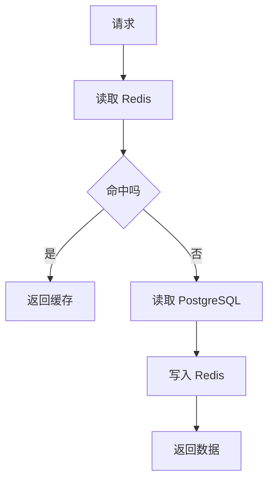
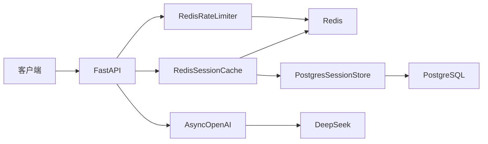

# 后端生产基础：Redis 与实际生产场景

日期：2026-09-17

目标：补齐 AI Agent 后端工程师需要的 Redis 基础、缓存设计和限流知识。

## 0. 为什么后端需要 Redis

后端服务通常有：

```text
数据库
  ->
应用服务
  ->
外部 API
```

数据库负责持久化，但每次查询都需要访问磁盘和网络。

Redis 把数据放在内存里，读写非常快。

前端类比：

```text
PostgreSQL：
把文件保存到硬盘，每次打开都要读硬盘。

Redis：
把最近常用的数据放在桌面便签上，随时能看。
```

Redis 不是替代数据库，而是放在数据库前面，加速高频数据。

## 1. Redis 是什么

Redis 是一个内存键值数据库。

特点：

- 数据存在内存。
- 读写延迟很低。
- 支持过期时间。
- 支持多种数据结构。
- 支持多进程共享。
- 支持持久化。

## 2. 键值模型

### 2.1 key 和 value

```text
key：数据的名字
value：数据的内容
```

例如：

```text
key = chat:session:s1:messages
value = [{"role":"user","content":"你好"}]
```

### 2.2 基本命令

```bash
SET key value
GET key
DEL key
EXPIRE key 300
```

含义：

```text
SET：写入
GET：读取
DEL：删除
EXPIRE：设置过期秒数
```

## 3. Redis 常见数据结构

### 3.1 String

最基础的类型。

```bash
SET count 1
INCR count
GET count
```

适合：

- 缓存。
- 计数器。
- 简单状态。

### 3.2 Hash

类似 Python dict：

```bash
HSET user:1 name "Alex"
HSET user:1 age "28"
HGET user:1 name
```

适合：

- 用户资料。
- 对象字段。

### 3.3 List

有序列表：

```bash
LPUSH queue task-1
LPUSH queue task-2
RPOP queue
```

适合：

- 简单队列。
- 最新消息列表。

### 3.4 Set

无序不重复集合：

```bash
SADD tags python
SADD tags fastapi
SISMEMBER tags python
```

适合：

- 标签。
- 去重。

### 3.5 Sorted Set

带分数的有序集合：

```bash
ZADD leaderboard 100 player-a
ZADD leaderboard 90 player-b
ZREVRANGE leaderboard 0 10
```

适合：

- 排行榜。
- 按时间排序。

### 3.6 Stream

消息流，适合任务队列和事件流。

生产项目中，复杂队列也常使用 RabbitMQ、Kafka 或 Redis Stream。

## 4. TTL 和过期

### 4.1 TTL

TTL 表示 key 还有多久过期。

```bash
SET session:abc "..." EX 300
```

300 秒后，Redis 自动删除。

### 4.2 为什么需要 TTL

没有 TTL：

```text
缓存越来越多
  ->
内存耗尽
```

设置 TTL：

```text
旧数据自动清理
  ->
控制内存占用
```

### 4.3 前端类比

```text
TTL 像浏览器的 localStorage 过期策略。

不是所有缓存都应该永久存在。
```

## 5. Redis 与 PostgreSQL 的区别

| 维度 | PostgreSQL | Redis |
|---|---|---|
| 存储位置 | 磁盘 | 内存 |
| 主要用途 | 持久化、复杂查询 | 缓存、高频读写 |
| 查询能力 | SQL、事务、索引 | key-value、简单命令 |
| 数据结构 | 表 | String、Hash、List、Set 等 |
| 延迟 | 较高 | 很低 |
| 数据安全性 | 强 | 可配置持久化 |

结论：

```text
PostgreSQL：可靠保存数据。
Redis：加速访问和协调多个服务。
```

## 6. 缓存模式

### 6.1 Cache Aside

最常用。

读取：

```text
先查缓存
  ->
命中返回
  ->
未命中查数据库
  ->
写回缓存
```

写入：

```text
先写数据库
  ->
删除缓存
```

流程图：



### 6.2 Read Through

应用只访问缓存层。

缓存层负责查询数据库并回填。

### 6.3 Write Through

写入时同时更新缓存和数据库。

缓存和数据库一致性更好，但写入成本更高。

### 6.4 Write Behind

先写缓存，再异步写数据库。

写入快，但风险是缓存故障时可能丢数据。

生产系统通常先使用 Cache Aside，再根据业务选择更复杂模式。

## 7. 缓存三大问题

### 7.1 缓存穿透

查询一个不存在的数据：

```text
缓存没有
  ->
数据库也没有
  ->
每次请求都打到数据库
```

解决：

- 空结果也缓存。
- 使用布隆过滤器。
- 参数校验。

### 7.2 缓存击穿

某个热点 key 刚好过期：

```text
大量请求同时到达
  ->
都发现缓存失效
  ->
同时查询数据库
```

解决：

- 热点 key 不设置过期。
- 使用分布式锁，只允许一个请求回源。
- 互斥加载。

### 7.3 缓存雪崩

大量 key 同时过期：

```text
缓存集体失效
  ->
数据库压力瞬间暴涨
```

解决：

- TTL 加随机值。
- 多级缓存。
- 熔断降级。

## 8. Redis 会话缓存

### 8.1 为什么会话放 Redis

服务有多个进程时：

```text
进程 A 的会话
  ->
进程 B 无法读取
```

Redis 是共享存储：

```text
所有进程都能读取同一个 session。
```

### 8.2 本项目做法

```text
RedisSessionCache
  ->
Redis
  ->
PostgresSessionStore
```

先读 Redis，未命中读 PostgreSQL。

## 9. Redis 限流

### 9.1 为什么需要限流

保护：

- LLM API。
- PostgreSQL。
- Redis。
- 自己服务的 CPU 和内存。

### 9.2 固定窗口

例如：

```text
60 秒内最多 10 次请求。
```

实现：

```text
INCR key
如果计数是 1，设置 60 秒过期
超过 10 次则拒绝
```

### 9.3 滑动窗口

更平滑，但实现更复杂。

可以使用 Redis Sorted Set：

```text
每个请求记录时间戳
  ->
删除窗口外的记录
  ->
统计剩余请求数
```

### 9.4 令牌桶

系统以固定速度放入令牌。

每个请求消耗一个令牌。

没有令牌就拒绝。

适合允许突发但限制平均速率。

### 9.5 本项目限流

使用固定窗口和 Lua 脚本：

```lua
local current = redis.call('INCR', KEYS[1])
if current == 1 then
    redis.call('EXPIRE', KEYS[1], ARGV[1])
end
return current
```

## 10. Redis 分布式锁

### 10.1 使用场景

多个进程需要保证某个操作只执行一次。

例如：

- 防止重复下单。
- 防止重复执行任务。
- 热点缓存回源。

### 10.2 简单思路

```text
SET lock_key token NX EX 30
```

含义：

- `NX`：key 不存在才设置。
- `EX 30`：30 秒后自动释放。

### 10.3 注意事项

分布式锁必须：

- 设置过期时间。
- 释放锁时验证 token。
- 考虑业务执行时间是否超过锁 TTL。

生产环境可以使用 Redis 官方推荐算法或成熟库。

## 11. Redis 消息队列

### 11.1 简单队列

```bash
LPUSH queue task
RPOP queue
```

### 11.2 Redis Stream

更适合生产：

- 消费者组。
- 消息确认。
- 重试。

大型系统也可能使用：

- RabbitMQ。
- Kafka。
- Celery + Redis。
- arq + Redis。

## 12. Redis 持久化

Redis 主要存在内存，但也支持持久化。

### 12.1 RDB

定期保存内存快照。

优点：

- 恢复快。

缺点：

- 可能丢失最近数据。

### 12.2 AOF

记录每条写命令。

优点：

- 数据更完整。

缺点：

- 文件更大。

生产环境通常结合 RDB 和 AOF。

## 13. Redis 高可用

### 13.1 单实例

适合开发和简单项目。

单点故障风险。

### 13.2 主从复制

主节点写，从节点读。

提高读性能，但不能完全解决故障切换。

### 13.3 Sentinel

监控主节点。

主节点故障时自动切换。

### 13.4 Cluster

数据分片。

适合大数据量和高并发。

## 14. Redis 部署与 Docker

### 14.1 本地 Docker Redis

```yaml
redis:
  image: redis:7-alpine
  ports:
    - "6379:6379"
  volumes:
    - ./data/redis:/data
  healthcheck:
    test: ["CMD", "redis-cli", "ping"]
    interval: 5s
    timeout: 5s
    retries: 10
```

### 14.2 健康检查

```bash
redis-cli ping
```

返回：

```text
PONG
```

说明 Redis 正常。

### 14.3 backend 连接 Redis

本地开发：

```text
REDIS_URL=redis://localhost:6379/0
```

Docker 内：

```text
REDIS_URL=redis://redis:6379/0
```

## 15. 监控指标

生产 Redis 需要关注：

- 缓存命中率。
- 内存使用量。
- 连接数。
- 命令延迟。
- 过期 key 数量。
- 主从延迟。
- RDB/AOF 状态。

## 16. 当前项目生产架构



## 17. 常见问题

### 17.1 connection refused on localhost:6379

原因：

Redis 没有启动。

解决：

```bash
docker compose up -d redis
docker compose ps redis
```

### 17.2 缓存一直不更新

原因：

数据库写入后没有删除缓存。

解决：

写数据库后删除 Redis key。

### 17.3 测试 mock 了错误的方法

原因：

业务代码调用的是：

```text
redis.get()
```

测试却 mock：

```text
redis.get_json()
```

解决：

按实际调用链 mock 底层命令。

### 17.4 Docker 容器内 localhost 不通

原因：

容器之间访问应使用服务名。

解决：

```text
redis://redis:6379/0
```

## 18. 当前与生产的差距

| 当前项目 | 生产项目 |
|---|---|
| 单 Redis | Redis Sentinel 或 Cluster |
| 固定窗口限流 | 滑动窗口、令牌桶 |
| 只缓存会话 | 多级缓存、热点缓存 |
| 无分布式锁 | Redlock、事务锁 |
| 本地 Docker | 云 Redis 服务 |
| 基础健康检查 | 完整监控告警 |

后续 Day60 到 Day63 会继续补齐任务队列、认证、压力测试和稳定性能力。
