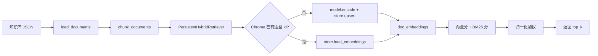

# Day 10 学习笔记

日期：2026-09-03

项目：`ai-job-agent`

目标：把内存中的 Embedding 和 chunk 元数据持久化到 Chroma，让服务重启后不需要重新编码，直接从磁盘加载。

## 1. Day 10 做了什么

Day 9 的 `HybridRetriever` 每次启动都会重新调用 `model.encode()`。Day 10 增加了一个本地向量库 Chroma，把向量、文本和元数据存到磁盘，启动时先判断 Chroma 里有没有这些数据，再决定是写入还是读取。



一句话描述：

> 检索器启动时先检查 Chroma 是否已经保存了当前所有 chunk 的 id；如果没有，就重新 Embedding 并写入，如果已经有，就直接从磁盘加载向量，然后继续做向量分 + BM25 分的混合检索。

## 2. 为什么需要持久化向量库

### 2.1 之前的问题

`HybridRetriever.__init__` 里这一行：

```python
self.doc_embeddings = model.encode(self.texts, normalize_embeddings=True)
```

每次进程启动都会重新加载模型并计算 Embedding。知识库很小的时候看不出来，但真实项目里：

- 模型加载很慢。
- 文档很多时 Embedding 很耗时。
- 进程重启后结果就丢了。

### 2.2 持久化解决什么

把结果存到磁盘，下次启动直接读，不再重复计算。Chroma 就是一个专门存向量和元数据的本地向量库，同时支持按向量相似度查询。

### 2.3 为什么选 Chroma 而不是 pgvector

学习阶段选 Chroma 是因为：

- 不需要单独装数据库服务。
- 本地直接持久化到 `data/chroma/`。
- API 简单，适合第一次接触向量库。

pgvector 更适合生产环境，但需要 PostgreSQL，学习成本更高。

## 3. 今天改了哪些文件

| 文件 | 变化 | 作用 |
|---|---|---|
| `app/vector_store.py` | 新增 | 封装 Chroma 的写入、读取和查询 |
| `app/rag.py` | 修改 | 新增 `PersistentHybridRetriever`，切换 `build_retriever` |
| `app/chroma_cli.py` | 新增 | 命令行验证持久化检索 |
| `tests/test_persistent_retriever.py` | 新增 | 用假对象测试“写入还是读取”的判断逻辑 |
| `data/chroma/` | 生成 | Chroma 持久化文件，例如 `chroma.sqlite3` 和索引文件 |

## 4. 核心代码与解释

### 4.1 ChromaStore 封装

`app/vector_store.py` 负责和 Chroma 打交道：

```python
import chromadb
import numpy as np


class ChromaStore:
    def __init__(self, persist_dir: str, collection_name: str = "job_knowledge"):
        self.client = chromadb.PersistentClient(path=persist_dir)
        self.collection = self.client.get_or_create_collection(
            name=collection_name,
            metadata={"hnsw:space": "cosine"},
        )

    def upsert(self, chunks: list[dict], embeddings: np.ndarray) -> None:
        self.collection.upsert(
            ids=[chunk["chunk_id"] for chunk in chunks],
            documents=[chunk["text"] for chunk in chunks],
            metadatas=[
                {
                    "doc_id": chunk["doc_id"],
                    "title": chunk["title"],
                    "chunk_index": chunk["chunk_index"],
                }
                for chunk in chunks
            ],
            embeddings=embeddings.tolist(),
        )

    def load_embeddings(self, chunk_ids: list[str]) -> np.ndarray:
        result = self.collection.get(ids=chunk_ids, include=["embeddings"])
        by_id = dict(zip(result["ids"], result["embeddings"]))
        return np.array([by_id[chunk_id] for chunk_id in chunk_ids])

    def query(self, query_embedding: np.ndarray, top_k: int) -> dict:
        return self.collection.query(
            query_embeddings=[query_embedding.tolist()],
            n_results=top_k,
            include=["documents", "metadatas", "distances"],
        )
```

解释：

- `chromadb.PersistentClient(path=...)`：创建一个持久化客户端，数据写到 `data/chroma/`。
- `get_or_create_collection`：同名 collection 已存在就复用，不存在就新建。
- `metadata={"hnsw:space": "cosine"}`：让 Chroma 用余弦距离，和我们归一化向量做点积的逻辑一致。
- `upsert`：有相同 `id` 就覆盖，没有就新增。
- `load_embeddings`：按 `chunk_ids` 的顺序把向量读回来，保证顺序和原 chunk 列表一致。

### 4.2 PersistentHybridRetriever

```python
class PersistentHybridRetriever:
    def __init__(self, chunks, model, store, alpha=0.5):
        self.chunks = chunks
        self.model = model
        self.store = store
        self.alpha = alpha
        self.texts = [chunk["text"] for chunk in chunks]
        self.bm25 = BM25()
        self.bm25.fit(self.texts)

        chunk_ids = [chunk["chunk_id"] for chunk in chunks]
        existing_ids = set(self.store.collection.get(ids=chunk_ids)["ids"])

        if existing_ids == set(chunk_ids):
            self.doc_embeddings = self.store.load_embeddings(chunk_ids)
        else:
            self.doc_embeddings = model.encode(self.texts, normalize_embeddings=True)
            self.store.upsert(chunks, self.doc_embeddings)

    def retrieve(self, query, top_k=3):
        query_embedding = self.model.encode([query], normalize_embeddings=True)[0]
        vector_scores = self.doc_embeddings @ query_embedding
        bm25_scores = np.array(self.bm25.score(query))

        final_scores = (
            self.alpha * _normalize(vector_scores)
            + (1 - self.alpha) * _normalize(bm25_scores)
        )

        top_indices = np.argsort(final_scores)[::-1][:top_k]

        return [
            {"doc": self.chunks[index], "score": float(final_scores[index])}
            for index in top_indices
        ]
```

关键判断：

```python
existing_ids = set(self.store.collection.get(ids=chunk_ids)["ids"])

if existing_ids == set(chunk_ids):
    self.doc_embeddings = self.store.load_embeddings(chunk_ids)
else:
    self.doc_embeddings = model.encode(self.texts, normalize_embeddings=True)
    self.store.upsert(chunks, self.doc_embeddings)
```

如果 Chroma 里已经保存了当前所有 chunk 的 id，就直接读取；否则重新编码并写入。BM25 数据量小，仍然保留在内存里。

### 4.3 切换入口

`build_retriever` 现在返回持久化版本：

```python
def build_retriever(path: Path, strategy: str = "fixed") -> PersistentHybridRetriever:
    documents = load_documents(path)
    chunks = chunk_documents(documents, strategy=strategy)
    model = SentenceTransformer(DEFAULT_EMBEDDING_MODEL)
    store = ChromaStore(persist_dir="data/chroma")
    return PersistentHybridRetriever(chunks, model, store)
```

顶部还需要导入：

```python
from app.vector_store import ChromaStore
```

## 5. Python 语法知识点

### 5.1 dict 和 zip 组合

```python
by_id = dict(zip(result["ids"], result["embeddings"]))
```

`zip` 把两个列表一一配对，`dict` 把配对结果转成字典：

```python
ids = ["a", "b"]
embeddings = [[1, 0], [0, 1]]
dict(zip(ids, embeddings))
# {"a": [1, 0], "b": [0, 1]}
```

### 5.2 列表推导式生成元数据

```python
metadatas=[
    {
        "doc_id": chunk["doc_id"],
        "title": chunk["title"],
        "chunk_index": chunk["chunk_index"],
    }
    for chunk in chunks
]
```

对每个 chunk 生成一个字典，最终得到一个字典列表。

### 5.3 numpy 数组转 Python 列表

`embeddings.tolist()` 把 numpy 二维数组转成 Python 的 `list[list[float]]`，这是 Chroma 需要的格式。

### 5.4 集合比较

```python
existing_ids == set(chunk_ids)
```

`set` 不关心顺序，只关心元素是否一样。这里用来判断 Chroma 里的 id 和当前 chunk 的 id 是否完全一致。

### 5.5 循环变量下划线

```python
for _ in texts:
    ...
```

`_` 是约定俗成的写法，表示“这个循环变量我用不到”。例如只想要“有多少个文本”，不关心每个文本内容。

## 6. 容易踩的坑和报错

### 6.1 NameError: name 'ChromaStore' is not defined

原因：`app/rag.py` 里用了 `ChromaStore`，但没有导入：

```python
from app.vector_store import ChromaStore
```

每个模块都要显式导入才能使用其他模块里的类。

### 6.2 load_embeddings 顺序错乱

Chroma 的 `collection.get` 不保证返回顺序和传入的 `chunk_ids` 一致。如果直接拿 `result["embeddings"]`，向量顺序可能和 chunk 列表对不上。

解决：

```python
by_id = dict(zip(result["ids"], result["embeddings"]))
return np.array([by_id[chunk_id] for chunk_id in chunk_ids])
```

先按 id 建立字典，再按 `chunk_ids` 顺序取，保证顺序稳定。

### 6.3 KeyError 表示某个 id 不在 Chroma 里

如果 `chunk_ids` 里的某个 id 不存在，`by_id[chunk_id]` 会抛 `KeyError`。所以 `PersistentHybridRetriever` 先比较 `existing_ids`，只有全部存在才调用 `load_embeddings`。

### 6.4 余弦距离和 L2 距离不要混用

Chroma 默认可能使用 L2 距离，L2 是越小越好；我们项目中向量是归一化后做点积，等价于余弦相似度，是越大越好。所以要显式创建 collection：

```python
metadata={"hnsw:space": "cosine"}
```

### 6.5 data/chroma 目录权限或锁问题

Chroma 会把数据写到 SQLite 文件。如果目录不可写，或同时有多个进程打开同一个持久化目录，可能会报 SQLite 相关错误。学习阶段保持只有一个进程运行即可。

## 7. 测试为什么要这样写

`tests/test_persistent_retriever.py` 没有真的启动 Chroma，也没有真的加载 Embedding 模型，而是用三个假对象：

- `FakeModel`：代替 Embedding 模型，记录 `encode` 被调用几次。
- `FakeCollection`：代替 Chroma collection，只实现 `get`，返回预设的已有 id。
- `FakeStore`：代替 `ChromaStore`，记录 `upsert` 和 `load_embeddings` 被调用几次。

真正要验证的是 `PersistentHybridRetriever.__init__` 的判断逻辑，所以不需要真实 Chroma。

三个测试分别验证：

1. Chroma 为空时，走 `encode + upsert`。
2. Chroma 已有 id 时，走 `load_embeddings`，不再 `encode`。
3. `retrieve` 仍然返回 `{"doc", "score"}`，并能把包含查询词的 chunk 排到第一。

测试结果：

```text
22 passed
```

## 8. Day 10 检查清单

- [ ] 理解为什么要把向量持久化到磁盘
- [ ] `app/vector_store.py` 已实现 `ChromaStore`
- [ ] `app/rag.py` 已增加 `PersistentHybridRetriever`
- [ ] `build_retriever` 已切换到持久化版本
- [ ] `app/chroma_cli.py` 已创建
- [ ] `data/chroma/` 能生成并复用向量文件
- [ ] 第二次启动不再重新 Embedding
- [ ] `tests/test_persistent_retriever.py` 已创建并通过
- [ ] `.venv/bin/pytest -q` 全部通过

## 9. 明天要做什么

Day 11 进入“会话记忆”：给 Agent 增加短期记忆和消息历史，让多轮对话能记住之前说了什么，而不是每次都从零开始。
