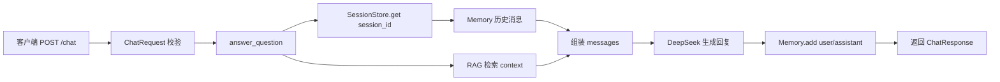

# Day 11 学习笔记

日期：2026-09-03

项目：`ai-job-agent`

目标：给 Agent 增加短期记忆，让同一个 `session_id` 的多轮对话能记住之前说过的话，而不是每轮都从零开始。

## 1. Day 11 做了什么

之前 `/jd/analyze` 每次都是单轮调用，模型看不到上一轮内容。Day 11 新增了 `/chat` 接口，用 `session_id` 维护每个会话的消息历史，并在下一轮把历史消息一起传给模型。



一句话描述：

> 客户端带着 `session_id` 和问题请求 `/chat`，服务端从 `SessionStore` 取出该会话的历史消息，再拼接系统提示、检索上下文和当前问题，交给 DeepSeek 生成回复，最后把本轮问答追加回记忆并返回。

## 2. 为什么需要会话记忆

### 2.1 模型本身没有记忆

DeepSeek 这类大模型本身不会自动记住上一次对话。每次调用，它都只能看到你这次传给它的 `messages`。

例如第一次问“FastAPI 需要掌握什么”，第二次问“那它和 Pydantic 是什么关系”。如果不把第一轮内容传给模型，它不知道“它”指的是 FastAPI。

### 2.2 短期记忆就是消息列表

短期记忆在代码里就是一个列表：

```python
[
    {"role": "system", "content": "你是 AI 岗位咨询助手"},
    {"role": "user", "content": "FastAPI 需要掌握什么"},
    {"role": "assistant", "content": "FastAPI 需要掌握路由、Pydantic..."},
]
```

下一轮只要把这个列表原样放进 `messages`，模型就有了上下文。

## 3. 今天改了哪些文件

| 文件 | 变化 | 作用 |
|---|---|---|
| `app/memory.py` | 新增 | 实现 `Memory` 和 `SessionStore` |
| `app/agent.py` | 修改 | 新增 `answer_question` 和聊天系统提示 |
| `app/models.py` | 修改 | 新增 `ChatResponse` |
| `app/main.py` | 修改 | 新增 `POST /chat` |
| `tests/test_memory.py` | 新增 | 测试记忆存储和会话隔离 |
| `tests/test_chat.py` | 新增 | 测试历史消息传递和追加 |

## 4. 核心代码与解释

### 4.1 Memory

```python
class Memory:
    def __init__(self):
        self.messages = []

    def add(self, role: str, content: str) -> None:
        self.messages.append({"role": role, "content": content})

    def get_messages(self) -> list[dict]:
        return list(self.messages)

    def clear(self) -> None:
        self.messages.clear()
```

解释：

- `self.messages` 是当前会话的消息列表。
- `add` 把一条 `{"role", "content"}` 追加到列表末尾。
- `get_messages` 返回一份副本，避免外部不小心修改内部列表。
- `clear` 清空记忆，用于“重新开始”的场景。

### 4.2 SessionStore

```python
class SessionStore:
    def __init__(self):
        self.sessions = {}

    def get(self, session_id: str) -> Memory:
        if session_id not in self.sessions:
            self.sessions[session_id] = Memory()
        return self.sessions[session_id]


session_store = SessionStore()
```

解释：

- `self.sessions` 用 `session_id` 作为 key，值是每个会话的 `Memory`。
- 第一次访问某个 `session_id` 时创建新的 `Memory`，之后返回同一个对象。
- 文件末尾的 `session_store` 是模块级单例，服务运行期间一直存在，所以不同请求能共享记忆。

### 4.3 answer_question

```python
def answer_question(session_id: str, question: str, retriever=None) -> str:
    memory = session_store.get(session_id)
    retriever = retriever or get_retriever()

    results = retriever.retrieve(question, top_k=3)
    context = format_context(results)

    messages = [
        {"role": "system", "content": CHAT_SYSTEM_PROMPT},
        *memory.get_messages(),
        {"role": "user", "content": f"知识库：\n{context}\n\n问题：{question}"},
    ]

    response = client.chat.completions.create(
        model=os.environ["OPENAI_MODEL"],
        messages=messages,
    )
    reply = response.choices[0].message.content

    memory.add("user", question)
    memory.add("assistant", reply)

    return reply
```

解释：

- `retriever = retriever or get_retriever()`：如果调用方传了假的检索器（测试时），就用它；否则用真实检索器。
- `format_context(results)` 把检索结果拼成文本。
- `*memory.get_messages()` 把历史消息列表展开，放进当前 `messages`。
- 当前问题放在最后，并带上检索到的知识上下文。
- 这里没有用 function calling，而是让模型直接返回文本，因为聊天需要自然多轮回答。
- 调用结束后，把本轮用户问题和模型回答追加进 `memory`。

### 4.4 /chat 接口

`app/models.py` 里：

```python
class ChatResponse(BaseModel):
    reply: str
```

`app/main.py` 里：

```python
class ChatRequest(BaseModel):
    session_id: str
    question: str = Field(min_length=1)

@app.post("/chat", response_model=ChatResponse)
def chat(request: ChatRequest) -> ChatResponse:
    reply = answer_question(request.session_id, request.question)
    return ChatResponse(reply=reply)
```

## 5. Python 语法知识点

### 5.1 类和实例属性

```python
class Memory:
    def __init__(self):
        self.messages = []
```

`__init__` 是构造函数，每次 `Memory()` 都会执行一次，`self.messages` 是每个实例独立的列表。

### 5.2 list.append 和 list.clear

- `append(x)` 在列表末尾加一个元素。
- `clear()` 清空整个列表。

### 5.3 字典按 key 取值和判断

```python
self.sessions[session_id]
session_id not in self.sessions
```

字典可以用 key 取值；`in` 判断 key 是否存在。

### 5.4 星号展开列表

```python
messages = [
    {"role": "system", "content": "..."},
    *memory.get_messages(),
    {"role": "user", "content": "..."},
]
```

`*list` 会把列表里的每个元素拆开，放进新列表的对应位置，相当于把历史消息“平铺”进来。

### 5.5 模块级单例

```python
session_store = SessionStore()
```

这行代码在模块被 import 时执行一次。之后所有 `from app.memory import session_store` 拿到的都是同一个对象，所以能共享记忆。

## 6. 容易踩的坑和报错

### 6.1 测试时 patch 错对象

`agent.py` 里写的是：

```python
from app.memory import session_store
```

所以测试应该 patch：

```python
patch("app.agent.session_store", store)
```

而不是 `patch("app.memory.session_store", store)`。因为导入后，`agent` 模块里已经有自己的 `session_store` 名字，patch 要指向真正被使用的地方。

### 6.2 全局 session_store 导致测试互相影响

真实的 `session_store` 是全局单例。如果多个测试都用它，前面的消息会漏到后面的测试里。所以测试里要 patch 成新的 `SessionStore()`，保证每个测试独立。

### 6.3 reply 可能是 None

如果模型因为某种原因没有返回文本，`response.choices[0].message.content` 可能是 `None`，后续 `memory.add` 会把 `None` 存进去。学习阶段可以先不处理，但要意识到这是一个潜在问题。

### 6.4 忘记把历史消息传回模型

记忆的“存”只是第一步，“取出来再传回去”才是关键。如果只 `memory.add`，但下一轮没有把 `memory.get_messages()` 放进 `messages`，模型仍然没有上下文。

## 7. 测试为什么要这样写

### 7.1 test_memory.py

`Memory` 和 `SessionStore` 是纯 Python，不需要 mock：

- 测试 `add` 后 `get_messages` 是否按顺序返回完整历史。
- 测试同一个 `session_id` 是否返回同一个对象，不同 id 是否返回不同对象。

### 7.2 test_chat.py

`answer_question` 会调用 DeepSeek 和检索器，所以用 `MagicMock` 和 `FakeRetriever` 代替。

两个测试分别验证：

1. 返回模型内容，并把本轮 user/assistant 消息追加进对应 session。
2. 当 memory 里已经有历史消息时，这些历史消息真的被传进 `messages`。

测试结果：

```text
26 passed
```

## 8. Day 11 检查清单

- [ ] 理解模型没有记忆，记忆靠消息列表传递
- [ ] `app/memory.py` 已实现 `Memory` 和 `SessionStore`
- [ ] `app/agent.py` 已增加 `answer_question`
- [ ] `app/models.py` 已增加 `ChatResponse`
- [ ] `app/main.py` 已增加 `/chat`
- [ ] 同一个 session 的多轮对话能记住上下文
- [ ] `tests/test_memory.py` 和 `tests/test_chat.py` 已创建并通过
- [ ] `.venv/bin/pytest -q` 全部通过

## 9. 明天要做什么

Day 12 进入“RAG 接入回答”：把检索到的上下文和引用来源整理进最终回答，让答案更可靠、可追溯。
