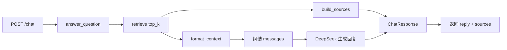

# Day 12 学习笔记

日期：2026-09-03

项目：`ai-job-agent`

目标：让 RAG 回答不仅返回文本，还返回引用的来源；同时让模型在回答中标注它使用了哪条知识片段。

## 1. Day 12 做了什么

Day 11 的 `/chat` 只会返回一段 `reply`，用户看不到答案来自哪里。Day 12 给回答增加了 `sources`，并把检索命中的 chunk 转成 `Source` 对象一起返回。



一句话描述：

> `/chat` 先检索出最相关的 chunk，一方面把检索结果拼成上下文交给模型生成 `reply`，另一方面把命中的 chunk 转成 `Source` 列表，最后把 `reply` 和 `sources` 一起通过 `ChatResponse` 返回。

## 2. 为什么需要引用来源

RAG 的价值是“答案来自检索到的资料”。如果不返回来源，用户无法判断：

- 答案是模型根据知识库回答的，还是模型自己编的。
- 这条信息来自哪个 chunk，能否回去验证。

返回 `sources` 后，答案变得可追溯，也更容易发现检索错误。

## 3. 今天改了哪些文件

| 文件 | 变化 | 作用 |
|---|---|---|
| `app/models.py` | 修改 | 新增 `Source`，`ChatResponse` 增加 `sources` |
| `app/agent.py` | 修改 | 新增 `build_sources`，`answer_question` 返回 `ChatResponse` |
| `app/main.py` | 修改 | `/chat` 直接返回 `answer_question` 的结果 |
| `tests/test_chat.py` | 修改 | 新增 `build_sources` 测试，更新返回类型相关断言 |

## 4. 核心代码与解释

### 4.1 Source 和 ChatResponse

```python
class Source(BaseModel):
    chunk_id: str
    title: str
    text: str
    score: float


class ChatResponse(BaseModel):
    reply: str
    sources: list[Source] = Field(default_factory=list)
```

解释：

- `Source` 描述一条引用来源，包含块的 id、标题、文本和检索分数。
- `ChatResponse.sources` 默认是空列表，兼容没有来源的情况。
- 这是 Pydantic 的嵌套模型：`ChatResponse` 里包含一个 `Source` 的列表。

### 4.2 build_sources

```python
def build_sources(results: list[dict]) -> list[Source]:
    sources = []

    for result in results:
        doc = result["doc"]
        sources.append(
            Source(
                chunk_id=doc.get("chunk_id", doc.get("id", "unknown")),
                title=doc["title"],
                text=doc["text"],
                score=result["score"],
            )
        )

    return sources
```

解释：

- 遍历检索结果，把每个 `{"doc", "score"}` 转成一个 `Source`。
- `doc.get("chunk_id", doc.get("id", "unknown"))` 优先取 `chunk_id`，没有时退回 `id`，再没有就用 `"unknown"`，避免 `KeyError`。

### 4.3 answer_question 返回 ChatResponse

```python
def answer_question(session_id: str, question: str, retriever=None) -> ChatResponse:
    memory = session_store.get(session_id)
    retriever = retriever or get_retriever()

    results = retriever.retrieve(question, top_k=3)
    sources = build_sources(results)
    context = format_context(results)

    messages = [
        {"role": "system", "content": CHAT_SYSTEM_PROMPT},
        *memory.get_messages(),
        {"role": "user", "content": f"知识库：\n{context}\n\n问题：{question}"},
    ]

    response = client.chat.completions.create(
        model=os.environ["OPENAI_MODEL"],
        messages=messages,
    )
    reply = response.choices[0].message.content

    memory.add("user", question)
    memory.add("assistant", reply)

    return ChatResponse(reply=reply, sources=sources)
```

关键变化：

- 原来返回 `str`，现在返回 `ChatResponse(reply=..., sources=...)`。
- `sources` 来自检索结果，`reply` 来自模型生成。

### 4.4 让模型标注来源

```python
CHAT_SYSTEM_PROMPT = """你是 AI 岗位咨询助手。
根据知识库和对话历史回答用户问题，回答要简洁、准确。
如果使用了知识库内容，请在相关句子末尾用 [chunk_id] 标注来源。
如果知识库没有相关内容，就明确说明不知道。"""
```

上下文里已经有 `[chunk_id] title: text` 的格式，所以模型可以引用这些 id，在回答末尾写 `[doc-fastapi-0]` 这样的来源标注。

## 5. Python 语法知识点

### 5.1 Pydantic 嵌套模型

一个 Pydantic 模型可以作为另一个模型的字段类型：

```python
class ChatResponse(BaseModel):
    reply: str
    sources: list[Source] = Field(default_factory=list)
```

`list[Source]` 表示 `sources` 是 `Source` 对象的列表，FastAPI 和 Pydantic 会自动校验并序列化。

### 5.2 Field(default_factory=list)

`default_factory=list` 表示每次创建对象时都生成一个新的空列表，避免多个对象共享同一个默认列表。

### 5.3 dict.get 的二级回退

```python
doc.get("chunk_id", doc.get("id", "unknown"))
```

先看有没有 `chunk_id`，没有再看 `id`，两个都没有就返回 `"unknown"`。这是安全的取值方式。

### 5.4 函数返回值类型变化

函数签名从 `-> str` 改成 `-> ChatResponse` 后，调用方拿到的是对象，需要通过 `result.reply` 或 `result.sources` 访问字段。这会导致旧的测试断言失效，需要同步更新。

## 6. 容易踩的坑和报错

### 6.1 返回类型变化导致测试失败

Day 11 的测试写的是：

```python
reply = agent.answer_question(...)
assert reply == "RAG 是检索增强生成。"
```

Day 12 返回的是 `ChatResponse`，所以 `reply` 不再是字符串，断言会失败。需要改成：

```python
result = agent.answer_question(...)
assert result.reply == "RAG 是检索增强生成。"
```

### 6.2 重复定义 ChatResponse

如果文件里有两个 `class ChatResponse`，后面那个会覆盖前面那个。虽然不影响运行，但容易让人困惑，应该删掉旧的定义，只保留带 `sources` 的版本。

### 6.3 直接取 doc["chunk_id"] 报 KeyError

如果某些旧文档只有 `id` 没有 `chunk_id`，直接写：

```python
chunk_id=doc["chunk_id"]
```

会抛 `KeyError`。所以 `build_sources` 里用 `.get()` 做回退。

### 6.4 只返回 reply 不返回 sources

如果只改模型，不改 `answer_question` 的返回值，`/chat` 响应里就不会有来源。来源必须在函数返回时显式带上。

## 7. 测试为什么要这样写

`tests/test_chat.py` 里新增了 `build_sources` 测试，并更新了 `answer_question` 的断言。

三个测试分别验证：

1. `build_sources` 能把检索结果转成 `Source` 列表，字段正确。
2. `answer_question` 返回 `ChatResponse`，其中 `reply` 和 `sources` 都正确，消息仍被追加进 memory。
3. 历史消息仍然被传进 `messages`，保证 Day 11 的记忆能力没有退化。

测试结果：

```text
27 passed
```

## 8. Day 12 检查清单

- [ ] 理解为什么要返回引用来源
- [ ] `app/models.py` 已增加 `Source` 并改造 `ChatResponse`
- [ ] `app/agent.py` 已增加 `build_sources`
- [ ] `answer_question` 返回 `ChatResponse`，带 `reply` 和 `sources`
- [ ] `CHAT_SYSTEM_PROMPT` 要求模型标注 `[chunk_id]`
- [ ] `/chat` 响应包含来源
- [ ] `tests/test_chat.py` 已更新并通过
- [ ] `.venv/bin/pytest -q` 全部通过

## 9. 明天要做什么

Day 13 进入“RAG 评估”：用召回率、答案忠实度等指标衡量检索和回答质量，建立可量化的评估集。
