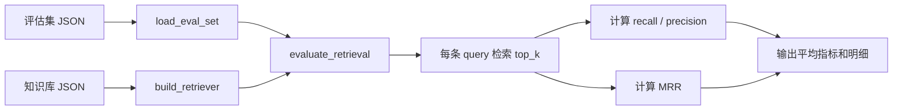

# Day 13 学习笔记

日期：2026-09-04

项目：`ai-job-agent`

目标：给检索链路建立评估集，用召回率、精确率、MRR 衡量检索质量，并了解答案忠实度的衡量思路。

## 1. Day 13 做了什么

之前系统只会检索和回答，没有量化指标。Day 13 增加了评估集和评估脚本，把“检索好不好”变成数字。



一句话描述：

> 评估脚本先加载人工标注的评估集，再对每个 query 做检索，分别计算召回率、精确率和 MRR，最后输出平均指标和每条 query 的明细，用来判断检索质量。

## 2. 为什么需要评估

评估是区分 Demo 和可上线系统的关键。没有评估，你只能凭感觉判断“检索得怎么样”。

三个核心指标：

- 召回率 Recall@k：真正相关的 chunk 里，有多少出现在前 k 个结果里。
- 精确率 Precision@k：前 k 个结果里，有多少是真正相关的。
- MRR：正确答案第一次出现的排名的倒数平均值，用来衡量排序质量。

## 3. 今天改了哪些文件

| 文件 | 变化 | 作用 |
|---|---|---|
| `data/eval_set.json` | 新增 | 人工标注的评估集 |
| `app/evaluate.py` | 新增 | 实现评估指标和整体评估函数 |
| `app/eval_cli.py` | 新增 | 命令行运行评估 |

## 4. 核心代码与解释

### 4.1 评估集

```json
[
  {
    "query": "FastAPI 后端需要掌握什么",
    "relevant_chunk_ids": ["doc-fastapi-0"]
  }
]
```

每个 case 包含：

- `query`：要检索的问题。
- `relevant_chunk_ids`：人工认为正确答案所在的 chunk。

### 4.2 召回率和精确率

```python
def recall_at_k(retrieved_ids: list[str], relevant_ids: list[str]) -> float:
    if not relevant_ids:
        return 0.0
    relevant = set(relevant_ids)
    return len(relevant & set(retrieved_ids)) / len(relevant)


def precision_at_k(retrieved_ids: list[str], relevant_ids: list[str]) -> float:
    if not retrieved_ids:
        return 0.0
    relevant = set(relevant_ids)
    return len(relevant & set(retrieved_ids)) / len(retrieved_ids)
```

解释：

- `set(a) & set(b)` 求两个集合的交集。
- 召回率 = 命中数 / 相关总数。
- 精确率 = 命中数 / 检索数量。

### 4.3 MRR

正确写法：

```python
def mrr(retrieved_ids_list: list[list[str]], relevant_ids_list: list[list[str]]) -> float:
    if not retrieved_ids_list:
        return 0.0

    scores = []

    for retrieved_ids, relevant_ids in zip(retrieved_ids_list, relevant_ids_list):
        relevant = set(relevant_ids)
        for index, chunk_id in enumerate(retrieved_ids, start=1):
            if chunk_id in relevant:
                scores.append(1 / index)
                break
        else:
            scores.append(0.0)

    return sum(scores) / len(scores)
```

解释：

- 对每个 query，找到第一个命中的排名 `index`，得分是 `1 / index`。
- 如果整个列表都没有命中，得分是 `0`。
- 最后求所有 query 得分的平均值。
- `for ... else` 的 `else` 要写在 `for` 那一层，表示“循环没有 break 才执行”。

### 4.4 整体评估

```python
def evaluate_retrieval(retriever, eval_set, top_k=3):
    recalls = []
    precisions = []
    details = []
    retrieved_ids_list = []
    relevant_ids_list = []

    for case in eval_set:
        results = retriever.retrieve(case["query"], top_k=top_k)
        retrieved_ids = [result["doc"]["chunk_id"] for result in results]
        relevant_ids = case["relevant_chunk_ids"]

        recall = recall_at_k(retrieved_ids, relevant_ids)
        precision = precision_at_k(retrieved_ids, relevant_ids)

        recalls.append(recall)
        precisions.append(precision)
        retrieved_ids_list.append(retrieved_ids)
        relevant_ids_list.append(relevant_ids)

        details.append(
            {
                "query": case["query"],
                "recall": recall,
                "precision": precision,
                "retrieved_ids": retrieved_ids,
                "relevant_chunk_ids": relevant_ids,
            }
        )

    return {
        "avg_recall": sum(recalls) / len(recalls),
        "avg_precision": sum(precisions) / len(precisions),
        "avg_mrr": mrr(retrieved_ids_list, relevant_ids_list),
        "details": details,
    }
```

### 4.5 答案忠实度

```python
def citation_coverage(reply: str, source_ids: list[str]) -> float:
    cited = re.findall(r"\[([A-Za-z0-9_-]+)\]", reply)
    if not cited:
        return 0.0

    valid = set(source_ids)
    matched = [chunk_id for chunk_id in cited if chunk_id in valid]
    return len(matched) / len(cited)
```

解释：

- 用正则找出回答里所有 `[chunk_id]`。
- 计算这些引用里有多少出现在 `source_ids` 中。
- 这是答案忠实度的一个简单代理指标，不是真正的语义忠实度。

## 5. Python 语法知识点

### 5.1 集合交集

```python
set(a) & set(b)
```

`&` 是集合交集运算符，返回两个集合都有的元素。

### 5.2 enumerate 的 start 参数

```python
for index, chunk_id in enumerate(retrieved_ids, start=1):
```

`start=1` 让下标从 1 开始，方便计算排名。

### 5.3 for...else

```python
for item in items:
    if condition:
        break
else:
    # 如果循环没有 break，就执行这里
```

注意 `else` 是对齐 `for` 的，不是对齐 `if`。

### 5.4 zip

```python
for a, b in zip(list_a, list_b):
```

`zip` 把两个列表一一配对。

### 5.5 re.findall

```python
re.findall(r"\[([A-Za-z0-9_-]+)\]", reply)
```

用正则表达式找出所有符合 `[内容]` 的部分，并返回括号里的内容。

## 6. 容易踩的坑和报错

### 6.1 JSON 不支持注释

如果把注释 `// ...` 写在 `data/eval_set.json` 顶部，`json.load` 会抛 `JSONDecodeError`。JSON 文件必须直接从 `[` 或 `{` 开始。

### 6.2 python -m 没有输出

如果 `app/eval_cli.py` 只定义了 `main()`，但没有：

```python
if __name__ == "__main__":
    main()
```

那么 `python -m app.eval_cli` 执行完顶层 import 就结束了，不会有任何输出。

### 6.3 precision@k 在单标签时偏低

每个 query 只标 1 个相关 chunk、但 `top_k=3` 时，precision 最多就是 `1/3`。这不是 bug，而是指标设置导致的。此时更适合看召回率和 MRR。

### 6.4 MRR 的 else 缩进写错

错误写法：

```python
for index, chunk_id in enumerate(retrieved_ids, start=1):
    if chunk_id in relevant:
        scores.append(1 / index)
        break
    else:
        scores.append(0.0)
```

这个 `else` 对齐了 `if`，会在第一个不相关的 chunk 上就追加 `0.0`，导致一个 query 可能产生多个分数，MRR 被算低。

正确写法是让 `else` 对齐 `for`：

```python
for index, chunk_id in enumerate(retrieved_ids, start=1):
    if chunk_id in relevant:
        scores.append(1 / index)
        break
else:
    scores.append(0.0)
```

### 6.5 平均指标除以 0

如果评估集为空，`sum(scores) / len(scores)` 会除零。`mrr` 里先判断 `if not retrieved_ids_list: return 0.0` 可以避免这个问题。

## 7. 测试

Day 13 的测试文件还未添加。需要覆盖：

- `recall_at_k` 和 `precision_at_k` 的计算。
- `evaluate_retrieval` 返回平均指标和明细。
- `citation_coverage` 的引用判断。

这些测试会在后续按“引导写测试”的方式补齐。

## 8. Day 13 检查清单

- [ ] 理解召回率、精确率、MRR 的含义
- [ ] `data/eval_set.json` 已创建
- [ ] `app/evaluate.py` 已实现指标函数
- [ ] `app/eval_cli.py` 已创建并能运行
- [ ] 能输出 `avg_recall`、`avg_precision`、`avg_mrr`
- [ ] 理解 `citation_coverage` 的作用

## 9. 明天要做什么

Day 14 进入“项目整合”：完整跑测试、补 README、接口联调、Git 提交和第 2 周复盘。
