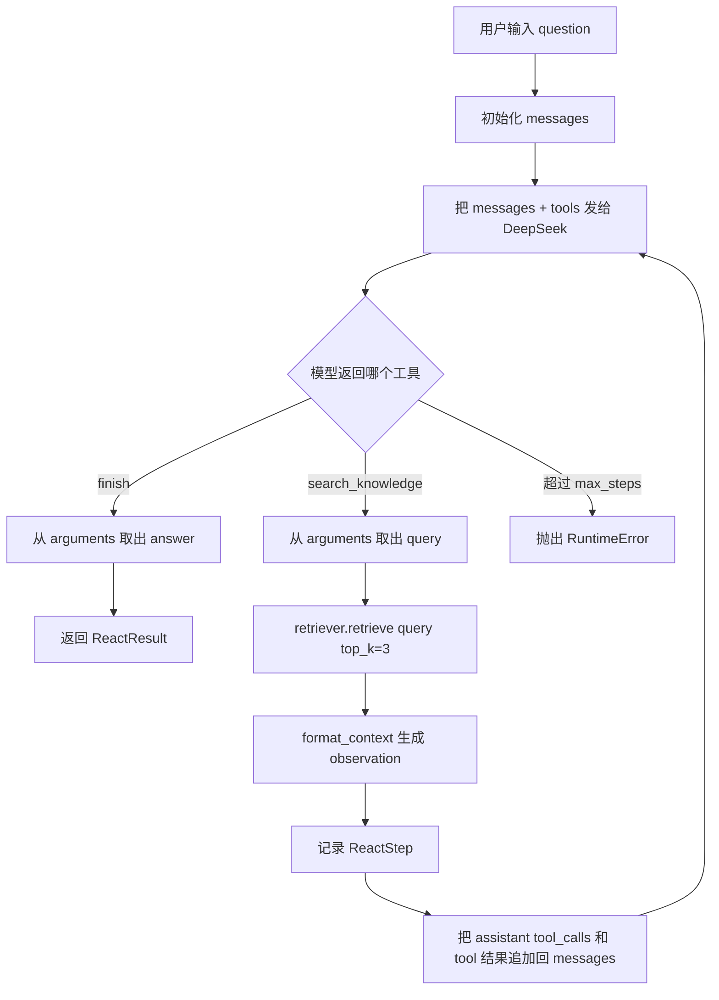

# Day 15 学习笔记

日期：2026-09-04

项目：`ai-job-agent`

目标：把原来的“固定步骤：解析 JD -> 检索 -> 生成”升级为 ReAct 循环，让模型自己决定下一步是继续检索还是结束回答。

## 1. Day 15 做了什么

Day 15 新增了 `app/react.py`，实现了一个最小 ReAct Agent。

它目前只有两个工具：

| 工具名 | 作用 |
|---|---|
| `search_knowledge` | 在岗位知识库里检索相关内容 |
| `finish` | 模型认为已经有足够信息，返回最终答案 |

和之前代码最大的区别是：

- Day 6 的 `analyze_job()` 是写死的步骤：先解析，再检索，再生成。
- Day 15 的 `run_react_loop()` 是循环：每一轮都让模型选择下一步行动。

用一个通俗的说法：

> 以前的代码像照着说明书做饭，每一步都固定。现在代码像让厨师自己判断：看看冰箱里有什么，再决定下一步做什么，直到可以上菜。

## 2. 项目闭环实际流程



每一步的实际含义：

1. 用户提出一个问题，例如“什么是 RAG”。
2. 程序先创建 `messages`，里面包含系统提示和用户问题。
3. 调用 DeepSeek，并且传入两个工具 Schema。
4. DeepSeek 返回一个 `tool_calls`，表示它想调用哪个工具。
5. 如果模型调用 `finish`，程序就解析参数里的 `answer`，结束循环。
6. 如果模型调用 `search_knowledge`，程序就从参数里拿出 `query`，去知识库检索。
7. 检索结果通过 `format_context()` 转成一段文本，成为本轮工具的 `observation`。
8. 本轮动作和观察结果记录到 `ReactStep`。
9. 程序把 assistant 的工具调用，以及 `role=tool` 的工具结果，追加回 `messages`。
10. 带着新的上下文重新调用 DeepSeek。
11. 循环继续，直到模型调用 `finish`，或者超过 `max_steps`。

## 3. 今天改了哪些文件

| 文件 | 变化 | 作用 |
|---|---|---|
| `app/models.py` | 新增 `ReactStep`、`ReactResult` | 保存每一步动作和最终答案 |
| `app/react.py` | 新增 | 实现 ReAct 循环和两个工具 |
| `tests/test_react.py` | 新增 | 验证循环会结束、会记录步骤、不会死循环 |

## 4. 核心代码逐段解释

### 4.1 `ReactStep` 和 `ReactResult`

```python
class ReactStep(BaseModel):
    action: str
    action_input: str = ""
    observation: str = ""


class ReactResult(BaseModel):
    answer: str
    steps: list[ReactStep] = Field(default_factory=list)
```

解释：

- `ReactStep` 是“一步”的轨迹。`action` 是工具名，`action_input` 是传给工具的输入，`observation` 是工具返回后给模型看的结果。
- `ReactResult` 是最终交付给调用方的内容：最终答案 `answer`，以及中间过程 `steps`。
- `steps` 使用 `Field(default_factory=list)`，而不是 `steps: list[ReactStep] = []`。因为 Pydantic 模型默认值如果是同一个列表对象，不同实例可能共享同一个列表，容易互相污染。

### 4.2 两个工具 Schema

`search_knowledge` 工具：

```python
SEARCH_KNOWLEDGE_TOOL = {
    "type": "function",
    "function": {
        "name": "search_knowledge",
        "description": "在岗位知识库中检索与用户问题相关的内容。",
        "parameters": {
            "type": "object",
            "additionalProperties": False,
            "properties": {
                "query": {"type": "string", "description": "检索关键词或问题"},
            },
            "required": ["query"],
        },
    },
}
```

解释：

- `name` 是模型会返回的工具名，也是 Python 代码后面用来判断执行哪段逻辑的 key。
- `description` 很重要，它告诉模型“什么时候该用这个工具”。
- `parameters` 就是 JSON Schema，描述参数长什么样。
- `required: ["query"]` 表示模型调用时必须提供 `query`。

`finish` 工具类似，只是参数名是 `answer`。模型用 `finish` 表示“我不用再检索了，现在就能回答”。

### 4.3 `TOOLS` 和 `tool_choice="auto"`

```python
TOOLS = [SEARCH_KNOWLEDGE_TOOL, FINISH_TOOL]
```

```python
response = client.chat.completions.create(
    model=os.environ["OPENAI_MODEL"],
    messages=messages,
    tools=TOOLS,
    tool_choice="auto",
)
```

这里最重要的一行是 `tool_choice="auto"`。

- `auto` 表示模型可以自己决定调用哪个工具，也可以决定是否调用工具。
- 它和 Day 4 的强制调用不同。Day 4 是 `tool_choice={"type": "function", "function": {"name": "..."}}`，强制模型调用一个固定函数。
- Day 15 有两个工具，所以必须让模型自己选。

### 4.4 `messages` 的初始内容

```python
messages = [
    {"role": "system", "content": REACT_SYSTEM_PROMPT},
    {"role": "user", "content": question},
]
```

解释：

- `messages` 就是每一轮发给模型的完整上下文。
- `system` 用来设定 Agent 的行为规则。
- `user` 是用户当前的问题。
- 后面每一次工具调用后，都会往这个列表里追加内容。模型每次看到的，都是“从开始到现在”的完整上下文。

### 4.5 判断模型返回的工具名

```python
tool_call = message.tool_calls[0]
tool_name = tool_call.function.name
arguments = json.loads(tool_call.function.arguments or "{}")
```

解释：

- `message.tool_calls` 是一个列表。当前代码只处理第一个工具调用，所以用 `[0]`。
- `tool_call.function.name` 是模型选择的函数名。
- `tool_call.function.arguments` 是 JSON 字符串，例如 `'{"query":"什么是 RAG"}'`。
- `json.loads()` 把 JSON 字符串转成 Python 字典。
- `or "{}"` 是一种防御性写法：如果 `arguments` 是空值，就解析一个空字典，避免 `json.loads(None)` 报错。

### 4.6 `finish` 分支

```python
if tool_name == "finish":
    return ReactResult(answer=arguments.get("answer", ""), steps=steps)
```

解释：

- `dict.get("answer", "")` 是安全取值。如果字典里没有 `answer`，就返回空字符串，而不是报 `KeyError`。
- `finish` 不继续追加消息，而是直接返回，循环结束。

### 4.7 `search_knowledge` 分支

```python
query = arguments.get("query") or question
results = retriever.retrieve(query, top_k=3)
observation = format_context(results)
```

解释：

- 优先使用模型提供的 `query`。
- 如果模型没给 `query`，就退回使用用户原来的问题，保证检索仍然能执行。
- `retriever.retrieve()` 就是我们第 2 周已经做好的混合检索能力。
- `format_context()` 把检索结果拼成模型容易阅读的文本。

### 4.8 把工具结果放回上下文

这是 ReAct 最关键的一步。

```python
call_id = getattr(tool_call, "id", None) or f"call_{len(steps)}"

steps.append(
    ReactStep(
        action=tool_name,
        action_input=query,
        observation=observation,
    )
)

messages.append(_assistant_tool_message(tool_call, arguments, call_id))
messages.append(
    {
        "role": "tool",
        "tool_call_id": call_id,
        "content": observation,
    }
)
```

解释：

- 模型“调用工具”这个动作也要原样放回 `messages`，否则模型会丢失自己上一步做了什么。
- 工具执行结果使用 `role="tool"` 放回上下文，并且必须带 `tool_call_id`。
- `tool_call_id` 就像快递单号，用来把 assistant 的工具调用和对应的工具结果关联起来。
- `getattr(tool_call, "id", None) or f"call_{len(steps)}"` 是为了兼容测试 mock 或某些返回值没有 id 的情况。

### 4.9 `max_steps` 防死循环

```python
for _ in range(max_steps):
    ...

raise RuntimeError("ReAct 循环超过最大步数")
```

解释：

- 如果模型一直调用 `search_knowledge`，不调用 `finish`，程序就会一直循环。
- `for _ in range(max_steps)` 限制最多执行多少轮。
- 超过限制后抛出 `RuntimeError`，而不是让程序无限运行。
- 这是最简单的安全护栏，Day 18 会继续加入重试、超时和降级。

## 5. 测试文件内容分析

测试文件是 `tests/test_react.py`。

### 5.1 为什么要 mock DeepSeek

真实测试如果调用 DeepSeek：

- 会消耗 API 费用。
- 需要网络。
- 模型返回不稳定，测试可能时好时坏。

所以测试里用 `unittest.mock` 把 `react.client.chat.completions.create` 替换成假函数。

### 5.2 `FakeRetriever`

```python
class FakeRetriever:
    def retrieve(self, query, top_k=3):
        return [
            {
                "doc": {
                    "chunk_id": "doc-fastapi-0",
                    "title": "FastAPI",
                    "text": "FastAPI 是 Python 后端框架。",
                },
                "score": 0.9,
            }
        ]
```

它不需要真正加载 Embedding 模型，也不需要访问 Chroma。只要返回和真实检索器结构一致的数据，`format_context()` 就能正常工作。

### 5.3 `make_response`

```python
def make_response(tool_name, arguments):
    tool_call = MagicMock()
    tool_call.id = "call_test"
    tool_call.function.name = tool_name
    tool_call.function.arguments = arguments

    message = MagicMock()
    message.content = None
    message.tool_calls = [tool_call]

    choice = MagicMock()
    choice.message = message

    response = MagicMock()
    response.choices = [choice]
    return response
```

它的作用是模拟 DeepSeek 返回的数据结构：

```text
response.choices[0].message.tool_calls[0].function.name
response.choices[0].message.tool_calls[0].function.arguments
```

### 5.4 三个测试分别验证什么

`test_react_finish_without_search`

- 模型第一轮就调用 `finish`。
- 验证循环能立即结束。
- 验证 `steps` 是空列表。

`test_react_search_then_finish`

- 第一次返回 `search_knowledge`，第二次返回 `finish`。
- 使用 `side_effect=[search_response, finish_response]` 模拟连续两次不同返回。
- 验证：
  - 最终答案正确。
  - `steps` 记录了一次检索。
  - `create` 被调用了两次。
  - 第二次调用时，`messages` 里确实包含了 `role="tool"` 的工具结果。

`test_react_stops_at_max_steps`

- 模型一直返回 `search_knowledge`。
- 设置 `max_steps=2`。
- 验证第二次后抛出 `RuntimeError`，不会无限循环。

## 6. 相关报错及原因

### 6.1 `ImportError: cannot import name 'ReactResult' from 'app.models'`

原因：

- `app/react.py` 里导入了 `ReactResult` 和 `ReactStep`。
- 但 `app/models.py` 还没有新增这两个类。

解决：

在 `app/models.py` 末尾补上两个模型，再运行测试。

### 6.2 `ModuleNotFoundError: No module named 'app.react'`

原因：

- 测试文件已经写好了，但 `app/react.py` 还没有创建。

解决：

先创建 `app/react.py`，再运行测试。

### 6.3 `RuntimeError: 模型没有返回 tool_calls`

原因：

- 代码先检查 `if not message.tool_calls:`，如果模型返回的 `tool_calls` 为空，就抛这个错误。
- 常见场景是测试 mock 没有正确设置 `message.tool_calls = [tool_call]`。

解决：

检查 `make_response` 里是否设置了：

```python
message.tool_calls = [tool_call]
```

### 6.4 `json.JSONDecodeError`

原因：

- `tool_call.function.arguments` 不是合法 JSON，或者为空字符串。

解决：

代码里已经写了 `tool_call.function.arguments or "{}"`，可以避免 `None` 导致的错误。但如果字符串内容不是 JSON，仍然会报错，需要检查模型返回或测试 mock 的参数内容。

### 6.5 `KeyError: 'query'`

原因：

- 如果代码写 `arguments["query"]`，而模型没有返回 `query`，就会报 `KeyError`。

解决：

使用 `arguments.get("query") or question`，给一个默认值。

### 6.6 `RuntimeError: ReAct 循环超过最大步数`

原因：

- 模型反复调用 `search_knowledge`，没有调用 `finish`。

这不是 bug，而是保护机制。它说明 Agent 没有在限制步数内完成任务。

后续 Day 18 可以处理这个异常，比如降级成普通回答，或者返回“未完成任务”的状态。

### 6.7 下一次模型调用没有正确关联工具结果

原因：

- 工具结果消息里缺少 `tool_call_id`。

如果只写：

```python
messages.append({"role": "tool", "content": observation})
```

模型可能不知道这个结果是哪一次工具调用产生的。

解决：

必须同时传：

```python
{
    "role": "tool",
    "tool_call_id": call_id,
    "content": observation,
}
```

## 7. 今天验证结果

运行：

```bash
uv run pytest tests/test_react.py -v
```

结果：

```text
3 passed
```

Day 15 的 ReAct 最小闭环已经跑通：模型可以选择检索，也可以选择结束，工具结果能正确放回上下文继续推理。
