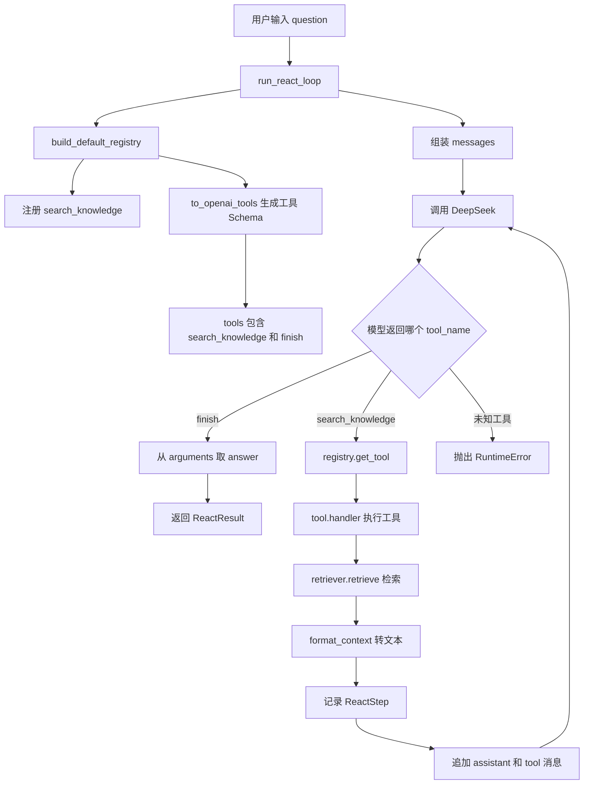

# Day 16 学习笔记

日期：2026-09-05

项目：`ai-job-agent`

目标：把 Day15 写在 `app/react.py` 里的工具逻辑抽出来，形成工具注册表和工具分发机制。以后新增工具时，不需要再修改 ReAct 循环里的 `if tool_name == ...` 分支。

## 1. Day 16 做了什么

Day 15 的 `run_react_loop()` 里有两个写死的分支：

```python
if tool_name == "finish":
    ...

if tool_name == "search_knowledge":
    ...
```

这种写法的问题是：每增加一个工具，都要去改 `app/react.py`，循环代码会越来越长。

Day 16 把“工具管理”拆到 `app/tools.py`，让循环代码只负责循环和消息拼接，不再关心具体工具有哪些。

现在项目分成了两层：

| 文件 | 职责 |
|---|---|
| `app/tools.py` | 定义工具、注册工具、根据名字找到工具并执行 |
| `app/react.py` | 调用 DeepSeek、维护 `messages`、判断是否结束、调用注册表 |

可以用一句话总结：

> `react.py` 负责“怎么循环”，`tools.py` 负责“每个工具具体做什么”。

## 2. 项目闭环实际流程



实际调用顺序：

1. `run_react_loop()` 先执行 `build_default_registry()`。
2. `build_default_registry()` 创建 `ToolRegistry`，并注册 `search_knowledge` 工具。
3. `registry.to_openai_tools()` 生成两个工具的 Schema：
   - 可执行工具：`search_knowledge`
   - 结束工具：`finish`
4. DeepSeek 根据 `messages` 和 `tools` 返回一个 `tool_name`。
5. 如果 `tool_name` 是 `finish`，循环结束，返回最终答案。
6. 如果 `tool_name` 是 `search_knowledge`，循环通过 `registry.get_tool()` 找到工具，再调用 `tool.handler()` 执行。
7. 工具执行结果通过 `format_context()` 变成文本，然后追加回 `messages`。
8. 带着新的上下文再次调用 DeepSeek。

## 3. 今天改了哪些文件

| 文件 | 变化 | 作用 |
|---|---|---|
| `app/tools.py` | 新增 | 定义 `Tool`、`ToolRegistry`、默认工具 |
| `app/react.py` | 修改 | 从写死工具改成使用注册表 |
| `tests/test_tools.py` | 新增 | 测试工具注册、查找、重复注册和工具执行 |

## 4. 核心代码逐段解释

### 4.1 `Tool` 数据类

```python
@dataclass
class Tool:
    name: str
    description: str
    parameters: dict
    handler: Callable
    input_field: str = "query"
```

解释：

- `@dataclass` 会帮我们自动生成 `__init__` 方法，减少样板代码。
- `name` 是工具名，也是 DeepSeek 返回的工具名。
- `description` 是给模型看的工具说明。
- `parameters` 是 JSON Schema，告诉模型工具参数长什么样。
- `handler` 是真正执行工具的函数。
- `input_field` 表示从模型参数里取哪个字段作为 `action_input`。默认是 `query`。

### 4.2 `Callable` 是什么

```python
from collections.abc import Callable

handler: Callable
```

解释：

- `Callable` 是“可调用对象”的类型提示。
- Python 函数可以像一个值一样被保存、传递和调用。
- 这里的 `handler` 保存的是 `search_knowledge` 这个函数本身，而不是调用它的结果。

```python
# 正确：保存函数本身
handler=search_knowledge

# 错误：这里已经调用了函数，保存的是返回值
handler=search_knowledge(...)
```

### 4.3 `ToolRegistry`

```python
class ToolRegistry:
    def __init__(self):
        self._tools: dict[str, Tool] = {}

    def register(self, tool: Tool) -> None:
        if tool.name in self._tools:
            raise ValueError(f"工具已注册：{tool.name}")

        self._tools[tool.name] = tool

    def get_tool(self, name: str) -> Tool | None:
        return self._tools.get(name)

    def tool_names(self) -> list[str]:
        return list(self._tools)
```

解释：

- `self._tools` 是一个字典，key 是工具名，value 是 `Tool` 对象。
- `register()` 在注册前先检查工具名是否已经存在，重复注册会报错。
- `get_tool()` 使用 `.get()` 安全查找。找不到时返回 `None`，不会像 `self._tools[name]` 那样直接报 `KeyError`。
- `tool_names()` 返回所有 key。
- `self._tools` 前面的下划线是 Python 约定：表示“这个属性是内部使用，不要从外部直接改”。

### 4.4 `to_openai_tools()`

```python
def to_openai_tools(self) -> list[dict]:
    executable_schemas = []

    for tool in self._tools.values():
        executable_schemas.append(
            {
                "type": "function",
                "function": {
                    "name": tool.name,
                    "description": tool.description,
                    "parameters": tool.parameters,
                },
            }
        )

    return executable_schemas + [FINISH_TOOL_SCHEMA]
```

解释：

- `self._tools.values()` 返回所有 `Tool` 对象。
- 每个 `Tool` 被转成 OpenAI function calling 需要的 Schema。
- 最后再加上 `FINISH_TOOL_SCHEMA`，所以最终返回的工具列表里有两个元素。

`finish` 没有放进 `ToolRegistry`，因为它是终止条件，不是普通可执行工具。ReAct 循环单独判断它。

### 4.5 `search_knowledge`

```python
def search_knowledge(arguments: dict, retriever) -> str:
    query = arguments.get("query")

    if not query:
        raise ValueError("search_knowledge 需要 query 参数")

    results = retriever.retrieve(query, top_k=3)
    return format_context(results)
```

解释：

- `arguments` 是模型返回的参数字典。
- `arguments.get("query")` 是安全取值。
- 如果模型没有返回 `query`，就抛出一个明确的 `ValueError`，而不是继续调用检索器。
- `retriever.retrieve()` 是我们第 2 周做好的混合检索。
- `format_context()` 把检索结果拼成模型容易阅读的文本。

### 4.6 修改后的 ReAct 循环

原来的写死逻辑：

```python
if tool_name == "search_knowledge":
    ...
```

现在改成：

```python
tool = registry.get_tool(tool_name)

if tool is None:
    raise RuntimeError(f"未知工具: {tool_name}")

action_input = arguments.get(tool.input_field) or question
observation = tool.handler(arguments, retriever=retriever)
```

解释：

- 先根据模型返回的工具名找到工具对象。
- 找不到时抛出 `RuntimeError`，避免继续执行。
- `action_input` 从工具自己声明的 `input_field` 中取，取不到时退回用户原始问题。
- `tool.handler(...)` 是动态调用。以后新增工具，循环这段代码不用改。

## 5. 测试文件内容分析

测试文件是 `tests/test_tools.py`，包含五个测试。

### 5.1 `FakeRetriever`

和 Day15 一样，用假检索器替代真实检索器，避免加载 Embedding 模型和 Chroma。

### 5.2 五个测试分别验证什么

`test_build_default_registry_contains_search_knowledge`

- 验证默认注册表里包含 `search_knowledge`。

`test_to_openai_tools_includes_executable_tool_and_finish`

- 验证 `to_openai_tools()` 返回的 Schema 名称集合正好是：

```text
{"search_knowledge", "finish"}
```

`test_search_knowledge_handler_returns_formatted_context`

- 直接调用工具函数，验证输出里包含 `FastAPI` 和 `doc-fastapi-0`。

`test_registry_rejects_duplicate_tool`

- 重复注册同名工具时，必须抛出 `ValueError`。

`test_registry_returns_none_for_unknown_tool`

- 查找不存在的工具时，返回 `None`。

## 6. 相关报错及原因

### 6.1 `TypeError: 'dict' object is not callable`

这是 Day16 实际遇到过的错误。

错误代码：

```python
query = arguments("query")
```

错误原因：

- `arguments` 是字典。
- 在 Python 里，`对象()` 表示“调用这个对象”。
- 字典不能被调用，所以 Python 报 `TypeError`。

正确写法：

```python
query = arguments.get("query")
```

或者：

```python
query = arguments["query"]
```

区别：

- `.get()` 找不到 key 时返回 `None`。
- `[]` 找不到 key 时抛出 `KeyError`。

因此项目里使用 `.get()` 更安全。

### 6.2 `KeyError: 'query'`

如果代码写成：

```python
query = arguments["query"]
```

而模型没有返回 `query`，就会抛出 `KeyError`。

解决：

```python
query = arguments.get("query")
```

然后判断是否为空，再决定是否报业务错误。

### 6.3 `ValueError: 工具已注册：xxx`

原因：

- `register()` 里做了重复检查。
- 同一个工具名被注册了两次。

解决：

- 检查是否重复调用 `registry.register()`。
- 或者给新工具换一个不同的 `name`。

### 6.4 `RuntimeError: 未知工具: xxx`

原因：

- DeepSeek 返回了一个 `tool_name`，但注册表里没有这个工具。

可能的情况：

- 工具 Schema 和注册名不一致。
- 只写了 Schema，但没有真正注册。
- 测试 mock 返回的工具名拼写错误。

解决：

- 确认 `Tool.name`、`to_openai_tools()` 中的 `name`、模型返回的 `function.name` 三者一致。

### 6.5 `ImportError: cannot import name 'ToolRegistry' from 'app.tools'`

原因：

- `app/react.py` 里导入了 `ToolRegistry`，但 `app/tools.py` 还没有创建，或者类名拼写错误。

解决：

- 先创建 `app/tools.py`。
- 确认 `from app.tools import ...` 的名字和文件里的类名完全一致。

### 6.6 把函数保存成函数执行结果

如果注册工具时写成：

```python
handler=search_knowledge({"query": "FastAPI"}, retriever=...)
```

这时 `handler` 保存的是字符串结果，而不是函数。后面执行：

```python
tool.handler(arguments, retriever=retriever)
```

就会报 `TypeError: 'str' object is not callable`。

解决：

注册时必须传函数本身：

```python
handler=search_knowledge
```

## 7. 今天验证结果

运行：

```bash
uv run pytest
```

结果：

```text
42 passed
```

Day16 完成后的核心能力：

- 工具可以注册和查找。
- 重复注册会被拦截。
- ReAct 循环不再写死工具分支。
- 新增工具只需注册，不需要修改循环主体。
