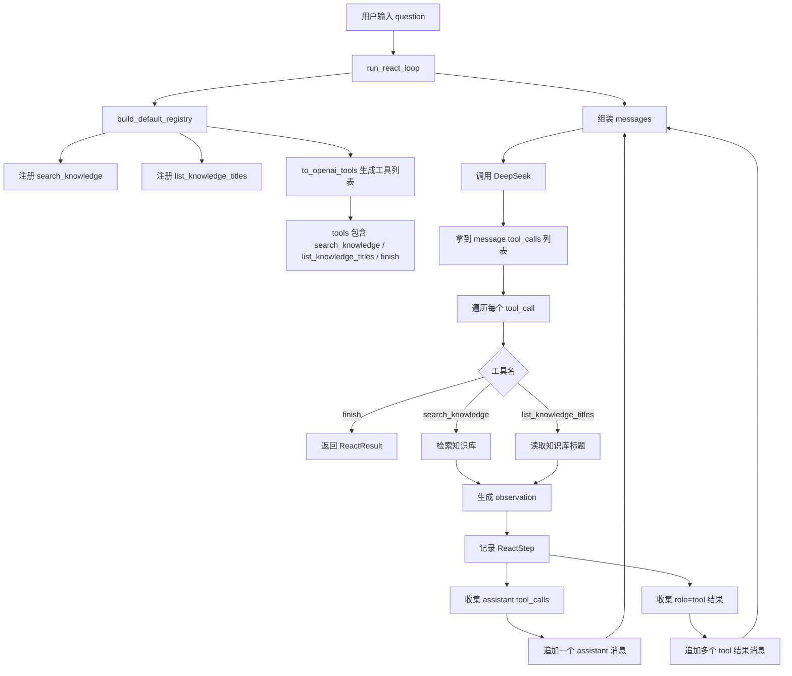

# Day 17 学习笔记

日期：2026-09-05

项目：`ai-job-agent`

目标：让 ReAct 循环支持 DeepSeek 在一次响应里返回多个 `tool_calls`，并且把每个工具调用都正确执行、记录和放回上下文。

## 1. Day 17 做了什么

Day 15 和 Day 16 的循环只处理了一个工具调用：

```python
tool_call = message.tool_calls[0]
```

但 DeepSeek 的 `message.tool_calls` 是一个列表，一次响应可以包含多个工具调用。

例如模型可能同时返回：

```json
[
  {
    "id": "call_1",
    "function": {
      "name": "search_knowledge",
      "arguments": "{\"query\":\"FastAPI\"}"
    }
  },
  {
    "id": "call_2",
    "function": {
      "name": "list_knowledge_titles",
      "arguments": "{}"
    }
  }
]
```

Day17 做了两件事：

1. 新增第二个可执行工具 `list_knowledge_titles`。
2. 把循环从“只处理第一个工具调用”改成“处理所有工具调用”。

## 2. 项目闭环实际流程



实际调用顺序：

1. `run_react_loop()` 创建默认工具注册表。
2. 注册表里现在有三个 Schema：
   - `search_knowledge`
   - `list_knowledge_titles`
   - `finish`
3. 循环调用 DeepSeek，得到 `message.tool_calls`。
4. 程序遍历这个列表，而不是只取第一个。
5. 遇到 `finish` 就立即结束循环。
6. 遇到其他工具就查找注册表并执行。
7. 这一轮所有工具都执行完后，先把 assistant 的 `tool_calls` 作为一个整体追加，再把每个工具结果追加进去。
8. 下一轮模型会看到完整的多工具调用和结果。

## 3. 今天改了哪些文件

| 文件 | 变化 | 作用 |
|---|---|---|
| `app/tools.py` | 新增 `list_knowledge_titles` 工具 | 让模型可以先了解知识库主题 |
| `app/react.py` | 遍历所有 `tool_calls` | 支持一次返回多个工具调用 |
| `tests/test_tools.py` | 更新 Schema 集合断言 | 适配新增工具 |
| `tests/test_multi_tool.py` | 新增 | 验证多工具调用、跨工具分发、未知工具报错 |

## 4. 核心代码逐段解释

### 4.1 新增 `list_knowledge_titles`

```python
KNOWLEDGE_BASE_PATH = Path("data/knowledge_base.json")


def _load_knowledge_titles() -> list[str]:
    with KNOWLEDGE_BASE_PATH.open("r", encoding="utf-8") as file:
        documents = json.load(file)

    return [doc["title"] for doc in documents]


def list_knowledge_titles(arguments: dict, retriever) -> str:
    titles = _load_knowledge_titles()
    return "\n".join(titles)
```

解释：

- `Path("data/knowledge_base.json")` 创建文件路径对象。
- `with ... open("r", encoding="utf-8")` 用 UTF-8 读取文件，读完后自动关闭。
- `json.load(file)` 把文件里的 JSON 转成 Python 列表。
- 列表推导式 `[doc["title"] for doc in documents]` 取出每个文档的 `title`。
- `"\n".join(titles)` 把标题用换行符拼成一个字符串。

### 4.2 无参数工具的 Schema

注册 `list_knowledge_titles` 时：

```python
registry.register(
    Tool(
        name="list_knowledge_titles",
        description="列出知识库中已有的学习主题标题。",
        parameters={
            "type": "object",
            "additionalProperties": False,
            "properties": {},
        },
        handler=list_knowledge_titles,
        input_field="",
    )
)
```

解释：

- `properties: {}` 表示这个工具不需要任何参数。
- `input_field=""` 告诉 ReAct 循环：不要从模型参数里取输入。
- 空字符串在 Python 的 `if` 判断中是假值，所以循环里用 `if tool.input_field` 判断。

### 4.3 遍历多个工具调用

原来：

```python
tool_call = message.tool_calls[0]
```

现在：

```python
for tool_call in message.tool_calls:
    tool_name = tool_call.function.name
    arguments = json.loads(tool_call.function.arguments or "{}")
```

解释：

- `for tool_call in message.tool_calls` 会依次取出每一个工具调用。
- 每个工具调用都有自己的 `id`、`function.name` 和 `function.arguments`。
- 不同工具调用之间互不覆盖。

### 4.4 处理 `finish`

```python
if tool_name == FINISH_TOOL_NAME:
    return ReactResult(answer=arguments.get("answer", ""), steps=steps)
```

解释：

- `finish` 是终止工具，不是普通可执行工具。
- 遇到它就直接返回，不再执行后面的工具。

### 4.5 通用工具分发

```python
tool = registry.get_tool(tool_name)

if tool is None:
    raise RuntimeError(f"未知工具: {tool_name}")

action_input = ""

if tool.input_field:
    action_input = arguments.get(tool.input_field) or question

observation = tool.handler(arguments, retriever=retriever)
```

解释：

- `registry.get_tool(tool_name)` 根据名字找到工具对象。
- `tool.input_field` 为空时，`action_input` 保持空字符串。
- `tool.input_field` 不为空时，从模型参数中取值；取不到就退回用户原始问题。
- `tool.handler()` 真正执行工具，返回观察结果。

### 4.6 一个 assistant 消息对应多个 tool_calls

```python
assistant_tool_calls = []
tool_result_messages = []

for tool_call in message.tool_calls:
    ...
    assistant_tool_calls.append(
        _tool_call_payload(tool_call, arguments, call_id)
    )
    tool_result_messages.append(
        {
            "role": "tool",
            "tool_call_id": call_id,
            "content": observation,
        }
    )

messages.append(
    {
        "role": "assistant",
        "content": None,
        "tool_calls": assistant_tool_calls,
    }
)
messages.extend(tool_result_messages)
```

解释：

- 一次模型响应里的多个工具调用，应该放在同一个 assistant 消息的 `tool_calls` 里。
- 每个工具结果用 `role="tool"` 表示，并且带自己的 `tool_call_id`。
- `messages.append()` 只添加一个元素。
- `messages.extend()` 把一个列表里的多个元素展开后添加进去。

这里有一个很容易犯的错误：

```python
messages.append(tool_result_messages)
```

这样会把整个列表当成一个消息，导致结构变成“消息里又套列表”，DeepSeek 无法正确解析。

正确写法是：

```python
messages.extend(tool_result_messages)
```

## 5. 测试文件内容分析

Day17 新增 `tests/test_multi_tool.py`，包含三个测试。

### 5.1 `make_tool_call`

```python
def make_tool_call(call_id, tool_name, arguments):
    tool_call = MagicMock()
    tool_call.id = call_id
    tool_call.function.name = tool_name
    tool_call.function.arguments = arguments
    return tool_call
```

它模拟单个工具调用对象。

### 5.2 `make_response`

```python
def make_response(tool_calls):
    message = MagicMock()
    message.content = None
    message.tool_calls = tool_calls

    choice = MagicMock()
    choice.message = message

    response = MagicMock()
    response.choices = [choice]
    return response
```

它接收一个列表，模拟 DeepSeek 一次返回多个工具调用。

### 5.3 三个测试分别验证什么

`test_react_processes_multiple_search_calls_in_one_message`

- 一次响应里有两个 `search_knowledge`。
- 验证两个工具调用都执行。
- 验证下一轮模型的 `messages` 里有两个 `role=tool` 结果。

`test_react_dispatches_different_tools_in_one_message`

- 一次响应里同时有 `search_knowledge` 和 `list_knowledge_titles`。
- 验证注册表能按名字分发到不同工具。
- 使用 `patch("app.tools._load_knowledge_titles", ...)` 模拟文件读取，避免依赖真实文件。

`test_react_raises_on_unknown_tool_in_multi_call`

- 多工具调用中出现未知工具。
- 验证程序立即抛出 `RuntimeError`，不会静默跳过。

## 6. 相关报错及原因

### 6.1 `TypeError: 'NoneType' object is not iterable`

如果模型返回：

```python
message.tool_calls = None
```

然后代码写：

```python
for tool_call in message.tool_calls:
    ...
```

就会报这个错误，因为 `None` 不能遍历。

解决：

先判断：

```python
if not message.tool_calls:
    raise RuntimeError("模型没有返回 tool_calls")
```

### 6.2 工具结果被套成嵌套列表

错误写法：

```python
messages.append(tool_result_messages)
```

结果：

```python
[
    ...,
    [
        {"role": "tool", ...},
        {"role": "tool", ...},
    ],
]
```

这会让 DeepSeek 收到一个“消息内容是列表”的奇怪结构。

正确写法：

```python
messages.extend(tool_result_messages)
```

### 6.3 `tool_call_id` 不匹配

assistant 消息里的工具调用 id：

```python
{"id": "call_1", ...}
```

工具结果也必须用同一个 id：

```python
{"role": "tool", "tool_call_id": "call_1", ...}
```

如果 id 写错，模型可能无法把工具结果对应到刚才的调用。

### 6.4 `RuntimeError: 未知工具: xxx`

原因：

- DeepSeek 返回的工具名没有在注册表里注册。
- 或者工具名拼写不一致。

解决：

确认 `Tool.name`、Schema 里的 `name`、模型返回的 `function.name` 三者完全一致。

### 6.5 `FileNotFoundError: data/knowledge_base.json`

原因：

- 运行代码时，当前工作目录不是项目根目录。
- 或者文件名、路径写错。

解决：

- 在项目根目录运行命令。
- 检查 `KNOWLEDGE_BASE_PATH` 是否指向正确的文件。

### 6.6 `ValueError: search_knowledge 需要 query 参数`

原因：

- `search_knowledge` 收到空参数，说明模型没有返回 `query`。

这是代码主动抛出的业务错误，表示工具调用不完整。

### 6.7 更新 `test_tools.py` 后集合断言失败

Day17 新增了 `list_knowledge_titles`，如果没更新旧测试：

```python
assert schema_names == {"search_knowledge", FINISH_TOOL_NAME}
```

会失败，因为实际 Schema 多了一个工具。

解决：

```python
assert schema_names == {
    "search_knowledge",
    "list_knowledge_titles",
    FINISH_TOOL_NAME,
}
```

## 7. 今天验证结果

运行：

```bash
uv run pytest
```

结果：

```text
45 passed
```

Day17 完成后的核心能力：

- DeepSeek 一次返回多个工具调用时，循环能全部处理。
- 同一个 assistant 消息可以包含多个 `tool_calls`。
- 每个工具结果都带正确的 `tool_call_id`。
- 默认注册表现在包含两个可执行工具和一个终止工具。
