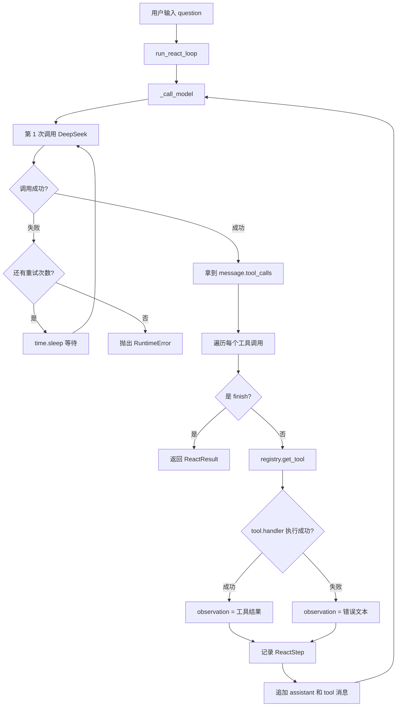

# Day 18 学习笔记

日期：2026-09-07

项目：`ai-job-agent`

目标：让 ReAct 循环具备基础错误处理能力，包括 LLM 调用重试、工具执行失败降级和超时配置。

## 1. Day 18 做了什么

Day17 的循环有一个问题：任何一步失败，整个 Agent 都会直接崩掉。

例如：

- DeepSeek 超时了，程序直接报错。
- 知识库检索器连接失败，程序直接报错。
- 工具函数写错，程序直接报错。

Day18 在 `app/react.py` 中加入三层保护：

| 场景 | 处理方式 |
|---|---|
| LLM 超时、连接失败、限流 | 自动重试 |
| 重试后仍然失败 | 抛出明确错误 |
| 单个工具执行失败 | 转成错误文本放回上下文，让模型继续决策 |

## 2. 项目闭环实际流程



实际调用顺序：

1. `run_react_loop()` 调用 `_call_model()`，不再直接调用 OpenAI SDK。
2. `_call_model()` 先尝试调用 DeepSeek。
3. 如果调用超时或连接失败，就等待一小段时间再试。
4. 重试次数用完后还失败，就抛出 `RuntimeError`。
5. 调用成功后，循环遍历所有工具调用。
6. 每个工具执行时，如果成功，结果正常放入 `observation`。
7. 如果工具失败，错误信息也放入 `observation`，模型下一轮能知道失败原因。

## 3. 今天改了哪些文件

| 文件 | 变化 | 作用 |
|---|---|---|
| `app/react.py` | 新增 `_call_model()` | 封装 LLM 重试和超时 |
| `app/react.py` | 工具执行加 `try/except` | 工具失败时降级而不是崩溃 |
| `tests/test_error_handling.py` | 新增 | 验证重试、最终失败、工具降级、超时参数 |

## 4. 核心代码逐段解释

### 4.1 新增导入

```python
import time

from openai import APIConnectionError, APITimeoutError, RateLimitError
```

解释：

- `time` 用来在重试前等待。
- `APITimeoutError`：请求超时。
- `APIConnectionError`：连接失败。
- `RateLimitError`：触发限流。

这三类错误通常不是代码逻辑问题，而是网络或服务暂时不稳定，所以适合重试。

### 4.2 `_call_model()`

```python
def _call_model(messages, tools, max_retries, timeout):
    last_error = None

    for attempt in range(max_retries):
        try:
            return client.chat.completions.create(
                model=os.environ["OPENAI_MODEL"],
                messages=messages,
                tools=tools,
                tool_choice="auto",
                timeout=timeout,
            )
        except (APIConnectionError, APITimeoutError, RateLimitError) as exc:
            last_error = exc

            if attempt < max_retries - 1:
                time.sleep(0.1 * (attempt + 1))

    raise RuntimeError(f"模型调用失败，已重试 {max_retries} 次") from last_error
```

解释：

- `range(max_retries)` 会执行 `max_retries` 次。
- `try` 里正常返回响应。
- `except` 只捕获网络类错误，不会捕获普通编程错误。
- `attempt < max_retries - 1` 表示“还没到最后一次尝试”。
- 每次重试前等待 `0.1 * (attempt + 1)` 秒，第一次等 0.1 秒，第二次等 0.2 秒，避免立刻把服务打挂。
- 如果全部失败，抛出带原因的 `RuntimeError`。
- `from last_error` 会把原始异常链接到新异常上，方便看到最开始的错误。

### 4.3 `run_react_loop()` 的新参数

```python
def run_react_loop(
    question: str,
    retriever=None,
    max_steps: int = 5,
    llm_max_retries: int = 3,
    timeout: int = 10,
) -> ReactResult:
```

解释：

- `llm_max_retries` 控制最多重试几次。
- `timeout` 控制每次 LLM 请求最长等待多少秒。
- 把它们放在函数参数里，方便测试和后续调整，而不是写死在函数内部。

### 4.4 工具失败降级

```python
try:
    observation = tool.handler(arguments, retriever=retriever)
except Exception as exc:
    observation = f"工具 {tool_name} 执行失败: {exc}"
```

解释：

- 工具正常时，`observation` 是真实结果。
- 工具出错时，`observation` 变成一句错误说明。
- 这个错误文本会被追加回 `messages`，模型下一轮就能看到“工具失败了，原因是 XXX”。
- 这样 Agent 不会因为一个工具失败而整体崩溃。

这里有一个权衡：

- 捕获 `Exception` 比较宽，能兜住大多数工具错误。
- 但它也可能把真正的代码 bug 藏起来。
- 当前阶段目标是保证 Agent 稳定，所以先宽捕获；以后可以逐步收窄。

## 5. 测试文件内容分析

Day18 新增 `tests/test_error_handling.py`，包含四个测试。

### 5.1 `FakeRetriever` 和 `BrokenRetriever`

```python
class FakeRetriever:
    def retrieve(self, query, top_k=3):
        return [...]


class BrokenRetriever:
    def retrieve(self, query, top_k=3):
        raise RuntimeError("知识库连接失败")
```

解释：

- `FakeRetriever` 表示工具正常执行。
- `BrokenRetriever` 表示工具执行失败。
- 这两个类让测试不需要真实模型、真实检索器和网络。

### 5.2 四个测试分别验证什么

`test_llm_call_retries_on_timeout_then_succeeds`

- 第一次调用抛出 `APITimeoutError`，第二次返回正常结果。
- 验证最终答案正确，并且 `create` 被调用了两次。

`test_llm_call_raises_after_all_retries`

- 每次调用都超时。
- 验证抛出 `RuntimeError`，并且调用次数等于 `llm_max_retries`。

`test_tool_error_is_converted_to_observation`

- 检索器坏掉。
- 验证工具错误被转成 `observation`，模型仍然能返回最终答案。

`test_llm_call_passes_timeout_to_openai`

- 验证 `timeout` 参数真的传给了 OpenAI SDK。

### 5.3 为什么 patch `time.sleep`

测试里写：

```python
with patch("app.react.time.sleep"), patch.object(...):
```

如果测试真的等待 `time.sleep()`，每次测试会多花时间。patch 后，`time.sleep()` 不会真正等待，测试瞬间完成。

## 6. 相关报错及原因

### 6.1 `RuntimeError: 模型调用失败，已重试 3 次`

原因：

- `_call_model()` 连续重试 3 次后，DeepSeek 仍然超时、连接失败或限流。

这是代码主动抛出的最终失败信息，说明网络或服务问题还没有恢复。

### 6.2 `NameError: name 'time' is not defined`

原因：

- `app/react.py` 里使用了 `time.sleep()`，但文件顶部没有 `import time`。

解决：

```python
import time
```

### 6.3 `TypeError: 'dict' object is not callable`

原因：

- 工具执行失败后，如果错误处理代码写错，例如：

```python
observation = tool.handler(arguments)(retriever)
```

又会把函数调用关系写错。

正确写法是：

```python
observation = tool.handler(arguments, retriever=retriever)
```

### 6.4 工具错误被吞掉，导致问题难以排查

原因：

- `except Exception as exc` 捕获了所有异常，如果只是打印或忽略，原始错误就看不到了。

解决：

- 当前代码把 `exc` 放进 `observation`，至少保留了错误信息。
- 以后可以记录日志，或者用结构化 trace 保存完整堆栈。

### 6.5 测试没有 patch `time.sleep`，测试很慢

原因：

- 真实等待会让测试变慢。

解决：

```python
with patch("app.react.time.sleep"):
    ...
```

### 6.6 `APIConnectionError` 实例化方式容易写错

`APIConnectionError` 的构造参数和普通异常不同，直接写：

```python
APIConnectionError("连接失败")
```

可能会报参数错误。

测试里优先使用更容易构造的：

```python
from openai import APITimeoutError

APITimeoutError("timeout")
```

它适合模拟最常见的超时场景。

## 7. 今天验证结果

运行：

```bash
uv run pytest
```

结果：

```text
49 passed
```

Day18 完成后的核心能力：

- LLM 网络类错误可以自动重试。
- 重试耗尽后能给出明确错误。
- 单个工具失败不会让 Agent 崩溃，而是降级为错误上下文。
- 超时时间可以配置。
