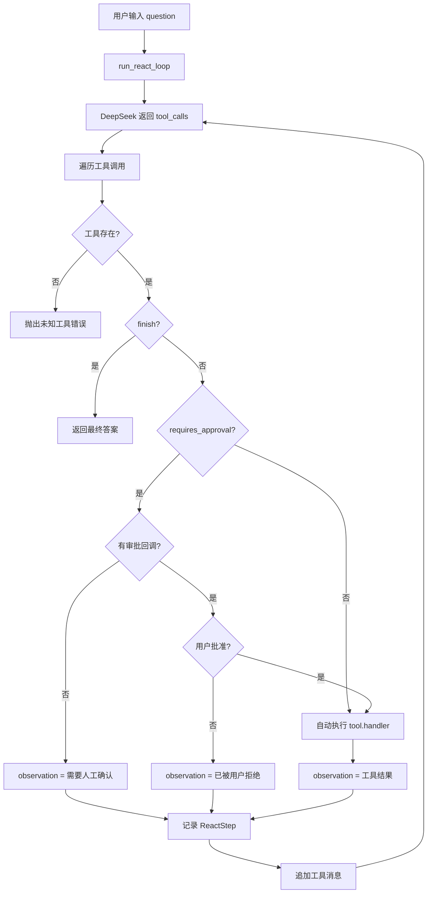

# Day 19 学习笔记

日期：2026-09-08

项目：`ai-job-agent`

目标：让 Agent 支持 human-in-the-loop，某些工具必须经过用户确认后才能真正执行。

## 1. Day 19 做了什么

Day18 让 Agent 在网络错误和工具错误面前更稳定，但所有工具仍然会自动执行。

真实 Agent 中有一些动作不能自动做，例如：

- 投递简历。
- 删除数据。
- 发送邮件。
- 扣款或下单。

Day19 新增了 `apply_job` 工具，并用 `requires_approval` 标记它是“需要人工确认”的工具。

现在工具分为两类：

| 工具类型 | 例子 | 执行方式 |
|---|---|---|
| 普通工具 | `search_knowledge`、`list_knowledge_titles` | 自动执行 |
| 危险工具 | `apply_job` | 必须经过审批 |

## 2. 项目闭环实际流程



实际调用顺序：

1. DeepSeek 返回要调用的工具。
2. 循环找到对应的 `Tool` 对象。
3. 如果工具是 `finish`，直接返回最终答案。
4. 如果工具不需要审批，自动执行。
5. 如果工具需要审批，先检查有没有审批回调。
6. 没有回调时，工具不执行，观察结果变成“需要人工确认”。
7. 有回调时，根据回调返回的 `True` 或 `False` 决定执行还是拒绝。
8. 结果统一写入 `ReactStep`，并追加回 `messages`。

## 3. 今天改了哪些文件

| 文件 | 变化 | 作用 |
|---|---|---|
| `app/tools.py` | `Tool` 增加 `requires_approval` | 标记危险工具 |
| `app/tools.py` | 新增 `apply_job` 工具 | 模拟需要审批的动作 |
| `app/react.py` | 新增 `_execute_tool()` | 统一处理审批、执行和异常 |
| `app/react.py` | `run_react_loop()` 增加 `approve_tool_call` | 传入人工确认回调 |
| `tests/test_human_in_the_loop.py` | 新增 | 验证审批通过、拒绝和无审批场景 |
| `tests/test_tools.py` | 更新 Schema 集合 | 适配新增的 `apply_job` |

## 4. 核心代码逐段解释

### 4.1 `Tool` 增加审批标记

```python
@dataclass
class Tool:
    name: str
    description: str
    parameters: dict
    handler: Callable
    input_field: str = "query"
    requires_approval: bool = False
```

解释：

- `requires_approval` 默认是 `False`，所以原有工具不受影响。
- 只有明确写 `requires_approval=True` 的工具才需要审批。
- 使用默认值的好处是：新增普通工具时不需要额外写这个字段。

### 4.2 新增 `apply_job`

```python
def apply_job(arguments: dict, retriever) -> str:
    company = arguments.get("company", "未知公司")
    position = arguments.get("position", "未知岗位")
    return f"已投递岗位：{company} - {position}"
```

解释：

- 这个函数目前只是返回一段文本，并不真正投递简历。
- 重点是学习“审批”机制，而不是真正访问外部系统。
- 使用 `.get()` 安全取值，参数缺失时给默认值。

注册工具时：

```python
registry.register(
    Tool(
        name="apply_job",
        ...
        handler=apply_job,
        input_field="position",
        requires_approval=True,
    )
)
```

### 4.3 `approve_tool_call` 回调

```python
approve_tool_call: Callable[[str, dict], bool] | None = None
```

解释：

- `Callable[[str, dict], bool]` 表示这个参数是一个函数。
- 它接收工具名和参数字典，返回 `True` 或 `False`。
- 默认值是 `None`，表示没有审批处理程序。

### 4.4 `_execute_tool()`

```python
def _execute_tool(tool, arguments, retriever, approve_tool_call):
    try:
        if tool.requires_approval:
            if approve_tool_call is None:
                return f"工具 {tool.name} 需要人工确认，但当前没有审批处理程序。"

            if not approve_tool_call(tool.name, arguments):
                return f"工具 {tool.name} 已被用户拒绝。"

        return tool.handler(arguments, retriever=retriever)
    except Exception as exc:
        return f"工具 {tool.name} 执行失败: {exc}"
```

解释：

- 先判断 `tool.requires_approval`。
- 如果不需要审批，直接执行。
- 如果需要审批但没有回调，返回“需要人工确认”。
- 如果需要审批且回调返回 `False`，返回“已被用户拒绝”。
- 如果需要审批且回调返回 `True`，继续执行工具。
- 整个流程包在 `try/except` 中，避免审批回调或工具函数抛异常导致循环崩溃。

### 4.5 循环中调用 `_execute_tool()`

```python
observation = _execute_tool(
    tool,
    arguments,
    retriever,
    approve_tool_call,
)
```

原来的直接执行逻辑被替换成这个函数。这样：

- 审批逻辑和普通执行逻辑集中在一个地方。
- `run_react_loop()` 本身保持简洁。
- 以后增加新的执行前检查，只需要修改 `_execute_tool()`。

## 5. 测试文件内容分析

Day19 新增 `tests/test_human_in_the_loop.py`，包含五个测试。

### 5.1 五个测试分别验证什么

`test_apply_job_requires_approval`

- 从注册表里取出 `apply_job`。
- 验证它的 `requires_approval` 是 `True`。

`test_safe_tool_runs_without_approval`

- 验证 `search_knowledge` 这种普通工具不需要审批，正常执行。

`test_apply_job_runs_when_approved`

- 传入一个总是返回 `True` 的审批回调。
- 验证工具真正执行，并拿到 `company` 和 `position` 参数。

`test_apply_job_skips_when_denied`

- 传入一个总是返回 `False` 的审批回调。
- 验证工具不执行，轨迹里显示“已被用户拒绝”。

`test_apply_job_waits_when_no_approval_handler`

- 不传审批回调。
- 验证危险工具不自动执行，轨迹里显示“需要人工确认”。

### 5.2 `assert_not_called()`

后面两个测试都写：

```python
mock_apply.assert_not_called()
```

它用来证明危险工具确实没有被偷偷执行。

如果不写这个断言，测试只能证明最终答案和观察文本正确，但不能证明 `apply_job` 函数本身没有被调用。

### 5.3 `patch("app.tools.apply_job")`

测试里：

```python
with patch("app.tools.apply_job") as mock_apply:
    ...
```

这会把 `app.tools` 模块里的 `apply_job` 替换成 `MagicMock`。

这样我们既能：

- 阻止真实函数执行。
- 通过 `mock_apply` 检查它是否被调用。

## 6. 相关报错及原因

### 6.1 `AttributeError: 'Tool' object has no attribute 'requires_approval'`

原因：

- `app/react.py` 里使用了 `tool.requires_approval`。
- 但 `app/tools.py` 的 `Tool` 类还没有新增这个字段。

解决：

在 `Tool` 数据类里增加：

```python
requires_approval: bool = False
```

### 6.2 `TypeError: run_react_loop() got an unexpected keyword argument 'approve_tool_call'`

原因：

- 测试传了 `approve_tool_call=...`。
- 但 `run_react_loop()` 函数签名里还没有这个参数。

解决：

在函数参数中增加：

```python
approve_tool_call: Callable[[str, dict], bool] | None = None
```

### 6.3 `apply_job` 在没有审批时仍然执行

原因可能是：

- 忘记给 `apply_job` 设置 `requires_approval=True`。
- 或者 `_execute_tool()` 没有检查 `tool.requires_approval`。

解决：

检查两个地方：

```python
requires_approval=True
```

```python
if tool.requires_approval:
    ...
```

### 6.4 `mock_apply.assert_not_called()` 失败

原因：

- 测试期望工具不被执行，但代码实际上执行了工具。

这说明审批判断没有拦住工具执行，需要检查：

- `_execute_tool()` 是否在调用 `tool.handler()` 之前提前 `return`。
- 审批回调是否返回了 `False`。
- 测试传入的回调是否正确。

### 6.5 `TypeError: apply_job() got an unexpected keyword argument 'retriever'`

原因：

- `tool.handler(arguments, retriever=retriever)` 会传一个名为 `retriever` 的关键字参数。
- 如果 `apply_job` 函数只写了 `arguments`，没有写 `retriever`，就会报错。

解决：

工具函数签名统一写成：

```python
def apply_job(arguments: dict, retriever) -> str:
    ...
```

即使这个函数不使用 `retriever`，也要接收它，保持所有工具接口一致。

### 6.6 `TypeError: 'NoneType' object is not callable`

原因：

- `approve_tool_call` 是 `None`。
- 但代码直接写：

```python
approve_tool_call(tool.name, arguments)
```

没有先判断 `approve_tool_call is None`。

解决：

```python
if approve_tool_call is None:
    return ...
```

### 6.7 `tests/test_tools.py` 的 Schema 集合断言失败

原因：

- 默认注册表新增了 `apply_job`。
- 但 `test_tools.py` 仍然只断言旧工具集合。

解决：

```python
assert schema_names == {
    "search_knowledge",
    "list_knowledge_titles",
    "apply_job",
    FINISH_TOOL_NAME,
}
```

## 7. 今天验证结果

运行：

```bash
uv run pytest
```

结果：

```text
54 passed
```

Day19 完成后的核心能力：

- 工具可以标记为“需要人工确认”。
- 没有审批处理程序时，危险工具不会自动执行。
- 审批通过才执行，审批拒绝会记录在轨迹里。
- 普通工具仍然自动执行，不受影响。
