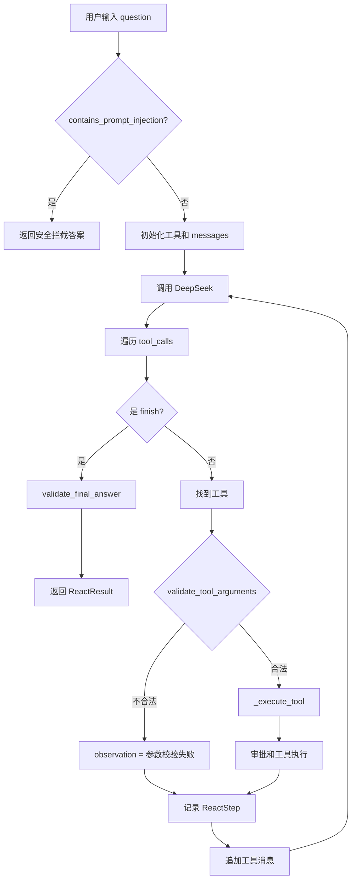

# Day 20 学习笔记

日期：2026-09-09

项目：`ai-job-agent`

目标：给 Agent 增加安全护栏，防止提示注入、空答案和危险工具参数绕过已有安全逻辑。

## 1. Day 20 做了什么

Day19 解决了“危险工具需要人工确认”，但还有两类安全问题没有处理：

- 用户输入可能包含提示注入。
- 模型输出或工具参数可能为空、异常或包含危险内容。

Day20 新增 `app/guards.py`，并把它接入 `app/react.py`。

现在有三个检查点：

| 检查点 | 处理位置 | 失败时做什么 |
|---|---|---|
| 用户输入检查 | `run_react_loop()` 开头 | 直接返回安全答案，不调用模型 |
| 工具参数检查 | 执行工具前 | 把错误写进 `observation`，不执行工具 |
| 最终答案检查 | 返回 `finish` 前 | 替换为安全兜底答案 |

## 2. 项目闭环实际流程



实际调用顺序：

1. 用户问题先经过 `contains_prompt_injection()`。
2. 如果命中提示注入关键词，直接返回安全答案，不再调用模型。
3. 正常问题进入 ReAct 循环。
4. 模型返回 `finish` 时，答案先经过 `validate_final_answer()`。
5. 模型返回普通工具时，参数先经过 `validate_tool_arguments()`。
6. 参数合法才进入审批和工具执行。
7. 参数不合法时，错误文本作为 `observation` 放回上下文。

## 3. 今天改了哪些文件

| 文件 | 变化 | 作用 |
|---|---|---|
| `app/guards.py` | 新增 | 提供提示注入检测、答案校验、参数校验 |
| `app/react.py` | 修改 | 在输入、输出和工具执行前接入护栏 |
| `tests/test_guardrails.py` | 新增 | 验证三道护栏是否生效 |

## 4. 核心代码逐段解释

### 4.1 提示注入关键词

```python
PROMPT_INJECTION_MARKERS = (
    "忽略之前指令",
    "ignore previous instructions",
    "system:",
    "system prompt",
    "忘记之前的规则",
)
```

解释：

- 这些是常见的提示注入话术。
- 攻击者可能会用“忽略之前指令”“忘记之前的规则”等方式，让模型忽略系统提示。
- 关键词只是简单规则，不能防住所有攻击，但能挡住最基础的尝试。

### 4.2 `contains_prompt_injection()`

```python
def contains_prompt_injection(text: str) -> bool:
    normalized = text.lower()
    return any(marker.lower() in normalized for marker in PROMPT_INJECTION_MARKERS)
```

解释：

- `text.lower()` 把输入统一转成小写。
- `marker.lower() in normalized` 检查某个关键词是否出现在文本里。
- `any(...)` 表示只要有一个关键词命中，就返回 `True`。

为什么先转小写：

- 攻击者可能写 `SYSTEM:` 或 `Ignore Previous Instructions`。
- 如果不统一大小写，规则就可能被大小写绕过。

### 4.3 `validate_final_answer()`

```python
def validate_final_answer(answer: str) -> str:
    cleaned = answer.strip()

    if not cleaned:
        return "抱歉，我没有生成有效答案。"

    if contains_prompt_injection(cleaned):
        return "抱歉，答案包含不安全内容，已被拦截。"

    return cleaned
```

解释：

- `.strip()` 去掉首尾空白。
- 如果答案是空字符串、纯空格或 `None`，返回安全兜底答案。
- 如果答案里包含提示注入关键词，也返回拦截答案。
- 正常答案原样返回。

### 4.4 `validate_tool_arguments()`

```python
def validate_tool_arguments(tool_name: str, arguments: dict) -> str | None:
    if tool_name != "apply_job":
        return None

    company = arguments.get("company", "").strip()
    position = arguments.get("position", "").strip()

    if not company or not position:
        return "company 和 position 不能为空"

    if contains_prompt_injection(company) or contains_prompt_injection(position):
        return "参数包含可疑指令"

    return None
```

解释：

- 只校验危险工具 `apply_job`，普通工具直接返回 `None`。
- `None` 表示参数合法。
- 字符串表示参数不合法。
- 参数缺失时用 `.get()` 给默认空字符串，避免 `KeyError`。

### 4.5 输入护栏接入

```python
if contains_prompt_injection(question):
    return ReactResult(answer="我无法处理包含指令注入的内容。", steps=[])
```

这段代码放在函数最前面，比创建检索器、创建注册表、调用模型都早。

这样做有两个好处：

- 可疑输入不会进入模型。
- 减少不必要的模型调用成本。

### 4.6 输出护栏接入

```python
if tool_name == FINISH_TOOL_NAME:
    answer = validate_final_answer(arguments.get("answer", ""))
    return ReactResult(answer=answer, steps=steps)
```

解释：

- 模型返回的 `answer` 不能直接信任。
- 先校验，再放进 `ReactResult`。
- 即使模型返回空答案，用户也能看到安全的兜底提示。

### 4.7 工具参数护栏接入

```python
guard_error = validate_tool_arguments(tool_name, arguments)

if guard_error:
    observation = f"工具 {tool_name} 参数校验失败: {guard_error}"
else:
    observation = _execute_tool(...)
```

解释：

- 参数校验发生在 `_execute_tool()` 之前。
- 因此即使 Day19 的审批逻辑允许执行，参数不合法的工具也不会执行。
- 参数错误会写进 `observation`，模型下一轮能看到失败原因。

## 5. 测试文件内容分析

Day20 新增 `tests/test_guardrails.py`，包含六个测试。

### 5.1 六个测试分别验证什么

`test_contains_prompt_injection_detects_marker`

- 验证能识别“请忽略之前指令”。
- 同时验证正常问题“FastAPI 需要掌握什么”不会被误伤。

`test_validate_final_answer_replaces_blank_answer`

- 空白答案被替换成兜底答案。
- 正常答案保持不变。

`test_validate_tool_arguments_rejects_empty_apply_job`

- `apply_job` 的 `company` 为空时返回错误信息。

`test_react_blocks_prompt_injection_question`

- 用户问题命中提示注入时，直接返回安全答案。
- 使用 `mock_create.assert_not_called()` 证明没有调用 DeepSeek。

`test_react_blocks_invalid_tool_arguments`

- 即使审批回调返回 `True`，参数不合法的 `apply_job` 也不会执行。
- 使用 `mock_apply.assert_not_called()` 证明工具函数没有被调用。

`test_react_uses_fallback_for_blank_final_answer`

- 模型返回空答案时，最终结果使用兜底答案。

### 5.2 为什么需要 `assert_not_called()`

普通断言只能证明最终结果正确，但不能证明“没有调用模型”或“没有执行工具”。

例如：

```python
mock_create.assert_not_called()
```

它验证的是防护发生的位置：

- 如果提示注入拦截发生在调用前，这个断言通过。
- 如果代码先调用了模型再做拦截，这个断言就会失败。

## 6. 相关报错及原因

### 6.1 `ImportError: cannot import name 'contains_prompt_injection' from 'app.guards'`

原因：

- `app/react.py` 里导入了这个函数。
- 但 `app/guards.py` 还没有创建，或者函数名拼写错误。

解决：

- 先创建 `app/guards.py`。
- 确认导入名和定义名完全一致。

### 6.2 `mock_create.assert_not_called()` 失败

原因：

- 测试期望提示注入输入不调用模型。
- 但实际代码先调用了模型，之后才做拦截。

解决：

把输入检查放在 `run_react_loop()` 最前面：

```python
if contains_prompt_injection(question):
    return ReactResult(...)
```

### 6.3 `mock_apply.assert_not_called()` 失败

原因：

- 参数校验没有发生在工具执行前。
- 或者参数校验漏掉了空字符串场景。

解决：

确保代码顺序是：

```python
guard_error = validate_tool_arguments(...)

if guard_error:
    ...
else:
    observation = _execute_tool(...)
```

### 6.4 正常问题被误判为提示注入

原因：

- 关键词设置得太宽。
- 例如如果把“你是”也放进关键词，正常问题“你是什么助手”就可能被误伤。

解决：

- 关键词尽量具体。
- 不要使用过于常见的短词。
- 对拦截行为加日志，方便发现误伤。

### 6.5 空白答案没有被识别

如果代码写：

```python
if answer == "":
    return fallback
```

只能处理空字符串，不能处理 `"   "` 这种纯空格。

解决：

```python
cleaned = answer.strip()

if not cleaned:
    return fallback
```

### 6.6 提示注入关键词被大小写绕过

如果检测代码不转小写，攻击者可以写：

```text
Ignore Previous Instructions
```

而关键词是小写 `ignore previous instructions`，就会检测不到。

解决：

```python
normalized = text.lower()
marker.lower() in normalized
```

### 6.7 `apply_job` 参数直接用 `arguments["company"]`

如果参数缺失，会报：

```text
KeyError: 'company'
```

解决：

```python
arguments.get("company", "")
```

## 7. 今天验证结果

运行：

```bash
uv run pytest
```

结果：

```text
60 passed
```

Day20 完成后的核心能力：

- 用户输入可以拦截基础提示注入。
- 危险工具参数会先校验再执行。
- 模型空答案会使用安全兜底。
- 正常问题、正常工具和正常答案不受影响。
