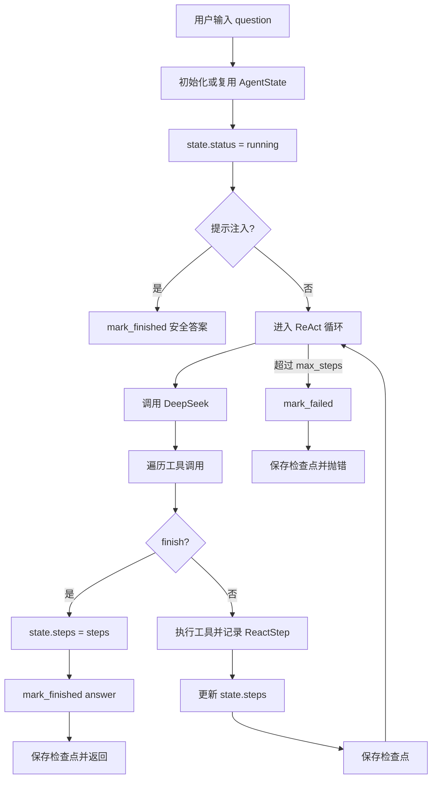

# Day 21 学习笔记

日期：2026-09-09

项目：`ai-job-agent`

目标：让 Agent 具备任务状态和检查点能力，记录 `running`、`finished`、`failed`，并能把状态保存到 JSON 后重新读取。

## 1. Day 21 做了什么

Day20 的 ReAct 循环能跑、能拦截、能处理工具，但缺少任务状态。

如果 Agent 跑了几步之后失败，我们只能看到最后抛出的异常，不知道：

- 任务当前处于什么阶段。
- 已经执行了哪些工具。
- 是否有中间结果可以恢复。

Day21 新增 `app/agent_state.py`，定义 `AgentState` 和检查点保存、加载函数，并让 `run_react_loop()` 支持传入状态对象和检查点路径。

## 2. 项目闭环实际流程



实际状态变化：

1. `run_react_loop()` 开始前，先创建或复用 `AgentState`。
2. 状态被设置为 `running`。
3. 如果输入被拦截，状态变成 `finished`，最终答案是安全提示。
4. 正常任务中，每完成一个工具步骤，`state.steps` 会更新。
5. 模型调用 `finish` 时，状态变成 `finished`，并保存 `final_answer`。
6. 超过最大步数时，状态变成 `failed`。

## 3. 今天改了哪些文件

| 文件 | 变化 | 作用 |
|---|---|---|
| `app/agent_state.py` | 新增 | 定义状态模型、保存和加载检查点 |
| `app/react.py` | 修改 | 在循环中更新状态并保存检查点 |
| `tests/test_agent_state.py` | 新增 | 验证状态转换、检查点保存和失败场景 |

## 4. 核心代码逐段解释

### 4.1 `AgentState`

```python
class AgentState(BaseModel):
    question: str
    status: Literal["running", "finished", "failed"] = "running"
    steps: list[ReactStep] = Field(default_factory=list)
    final_answer: str | None = None
```

解释：

- `question`：当前任务的问题。
- `status`：任务当前状态。
- `steps`：已经执行过的中间步骤。
- `final_answer`：最终答案，任务结束前是 `None`。

`Literal["running", "finished", "failed"]` 表示状态只能是这三个值，写错会直接被 Pydantic 拦截。

### 4.2 状态转换方法

```python
def mark_running(self) -> None:
    self.status = "running"


def mark_finished(self, answer: str) -> None:
    self.final_answer = answer
    self.status = "finished"


def mark_failed(self) -> None:
    self.status = "failed"
```

解释：

- 状态转换通过专门的方法完成，比直接改字符串更清晰。
- `mark_finished()` 同时设置答案和状态。
- `mark_failed()` 只设置失败状态。

### 4.3 保存和加载检查点

```python
def save_checkpoint(state: AgentState, path: Path) -> None:
    path.write_text(state.model_dump_json(indent=2), encoding="utf-8")


def load_checkpoint(path: Path) -> AgentState:
    return AgentState.model_validate_json(path.read_text(encoding="utf-8"))
```

解释：

- `model_dump_json(indent=2)` 把 Pydantic 模型转成带缩进的 JSON 字符串。
- `write_text()` 把 JSON 字符串写入文件。
- `read_text()` 读回文件内容。
- `model_validate_json()` 把 JSON 字符串恢复成 `AgentState` 对象。

### 4.4 `run_react_loop()` 接入状态

函数签名增加两个参数：

```python
state: AgentState | None = None
checkpoint_path: Path | None = None
```

解释：

- 不传 `state` 时，函数内部自动创建新的状态对象。
- 不传 `checkpoint_path` 时，只更新内存状态，不写文件。
- 两个参数都有默认值，所以旧测试仍然兼容。

函数开头：

```python
if state is None:
    state = AgentState(question=question)

state.question = question
state.status = "running"
```

任务正常完成时：

```python
state.steps = list(steps)
state.mark_finished(answer)

if checkpoint_path:
    save_checkpoint(state, checkpoint_path)
```

超过最大步数时：

```python
state.steps = list(steps)
state.mark_failed()

if checkpoint_path:
    save_checkpoint(state, checkpoint_path)

raise RuntimeError("ReAct 循环超过最大步数")
```

## 5. 测试文件内容分析

Day21 新增 `tests/test_agent_state.py`，包含五个测试。

### 5.1 五个测试分别验证什么

`test_agent_state_mark_finished`

- 验证状态对象能从 `running` 变成 `finished`。

`test_save_and_load_checkpoint_roundtrip`

- 验证保存后再加载，字段保持一致。

`test_run_react_loop_marks_state_finished`

- 任务正常结束时，内存状态和 JSON 检查点都变成 `finished`。

`test_run_react_loop_saves_steps_to_checkpoint`

- 检查点里保存了工具执行步骤。

`test_run_react_loop_marks_state_failed`

- 超过最大步数时，状态和检查点都变成 `failed`。

### 5.2 `tmp_path` 的作用

测试函数参数里的 `tmp_path` 是 pytest 提供的临时目录。

```python
path = tmp_path / "state.json"
```

这样每个测试都有自己的独立文件，测试结束后 pytest 会自动清理，不会污染项目目录。

## 6. 相关报错及原因

### 6.1 `ImportError: cannot import name 'AgentState' from 'app.agent_state'`

原因：

- `app/react.py` 已经导入 `AgentState`，但 `app/agent_state.py` 还没有创建，或者类名不一致。

解决：

先创建 `app/agent_state.py`，并确认类名、文件名、导入名一致。

### 6.2 `TypeError: run_react_loop() got an unexpected keyword argument 'state'`

原因：

- 测试传了 `state=...`，但 `run_react_loop()` 还没有增加这个参数。

解决：

在函数签名中增加：

```python
state: AgentState | None = None
```

### 6.3 `FileNotFoundError: No such file or directory`

原因：

- `checkpoint_path` 的父目录不存在。
- 例如传入 `data/checkpoints/state.json`，但 `data/checkpoints/` 还没创建。

解决：

先创建目录：

```python
path.parent.mkdir(parents=True, exist_ok=True)
```

或者确保传入的路径所在目录已经存在。

### 6.4 状态一直是 `running`

如果任务因为某些异常失败，但代码只在“超过最大步数”时调用 `mark_failed()`，那么其他异常场景可能不会更新状态。

例如：

- 模型没有返回 `tool_calls`。
- 未知工具。
- 模型调用最终失败。

这些情况下目前可能直接抛错，状态仍停留在 `running`。

解决思路：

在统一异常出口中调用 `mark_failed()` 并保存检查点。

### 6.5 多工具调用时检查点只保存了部分步骤

当前代码把保存检查点放在了 `for tool_call in message.tool_calls` 里面。

如果一次模型响应包含多个工具调用，第一个工具执行后就会保存检查点，而第二个工具还没有执行。

这会导致检查点代表一个“进行到一半”的状态。

解决思路：

把保存检查点的逻辑移到内层 `for` 循环结束后、下一轮模型调用之前：

```python
for tool_call in message.tool_calls:
    ...

messages.append(...)
messages.extend(...)

state.steps = list(steps)

if checkpoint_path:
    save_checkpoint(state, checkpoint_path)
```

## 7. 今天验证结果

运行：

```bash
uv run pytest
```

结果：

```text
65 passed
```

Day21 完成后的核心能力：

- Agent 有明确的任务状态。
- 中间步骤可以保存到 JSON。
- 正常完成和失败场景都有状态标记。
- 后续可以继续做断点恢复、前端状态展示和可观测性。
