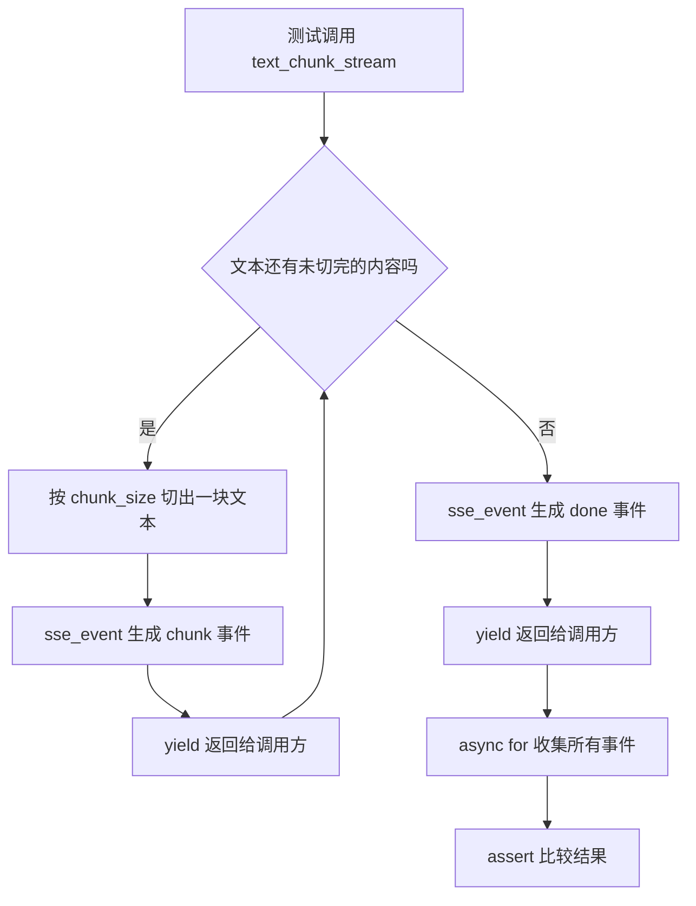

# Day 22 学习笔记

日期：2026-09-10

项目：`ai-job-agent`

目标：理解流式输出的基本概念，并实现 SSE 事件格式化和文本分块生成器。

## 1. Day 22 做了什么

第 3 周已经完成了单 Agent 循环、工具调用、人工确认、安全护栏和 Agent 状态。但从用户角度看，目前接口都是一次性把完整结果返回，用户需要等整个模型输出结束后才能看到内容。

第 4 周的目标是做出一个可演示的端到端 Agent 产品，第一步就是让输出能够“边生成边显示”。

Day 22 先不直接接 FastAPI，也不接 DeepSeek 的真实流式输出，而是做一件更基础的事情：

- 学习 SSE 和 WebSocket 的区别。
- 把普通文本转成标准的 SSE 事件格式。
- 把一段文本按固定长度切成小块，逐块生成 SSE 事件。

这样 Day 23 接入 FastAPI 的 `StreamingResponse` 时，就不会把“协议格式”和“HTTP 框架”两件事混在一起。

### 1.1 今天改了哪些文件

| 文件 | 变化 | 作用 |
|---|---|---|
| `app/streaming.py` | 新增 | 生成 SSE 事件和分块事件流 |
| `tests/test_streaming.py` | 新增 | 验证 SSE 格式和分块顺序 |

今天没有修改：

- `app/main.py`
- `app/react.py`
- `app/agent.py`

也就是说，Day 22 只是在流式输出这件事上先打好地基。

## 2. 什么是 SSE

SSE 的英文是 Server-Sent Events，意思是“服务器主动向浏览器发送事件”。

普通 HTTP 请求通常是：

```text
浏览器请求 -> 服务器返回一次结果 -> 连接结束
```

SSE 则是：

```text
浏览器请求 -> 服务器保持连接 -> 服务器多次发送数据 -> 数据发完后连接结束
```

它适合聊天回答逐字显示、下载进度、任务进度更新这类场景。

### 2.1 SSE 和 WebSocket 的区别

| 比较项 | SSE | WebSocket |
|---|---|---|
| 通信方向 | 服务器到客户端，单向 | 双向通信 |
| 底层协议 | HTTP | WebSocket 协议 |
| 自动重连 | 浏览器通常支持 | 需要自己处理 |
| 使用复杂度 | 较低 | 较高 |
| 适合场景 | 文本流、进度、通知 | 聊天、审批、协作、实时状态 |

当前第 4 周的聊天页面主要使用 SSE。以后如果 Agent 需要双向实时通信，例如浏览器端频繁发送审批状态、服务端持续推送中间步骤，再考虑 WebSocket。

### 2.2 SSE 文本长什么样

SSE 的事件是一段普通文本：

```text
event: chunk
data: 你好

event: done
data:

```

规则是：

- 一个事件可以有 `event:` 和 `data:` 两种字段。
- `event:` 表示事件名称，可以省略。
- `data:` 表示事件携带的数据。
- 一个事件结束时，必须有一个空行。

如果数据本身包含多行，不能直接写成下面这样：

```text
data: 第一行
第二行

```

因为客户端会认为第二行不是 `data:` 字段，可能解析出错。正确做法是每一行前面都加 `data:`：

```text
data: 第一行
data: 第二行

```

这就是 Day 22 里 `sse_event()` 要做的事情。

## 3. 项目闭环实际流程

今天还没有 HTTP 接口，所以“闭环”发生在 `tests/test_streaming.py` 和 `app/streaming.py` 之间。



实际调用顺序：

1. 测试调用 `streaming.text_chunk_stream("abcdef", chunk_size=2)`。
2. 函数内部第一次循环从位置 0 开始，切出 `"ab"`。
3. 调用 `sse_event("chunk", "ab")`，得到 `"event: chunk\ndata: ab\n\n"`。
4. 通过 `yield` 把这个字符串交给调用方。
5. 测试里的 `async for` 拿到这个字符串，放进结果列表。
6. 函数继续循环，依次处理 `"cd"` 和 `"ef"`。
7. 文本处理完后，`yield sse_event("done", "")` 发出结束事件。
8. 测试把所有事件收集完，和期望列表进行比较。

整个过程没有真实网络请求，也没有模型调用，所以测试很快，也不会产生 API 成本。

## 4. 核心代码逐段解释

### 4.1 导入语句

```python
import asyncio
from collections.abc import AsyncIterator
```

`asyncio` 是 Python 处理异步任务的模块。

今天代码里会用到 `asyncio.sleep()` 模拟流式输出过程中的等待。后续真正接入模型流时，也会用异步方式读取模型生成的内容。

`AsyncIterator` 是一个类型提示，表示“这是一个异步迭代器”。它不改变代码运行结果，只是让代码更容易理解。

### 4.2 `sse_event()` 函数

```python
def sse_event(event: str | None, data: str) -> str:
    lines = []

    if event is not None:
        lines.append(f"event: {event}")

    for line in data.splitlines() or [""]:
        lines.append(f"data: {line}")

    return "\n".join(lines) + "\n\n"
```

函数签名：

```python
def sse_event(event: str | None, data: str) -> str:
```

它表示：

- `event` 参数可以是字符串，也可以是 `None`。
- `data` 参数必须是字符串。
- 函数返回一个字符串。

`event` 为什么可以是 `None`：

- 不是所有 SSE 事件都需要名字。
- 如果只想发一条普通消息，可以传 `event=None`。
- 如果事件叫 `chunk`，就传 `event="chunk"`。

### 4.3 为什么要用 `lines` 列表

```python
lines = []
```

我们先创建一个空列表，然后逐步把 `event:` 行和 `data:` 行放进去。

这样做的原因是：

- 一个事件可能有多个 `data:` 行。
- 我们不知道事件一共有几行。
- 使用列表收集，最后统一用换行符连接，比反复拼接字符串更清晰，也更不容易出错。

### 4.4 可选 `event:` 字段

```python
if event is not None:
    lines.append(f"event: {event}")
```

只有 `event` 不是 `None` 时，才添加 `event:` 这一行。

例如：

```python
sse_event(None, "hello")
```

结果中不会出现 `event:`，只有：

```text
data: hello
```

而：

```python
sse_event("chunk", "hello")
```

会先添加：

```text
event: chunk
```

### 4.5 `f"event: {event}"` 是什么意思

这叫 f-string，是 Python 格式化字符串的方式。

`{event}` 不是普通文本，而是会被替换成变量 `event` 的实际值。

例如：

```python
event = "chunk"
result = f"event: {event}"
```

运行后，`result` 的值是：

```text
event: chunk
```

### 4.6 `data.splitlines() or [""]`

```python
for line in data.splitlines() or [""]:
    lines.append(f"data: {line}")
```

`splitlines()` 会把多行文本拆成一个列表。

例如：

```python
"第一行\n第二行".splitlines()
```

结果是：

```python
["第一行", "第二行"]
```

所以循环会执行两次，分别生成：

```text
data: 第一行
data: 第二行
```

为什么写 `or [""]`：

- 如果 `data` 是空字符串，`"".splitlines()` 返回 `[]`。
- 空列表会直接被当作“没有内容”，循环不会执行。
- 但我们仍然希望生成一个 `data:` 行，用来表示这个事件没有正文。
- `[] or [""]` 会使用右边的 `[""]`，于是生成 `data: `。

这个写法保证了空数据也能生成合法事件。

### 4.7 `"\n".join(lines) + "\n\n"`

```python
return "\n".join(lines) + "\n\n"
```

`"\n".join(lines)` 的意思是：

- 用换行符 `\n` 把列表里的每一行连接起来。

例如列表是：

```python
["event: chunk", "data: hello"]
```

连接后是：

```text
event: chunk
data: hello
```

最后再加 `"\n\n"`，也就是两个换行符。

这样输出末尾会有一个空行：

```text
event: chunk
data: hello

```

空行是 SSE 事件结束的标志，不能省略。

### 4.8 `text_chunk_stream()` 是异步生成器

```python
async def text_chunk_stream(
    text: str,
    *,
    chunk_size: int = 5,
    delay: float = 0,
) -> AsyncIterator[str]:
```

`async def` 表示这是一个异步函数。

但里面又使用了 `yield`，所以它不是普通异步函数，而是异步生成器。

普通函数和生成器的区别：

- 普通函数会一次性执行完并返回结果。
- 生成器调用时不会马上执行，而是在需要下一个值时执行一小段，然后通过 `yield` 交出值。

例如：

```python
stream = text_chunk_stream("abcdef", chunk_size=2)
```

这行代码不会把整段文本立刻切完。它只是创建了一个异步生成器对象。只有后面使用 `async for` 读取它时，代码才会一段一段运行。

这种“需要时才计算”的方式叫惰性执行。流式输出必须这样，否则就做不到边生成边显示。

### 4.9 参数后面的 `*`

```python
*,
chunk_size: int = 5,
delay: float = 0,
```

`*` 表示它后面的参数只能通过参数名传入。

例如只能这样调用：

```python
text_chunk_stream("abcdef", chunk_size=2)
```

不能这样调用：

```python
text_chunk_stream("abcdef", 2)
```

这样写的好处是调用方必须写清楚 `chunk_size=2`，代码更容易阅读，也不容易传错位置。

### 4.10 `range(0, len(text), chunk_size)`

```python
for start in range(0, len(text), chunk_size):
```

`range(开始位置, 结束位置, 步长)` 会生成一组数字。

例如：

```python
range(0, 6, 2)
```

会依次生成：

```text
0
2
4
```

所以 `"abcdef"` 被切成：

```text
ab
cd
ef
```

### 4.11 字符串切片

```python
chunk = text[start : start + chunk_size]
```

这是 Python 的切片语法。

`text[start : end]` 表示取从位置 `start` 开始、到位置 `end` 之前的一段字符。

例如：

```python
text = "abcdef"
text[0:2]
```

结果是：

```text
ab
```

即使最后一段不够长，Python 也不会报错。例如：

```python
text = "abcde"
text[4:6]
```

结果是：

```text
e
```

所以文本长度不是块大小的整数倍时，也能正常处理。

### 4.12 `yield`

```python
yield sse_event("chunk", chunk)
```

`yield` 会把 `sse_event(...)` 的结果交给读取这个生成器的人，然后暂停在这里。

下一次读取时，代码会从暂停的位置继续运行。

这就是“边生成、边输出”的关键。

### 4.13 `await asyncio.sleep(delay)`

```python
if delay:
    await asyncio.sleep(delay)
```

`if delay` 的意思是：

- `delay` 为 0 时，不等待。
- `delay` 大于 0 时，等待对应秒数。

`await asyncio.sleep(delay)` 会在异步环境中暂停一小段时间，让其他异步任务有机会运行。

今天测试传的 `delay` 默认是 0，所以测试不会真的等待。后续接真实模型流时，如果模型生成速度很快，可以在这里加入小延迟，让前端看起来更像真实聊天。

### 4.14 结束事件

```python
yield sse_event("done", "")
```

文本全部切完后，再生成一个 `done` 事件。

前端收到 `done` 时，就可以知道：

- 所有内容已经发送完。
- 可以把加载状态关闭。
- 可以执行保存、重新启用按钮等收尾操作。

## 5. 测试文件内容分析

Day 22 新增 `tests/test_streaming.py`，包含四个测试。

### 5.1 `test_sse_event_uses_message_event_by_default`

```python
assert streaming.sse_event(None, "hello") == "data: hello\n\n"
```

验证当 `event` 为 `None` 时，只生成 `data:` 行，不生成 `event:` 行。

这是最普通的 SSE 消息事件。

### 5.2 `test_sse_event_includes_named_event`

```python
assert streaming.sse_event("chunk", "hello") == "event: chunk\ndata: hello\n\n"
```

验证传入事件名时，输出中会包含 `event: chunk`。

前端以后可以通过 `addEventListener("chunk", ...)` 专门监听文本块事件。

### 5.3 `test_sse_event_splits_multiline_payload`

```python
assert streaming.sse_event("chunk", "第一行\n第二行") == (
    "event: chunk\n"
    "data: 第一行\n"
    "data: 第二行\n\n"
)
```

验证多行数据会被拆成多个 `data:` 行。

这是 SSE 协议中很容易忽略的一个细节。如果模型输出里包含换行，而我们不拆行，浏览器可能无法正确解析后续内容。

### 5.4 `test_text_chunk_stream_emits_chunks_then_done_event`

```python
async def collect():
    return [
        item
        async for item in streaming.text_chunk_stream(
            "abcdef",
            chunk_size=2,
        )
    ]

events = run(collect())
```

这个测试验证完整流程：

1. 输入 `"abcdef"`。
2. 每次切成 2 个字符。
3. 依次产出 `ab`、`cd`、`ef` 三个 `chunk` 事件。
4. 最后产出一个 `done` 事件。

`async for` 会逐项读取异步生成器。

`run(collect())` 是 `asyncio.run()` 的简写：

```python
from asyncio import run
```

它的作用是在普通同步测试函数里运行一段异步代码。因为 `collect()` 内部使用了 `async for`，它必须在一个事件循环中运行。

### 5.5 为什么测试里不用真实 HTTP 请求

Day 22 的测试只验证协议格式和分块逻辑，不验证网络层。

好处是：

- 测试运行很快。
- 不依赖 FastAPI 服务启动。
- 不依赖真实 DeepSeek。
- 不用考虑网络不稳定导致测试偶然失败。

Day 23 接入 `StreamingResponse` 后，再增加接口层测试。

## 6. 相关报错及原因

### 6.1 `ImportError: cannot import name 'sse_event' from 'app.streaming'`

原因：

- `app/streaming.py` 还没有创建。
- 或者文件名不对。
- 或者函数名和导入名拼写不一致。

解决：

先确认文件路径是：

```text
app/streaming.py
```

再确认函数定义是：

```python
def sse_event(...):
```

导入和定义必须完全一致。

### 6.2 `SyntaxError: 'return' with value in async generator`

原因：

异步生成器里不能使用：

```python
return "某个结果"
```

因为 `async def` 中一旦出现 `yield`，这个函数就是生成器。生成器只能用 `yield` 产出值，不能使用带返回值的 `return`。

解决：

把需要交出的值改成 `yield`：

```python
yield "某个结果"
```

如果确实要结束生成器，可以直接使用：

```python
return
```

但当前 `text_chunk_stream()` 不需要这种写法，因为它会自然执行到函数末尾并结束。

### 6.3 `TypeError: object async_generator can't be used in 'await' expression`

错误示例：

```python
result = await text_chunk_stream("abcdef")
```

原因：

`text_chunk_stream()` 返回的是异步生成器，不是协程对象，不能直接用 `await`。

正确做法：

```python
async for item in text_chunk_stream("abcdef"):
    print(item)
```

或者把它包进 `asyncio.run()` 中运行。

### 6.4 `TypeError: 'async_generator' object is not iterable`

错误示例：

```python
for item in text_chunk_stream("abcdef"):
    print(item)
```

原因：

异步生成器不能使用普通的 `for`，必须使用 `async for`。

解决：

```python
async for item in text_chunk_stream("abcdef"):
    print(item)
```

### 6.5 断言失败，字符串结尾看起来一样但少了一个空行

例如期望：

```python
"event: chunk\ndata: ab"
```

但实际输出是：

```python
"event: chunk\ndata: ab\n\n"
```

原因：

SSE 事件必须以一个空行结束，也就是字符串最后要有 `\n\n`。

`sse_event()` 里最后统一添加了：

```python
return "\n".join(lines) + "\n\n"
```

如果测试期望少了 `\n\n`，虽然肉眼看起来差不多，但这是错误协议。

### 6.6 多行内容没有拆成多个 `data:` 行

如果测试期望：

```python
"event: chunk\ndata: 第一行\n第二行\n\n"
```

实际正确输出应该是：

```python
"event: chunk\ndata: 第一行\ndata: 第二行\n\n"
```

原因：

多行数据必须每行都有 `data:` 前缀。

这是 `data.splitlines()` 和循环共同完成的。如果漏掉循环，直接写：

```python
f"data: {data}"
```

就会生成错误协议。

### 6.7 `RuntimeError: asyncio.run() cannot be called from a running event loop`

原因：

如果测试函数本身就是 `async def`，并且 pytest 已经运行在一个事件循环里，就不能在测试内部再调用 `asyncio.run()`。

解决：

Day 22 的测试函数是普通 `def`，所以可以安全调用：

```python
events = run(collect())
```

如果以后需要写异步测试，可以安装 pytest 的异步插件，或者把逻辑改写成不嵌套调用 `asyncio.run()`。

## 7. 实际验证记录

本次运行时，直接使用普通命令遇到环境权限问题：

```text
uv run pytest tests/test_streaming.py -q

error: Failed to initialize cache at `/Users/zhitong/.cache/uv`
  Caused by: failed to open file `/Users/zhitong/.cache/uv/sdists-v9/.git`:
  Operation not permitted
```

原因：

当前执行环境不允许写入 `~/.cache/uv`，不是代码问题。

解决：

把 `uv` 的缓存目录临时指向 `/tmp`：

```bash
UV_CACHE_DIR=/tmp/uv-cache uv run pytest tests/test_streaming.py -q
```

运行结果：

```text
4 passed in 0.00s
```

这说明 Day 22 的 SSE 事件格式和分块生成器测试全部通过。

## 8. Day 22 学到了什么

- SSE 是服务器到客户端的单向流式通信。
- WebSocket 是双向通信，当前阶段暂不引入。
- SSE 事件必须使用 `event:`、`data:` 和空行作为结束标志。
- 多行数据必须拆成多个 `data:` 行。
- `yield` 让函数变成生成器，支持边生成边输出。
- `async for` 用来读取异步生成器。
- `asyncio.run()` 可以在普通同步函数里运行异步代码。
- 测试流式逻辑时，先测协议格式和分块顺序，比直接测 HTTP 更简单可靠。

## 9. 下一步

Day 23 会在 `app/main.py` 中使用 FastAPI 的 `StreamingResponse`，把这个流式生成器接到 `/chat/stream` 接口上，然后用 `TestClient.stream()` 验证 HTTP 流式响应。
