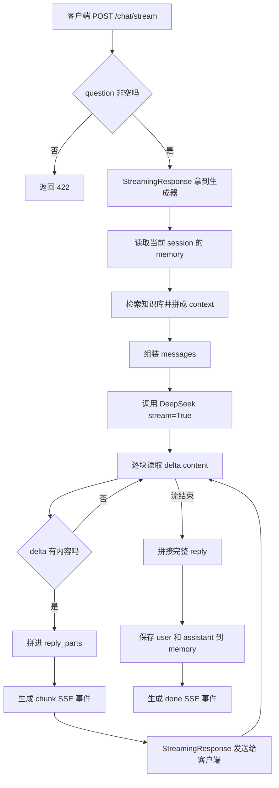

# Day 23 学习笔记

日期：2026-09-10

项目：`ai-job-agent`

目标：把 Day 22 的 SSE 事件格式接入 FastAPI，实现 `/chat/stream` 流式回答接口。

## 1. Day 23 做了什么

Day 22 完成了 SSE 的基础组件：

- `sse_event()`：把普通文本转换成标准 SSE 事件。
- `text_chunk_stream()`：把一段完整文本切块并生成 SSE 事件。

Day 23 不再只做“字符串层面”的流式演示，而是把它接到真实项目里。

现在新增了一个接口：

```text
POST /chat/stream
```

原来的 `/chat` 是一次性返回完整 JSON：

```json
{
  "reply": "完整回答",
  "sources": []
}
```

新的 `/chat/stream` 则像打字一样，一块一块地返回模型生成的内容。

## 2. 今天改了哪些文件

| 文件 | 变化 | 作用 |
|---|---|---|
| `app/agent.py` | 新增 `stream_answer_question()` | 用 DeepSeek 流式生成回答 |
| `app/main.py` | 新增 `/chat/stream` | 用 `StreamingResponse` 持续返回 SSE |
| `tests/test_streaming_api.py` | 新增 | 验证流式生成器、接口响应和输入校验 |

`app/streaming.py` 没有修改，Day 23 只复用了 `sse_event()`。

## 3. 项目闭环实际流程



实际调用顺序：

1. 客户端请求 `/chat/stream`。
2. FastAPI 先检查 `question` 是否为空。
3. `StreamingResponse` 拿到 `stream_answer_question()` 返回的生成器。
4. 函数先读取会话记忆和知识库上下文。
5. 调用 DeepSeek 时传入 `stream=True`。
6. DeepSeek 不再一次返回完整答案，而是多次返回增量文本。
7. 每拿到一个增量文本，就包装成 `chunk` 事件并交给 FastAPI。
8. 所有文本都接收完后，把完整答案写入会话记忆。
9. 最后发送 `done` 事件，告诉客户端输出结束。

## 4. 核心代码逐段解释

### 4.1 新增导入

```python
from collections.abc import Iterator
from app.streaming import sse_event
```

`Iterator` 是“迭代器”的类型提示。

它表示 `stream_answer_question()` 不会一次性返回一个值，而是会多次产出值。每个值都是字符串。

`sse_event` 是 Day 22 写好的函数，Day 23 直接复用它来生成标准 SSE 文本。

### 4.2 `stream_answer_question()` 函数签名

```python
def stream_answer_question(
    session_id: str,
    question: str,
    retriever=None,
) -> Iterator[str]:
```

含义：

- `session_id`：当前会话 ID。
- `question`：用户问题。
- `retriever`：检索器，默认为 `None`，函数内部会自动创建。
- `-> Iterator[str]`：这个函数是一个迭代器，会多次产出字符串。

### 4.3 读取记忆和检索器

```python
memory = session_store.get(session_id)
retriever = retriever or get_retriever()

results = retriever.retrieve(question, top_k=3)
context = format_context(results)
```

这段逻辑和原来的 `answer_question()` 基本一样：

- 从 `session_store` 获取当前会话。
- 如果调用方传入了 `retriever`，使用传入的；否则使用默认检索器。
- 用问题检索知识库，最多取 3 条。
- 把检索结果拼成文本上下文。

这样流式接口和普通接口的检索逻辑保持一致。

### 4.4 组装消息

```python
messages = [
    {"role": "system", "content": CHAT_SYSTEM_PROMPT},
    *memory.get_messages(),
    {"role": "user", "content": f"知识库：\n{context}\n\n问题：{question}"},
]
```

`*memory.get_messages()` 会把历史消息列表展开，放进当前 `messages` 列表。

例如历史消息是：

```python
[
    {"role": "user", "content": "上一轮问题"},
    {"role": "assistant", "content": "上一轮回答"},
]
```

展开后，`messages` 会包含历史消息和当前问题。这样模型仍然记得前面的对话。

### 4.5 `stream=True`

```python
response = client.chat.completions.create(
    model=os.environ["OPENAI_MODEL"],
    messages=messages,
    stream=True,
)
```

这是 Day 23 最重要的变化。

普通调用不传 `stream=True` 时，DeepSeek 会生成完整回答后一次返回。

传入 `stream=True` 后，DeepSeek 会返回一个可迭代对象。我们可以在模型还没生成完时，就读取已经生成出来的部分文本。

### 4.6 `reply_parts`

```python
reply_parts = []
```

这是一个列表，用来保存模型生成的所有碎片。

为什么需要它：

- 流式过程中，模型每次只给一小块文本。
- 前端需要看到这些碎片。
- 但会话记忆不能保存一堆碎片，否则下一轮上下文会很混乱。
- 所以先把碎片收集起来，最后拼成完整答案。

### 4.7 逐块读取模型输出

```python
for chunk in response:
    delta = chunk.choices[0].delta.content

    if delta:
        reply_parts.append(delta)
        yield sse_event("chunk", delta)
```

真实流式响应里，每个 `chunk` 表示一次增量输出。

`chunk.choices[0].delta.content` 就是模型这次生成的一小块文本。

例如模型最终答案是：

```text
RAG 是检索增强生成。
```

流式响应可能是：

```text
"RAG"
" 是"
"检索增强生成。"
```

每拿到一块，就做两件事：

- 保存到 `reply_parts`。
- 包装成 SSE `chunk` 事件交给调用方。

### 4.8 为什么判断 `if delta`

```python
if delta:
```

有些流式 chunk 可能不包含文本内容。

例如模型可能先返回角色信息、结束信息或工具调用元信息。此时 `delta` 可能是 `None` 或空字符串。

如果不判断，就可能：

- 生成空事件。
- 把 `None` 拼进最终答案。

所以只处理真正有内容的增量。

### 4.9 `yield`

```python
yield sse_event("chunk", delta)
```

`yield` 会把结果交给 `StreamingResponse`，然后暂停在这里。

下一次 FastAPI 需要更多数据时，函数会从暂停位置继续运行。

这就是流式输出能“边生成边发送”的原因。

### 4.10 拼接完整答案

```python
reply = "".join(reply_parts)
```

`join()` 会把列表里的字符串按指定分隔符连接起来。

这里分隔符是空字符串 `""`，所以：

```python
["RAG", " 是", "检索增强生成。"]
```

会变成：

```text
RAG 是检索增强生成。
```

### 4.11 保存完整记忆

```python
memory.add("user", question)
memory.add("assistant", reply)
```

必须在循环结束后保存。

原因是此时 `reply` 才是完整答案。如果在循环里保存碎片，下一轮模型只能看到不完整的历史。

### 4.12 发送结束事件

```python
yield sse_event("done", "")
```

`done` 事件表示：

- 模型内容已经全部发送完。
- 前端可以关闭“正在输入”状态。
- 可以执行保存、重新启用按钮等收尾操作。

## 5. FastAPI 接口解释

### 5.1 导入 `StreamingResponse`

```python
from fastapi.responses import StreamingResponse
```

普通接口返回字典、Pydantic 模型或字符串时，FastAPI 会自动处理 JSON 响应。

流式接口需要返回一个可以持续读取的对象，所以使用 `StreamingResponse`。

### 5.2 `/chat/stream`

```python
@app.post("/chat/stream")
def chat_stream(request: ChatRequest):
    if not request.question.strip():
        raise HTTPException(status_code=422, detail="question must not be empty")

    return StreamingResponse(
        stream_answer_question(request.session_id, request.question),
        media_type="text/event-stream",
    )
```

这里有三点：

1. 校验 `question` 去除首尾空格后不能为空。
2. `StreamingResponse` 接收 `stream_answer_question(...)` 返回的生成器。
3. `media_type="text/event-stream"` 告诉浏览器和客户端，这是 SSE 流。

注意：

- 这个接口不能设置 `response_model`，因为返回的不是一个普通 JSON 对象。
- 这里使用的是同步生成器，因为当前 DeepSeek 客户端是同步 `OpenAI`。

## 6. 同步生成器和异步生成器的区别

Day 22 的 `text_chunk_stream()` 是异步生成器：

```python
async def text_chunk_stream(...):
    ...
    yield ...
```

Day 23 的 `stream_answer_question()` 是同步生成器：

```python
def stream_answer_question(...):
    ...
    yield ...
```

为什么 Day 23 使用同步生成器：

- `app/llm.py` 中的 `client` 是同步 OpenAI 客户端。
- 同步客户端返回的流可以直接用普通 `for chunk in response` 读取。
- 如果强行改成异步，需要处理事件循环、线程切换等更多问题。

FastAPI 的 `StreamingResponse` 两种都支持。当前场景下，同步生成器最直接。

## 7. 测试文件内容分析

Day 23 新增 `tests/test_streaming_api.py`，包含三个测试。

### 7.1 `FakeRetriever`

```python
class FakeRetriever:
    def retrieve(self, query, top_k=3):
        return [
            {
                "doc": {
                    "chunk_id": "doc-rag-0",
                    "title": "RAG",
                    "text": "RAG 是检索增强生成。",
                },
                "score": 0.9,
            }
        ]
```

它模拟知识库检索，避免测试依赖真实的 Embedding、Chroma 和本地数据文件。

### 7.2 `make_stream_chunk(content)`

```python
def make_stream_chunk(content):
    delta = MagicMock()
    delta.content = content

    choice = MagicMock()
    choice.delta = delta

    chunk = MagicMock()
    chunk.choices = [choice]
    return chunk
```

它构造一个假的流式响应块。

真实流式代码会访问：

```python
chunk.choices[0].delta.content
```

所以测试需要把结构补成：

```text
chunk
  -> choices
    -> [0]
      -> delta
        -> content
```

`MagicMock` 可以自动模拟这些属性。

### 7.3 第一个测试：流式生成器

```python
def test_stream_answer_question_yields_chunks_then_done():
    ...
```

验证三件事：

1. 三个真实文本块分别变成 `chunk` 事件。
2. `None` 内容被跳过。
3. 最后生成 `done` 事件。
4. 完整回答被写入会话记忆。
5. `create` 调用时确实传了 `stream=True`。

关键断言：

```python
assert mock_create.call_args.kwargs["stream"] is True
```

如果实现时忘记写 `stream=True`，这个测试会失败。

### 7.4 第二个测试：接口返回 SSE

```python
def test_chat_stream_endpoint_returns_sse():
    ...
```

验证 FastAPI 层：

- 接口返回 200。
- `Content-Type` 是 `text/event-stream`。
- 响应体里有 `event: chunk`、`data: 你好` 和 `event: done`。

这里使用：

```python
patch("app.main.stream_answer_question", side_effect=fake_stream)
```

因为 `app/main.py` 已经导入并使用了 `stream_answer_question`，所以要 patch `app.main` 中的名字，而不是 `app.agent` 中的名字。

### 7.5 第三个测试：空问题校验

```python
def test_chat_stream_rejects_empty_question():
    ...
```

验证空问题返回 422，和 `/chat` 的基础输入校验保持一致。

## 8. 相关报错及原因

### 8.1 `ImportError: cannot import name 'Iterator' from 'collections.abc'`

原因：

`app/agent.py` 使用了 `Iterator`，但顶部没有导入。

解决：

```python
from collections.abc import Iterator
```

### 8.2 `TypeError: 'NoneType' object is not iterable`

原因：

某个流式 `chunk` 的 `delta.content` 是 `None`，但代码没有判断就直接处理。

解决：

```python
if delta:
    reply_parts.append(delta)
    yield sse_event("chunk", delta)
```

### 8.3 `AttributeError: 'NoneType' object has no attribute 'content'`

原因：

真实响应中可能有些 chunk 没有 `choices`，或者 `delta` 为 `None`。

解决：

可以在循环里增加保护：

```python
for chunk in response:
    if not chunk.choices or chunk.choices[0].delta is None:
        continue

    delta = chunk.choices[0].delta.content
```

### 8.4 测试里 `response.text` 为空

原因：

`side_effect` 写成了调用结果：

```python
side_effect=fake_stream()
```

这会让生成器在传入 patch 之前就被提前消费完。

解决：

传入函数本身：

```python
side_effect=fake_stream
```

### 8.5 `AssertionError: assert False is True`

原因：

测试要求 `stream=True`，但实现代码漏写了这个参数，导致 `create` 仍在使用普通响应模式。

解决：

确认调用里包含：

```python
client.chat.completions.create(
    ...,
    stream=True,
)
```

## 9. 实际验证记录

运行 Day 23 相关测试：

```bash
cd /Users/zhitong/Desktop/AI-Agent
UV_CACHE_DIR=/tmp/uv-cache uv run pytest tests/test_streaming_api.py tests/test_chat.py tests/test_api.py -q
```

结果：

```text
9 passed in 3.28s
```

这说明：

- 新流式接口测试通过。
- 原有 `/chat` 和 API 测试没有回归。

## 10. Day 23 学到了什么

- `StreamingResponse` 可以把生成器变成 HTTP 流式响应。
- `stream=True` 让模型逐块返回内容。
- `chunk.choices[0].delta.content` 是每次生成的增量文本。
- `yield` 让函数在生成过程中暂停和恢复。
- 完整答案必须在流结束后拼接，再写入记忆。
- SSE 的 `chunk` 事件表示内容片段，`done` 事件表示结束。
- 测试流式接口时，需要模拟流式 chunk 的结构。

## 11. 下一步

Day 24 会新增 React 聊天前端，让浏览器能够消费 `/chat/stream` 返回的 SSE 流，实现消息列表和边输入边显示。
