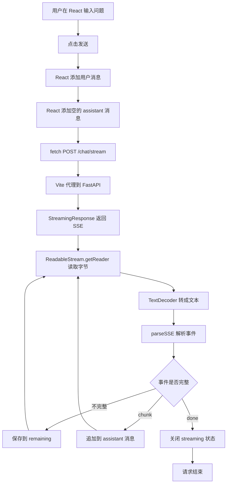

# Day 24 学习笔记

日期：2026-09-10

项目：`ai-job-agent`

目标：新增 React 聊天前端，让浏览器能够消费 Day 23 的 `/chat/stream` 接口，实现消息列表和流式渲染。

## 1. Day 24 做了什么

Day 23 已经把后端的 `/chat/stream` 做好了，但当时只能用命令行或测试客户端查看 SSE 文本。普通用户无法直接使用这个能力。

Day 24 新增了 `frontend/` 前端项目，主要完成：

- 创建基于 Vite、React、TypeScript 的前端项目。
- 实现消息列表、输入框和发送按钮。
- 使用浏览器 `fetch` 请求 `/chat/stream`。
- 使用 `ReadableStream` 逐块读取网络响应。
- 使用 `TextDecoder` 把字节流转换成文本。
- 使用 `parseSSE()` 解析不完整事件。
- 收到 `chunk` 事件时逐步追加回答，收到 `done` 事件时停止加载状态。

今天不处理 Agent 的工具调用状态和审批按钮，那些是 Day 25 的内容。

## 2. 今天改了哪些文件

| 文件 | 变化 | 作用 |
|---|---|---|
| `frontend/vite.config.ts` | 配置开发代理 | 把 `/chat/stream` 转发到 FastAPI |
| `frontend/src/lib/sseParser.ts` | 新增 | 解析 SSE 文本事件 |
| `frontend/src/App.tsx` | 替换 | 实现聊天界面和流式请求 |
| `frontend/src/App.css` | 替换 | 聊天页面样式 |
| `frontend/src/lib/sseParser.test.ts` | 新增 | 验证 SSE 解析逻辑 |
| `frontend/package.json` | 增加 `test` 脚本 | 运行 Vitest |

## 3. 项目闭环实际流程



实际调用顺序：

1. 用户输入问题并提交表单。
2. React 同时添加一条用户消息和一条空白的 assistant 消息。
3. `fetch("/chat/stream", ...)` 发起流式请求。
4. Vite 开发服务器把请求转发到 FastAPI。
5. FastAPI 通过 `StreamingResponse` 不断返回 SSE 文本。
6. 浏览器使用 `response.body.getReader()` 一段一段读取网络数据。
7. `TextDecoder` 把字节转换成字符串。
8. `parseSSE()` 判断当前字符串中有没有完整事件。
9. 完整事件立即交给 React 更新界面。
10. 不完整事件暂时保存，等待下一段网络数据到来后继续处理。
11. 收到 `done` 事件后，关闭当前回答的流式状态。

## 4. 前端开发环境为什么需要代理

后端运行在：

```text
http://127.0.0.1:8000
```

前端开发服务器运行在：

```text
http://127.0.0.1:5173
```

如果前端直接请求：

```text
http://127.0.0.1:8000/chat/stream
```

浏览器会认为这是跨域请求，默认会被浏览器阻止。

Day 24 采用更简单的方式：前端请求同源路径 `/chat/stream`，由 Vite 开发服务器转发到后端。

`vite.config.ts` 中配置：

```ts
server: {
  proxy: {
    "/chat/stream": {
      target: "http://127.0.0.1:8000",
      changeOrigin: true
    }
  }
}
```

这样开发阶段不用在后端配置 CORS。

## 5. 核心代码逐段解释

### 5.1 `parseSSE()` 为什么要处理剩余文本

网络数据不是按“一条 SSE 事件”为单位到达的。它可能把一条事件拆成几段：

```text
第一次到达：event: chun
第二次到达：k\ndata: 你好\n\n
```

如果拿到一段文本就立即解析，第一次会解析失败。

所以 `parseSSE()` 把“已经完整的事件”和“还不完整的尾巴”分开：

```ts
const splitIndex = chunk.lastIndexOf("\n\n");
const complete = chunk.slice(0, splitIndex + 2);
const remaining = chunk.slice(splitIndex + 2);
```

`remaining` 会在下一次网络数据到达后继续参与解析。

### 5.2 SSE 事件结束的标志

SSE 使用空行表示一个事件结束，也就是文本中出现：

```text
\n\n
```

`lastIndexOf("\n\n")` 会找到最后一个完整事件结束的位置。

例如：

```ts
parseSSE("event: chunk\ndata: 你好\n\n")
```

结果：

```ts
{
  events: [{ event: "chunk", data: "你好" }],
  remaining: ""
}
```

### 5.3 默认事件名是 `message`

SSE 事件可以省略 `event:` 字段。

```text
data: hello
```

没有 `event:` 时，标准默认事件名是 `message`。

所以 `parseSSE()` 中先设置：

```ts
let event = "message";
```

只有读到 `event:` 字段时才更新它。

### 5.4 多行 `data:` 的合并

后端 `sse_event()` 会把多行内容拆成多个 `data:` 行。

例如：

```text
event: chunk
data: 第一行
data: 第二行

```

前端解析时必须还原成：

```text
第一行\n第二行
```

`parseSSE()` 使用：

```ts
dataLines.join("\n")
```

把所有 `data:` 值重新连接起来。

### 5.5 React 状态：消息列表

```ts
const [messages, setMessages] = useState<Message[]>([]);
```

这是 React 的 `useState`。

- `messages` 是当前消息列表。
- `setMessages` 是更新消息列表的函数。
- `useState<Message[]>([])` 表示初始值是空数组。

TypeScript 中的 `Message` 类型是：

```ts
type Message = {
  id: string;
  role: "user" | "assistant";
  content: string;
  streaming?: boolean;
};
```

`role` 只能是 `"user"` 或 `"assistant"`。

`streaming?` 后面的 `?` 表示这个字段可以省略。

### 5.6 为什么使用 `crypto.randomUUID()`

```ts
id: crypto.randomUUID()
```

每条消息都需要一个唯一 ID。

这样收到 `chunk` 时，React 可以准确找到那条 assistant 消息并追加内容，而不会影响其他消息。

### 5.7 发送消息时先添加两条消息

```ts
setMessages((current) => [
  ...current,
  userMessage,
  assistantMessage,
]);
```

这样做让用户马上看到：

- 自己刚才发送的问题。
- 一个空的 assistant 回答框。

之后模型输出到达时，只需要更新这个空的 assistant 消息。

### 5.8 `fetch` 的请求体

```ts
const response = await fetch("/chat/stream", {
  method: "POST",
  headers: {
    "Content-Type": "application/json",
  },
  body: JSON.stringify({
    session_id: SESSION_ID,
    question,
  }),
});
```

它对应后端：

```python
class ChatRequest(BaseModel):
    session_id: str
    question: str = Field(min_length=1)
```

`JSON.stringify()` 把 JavaScript 对象转成 JSON 字符串。

### 5.9 读取流式响应体

```ts
const reader = response.body.getReader();
const decoder = new TextDecoder();
let buffer = "";

while (true) {
  const { value, done } = await reader.read();

  if (done) {
    break;
  }

  buffer += decoder.decode(value, { stream: true });
  ...
}
```

解释：

- `response.body.getReader()` 获取一个可以逐步读取网络数据的 reader。
- `reader.read()` 每次返回一个数据块和 `done` 状态。
- `done` 为 `true` 表示网络数据已经读完了。
- `TextDecoder` 把字节数据转换成字符串。
- `decoder.decode(value, { stream: true })` 表示当前只是部分数据，不要把多字节字符错误地拆开。

### 5.10 `chunk` 和 `done` 事件

```ts
if (item.event === "chunk") {
  setMessages((current) =>
    current.map((message) =>
      message.id === assistantId
        ? { ...message, content: message.content + item.data }
        : message,
    ),
  );
}

if (item.event === "done") {
  setMessages((current) =>
    current.map((message) =>
      message.id === assistantId
        ? { ...message, streaming: false }
        : message,
    ),
  );
}
```

`chunk` 表示模型生成的一段文本，前端把它追加到对应回答后面。

`done` 表示所有文本已经发送完成，前端关闭加载状态。

### 5.11 `sending` 状态

```ts
const [sending, setSending] = useState(false);
```

`sending` 为 `true` 时：

- 输入框被禁用。
- 发送按钮被禁用。
- 按钮显示旋转图标。

请求结束后，`finally` 中恢复：

```ts
finally {
  setSending(false);
}
```

`finally` 表示无论请求成功还是失败，都会执行这段代码。

### 5.12 自动滚动

```ts
useEffect(() => {
  listRef.current?.scrollTo({
    top: listRef.current.scrollHeight,
    behavior: "smooth",
  });
}, [messages]);
```

`useEffect` 会在 `messages` 变化后执行。

它的作用是把消息列表滚动到最底部，这样新消息能自动进入用户视野。

## 6. 测试文件内容分析

Day 24 新增 `frontend/src/lib/sseParser.test.ts`，使用 Vitest，包含五个测试。

### 6.1 测试一个带名字的事件

```ts
parseSSE("event: chunk\ndata: 你好\n\n")
```

验证 `event` 为 `chunk`、`data` 为 `你好`，并且没有剩余文本。

### 6.2 测试默认事件名

```ts
parseSSE("data: hello\n\n")
```

验证没有 `event:` 字段时，事件名默认是 `message`。

### 6.3 测试多个事件

```ts
parseSSE(
  "event: chunk\ndata: 你\n\nevent: done\ndata: \n\n"
)
```

验证同一个网络数据块里可能包含多个完整事件，解析器要全部返回。

### 6.4 测试多行 `data:` 合并

```ts
parseSSE(
  "event: chunk\ndata: 第一行\ndata: 第二行\n\n"
)
```

验证多个 `data:` 行最终合并成：

```text
第一行\n第二行
```

### 6.5 测试不完整事件

```ts
parseSSE("event: chunk\ndata: 你")
```

验证事件还没有空行结束时，不会被当成完整事件，而是保留在 `remaining` 中。

### 6.6 为什么先测 `parseSSE`，不测 React 组件

`parseSSE()` 是纯函数：

- 输入固定字符串。
- 输出固定结果。
- 不依赖浏览器、DOM、网络和 React。

流式聊天最容易出错的是 SSE 文本边界。先把这部分测试稳定，后面的 UI 层才容易排查问题。

## 7. 相关报错及原因

### 7.1 `ReferenceError: crypto is not defined`

原因：

某些旧浏览器或测试环境没有 `crypto.randomUUID()`。

解决：

可以封装一个安全的 ID 生成函数：

```ts
function createId() {
  return crypto.randomUUID?.() ?? `${Date.now()}-${Math.random()}`;
}
```

### 7.2 页面发送请求成功，但没有流式显示

原因常见有两种：

1. 前端还在使用 `response.json()`，而不是 `response.body.getReader()`。
2. 后端 `/chat/stream` 没有使用 `StreamingResponse`。

解决：

前端必须读取 `response.body`，后端必须返回 `StreamingResponse`。

### 7.3 中文内容出现乱码

原因：

`TextDecoder` 没有按 UTF-8 解码，或者使用了错误的编码。

解决：

确认代码使用：

```ts
const decoder = new TextDecoder();
```

`TextDecoder` 默认使用 UTF-8。

### 7.4 页面只显示最后几个字

原因：

网络数据把 SSE 事件拆开了，但前端拿到一段文本就立即解析，没有保存不完整部分。

解决：

使用 `parseSSE()` 返回的 `remaining`，把不完整部分留到下一次继续解析。

### 7.5 `npm test` 提示找不到 `vitest`

原因：

还没有安装 Vitest。

解决：

```bash
npm install -D vitest
```

### 7.6 Vite 请求 `/chat/stream` 返回 404

原因：

`vite.config.ts` 没有配置代理。

解决：

增加：

```ts
server: {
  proxy: {
    "/chat/stream": {
      target: "http://127.0.0.1:8000",
      changeOrigin: true
    }
  }
}
```

## 8. 实际验证记录

运行前端测试：

```bash
cd /Users/zhitong/Desktop/AI-Agent/frontend
npm test
```

结果：

```text
Test Files  1 passed
     Tests  5 passed
```

这说明 `parseSSE()` 的五个边界情况全部通过。

## 9. Day 24 学到了什么

- Vite 开发代理可以避免开发阶段的跨域问题。
- `fetch` 可以发送 JSON 请求。
- `response.body.getReader()` 用来逐步读取流式响应。
- `TextDecoder` 把字节流转换成字符串。
- SSE 事件以空行结束。
- 网络数据可能被拆开，必须保留未完整事件。
- `chunk` 事件追加内容，`done` 事件结束加载状态。
- React 使用状态驱动界面，每次 `setMessages` 后界面自动更新。

## 10. 下一步

Day 25 会把 Agent 的中间状态接到前端，展示工具调用、思考步骤和人工确认按钮。
