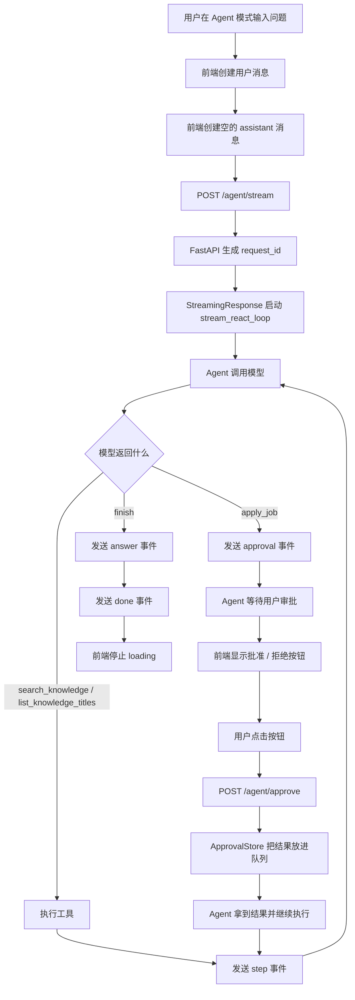

# Day 25 学习笔记

日期：2026-09-11

项目：`ai-job-agent`

目标：把 Day 24 的前端聊天页面升级成 Agent 页面。用户提出问题后，页面能实时看到 Agent 的工具执行步骤，遇到 `apply_job` 时弹出审批按钮，用户批准后 Agent 再继续执行。

## 1. Day 25 做了什么

Day 23 和 Day 24 已经完成了：

- 后端 `/chat/stream`：普通问答的流式返回。
- 前端 React 页面：接收 SSE，并逐块显示回答。

Day 25 的新增重点是 Agent：

- 后端新增 `stream_react_loop()`，把原来的 ReAct 循环改成流式生成器。
- 后端新增 `ApprovalStore`，让两个不同的 HTTP 请求之间可以传递审批结果。
- 后端新增 `POST /agent/stream` 和 `POST /agent/approve`。
- 前端新增“问答 / Agent”模式切换。
- 前端新增 Agent 步骤列表和审批按钮。
- 修复了 Agent 不调用 `apply_job`、前端布局错乱、错误信息不显示等问题。

现在从“用户提问”到“审批投递”的完整链路已经打通。

## 2. 今天改了哪些文件

| 文件 | 变化 | 作用 |
|---|---|---|
| `app/react.py` | 新增 `stream_react_loop()` 和审批兜底逻辑 | 把 ReAct 过程实时发给前端 |
| `app/approval.py` | 新增 | 用队列暂存审批结果 |
| `app/main.py` | 新增 Agent 两个接口 | 提供流式 Agent 和审批入口 |
| `frontend/src/App.tsx` | 替换 | 增加 Agent 模式、步骤、审批、错误展示 |
| `frontend/src/App.css` | 修复并补全 | 区分用户/助手消息，输入框固定在底部 |
| `frontend/vite.config.ts` | 修改代理 | 增加 `/agent` 相关接口代理 |
| `tests/test_react_stream.py` | 新增 | 验证 Agent 流、审批通过、审批拒绝和队列 |

## 3. 项目闭环实际流程



真实调用顺序：

1. 用户在 `Agent` 模式输入“帮我分析 AI Agent 这个岗位并投递”。
2. 前端使用 `fetch` 请求 `/agent/stream`。
3. Vite 把请求代理到 FastAPI。
4. FastAPI 先生成一个 `request_id`，这个 ID 用来关联这次 Agent 流程和后面的审批请求。
5. `StreamingResponse` 逐条读取 `stream_react_loop()` 产出的 SSE 字符串。
6. Agent 先让模型选择工具。模型可能先调用 `list_knowledge_titles` 和 `search_knowledge`。
7. 每执行一个工具，前端收到一条 `step` 事件，页面下方列出工具名、输入和观察结果。
8. 当 Agent 判断需要投递时，后端发出 `approval` 事件，然后暂时等待。
9. 前端收到 `approval` 事件后显示“批准 / 拒绝”两个按钮。
10. 用户点击批准，前端请求 `/agent/approve`。
11. `ApprovalStore` 把批准结果放进队列。
12. Agent 从队列拿到结果，继续执行 `apply_job`。
13. 执行完成后发出 `step` 事件，接着模型生成最终答案。
14. 前端收到 `answer` 和 `done`，停止加载状态。

## 4. 后端核心知识点

### 4.1 `stream_react_loop()` 和普通 `run_react_loop()` 有什么区别

Day 17 已经有一个 `run_react_loop()`。它的问题是：

```python
result = run_react_loop(question)
```

必须等整个 Agent 循环完全结束后，才一次性返回 `ReactResult`。前端只能看到一个“正在加载”，看不到中间步骤。

Day 25 新增的 `stream_react_loop()` 返回 `Iterator[str]`。它不会一次返回结果，而是多次 `yield` SSE 字符串：

```python
def stream_react_loop(...) -> Iterator[str]:
    ...
    yield sse_event("step", ...)
    ...
```

这样 FastAPI 可以一边生成，一边把内容发送给浏览器。

### 4.2 `Iterator` 和生成器

`Iterator[str]` 的意思是：

> 这个函数会多次产出字符串，而不是只返回一个字符串。

Python 中，函数里只要出现 `yield`，这个函数就变成“生成器函数”。

```python
def demo():
    yield 1
    yield 2
```

调用 `demo()` 不会立刻执行函数体，而是得到一个生成器对象。只有开始迭代它时，代码才会逐段执行，遇到 `yield` 就把值交出去并暂停。

Day 25 中：

```python
yield sse_event("step", data)
```

意思是：

1. 先把这段 SSE 文本交给 FastAPI。
2. FastAPI 把它发送给浏览器。
3. 浏览器更新页面。
4. 函数暂停在这里。
5. 下一次迭代时继续向下执行。

### 4.3 `yield from` 是什么

流式函数中，有时希望一个函数暂时替自己产出几段事件。这时可以用 `yield from`。

```python
yield from _ensure_apply_job_events(...)
```

它的意思不是普通的函数调用，而是：

> 把 `_ensure_apply_job_events(...)` 产出的每一条事件，都当作当前函数产出的下一条事件。

如果使用普通函数调用：

```python
_ensure_apply_job_events(...)
```

生成器不会自动执行，前端也收不到这些事件。必须使用 `yield from` 或者 `for event in ...: yield event`。

### 4.4 SSE 事件有哪些

Day 25 使用的事件：

| 事件名 | 含义 | 前端动作 |
|---|---|---|
| `step` | Agent 执行了一个工具 | 追加工具步骤 |
| `approval` | Agent 需要用户审批 | 显示批准/拒绝按钮 |
| `answer` | Agent 最终答案 | 替换 assistant 内容 |
| `error` | Agent 执行失败 | 显示错误内容 |
| `done` | 流结束 | 关闭 loading |

这些事件统一通过 `sse_event(event, data)` 生成。它会把事件包装成：

```text
event: approval
data: {...}

```

### 4.5 Agent 为什么需要 `request_id`

Agent 流开始后，后端需要暂时等待用户点击审批按钮。

但审批按钮触发的是另一个 HTTP 请求：

```text
POST /agent/stream
POST /agent/approve
```

它们是两个完全独立的请求。后端必须知道这两个请求应该对应同一次 Agent 任务，否则无法把审批结果送回去。

`request_id` 就是连接这两个请求的凭证。

在 `app/main.py` 中：

```python
request_id = request.request_id or str(uuid.uuid4())
```

`uuid.uuid4()` 会生成一个很难重复的随机字符串。生成后，同一个 `request_id` 同时用于：

- `stream_react_loop()` 的 `approval_request_id`。
- `/agent/approve` 请求里的 `request_id`。

### 4.6 `ApprovalStore` 为什么用队列

审批存在两个不同请求之间传递，而且时间上并不是同步的。

`queue.Queue` 可以看作一个排队传递东西的小盒子：

```python
import queue

q = queue.Queue()
q.put("批准")       # 一个请求把结果放进去
result = q.get()    # 另一个请求把结果取出来
```

Day 25 的 `ApprovalStore` 维护多个队列：

```python
self._queues: dict[str, queue.Queue] = {}
```

每次 Agent 任务使用自己的 `request_id` 作为 key，所以多个 Agent 同时运行时也不会串掉。

### 4.7 `approve_tool_call` 回调

`stream_react_loop()` 执行工具时，如果工具需要审批，会调用：

```python
approve_tool_call(tool_name, arguments)
```

在 `app/main.py` 中，这个回调被定义成一个闭包：

```python
def approve_tool_call(tool_name, arguments):
    return approval_store.wait(request_id)
```

这里的重点不是 `tool_name` 和 `arguments`，而是 `request_id` 已经被外层函数捕获。也就是说，这个内部函数即使以后被调用，仍然记得当前的 `request_id`。

如果用户一直不点击，`queue.get(timeout=...)` 会超时，返回 `False`，避免 Agent 永远卡住。

## 5. 前端核心知识点

### 5.1 Agent 模式和问答模式共用一套消息列表

`App.tsx` 中新增：

```ts
type Mode = "chat" | "agent";
const [mode, setMode] = useState<Mode>("agent");
```

提交时根据当前模式选择接口：

```ts
const endpoint = mode === "chat" ? "/chat/stream" : "/agent/stream";
```

Agent 模式会给 assistant 消息增加：

```ts
steps: mode === "agent" ? [] : undefined,
approval: null,
```

所以 Agent 的 assistant 消息可以同时保存步骤列表和当前审批信息。

### 5.2 `step` 事件如何更新状态

收到 `step` 事件时，需要把新步骤追加到现有步骤列表末尾：

```ts
const step = JSON.parse(item.data) as Step;

setMessages((current) =>
  current.map((message) =>
    message.id === assistantId
      ? {
          ...message,
          steps: [...(message.steps ?? []), step],
        }
      : message,
  ),
);
```

这里有两个值得注意的地方：

- `...(message.steps ?? [])` 表示先展开旧步骤，再加入新步骤。
- `map` 会返回一个新数组，React 发现数组是新对象，才会重新渲染。

### 5.3 审批按钮如何回到后端

前端点击批准或拒绝时：

```ts
await fetch("/agent/approve", {
  method: "POST",
  headers: { "Content-Type": "application/json" },
  body: JSON.stringify({
    request_id: approval.request_id,
    approved,
  }),
});
```

`approved` 是 `true` 或 `false`。后端把它放进对应 `request_id` 的队列，等待 Agent 取走。

### 5.4 前端必须处理 `error` 事件

如果后端只发送 `error`，前端不处理它，用户就看不到失败原因。

Day 25 补上了：

```ts
if (item.event === "error") {
  setMessages((current) =>
    current.map((message) =>
      message.id === assistantId
        ? {
            ...message,
            content: message.content || item.data,
            streaming: false,
            approval: null,
          }
        : message,
    ),
  );
}
```

同时，`fetch` 本身如果抛异常，也用 `catch` 把错误显示到 assistant 消息里。

### 5.5 输入框固定在底部的 CSS 思路

页面结构是：

```text
chat
├── chat-header
├── message-list
└── composer
```

关键 CSS：

```css
.chat {
  height: 100vh;
  display: flex;
  flex-direction: column;
  overflow: hidden;
}

.message-list {
  flex: 1;
  min-height: 0;
  overflow-y: auto;
}

.composer {
  flex-shrink: 0;
}
```

含义：

- `.chat` 是纵向 flex 容器。
- `.message-list` 使用 `flex: 1`，占满中间剩余空间。
- `.composer` 使用 `flex-shrink: 0`，不会被压缩，所以一直固定在底部。
- 消息太多时，只有 `.message-list` 自己滚动。

### 5.6 用户消息和助手消息如何区分

CSS 使用：

```css
.message.user {
  align-self: flex-end;
  background: #0f766e;
  color: #ffffff;
}

.message.assistant {
  align-self: flex-start;
  background: #e8f0ee;
  color: #134e4a;
}
```

`align-self: flex-end` 把用户消息推到右边，`flex-start` 把助手消息留在左边。颜色和位置一起形成清晰的聊天气泡。

## 6. 测试文件和用例分析

测试文件是 `tests/test_react_stream.py`。

### 6.1 `FakeRetriever`

```python
class FakeRetriever:
    def retrieve(self, query, top_k=3):
        return [
            {
                "doc": {
                    "chunk_id": "doc-rag-0",
                    "title": "RAG",
                    "text": "RAG 是检索增强生成。",
                },
                "score": 0.9,
            }
        ]
```

真实测试中不希望连接 DeepSeek，也不希望加载本地向量模型。这个假检索器只要返回固定的一条知识，就能验证 Agent 是否把工具流程跑通。

### 6.2 `make_response()`

```python
def make_response(tool_name, arguments):
    tool_call = MagicMock()
    ...
    response.choices = [choice]
    return response
```

它用 `unittest.mock.MagicMock` 伪造 OpenAI 的响应对象。

真实响应中，模型会返回一个或多个 `tool_call`。测试直接构造这种结构，就不需要网络。

### 6.3 `parse_event_data()`

```python
def parse_event_data(event_text: str) -> dict:
    lines = event_text.splitlines()

    for line in lines:
        if line.startswith("data:"):
            return json.loads(line.removeprefix("data:").strip())

    raise AssertionError("SSE 事件中没有 data 字段")
```

它的作用是扫描一条 SSE 文本中的所有行，找到 `data:` 开头的那一行，再把它转换成 Python 字典。

为什么不能固定取第一行？

因为 SSE 的完整格式可能是：

```text
event: step
data: {"tool": "search_knowledge"}
```

第一行是 `event:`，不是 `data:`。如果直接解析第一行，就会失败。所以这里用循环查找 `data:` 行。

### 6.4 各测试用例

| 测试 | 验证内容 |
|---|---|
| `test_stream_react_loop_emits_step_answer_and_done` | 普通工具流程会发出 `step`、`answer`、`done` |
| `test_stream_react_loop_emits_approval_and_approves` | 投递会发出 `approval`，批准后执行投递 |
| `test_stream_react_loop_emits_approval_and_rejects` | 拒绝后会记录“已被用户拒绝” |
| `test_approval_store_roundtrip` | 队列能正确传递审批结果 |
| `test_approval_store_times_out_when_no_decision` | 无人审批时会超时并返回 `False` |

这些测试覆盖了 Agent 流式输出的核心分支，也覆盖了审批通过、拒绝、超时三种情况。

## 7. 常见报错及原因

### 7.1 前端请求 `/agent/stream` 返回 404

原因：

原来 `frontend/vite.config.ts` 只代理了：

```ts
"/chat/stream"
```

当 Agent 页面请求 `/agent/stream` 时，Vite 不知道要转发，于是前端自己返回 404。

修复方式是把代理改成：

```ts
"/chat": {
  target: "http://127.0.0.1:8000",
  changeOrigin: true
},
"/agent": {
  target: "http://127.0.0.1:8000",
  changeOrigin: true
}
```

`/agent` 会同时匹配 `/agent/stream` 和 `/agent/approve`。

### 7.2 后端异常处理里出现 `NameError: name 'exc' is not defined`

原因：

原来后端写的是：

```python
except Exception:
    ...
    message = str(exc)
```

异常对象没有用 `as exc` 绑定，所以后面不能使用 `exc`。

修复：

```python
except Exception as exc:
    ...
    message = str(exc)
```

这样 `exc` 才指向刚刚捕获到的异常对象。

### 7.3 Agent 报“模型没有返回 tool_calls”

原因：

OpenAI 兼容接口允许模型返回两种形式：

- 工具调用：`message.tool_calls` 有内容。
- 普通文本：`message.content` 有内容，`tool_calls` 为空。

原来的代码只处理了工具调用：

```python
if not message.tool_calls:
    raise RuntimeError("模型没有返回 tool_calls")
```

模型有时会直接返回文本答案，不走 `finish` 工具。这时就会出现这个错误。

修复：

```python
if not message.tool_calls:
    if message.content:
        answer = validate_final_answer(message.content)
        ...
        yield sse_event("answer", answer)
        yield sse_event("done", "")
        return

    raise RuntimeError("模型没有返回 tool_calls")
```

也就是说，如果模型已经给出了普通文本答案，就把这段文本当成最终答案。

### 7.4 用户说“投递”，但页面没有审批按钮

原因有两层：

1. 模型没有调用 `apply_job`，而是直接返回普通文本。
2. 模型调用 `finish` 时，也没有先调用 `apply_job`。

修复：

- 修改 `REACT_SYSTEM_PROMPT`，明确要求：只要用户要求投递，就必须调用 `apply_job`。
- 在后端加一层确定性兜底：如果问题里包含“投递 / apply / 应聘”，但步骤里还没有 `apply_job`，在最终回答前自动发出 `approval` 并执行投递。

这样即使模型偶尔不听话，业务规则仍然能保证审批流程出现。

### 7.5 前端聊天页面样式错乱、输入框不固定

原因：

之前的 `App.css` 被手动改短，只留下了 `.mode-switch`、`.steps`、`.approval` 等零散样式，缺少：

- `.chat` 的纵向布局。
- `.message-list` 的滚动区域。
- `.message.user` 和 `.message.assistant` 的气泡区分。
- `.composer` 的固定底部样式。

修复后，页面重新使用“纵向 flex 布局 + 中间滚动 + 底部固定”的结构。

### 7.6 npm test 报 `styleText` 不存在

默认终端 Node 版本是 `v18.15.0`，而当前 Vitest 需要更新的 Node 版本。

运行前端测试前建议：

```bash
source ~/.nvm/nvm.sh
nvm use v20.18.0
npm test
```

构建建议使用：

```bash
nvm use v22.22.2
npm run build
```

## 8. 验证记录

后端：

```text
UV_CACHE_DIR=/tmp/uv-cache uv run pytest tests/test_react_stream.py -q
5 passed
```

前端：

```text
npm test
5 passed

npm run build
构建成功
```

真实 DeepSeek 验证：

- 输入“帮我分析 AI Agent 这个岗位并投递”。
- 输出包含 `approval` 事件。
- 没有 `error` 事件。
- 审批通过后生成了 `step` 和最终 `answer`。
