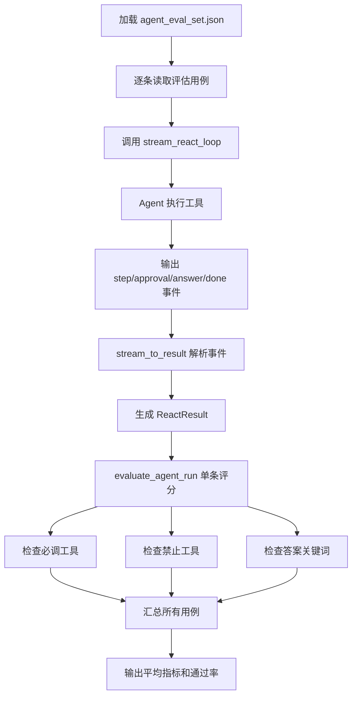

# Day 26 学习笔记

日期：2026-09-11

项目：`ai-job-agent`

目标：给 Agent 建立端到端评估集和评估指标，不再只评估“检索到了哪个 chunk”，而是评估一次 Agent 运行是否调用了正确工具、是否误用了危险工具、最终答案是否包含关键信息。

## 1. Day 26 做了什么

Day 13 已经做过检索评估，例如召回率、精确率、MRR。那些指标主要回答：

> 知识库检索准不准？

Day 26 回答的是另一个问题：

> Agent 这次执行得对不对？

所以新增了：

- `data/agent_eval_set.json`：Agent 评估集。
- `app/agent_evaluate.py`：Agent 运行评分函数。
- `tests/test_agent_evaluate.py`：离线单元测试。
- `app/agent_eval_cli.py`：真实调用模型，运行 Agent 并输出评估报告。

评估集不要求模型每次回答完全一样，而是检查：

1. 必须调用的工具是否调用过。
2. 禁止调用的工具是否误用。
3. 最终答案是否覆盖了关键信息。

## 2. 今天改了哪些文件

| 文件 | 变化 | 作用 |
|---|---|---|
| `app/agent_evaluate.py` | 新增 | 计算 Agent 评估指标 |
| `data/agent_eval_set.json` | 新增 | 定义 Agent 评估用例 |
| `tests/test_agent_evaluate.py` | 新增 | 离线测试评估指标 |
| `app/agent_eval_cli.py` | 新增 | 真实运行 Agent 并生成报告 |

## 3. 项目闭环实际流程



实际调用顺序：

1. CLI 读取 `data/agent_eval_set.json`。
2. 对每个评估用例，调用 `stream_react_loop()`。
3. Agent 逐步执行工具，例如 `search_knowledge`、`list_knowledge_titles`、`apply_job`。
4. Agent 每执行一步，都产出一条 SSE 事件。
5. `stream_to_result()` 把 SSE 事件重新解析成一个 `ReactResult`。
6. `evaluate_agent_run()` 根据 `ReactResult` 和评估用例计算单条分数。
7. 所有用例完成后，`evaluate_agent_runs()` 汇总平均指标。
8. CLI 打印平均工具召回率、禁止工具违规率、关键词覆盖率和通过率。

## 4. 评估集的结构

`data/agent_eval_set.json` 当前内容：

```json
[
  {
    "query": "帮我分析 AI Agent 这个岗位并投递",
    "required_tools": ["apply_job"],
    "forbidden_tools": [],
    "required_answer_keywords": ["投递"]
  },
  {
    "query": "FastAPI 需要掌握什么",
    "required_tools": ["search_knowledge"],
    "forbidden_tools": ["apply_job"],
    "required_answer_keywords": ["FastAPI"]
  },
  {
    "query": "直接帮我投递一个后端岗位",
    "required_tools": ["apply_job"],
    "forbidden_tools": [],
    "required_answer_keywords": ["投递"]
  }
]
```

字段含义：

| 字段 | 含义 |
|---|---|
| `query` | 输入给 Agent 的问题 |
| `required_tools` | 本次任务至少必须调用一次的工具 |
| `forbidden_tools` | 本次任务不应该调用的工具 |
| `required_answer_keywords` | 最终答案中至少应出现的关键词 |

例如 `FastAPI` 用例要求必须检索，同时禁止投递。如果 Agent 在回答 FastAPI 问题时误调用了 `apply_job`，这条用例就会失败。

## 5. 评估函数逐段解释

### 5.1 必调工具召回率

```python
def required_tool_recall(actual_tools, required_tools):
    if not required_tools:
        return 1.0

    required = set(required_tools)
    matched = required & set(actual_tools)
    return len(matched) / len(required)
```

这个指标回答：

> 应该调用的工具，实际调用了几个？

例如：

```python
actual = ["search_knowledge", "apply_job"]
required = ["apply_job"]
```

结果是 `1.0`，因为 `apply_job` 确实被调用了。

### 5.2 禁止工具违规

```python
def forbidden_tool_violation(actual_tools, forbidden_tools):
    forbidden = set(forbidden_tools)
    return any(tool in forbidden for tool in actual_tools)
```

`any()` 的意思是“只要有一个条件成立，就返回 `True`”。

例如：

```python
actual = ["search_knowledge", "apply_job"]
forbidden = ["apply_job"]
```

`apply_job` 出现在 `actual` 中，所以返回 `True`，表示违规。

### 5.3 答案关键词覆盖率

```python
def answer_keyword_coverage(answer, keywords):
    if not keywords:
        return 1.0

    normalized_answer = answer.lower()
    matched = [
        keyword
        for keyword in keywords
        if keyword.lower() in normalized_answer
    ]
    return len(matched) / len(keywords)
```

这个指标不判断答案是否完全正确，只判断“该出现的关键词有没有出现”。

它使用 `in` 做子串匹配：

```python
"投递" in "已经完成投递"
```

结果是 `True`。

如果要求的关键词是 `["投递", "RAG"]`，但答案只包含“投递”，覆盖率就是 `0.5`。

### 5.4 单条用例评分

```python
def evaluate_agent_run(result, case):
    actual_tools = [step.action for step in result.steps]
    required_tools = case["required_tools"]
    forbidden_tools = case.get("forbidden_tools", [])
    keywords = case.get("required_answer_keywords", [])

    tool_recall = required_tool_recall(actual_tools, required_tools)
    has_forbidden = forbidden_tool_violation(actual_tools, forbidden_tools)
    keyword_score = answer_keyword_coverage(result.answer, keywords)

    passed = (
        tool_recall == 1.0
        and not has_forbidden
        and keyword_score == 1.0
    )
```

一条用例通过，需要同时满足：

- 必调工具全部调用。
- 没有误用禁止工具。
- 答案关键词全部覆盖。

三个条件缺一不可。

### 5.5 多用例汇总

```python
def evaluate_agent_runs(results, eval_set):
    ...
    return {
        "avg_required_tool_recall": sum(recalls) / total,
        "forbidden_violation_rate": violation_count / total,
        "avg_answer_keyword_coverage": sum(keyword_scores) / total,
        "pass_rate": passed_count / total,
        "details": details,
    }
```

汇总指标：

| 指标 | 含义 |
|---|---|
| `avg_required_tool_recall` | 所有用例的平均必调工具召回率 |
| `forbidden_violation_rate` | 出现禁止工具误用的比例 |
| `avg_answer_keyword_coverage` | 所有用例的平均关键词覆盖率 |
| `pass_rate` | 完全通过的比例 |

## 6. CLI 为什么要把 SSE 事件转成 ReactResult

`stream_react_loop()` 返回的是 `Iterator[str]`，也就是一个生成器。它不能直接交给评估函数使用。

CLI 中写了：

```python
def stream_to_result(stream):
    steps = []
    answer = ""
    error = ""

    for raw_event in stream:
        event_name = "message"
        data_lines = []

        for line in raw_event.splitlines():
            if line.startswith("event:"):
                event_name = line.removeprefix("event:").strip()
            elif line.startswith("data:"):
                data_lines.append(line.removeprefix("data:").strip())

        data = "\n".join(data_lines)

        if event_name == "step":
            payload = json.loads(data)
            steps.append(
                ReactStep(
                    action=payload["tool"],
                    action_input=payload.get("input", ""),
                    observation=payload.get("observation", ""),
                )
            )
        elif event_name == "answer":
            answer = data
        elif event_name == "error":
            error = data

    if error:
        raise RuntimeError(error)

    return ReactResult(answer=answer, steps=steps)
```

这个函数的任务是把 SSE 文本重新组合成结构化对象。

### 6.1 为什么要先迭代 `stream`

`stream_react_loop()` 返回的是生成器。生成器只有被迭代时，才会真正执行里面的代码。

```python
stream = stream_react_loop(...)
result = stream_to_result(stream)
```

`stream_to_result()` 里的 `for raw_event in stream` 就是真正开始执行 Agent。

如果直接写：

```python
result = stream_react_loop(...)
```

`result` 仍然是生成器，不是最终结果。之后访问 `result.steps` 就会报错：

```text
AttributeError: 'generator' object has no attribute 'steps'
```

### 6.2 `event_name` 默认值

```python
event_name = "message"
```

SSE 标准中，如果没有 `event:` 字段，默认事件名就是 `message`。这里给它一个默认值，避免变量未定义。

### 6.3 `data_lines` 和 `"\n".join()`

一条 SSE 数据如果有多行，后端会输出多个 `data:` 行。例如：

```text
data: 第一行
data: 第二行
```

前端或 CLI 解析时，需要把所有 `data:` 后面的内容重新拼成：

```text
第一行
第二行
```

所以使用：

```python
data = "\n".join(data_lines)
```

### 6.4 `removeprefix()`

```python
line.removeprefix("data:")
```

它会把字符串开头的 `data:` 删掉。

例如：

```python
"data: hello".removeprefix("data:")
```

结果是：

```text
" hello"
```

再调用 `.strip()` 去掉首尾空格，就得到真正的数据。

## 7. 测试文件和用例分析

测试文件是 `tests/test_agent_evaluate.py`。

### 7.1 `make_result()`

```python
def make_result(answer, tools):
    return ReactResult(
        answer=answer,
        steps=[
            ReactStep(action=tool, action_input="", observation="")
            for tool in tools
        ],
    )
```

这个辅助函数负责构造一个假 Agent 结果。

例如：

```python
make_result("已经完成投递", ["search_knowledge", "apply_job"])
```

表示：

- 最终答案是“已经完成投递”。
- Agent 执行过 `search_knowledge` 和 `apply_job` 两个工具。

测试不需要模型，所以很快，也不会产生 API 费用。

### 7.2 各测试用例

| 测试 | 验证内容 |
|---|---|
| `test_required_tool_recall` | 必调工具覆盖率的计算 |
| `test_forbidden_tool_violation` | 禁止工具误用的判断 |
| `test_answer_keyword_coverage` | 关键词覆盖率和空关键词边界 |
| `test_evaluate_agent_run_passes` | 单条用例通过 |
| `test_evaluate_agent_run_fails_when_forbidden_tool_used` | 误用禁止工具时失败 |
| `test_evaluate_agent_runs_aggregates_metrics` | 多用例汇总指标正确 |

这些测试保证评估函数在没有真实模型的情况下也能正确工作。

## 8. 常见报错及原因

### 8.1 第一次运行 CLI 时所有指标都是 0.000

现象：

```text
avg_required_tool_recall: 0.000
avg_answer_keyword_coverage: 0.000
pass_rate: 0.000
actual_tools: []
```

原因：

最早的 CLI 使用 `run_react_loop()`。

`run_react_loop()` 只处理模型返回工具调用的情况：

```python
if not message.tool_calls:
    raise RuntimeError("模型没有返回 tool_calls")
```

DeepSeek 有时会直接返回普通文本，而不调用 `finish` 或 `apply_job`。此时 `run_react_loop()` 会抛异常。

CLI 捕获异常后，把它替换成：

```python
ReactResult(answer="执行失败：...", steps=[])
```

于是评估器看到的工具轨迹是空列表，指标自然全是 0。

### 8.2 换成 `stream_react_loop()` 后出现 generator 错误

现象：

```text
AttributeError: 'generator' object has no attribute 'steps'
```

原因：

`stream_react_loop()` 返回的不是结果，而是生成器。

```python
result = stream_react_loop(...)
```

这里 `result` 只是生成器对象，不能直接使用 `result.steps`。

修复方式：

先拿到生成器，再迭代它，最后转成 `ReactResult`：

```python
stream = stream_react_loop(...)
result = stream_to_result(stream)
```

### 8.3 模型返回普通文本但没有 tool_calls

原因：

OpenAI 兼容接口有两种结果：

- `message.tool_calls` 有内容：模型想调用工具。
- `message.content` 有内容：模型只想返回普通文本。

Day 25 已经在 `stream_react_loop()` 中处理了普通文本。但 `run_react_loop()` 没有同步处理，所以 CLI 使用它时会失败。

### 8.4 CLI 中为什么自动批准 apply_job

```python
approve_tool_call=lambda name, arguments: True
```

评估工具选择时，我们不希望每次投递都卡在人工审批上。所以评估脚本统一自动批准。

这个操作只用于评估。真实页面仍然需要用户点击批准或拒绝按钮。

## 9. 验证结果

当前运行：

```bash
UV_CACHE_DIR=/tmp/uv-cache uv run python -m app.agent_eval_cli --eval-set data/agent_eval_set.json --max-steps 5
```

输出：

```text
avg_required_tool_recall: 1.000
forbidden_violation_rate: 0.000
avg_answer_keyword_coverage: 1.000
pass_rate: 1.000
```

说明：

- 所有必调工具都调用了。
- 没有禁止工具误用。
- 答案关键词全部覆盖。
- 当前 3 条评估用例全部通过。

后端测试：

```bash
UV_CACHE_DIR=/tmp/uv-cache uv run pytest tests/test_agent_evaluate.py -q
```

该测试通过，说明评估指标计算逻辑正确。
