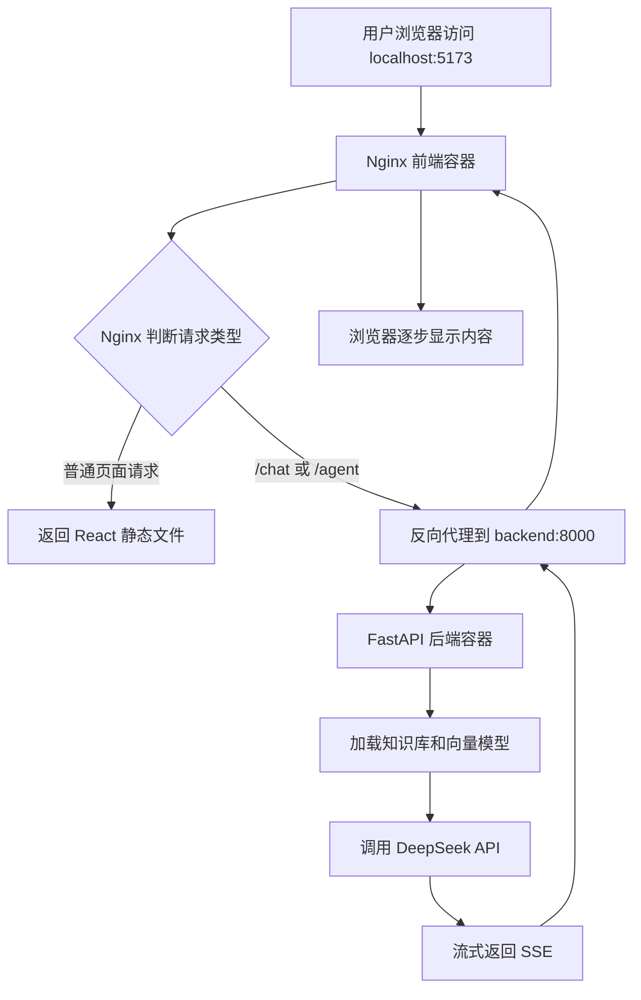

# Day 28 学习笔记

日期：2026-09-11

项目：`ai-job-agent`

目标：把已经完成的前端 React、后端 FastAPI、Agent 和可观测性功能打包成 Docker 容器，并用 Docker Compose 一起启动，得到一个可以部署的 MVP。

## 1. Day 28 做了什么

Day 27 完成了本地可观测性。Day 28 的重点是把整个项目搬进容器：

- 后端 FastAPI 使用自己的 Docker 镜像。
- 前端 React 先构建成静态文件，再放进 Nginx。
- 使用 Docker Compose 同时管理前后端两个容器。
- 通过 Nginx 把 `/chat` 和 `/agent` 请求转发给后端。
- 使用 volume 持久化 Chroma 向量数据。
- 使用环境变量传入 DeepSeek 密钥。
- 通过 HuggingFace 镜像和宿主机缓存解决模型加载问题。

最终结果是：

```text
http://localhost:5173
```

浏览器打开的是 Docker 容器里的前端，而不是本地 `npm run dev` 服务。

## 2. 今天改了哪些文件

| 文件 | 作用 |
|---|---|
| `Dockerfile` | 构建 FastAPI 后端镜像 |
| `.dockerignore` | 排除不需要复制进镜像的文件 |
| `frontend/Dockerfile` | 构建 React 并放入 Nginx |
| `frontend/nginx.conf` | Nginx 静态页面和反向代理配置 |
| `frontend/.dockerignore` | 排除前端依赖和构建产物 |
| `docker-compose.yml` | 编排前后端容器 |
| `tests/test_docker_config.py` | 检查 Docker 配置是否完整 |
| `scripts/docker_smoke_test.sh` | 可选的 Docker 启动验证脚本 |

## 3. 部署后的完整闭环



实际流程：

1. 用户在浏览器打开 `http://localhost:5173`。
2. Docker 把宿主机的 5173 端口映射到前端容器里的 80 端口。
3. Nginx 接收请求。
4. 如果是普通页面请求，Nginx 直接返回 React 构建出来的 `index.html`、JS、CSS。
5. 如果请求路径是 `/chat/` 或 `/agent/`，Nginx 把请求转发给后端容器的 8000 端口。
6. FastAPI 处理请求。
7. Agent 需要检索时，加载知识库和 Embedding 模型。
8. Agent 调用 DeepSeek API。
9. FastAPI 把结果包装成 SSE 事件。
10. Nginx 把 SSE 内容持续转发给浏览器。
11. 浏览器收到 `step`、`approval`、`answer`、`done` 等事件并渲染。

## 4. 后端 Dockerfile 解释

```dockerfile
FROM python:3.12-slim

WORKDIR /app

COPY pyproject.toml uv.lock ./
COPY app ./app
COPY data ./data

RUN pip install --no-cache-dir uv \
    && uv sync --frozen --no-dev --no-install-project

EXPOSE 8000

CMD [".venv/bin/uvicorn", "app.main:app", "--host", "0.0.0.0", "--port", "8000"]
```

### 4.1 `FROM python:3.12-slim`

表示这个镜像基于官方 Python 3.12 精简版。

`slim` 比完整版小，更适合生产环境。

### 4.2 `WORKDIR /app`

把容器内的当前目录设置为 `/app`。

后面所有相对路径都以 `/app` 为基准。

### 4.3 `COPY`

把宿主机文件复制到镜像里。

这里复制：

- `pyproject.toml`
- `uv.lock`
- `app/`
- `data/`

### 4.4 `uv sync`

安装项目依赖。

关键参数：

- `--frozen`：严格按 `uv.lock` 安装。
- `--no-dev`：不安装测试依赖。
- `--no-install-project`：不安装项目本身。

### 4.5 `EXPOSE 8000`

声明容器内服务监听 8000 端口。

注意：`EXPOSE` 只是声明，不会真的把端口暴露给宿主机。真正端口映射由 Docker Compose 的 `ports` 完成。

### 4.6 `CMD`

容器启动后执行：

```bash
.venv/bin/uvicorn app.main:app --host 0.0.0.0 --port 8000
```

使用 `.venv/bin/uvicorn`，而不是：

```bash
uv run uvicorn ...
```

原因是：

`uv run` 会尝试把当前项目安装进环境，而项目并不是标准 Python 包，会报：

```text
Expected a Python module at: src/ai_job_agent/__init__.py
```

直接运行 `.venv/bin/uvicorn` 可以绕过项目安装步骤。

## 5. 前端 Dockerfile 解释

```dockerfile
  node:22-alpine AS build

WORKDIR /app

COPY package.json ./
RUN npm install

COPY . .
RUN npm run build

FROM nginx:alpine

COPY --from=build /app/dist /usr/share/nginx/html
COPY nginx.conf /etc/nginx/conf.d/default.conf

EXPOSE 80
```

### 5.1 多阶段构建

这个 Dockerfile 有两个阶段：

1. `build` 阶段：使用 Node 构建 React。
2. `nginx` 阶段：只保留构建产物和 Nginx。

最终镜像不需要包含 Node、`node_modules` 和源码，因此体积更小。

### 5.2 `COPY --from=build`

从名为 `build` 的中间阶段复制文件。

这里把 `/app/dist` 复制到 Nginx 的静态页面目录：

```text
/usr/share/nginx/html
```

### 5.3 Nginx 配置

```nginx
location / {
    try_files $uri /index.html;
}
```

`try_files` 保证 React 单页应用刷新页面时不会 404。

```nginx
location /chat/ {
    proxy_pass http://backend:8000;
    proxy_buffering off;
    proxy_cache off;
    proxy_read_timeout 300s;
}
```

`proxy_pass` 把请求转发给后端容器。

`proxy_buffering off` 非常重要。SSE 是持续流式输出，如果 Nginx 缓冲，浏览器可能等很久也收不到内容。

## 6. Docker Compose 解释

```yaml
services:
  backend:
    build:
      context: .
      dockerfile: Dockerfile
    environment:
      OPENAI_API_KEY: ${OPENAI_API_KEY}
      OPENAI_MODEL: ${OPENAI_MODEL:-deepseek-chat}
      OPENAI_BASE_URL: ${OPENAI_BASE_URL:-https://api.deepseek.com}
      HF_ENDPOINT: https://hf-mirror.com
    ports:
      - "8000:8000"
    volumes:
      - ./data/chroma:/app/data/chroma
      - ${HOME}/.cache/huggingface:/root/.cache/huggingface
    command: [".venv/bin/uvicorn", "app.main:app", "--host", "0.0.0.0", "--port", "8000"]

  frontend:
    build:
      context: ./frontend
      dockerfile: Dockerfile
    ports:
      - "5173:80"
    depends_on:
      - backend
```

### 6.1 `build`

告诉 Compose 用哪个目录和 Dockerfile 构建镜像。

### 6.2 `environment`

给容器传入环境变量。

`${OPENAI_API_KEY}` 会从宿主机 `.env` 或 shell 环境变量中读取。

### 6.3 `ports`

格式：

```text
宿主机端口:容器端口
```

例如：

```yaml
- "5173:80"
```

表示浏览器访问宿主机 5173，Docker 把请求交给容器内 80 端口。

### 6.4 `volumes`

把宿主机目录挂载到容器里。

例如：

```yaml
- ./data/chroma:/app/data/chroma
```

这样容器里写入的 Chroma 数据会保存到宿主机，容器重启后不会丢失。

### 6.5 `command`

覆盖 Dockerfile 里的 `CMD`。

Day 28 曾经在这里保留 `uv run ...`，导致即使 Dockerfile 改对了，容器还是报同一个项目构建错误。所以这里也必须改成 `.venv/bin/uvicorn`。

### 6.6 `depends_on`

让 frontend 等 backend 先启动。

但它只控制启动顺序，不会等待 backend 完全准备好。

## 7. 测试文件分析

`tests/test_docker_config.py` 不启动 Docker，只检查关键配置是否存在。

| 测试 | 作用 |
|---|---|
| `test_backend_dockerfile_exists_and_runs_fastapi` | 后端镜像必须包含 FastAPI 启动命令 |
| `test_dockerignore_does_not_copy_env` | 防止 `.env` 被复制进镜像 |
| `test_frontend_dockerfile_builds_react` | 前端必须构建并放入 Nginx |
| `test_nginx_proxies_backend_streams` | Nginx 必须代理流式接口并关闭缓冲 |
| `test_compose_defines_backend_and_frontend` | Compose 必须包含前后端和密钥变量 |

真实 Docker 是否能运行，还需要执行 `docker compose up` 或 `docker-compose up`。

## 8. 常见报错及原因

### 8.1 `docker compose` 命令不存在

现象：

```text
docker: unknown command: docker compose
```

原因：

当前 Docker 没有安装 Compose 插件。

解决：

```bash
brew install docker-compose
```

之后使用：

```bash
docker-compose up --build -d
```

### 8.2 连接 Docker daemon 失败

现象：

```text
dial unix /var/run/docker.sock: connect: no such file or directory
```

原因：

Docker Desktop 没有启动。

解决：

```bash
open -a Docker
```

等待 Docker Desktop 正常运行。

### 8.3 找不到 docker-credential-desktop

现象：

```text
error getting credentials - err:
exec: "docker-credential-desktop": executable file not found in $PATH
```

原因：

`~/.docker/config.json` 配置了 `credsStore: desktop`，但当前 shell 找不到凭据工具。

解决：

删除 `~/.docker/config.json` 里的 `credsStore` 字段，或使用空 Docker 配置测试。

### 8.4 拉取镜像超时或连接被重置

现象：

```text
timeout awaiting response headers
context deadline exceeded
connection reset by peer
```

原因：

访问 Docker Hub 不稳定，尤其在国内网络环境下。

解决：

- 关闭 VPN 或系统代理。
- 在 Docker Desktop 中配置 `registry-mirrors`。
- 或直接从镜像站拉取后重新打标签。

### 8.5 uv sync 报缺少 src/ai_job_agent

现象：

```text
Failed to build ai-job-agent
Expected a Python module at: src/ai_job_agent/__init__.py
```

原因：

`uv sync` 默认会安装当前项目本身，但项目结构不是标准 Python 包。

解决：

使用：

```bash
uv sync --frozen --no-dev --no-install-project
```

启动时使用：

```bash
.venv/bin/uvicorn ...
```

### 8.6 容器日志仍然出现 uv run 错误

原因：

`docker-compose.yml` 中的 `command` 覆盖了 Dockerfile 里的 `CMD`。

解决：

把 Compose 中的 `command` 也改成 `.venv/bin/uvicorn`。

### 8.7 前端 502

原因：

Nginx 无法连接后端容器。通常是因为 backend 容器已经退出。

解决：

```bash
docker-compose ps -a
docker-compose logs backend
```

根据后端日志修复问题。

### 8.8 Agent 请求一直无内容

原因：

容器内正在尝试从 HuggingFace 下载模型，但网络不可达。

解决：

1. 挂载宿主机模型缓存。
2. 设置：

```yaml
HF_ENDPOINT: https://hf-mirror.com
```

3. 重启后端容器。

## 9. 最终验证

```bash
docker-compose ps
```

两个容器都应为 `Up`：

```text
ai-agent-backend-1
ai-agent-frontend-1
```

后端健康检查：

```bash
curl http://localhost:8000/health
```

返回：

```json
{"status":"ok"}
```

浏览器访问：

```text
http://localhost:5173
```

应能正常进行 Agent 问答和审批。
