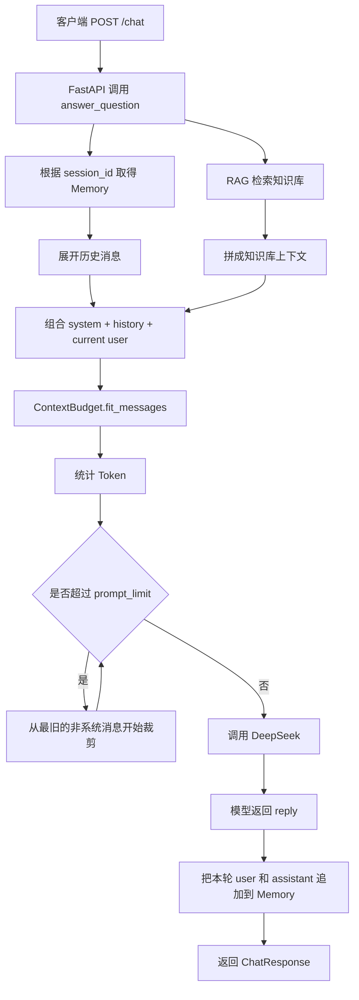
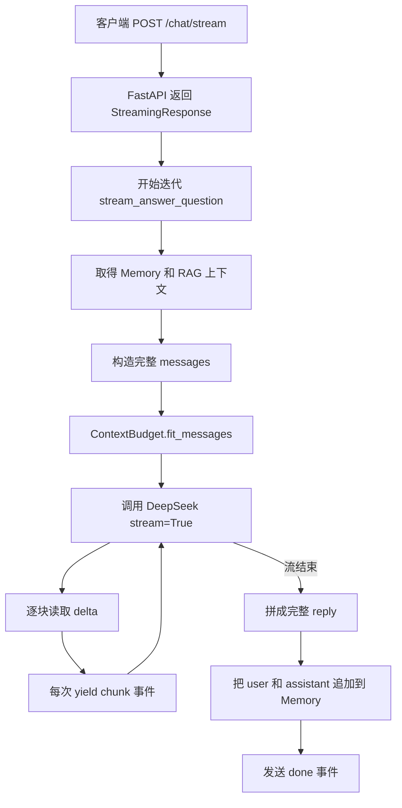

# Day 29 学习笔记

日期：2026-09-13

项目：`ai-job-agent`

目标：给 `/chat` 和 `/chat/stream` 增加 Token 统计与上下文预算，避免会话历史越长越占用模型上下文，最后把请求挤爆或导致模型忽略更早的重要信息。

## 1. Day 29 做了什么

Day 28 已经能把整个项目打包成 Docker MVP。Day 29 回到模型调用层，补上一个基础但非常重要的问题：

```text
聊天记录会随着对话不断增长
        ->
每次请求携带的历史消息越来越多
        ->
模型上下文和成本越来越高
```

Day 29 新增了：

- `app/context.py`：统计 Token，判断上下文是否超预算，并自动裁剪历史消息。
- `tests/test_context.py`：验证 Token 统计和上下文裁剪逻辑。
- `app/agent.py`：在普通问答和流式问答里接入 `ContextBudget`。
- `pyproject.toml` 和 `uv.lock`：新增 `tiktoken` 依赖。

现在 `/chat` 和 `/chat/stream` 在调用模型前，都会先执行：

```python
messages = ContextBudget().fit_messages(messages)
```

## 2. 今天改了哪些文件

| 文件 | 变化 | 作用 |
|---|---|---|
| `app/context.py` | 新增 | Token 计数、消息分组、上下文预算 |
| `tests/test_context.py` | 新增 | 验证计数、分组和裁剪行为 |
| `app/agent.py` | 修改 | 在 `answer_question` 和 `stream_answer_question` 里裁剪历史消息 |
| `pyproject.toml` | 修改 | 添加 `tiktoken>=0.14.0` |
| `uv.lock` | 修改 | 锁定 `tiktoken` 版本 |

## 3. 项目闭环实际流程

### 3.1 普通问答 `/chat`



实际调用顺序：

1. 用户请求 `POST /chat`。
2. FastAPI 调用 `answer_question(session_id, question)`。
3. `answer_question` 先从 `session_store` 取出这个会话的历史消息。
4. 同时用 RAG 检索知识库，得到 `sources` 和 `context`。
5. 把消息拼成 `system + 历史消息 + 当前用户问题`。
6. 用 `ContextBudget().fit_messages(messages)` 检查并裁剪。
7. 调用 DeepSeek，得到最终回答。
8. 把本轮用户问题和模型回答追加到 `Memory`，供下一轮使用。
9. 返回 `ChatResponse`。

### 3.2 流式问答 `/chat/stream`



和 `/chat` 的区别是：

- `/chat` 一次拿到完整回答。
- `/chat/stream` 边生成边返回，适合前端显示打字效果。

两者都在真正调用模型前执行了 `ContextBudget.fit_messages()`。

## 4. 改动对应的知识点

### 4.1 Token 不是字符

模型不是按“一个字一个字”读取文本，而是先把文本切成 Token。

例如：

```python
count_tokens("hello")
# 结果是 1

count_tokens("hello world")
# 结果是 2
```

同一个词不一定总是 1 个 Token。不同模型的切分方式不同，Token 数量也可能不同。

### 4.2 `tiktoken` 和 `cl100k_base`

代码里使用：

```python
ENCODING_NAME = "cl100k_base"
```

`tiktoken` 是 OpenAI 常用的 Token 统计库，`cl100k_base` 是其中一种编码方式。

需要注意：

> DeepSeek 没有公开完整 tokenizer，所以这里不是 DeepSeek 服务端的真实 Token 数，而是一个估算值。

它已经足够用来做应用层的上下文预算。如果以后需要更准确，应该优先使用模型接口返回的 `usage.prompt_tokens`。

### 4.3 上下文预算为什么要预留输出空间

`ContextBudget` 有两个关键数字：

```python
max_tokens = 12000
reserved_output_tokens = 1500
```

实际允许输入占用的 Token 是：

```python
prompt_limit = max_tokens - reserved_output_tokens
```

也就是：

```text
12000 - 1500 = 10500
```

这样做的原因：

- 模型不只是读输入，还要生成回答。
- 输入和输出共享同一个上下文窗口。
- 如果不预留输出空间，输入占满上下文后，模型可能没有空间生成答案。

### 4.4 每条消息还有固定开销

OpenAI Chat Completions 的消息格式不是只计算 `content`。

代码中设置了：

```python
TOKENS_PER_MESSAGE = 3
TOKENS_PER_NAME = 1
```

含义是：

- 每条消息至少先算 3 个 Token 的结构开销。
- 如果消息有 `name` 字段，还要额外算 1 个 Token，再加上名字本身。

所以：

```python
count_message_tokens({"role": "user", "content": "hello"})
```

不是 1，而是：

```text
3 + count_tokens("hello") = 4
```

### 4.5 为什么要按“消息组”裁剪

如果只是简单地从旧到新逐条删除消息，可能会出现：

```text
assistant(tool_calls) 被删掉
tool 消息还留着
```

这会产生一条没有对应 `assistant(tool_calls)` 的 `tool` 消息，模型接口可能报错。

所以 `group_messages()` 会把关联消息放在一起：

- `system` 单独一组。
- 普通对话中，一个 `user` 和紧接着的 `assistant` 算一组。
- `assistant(tool_calls)` 和后面的 `tool` 结果算一组。
- 工具结果之后的普通 `assistant` 再单独开一组。

这样裁剪时只会删除整组，不会把“调用工具”和“工具结果”拆散。

### 4.6 `fit_messages` 的裁剪策略

代码策略是：

```text
保留 system
保留越新越好的非系统消息组
从最旧的非系统消息组开始删
```

伪代码：

```python
for start in range(len(other_groups) + 1):
    candidate = system_groups + other_groups[start:]
    if fits(candidate):
        return candidate
```

其中 `other_groups[start:]` 表示：

- `start = 0`：不删任何非系统消息。
- `start = 1`：删除最旧的第 1 组。
- `start = 2`：删除最旧的第 1 组和第 2 组。

第一次能放进预算的组合，就是本次发送给模型的消息。

## 5. 核心代码逐段解释

### 5.1 `get_encoding()`

```python
@lru_cache(maxsize=1)
def get_encoding():
    return tiktoken.get_encoding(ENCODING_NAME)
```

`lru_cache(maxsize=1)` 会把结果缓存起来。

好处是：

- 第一次调用时加载编码器。
- 之后调用直接返回缓存结果，不用重复加载。

### 5.2 `count_tokens()`

```python
def count_tokens(text: str) -> int:
    if not text:
        return 0
    return len(get_encoding().encode(text))
```

`encode(text)` 会把文本变成 Token ID 列表，`len()` 再取得数量。

空字符串直接返回 0，避免无意义计算。

### 5.3 `count_message_tokens()`

```python
def count_message_tokens(message: dict) -> int:
    total = TOKENS_PER_MESSAGE

    content = message.get("content")
    if isinstance(content, str):
        total += count_tokens(content)
    ...
```

它分别处理：

- `content`
- `name`
- `tool_calls` 里的函数名和参数

例如 ReAct 循环里的 assistant 消息可能包含：

```json
{
  "role": "assistant",
  "tool_calls": [
    {
      "function": {
        "name": "search_knowledge",
        "arguments": "{\"query\":\"FastAPI\"}"
      }
    }
  ]
}
```

函数名和参数也应该被计入 Token，否则会低估上下文占用。

### 5.4 `group_messages()`

它返回一个嵌套列表：

```python
[
    [system],
    [user, assistant],
    [user, assistant],
]
```

核心判断是：

```python
if role == "user":
    if current:
        groups.append(current)
    current = [message]
```

遇到新的 `user`，说明上一轮对话结束，应该把上一组收起来。

对于 `assistant(tool_calls)`：

```python
has_tool_calls = bool(message.get("tool_calls"))
```

如果它有工具调用，就新开一组。后面的 `tool` 消息会追加到这一组里，保证它们一起保留或一起删除。

### 5.5 `ContextBudget.fit_messages()`

```python
groups = group_messages(messages)
system_groups = [g for g in groups if g[0].get("role") == "system"]
other_groups = [g for g in groups if g[0].get("role") != "system"]
```

先把 `system` 和其他消息分开。

```python
for start in range(len(other_groups) + 1):
    candidate = [
        message
        for group in system_groups + other_groups[start:]
        for message in group
    ]
    if self.fits(candidate):
        return candidate
```

这里从“不删除”开始尝试，逐步删除最旧的组，直到找到第一个符合预算的组合。

如果删到最后仍然放不下：

```python
raise ValueError("只保留系统消息仍然超过上下文预算")
```

这说明 `system` 本身已经太长，需要缩短系统提示词或提高 `max_tokens`。

## 6. 测试验证了什么

测试文件是 `tests/test_context.py`。

### 6.1 测试真实 Token 计数

```python
def test_count_tokens_counts_english_words():
    assert count_tokens("hello") == 1
    assert count_tokens("hello world") == 2
```

这里使用英文词，因为英文 Token 结果更直观。中文的切分结果不稳定，不适合写死精确数量。

### 6.2 测试固定消息开销

```python
def test_count_message_tokens_adds_fixed_overhead():
    message = {"role": "user", "content": "hello"}

    assert count_message_tokens(message) == 3 + count_tokens("hello")
```

这个测试保证以后不会忘记每条消息的固定 3 Token 开销。

### 6.3 测试消息分组

`test_group_messages_groups_chat_turns()` 验证普通聊天按轮次分组。

`test_group_messages_keeps_tool_calls_with_tool_results()` 验证工具调用和工具结果不会分开。

### 6.4 测试预算裁剪

`fake_counter` 使用字符长度代替真实 Token：

```python
def fake_counter(messages):
    return sum(len(message.get("content", "")) for message in messages)
```

这样预算测试不依赖 `tiktoken`，结果确定。

在 `test_fit_messages_drops_oldest_turns()` 中：

- `max_tokens = 12`
- `reserved_output_tokens = 5`
- 所以 `prompt_limit = 7`

消息内容长度：

```text
SYS = 3
q1 = 2
a1 = 2
q2 = 2
a2 = 2
```

全部内容长度为 11，超过 7，因此删除最旧一组 `q1 + a1`，最终保留：

```text
SYS, q2, a2
```

### 6.5 测试系统消息过长

```python
def test_fit_messages_raises_when_system_too_large():
    budget = ContextBudget(
        max_tokens=5,
        reserved_output_tokens=0,
        token_counter=fake_counter,
    )

    with pytest.raises(ValueError, match="系统消息"):
        budget.fit_messages(...)
```

`SYSTEM` 长度为 6，而 `prompt_limit` 只有 5，所以应该抛出 `ValueError`。

## 7. 相关报错和原因

### 7.1 `ModuleNotFoundError: No module named 'tiktoken'`

原因：

- 代码已经 `import tiktoken`，但当前 Python 环境没有安装这个包。
- 常见情况是只改了 `pyproject.toml`，没有执行安装或同步命令。

解决：

```bash
uv add tiktoken
uv sync
```

### 7.2 `ValueError: reserved_output_tokens 必须小于 max_tokens`

原因：

- 如果 `reserved_output_tokens >= max_tokens`，那么 `prompt_limit <= 0`，模型连输入空间都没有。

解决：

- 让 `max_tokens` 明显大于 `reserved_output_tokens`。
- 例如 `max_tokens=12000`、`reserved_output_tokens=1500`。

### 7.3 `ValueError: 只保留系统消息仍然超过上下文预算`

原因：

- `system` 消息本身已经超过 `prompt_limit`。
- 无论怎么裁剪非系统消息，都无法放进预算。

解决：

- 缩短 `system` 提示词。
- 或者提高 `max_tokens`。
- 或者减少 `reserved_output_tokens`。

### 7.4 本机运行 pytest 时出现 `Operation not permitted`

本机验证时可能看到：

```text
Failed to initialize cache at `/Users/zhitong/.cache/uv`
Caused by: failed to open file ...
Operation not permitted
```

原因：

- 当前执行环境不能写用户默认的 `uv` 缓存目录。

解决：

```bash
UV_CACHE_DIR=/tmp/uv-cache uv run pytest tests/test_context.py tests/test_chat.py -q
```

也可以直接使用项目虚拟环境里的 pytest：

```bash
.venv/bin/pytest tests/test_context.py tests/test_chat.py -q
```

### 7.5 设计上避免的“孤立 tool 消息”问题

如果没有 `group_messages()`，直接逐条删除旧消息，就可能删除 `assistant(tool_calls)` 但留下后面的 `tool` 结果。

这会导致请求结构不完整。

Day 29 通过“整组裁剪”避免了这个问题。这也是测试中专门增加 `test_group_messages_keeps_tool_calls_with_tool_results()` 的原因。

## 8. 今天的结果

```bash
UV_CACHE_DIR=/tmp/uv-cache uv run pytest tests/test_context.py tests/test_chat.py -q
```

结果为：

```text
12 passed
```

说明：

- 新的上下文预算逻辑正确。
- 旧的聊天记忆测试没有回退。

## 9. 遗留问题和下一步

当前只是“发送给模型前裁剪消息”，`Memory` 内部仍然会一直保存完整历史。

也就是说：

```text
Memory 里的消息不会因为 ContextBudget 而减少
        ->
只是每次请求发给模型的是裁剪后的副本
```

后续可以继续做：

- 限制 `Memory` 的最大消息条数。
- 使用摘要压缩旧消息。
- 在 `run_react_loop` 和 `stream_react_loop` 中接入上下文预算。
- 使用模型接口返回的 `usage` 做更准确的 Token 统计。

Day 30 可以进入 Prompt 模式，重点比较 few-shot 和 CoT。
