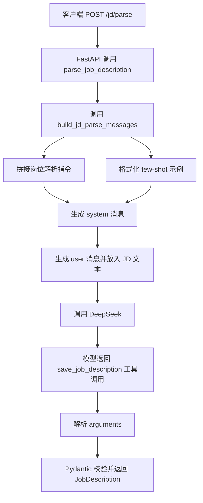
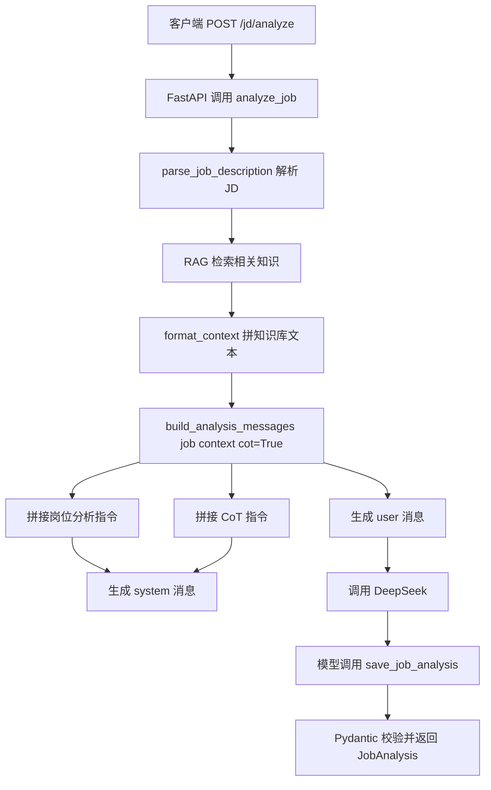
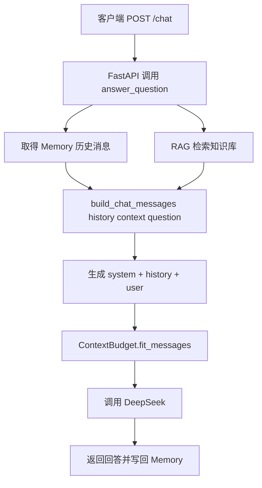

# Day 30 学习笔记

日期：2026-09-13

项目：`ai-job-agent`

目标：把原来散落在业务代码里的 Prompt 抽到独立模块，并引入两个最常用的 Prompt 模式：

- few-shot：给模型几个输入输出示例，让结构化输出更稳定。
- Chain-of-Thought，简称 CoT：让模型先思考，再给最终结果。

## 1. Day 30 做了什么

Day 29 解决的是“上下文太长怎么办”。Day 30 解决的是“如何让模型更稳定地理解任务”。

Day 30 之前，Prompt 直接写在：

- `app/llm.py` 的 `SYSTEM_PROMPT`
- `app/agent.py` 的 `ANALYSIS_SYSTEM_PROMPT`
- `app/agent.py` 的 `CHAT_SYSTEM_PROMPT`

这种写法的缺点是：

```text
Prompt 散落在多个文件
        ->
想调整语气、格式、示例时不知道改哪里
        ->
也很难测试 Prompt 本身
```

Day 30 新增了 `app/prompts.py`，把 Prompt 集中起来，并让业务代码只调用 Prompt 构造函数。

## 2. 今天改了哪些文件

| 文件 | 变化 | 作用 |
|---|---|---|
| `app/prompts.py` | 新增 | 集中管理 few-shot、CoT、聊天 Prompt |
| `app/llm.py` | 修改 | `/jd/parse` 使用 `build_jd_parse_messages` |
| `app/agent.py` | 修改 | `/jd/analyze` 和 `/chat` 使用 Prompt 构造函数 |
| `tests/test_prompts.py` | 新增 | 验证 Prompt 结构和开关逻辑 |

## 3. 项目闭环实际流程

### 3.1 JD 解析流程 `/jd/parse`



调用顺序：

1. 用户请求 `/jd/parse`。
2. FastAPI 调用 `parse_job_description(jd_text)`。
3. `build_jd_parse_messages()` 生成两条消息：
   - `system`：角色说明、任务规则和 few-shot 示例。
   - `user`：真实 JD 文本。
4. DeepSeek 根据示例理解应该返回什么格式。
5. 模型调用 `save_job_description`，把参数返回给 Python。
6. Python 用 Pydantic 校验参数，返回 `JobDescription`。

### 3.2 岗位分析流程 `/jd/analyze`



这里最重要的变化是：

```python
messages=build_analysis_messages(job, context, cot=True)
```

`cot=True` 会在 `system` 消息中增加以下要求：

```text
先完成以下思考：
1. 岗位核心职责是什么
2. 已经具备什么
3. 还缺少什么
4. 面试可能考察什么
5. 应该按什么顺序学习
```

### 3.3 聊天问答流程 `/chat`



`build_chat_messages()` 不负责业务判断，只负责把三类内容按正确顺序拼起来：

```text
system
history
current user question
```

## 4. 改动对应的知识点

### 4.1 什么是 Prompt

Prompt 是给大模型的输入指令。

在本项目中，它不只是“用户问什么”，还包括：

- 角色设定，例如“你是招聘信息解析器”。
- 任务说明，例如“提取结构化岗位信息”。
- 输出格式，例如“必须调用 save_job_description 工具”。
- 边界约束，例如“不要编造 JD 中不存在的信息”。

在业务代码中，Prompt 负责告诉模型“你要做什么、按什么格式做、不能做什么”。

### 4.2 为什么要把 Prompt 从业务代码中抽出来

原来 Prompt 和 Python 业务逻辑混在一起。实际生产中，Prompt 会被频繁调整：

- 产品要求改变回答语气。
- 模型升级后需要重写指令。
- 需要给不同语言或不同场景准备不同模板。
- 需要做 A/B 测试。

如果把 Prompt 抽出来：

- 修改 Prompt 不需要理解完整业务代码。
- 可以用单元测试验证 Prompt 是否包含必要指令。
- 后续可以进一步做成 Prompt 库、版本化或接入 Prompt 管理平台。

Day 30 是向这个方向走的第一步。

### 4.3 few-shot 是什么

few-shot 是在 Prompt 中给出少量“输入 + 输出”示例，让模型照着示例完成任务。

Day 30 的 JD 解析示例是：

```text
示例 1 输入 JD：
字节跳动招聘 AI Agent 工程师，要求掌握 Python 和 RAG...

示例 1 输出 JSON：
{
  "company": "字节跳动",
  "title": "AI Agent 工程师",
  ...
}
```

模型看到示例后，更容易理解：

- `company` 应该填公司名。
- `title` 应该填岗位名。
- `requirements` 应该是数组。
- 哪些字段不能编造。

### 4.4 few-shot 在本项目中的位置

这里把示例放在 `system` 消息里，而不是放成多轮 `user` 和 `assistant` 消息。

原因是：

```text
/jd/parse 使用 function calling
        ->
当前流程是 system + user
        ->
然后模型调用工具
```

如果强行插入多轮示例，会破坏当前“一个用户 JD、一次工具调用”的结构。

所以最合适的位置是：

```text
system 消息
  -> 角色和任务说明
  -> few-shot 示例
```

### 4.5 CoT 是什么

CoT 是 Chain-of-Thought 的缩写，意思是“思维链”。

普通 Prompt：

```text
请分析这个岗位。
```

CoT Prompt：

```text
请先思考：
1. 岗位核心职责是什么
2. 我已经具备什么
3. 我还缺少什么
4. 面试可能考察什么
5. 应该按什么顺序学习

然后再输出最终分析。
```

CoT 的目标是让模型不要直接跳到答案，而是先拆解问题，再推理，最后输出结论。

对于复杂任务，这种“先想再答”通常更稳定。

### 4.6 本项目中 CoT 与 function calling 如何配合

本项目的 `save_job_analysis` 工具没有增加 `reasoning` 字段。

所以这里的 CoT 不是要求模型把推理过程原样返回，而是在调用工具前先在内部完成推理。

实际流程是：

```text
模型看到 CoT 指令
        ->
内部先分析岗位
        ->
再调用 save_job_analysis
        ->
返回 summary、matched_skills、missing_skills 等结构化字段
```

这比直接生成结构化字段更稳定。

### 4.7 实际生产中的对标方案

few-shot 和 CoT 在真实项目里通常对应：

| 当前做法 | 生产中的常见方案 |
|---|---|
| 在 Python 里写死示例 | Prompt 模板化、Prompt 版本管理 |
| 示例直接放在系统提示词中 | 动态检索相似示例，再插入当前 Prompt |
| CoT 只写在指令里 | 在工具参数中增加 `reasoning`，让推理过程可见 |
| 手工看效果 | 建立 Prompt 评估集，做 A/B 测试 |
| 一个系统提示词 | Prompt 库、版本号、发布和回滚 |

Day 30 已经完成了模板化。Day 34 和 Day 35 会继续做 Prompt 评估和 Prompt 库。

## 5. 核心代码逐段解释

### 5.1 `_format_few_shot_examples()`

```python
def _format_few_shot_examples(examples: list[dict]) -> str:
    blocks = []

    for index, example in enumerate(examples, start=1):
        output = json.dumps(example["output"], ensure_ascii=False, indent=2)
        blocks.append(
            f"示例 {index} 输入 JD：\n{example['jd']}\n"
            f"示例 {index} 输出 JSON：\n{output}"
        )

    return "\n\n".join(blocks)
```

这个函数把 Python 的示例列表转换成适合大模型阅读的文本。

`ensure_ascii=False` 很重要：

- 默认 `json.dumps()` 会把中文变成 `\uXXXX`。
- 加上 `ensure_ascii=False` 后，中文会原样显示。

### 5.2 `build_jd_parse_messages()`

```python
def build_jd_parse_messages(jd_text: str) -> list[dict]:
    system = (
        JD_PARSE_INSTRUCTIONS
        + "\n\n以下示例只用于说明格式，不要照搬示例内容。\n"
        + _format_few_shot_examples(JD_FEW_SHOT_EXAMPLES)
    )

    return [
        {"role": "system", "content": system},
        {"role": "user", "content": jd_text},
    ]
```

它负责：

- 把岗位解析规则放进 `system`。
- 把示例放进 `system`。
- 把真实 JD 放进 `user`。

### 5.3 `build_analysis_messages()`

```python
def build_analysis_messages(job, context: str, cot: bool = True) -> list[dict]:
    instructions = ANALYSIS_INSTRUCTIONS

    if cot:
        instructions = f"{instructions}\n\n{COT_INSTRUCTIONS}"

    user_content = f"岗位信息：\n{job.model_dump_json()}\n\n知识库：\n{context}"

    return [
        {"role": "system", "content": instructions},
        {"role": "user", "content": user_content},
    ]
```

`cot=True` 是默认值，表示默认开启思维链。

如果以后想测试“不用 CoT 会怎样”，可以传：

```python
build_analysis_messages(job, context, cot=False)
```

这也是 Day 30 测试中的一个重点。

### 5.4 `build_chat_messages()`

```python
def build_chat_messages(
    history: list[dict],
    context: str,
    question: str,
) -> list[dict]:
    return [
        {"role": "system", "content": CHAT_INSTRUCTIONS},
        *history,
        {"role": "user", "content": f"知识库：\n{context}\n\n问题：{question}"},
    ]
```

`*history` 会把历史消息展开，放在 `system` 和当前用户问题之间。

这样顺序就变成：

```text
system
历史 user
历史 assistant
当前 user
```

### 5.5 `app/llm.py` 的改动

原来：

```python
messages=[
    {"role": "system", "content": SYSTEM_PROMPT},
    {"role": "user", "content": jd_text},
]
```

现在：

```python
messages=build_jd_parse_messages(jd_text)
```

业务代码不再关心 Prompt 内部怎么拼，只关心“给我一个可以调用模型的 messages”。

### 5.6 `app/agent.py` 的改动

`generate_analysis` 使用：

```python
messages=build_analysis_messages(job, context, cot=True)
```

聊天问答使用：

```python
messages = build_chat_messages(
    memory.get_messages(),
    context,
    question,
)
```

Day 29 的 `ContextBudget` 仍然保留，流程变成：

```text
先构造 Prompt
        ->
再做上下文预算裁剪
        ->
再调用模型
```

## 6. 测试验证了什么

### 6.1 few-shot 示例是否正确拼入

```python
def test_build_jd_parse_messages_contains_few_shot_example():
    messages = build_jd_parse_messages("测试 JD 文本")

    assert len(messages) == 2
    assert messages[0]["role"] == "system"
    assert "示例" in messages[0]["content"]
    assert "字节跳动" in messages[0]["content"]
    assert "AI Agent 工程师" in messages[0]["content"]
    assert messages[1] == {"role": "user", "content": "测试 JD 文本"}
```

这个测试验证：

- 输出有两条消息。
- 示例出现在 `system` 中。
- 真实 JD 在 `user` 中，没有被示例污染。

### 6.2 CoT 是否默认开启

```python
def test_build_analysis_messages_includes_cot_instruction():
    messages = build_analysis_messages(job, "RAG 相关知识库上下文")

    assert "先完成以下思考" in messages[0]["content"]
    assert "岗位信息" in messages[1]["content"]
    assert "RAG 相关知识库上下文" in messages[1]["content"]
```

验证默认 `cot=True` 时，系统消息中包含思考步骤。

### 6.3 CoT 是否能关闭

```python
def test_build_analysis_messages_can_disable_cot():
    messages = build_analysis_messages(job, "上下文", cot=False)

    assert "先完成以下思考" not in messages[0]["content"]
```

这一步证明 Prompt 是可配置的，而不是写死。

### 6.4 聊天历史顺序是否保留

```python
def test_build_chat_messages_keeps_history_and_current_question():
    ...
    assert messages[1] == {"role": "user", "content": "上一轮问题"}
    assert messages[2] == {"role": "assistant", "content": "上一轮回答"}
    assert messages[3]["role"] == "user"
```

这个测试防止 Prompt 重构破坏 Day 11 的会话记忆能力。

## 7. 相关报错和原因

### 7.1 `NameError: name 'SYSTEM_PROMPT' is not defined`

如果 `app/llm.py` 已经删除了 `SYSTEM_PROMPT`，但还有其他地方仍引用它，会报这个错误。

原因：

- 删除常量后没有同步修改所有引用。

解决：

- 搜索整个项目，确保所有旧常量都被新的 Prompt 构造函数替代。

检查方式：

```bash
rg "SYSTEM_PROMPT|ANALYSIS_SYSTEM_PROMPT|CHAT_SYSTEM_PROMPT" app
```

### 7.2 `ImportError: cannot import name 'build_jd_parse_messages' from 'app.prompts'`

原因：

- `app/prompts.py` 没有保存。
- 文件名或函数名拼写错误。
- 当前运行目录不对，导致找不到 `app` 包。

解决：

- 确认 `app/prompts.py` 存在。
- 确认函数名和导入名一致。
- 在项目根目录运行命令。

### 7.3 `TypeError: build_chat_messages() missing 1 required positional argument`

原因：

- `build_chat_messages` 需要三个参数：
  - `history`
  - `context`
  - `question`

如果调用时少传一个，就会报错。

解决：

```python
build_chat_messages(
    memory.get_messages(),
    context,
    question,
)
```

### 7.4 中文 JSON 显示成 `\uXXXX`

如果忘记设置：

```python
json.dumps(example["output"], ensure_ascii=False)
```

会看到：

```text
{"company": "\u5b57\u8282\u8df3\u52a8"}
```

原因：

- Python 的 `json.dumps()` 默认会把非 ASCII 字符转成 Unicode 转义。

解决：

- 使用 `ensure_ascii=False`。

### 7.5 `ValueError`：模型返回的 JSON 缺少字段

如果模型没有返回 Pydantic 要求的字段，`JobDescription.model_validate()` 或 `JobAnalysis.model_validate()` 会抛出校验错误。

可能原因：

- few-shot 示例中的字段和 Pydantic 模型不一致。
- 模型受到示例影响，漏掉了某些字段。
- CoT 指令太长，模型直接生成普通文本，没有调用工具。

解决：

- 检查示例 JSON 的字段是否和 Pydantic 模型完全对应。
- 确保 `system` 中仍然明确要求调用工具。
- 必要时增加“缺少字段就填 unknown 或空数组”的约束。

### 7.6 本机运行 pytest 时的 `uv` 缓存权限问题

本机可能遇到：

```text
Failed to initialize cache at `/Users/zhitong/.cache/uv`
Operation not permitted
```

原因：

- 当前执行环境不能写用户默认的 `uv` 缓存目录。

解决：

```bash
UV_CACHE_DIR=/tmp/uv-cache uv run pytest tests/test_prompts.py -q
```

## 8. 今天的结果

运行：

```bash
UV_CACHE_DIR=/tmp/uv-cache uv run pytest tests/test_prompts.py tests/test_llm.py tests/test_agent.py tests/test_chat.py -q
```

结果：

```text
10 passed
```

说明：

- 新的 Prompt 构造模块正确。
- 旧的 JD 解析、岗位分析和聊天记忆测试没有回退。

## 9. 遗留问题和下一步

当前 `app/agent.py` 中还保留了 Day 30 之前的注释代码块，建议后续清理。

另外，Day 30 只是做了 Prompt 模板化，还没有做：

- Prompt 评估集。
- 多个 Prompt 版本对比。
- 动态选择 few-shot 示例。
- CoT 推理过程可见化。

这些内容可以放在 Day 34 和 Day 35 继续完成。
