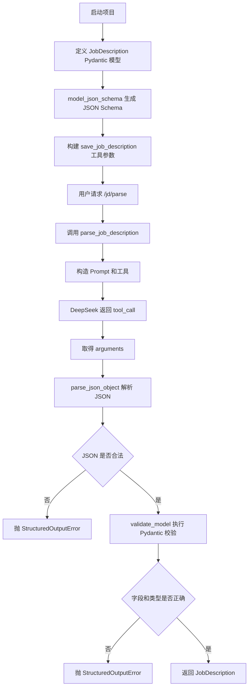
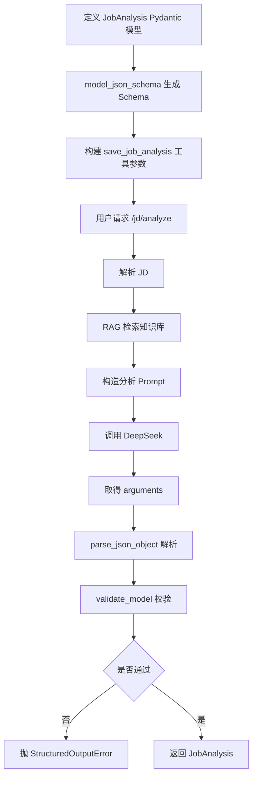

# Day 31 学习笔记

日期：2026-09-13

项目：`ai-job-agent`

目标：把结构化输出从“手写 JSON Schema + 直接 `json.loads`”升级成“Pydantic 生成 JSON Schema + 统一解析和校验”。

## 1. Day 31 做了什么

Day 30 解决了 Prompt 怎么组织。Day 31 解决的是：

```text
模型返回的 JSON 是否合法
        ->
字段是否齐全
        ->
类型是否正确
        ->
错误能不能被清晰识别
```

Day 31 之前，项目里有两个隐患：

- 工具参数是手写在 `app/llm.py` 和 `app/agent.py` 里的。
- 模型返回后直接使用 `json.loads()` 和 `model_validate()`。
- 如果 JSON 不合法，会直接抛 `json.JSONDecodeError`。
- 如果字段错误，会直接抛 `pydantic.ValidationError`。

这些错误都能工作，但不够清晰，也不容易统一处理。

Day 31 新增了 `app/structured_output.py`，统一负责：

1. 从 Pydantic 模型生成工具参数。
2. 解析模型返回的 JSON。
3. 用 Pydantic 校验并转换成业务对象。
4. 把错误统一包装成 `StructuredOutputError`。

## 2. 今天改了哪些文件

| 文件 | 变化 | 作用 |
|---|---|---|
| `app/structured_output.py` | 新增 | 结构化输出解析、校验和 Schema 生成 |
| `app/models.py` | 修改 | 给 `JobDescription` 字段增加 `Field(description=...)` |
| `app/llm.py` | 修改 | 使用 Pydantic 生成 `save_job_description` 参数 |
| `app/agent.py` | 修改 | 使用 Pydantic 生成 `save_job_analysis` 参数 |
| `tests/test_structured_output.py` | 新增 | 验证 JSON 解析、Pydantic 校验和 Schema 生成 |

## 3. 项目闭环实际流程

### 3.1 JD 解析 `/jd/parse`



核心变化是：

```python
parameters=build_tool_parameters_from_model(JobDescription)
```

以及：

```python
return parse_and_validate(
    tool_call.function.arguments,
    JobDescription,
)
```

### 3.2 岗位分析 `/jd/analyze`



`ANALYSIS_TOOL` 中的手写参数被替换为：

```python
"parameters": build_tool_parameters_from_model(JobAnalysis)
```

## 4. 改动对应的知识点

### 4.1 JSON Schema 是什么

JSON Schema 用来描述“一段 JSON 应该长什么样”。

例如本项目中：

```json
{
  "type": "object",
  "properties": {
    "company": {"type": "string"},
    "seniority": {
      "type": "string",
      "enum": ["junior", "mid", "senior", "staff", "unknown"]
    },
    "requirements": {
      "type": "array",
      "items": {"type": "string"}
    }
  },
  "required": ["company", "title"]
}
```

它表达了几件事：

- 顶层必须是一个对象。
- `company` 必须是字符串。
- `seniority` 只能是枚举中的某一个值。
- `requirements` 必须是字符串数组。
- `company` 和 `title` 是必填字段。

### 4.2 JSON Schema 在本项目业务中负责什么

在 function calling 中，`parameters` 就是工具的 JSON Schema。

它负责告诉模型：

```text
调用 save_job_description 时
        ->
参数必须符合这个结构
        ->
不能少必填字段
        ->
不能用错误类型
```

例如：

- 模型应该返回 `"seniority": "mid"`，而不是 `"seniority": 3`。
- `requirements` 应该是数组，而不是普通字符串。

### 4.3 Pydantic 在本项目业务中负责什么

JSON Schema 只能描述“应该是什么样”，但模型不一定完全遵守。

Pydantic 负责在 Python 收到数据后，真正做一次运行时校验：

```python
JobDescription.model_validate(data)
```

它会：

- 检查字段是否存在。
- 检查字段类型是否正确。
- 检查 `Literal` 枚举值是否合法。
- 把默认值补上。
- 把字典转换成 `JobDescription` 对象。

### 4.4 `model_json_schema()` 解决了什么问题

以前工具参数和 Pydantic 模型是两套手写内容：

```text
工具参数
  company: string
  seniority: enum

Pydantic 模型
  company: str
  seniority: Literal[...]
```

两者很容易不一致。

例如：

- 你在 Pydantic 模型里新增一个字段。
- 但忘记修改工具参数。
- 模型就可能不会返回这个新字段。

Day 31 使用：

```python
schema = model.model_json_schema()
```

让工具参数从 Pydantic 模型自动生成。

这样：

```text
Pydantic 模型成为唯一数据源
        ->
工具参数自动跟随模型变化
        ->
减少手写不一致
```

### 4.5 `Field(description=...)` 的作用

`app/models.py` 中现在写：

```python
company: str = Field(..., description="公司名称")
```

`...` 表示该字段必填。

`description="公司名称"` 会进入 `model_json_schema()` 生成的 JSON Schema。

这个描述会被 function calling 传给模型，让模型更容易理解字段含义。

### 4.6 为什么要统一成 `StructuredOutputError`

原来的代码可能出现两种错误：

```text
json.JSONDecodeError
pydantic.ValidationError
```

它们都是标准 Python 异常，但调用方需要分别处理。

Day 31 统一包装成：

```text
StructuredOutputError
```

好处是：

- 调用方只处理一种业务错误。
- 错误信息可以统一加前缀。
- 后续可以统一记录日志、统一重试、统一上报监控。

### 4.7 为什么要处理 Markdown 代码块

有些模型在普通文本输出中，会返回：

```text
```json
{"company": "测试公司"}
```
```

如果直接把整段内容交给 `json.loads()`，会解析失败。

`_strip_code_fences()` 负责把外层的 Markdown 代码块符号去掉，只留下 JSON。

在当前 function calling 中，`arguments` 通常已经是纯 JSON，但保留这个能力可以让模块以后复用。

```

### 4.8 实际生产中的对标方案

| Day 31 的做法                      | 生产中的常见方案                               |
| ---------------------------------- | ---------------------------------------------- |
| `model_json_schema()` 生成工具参数 | Pydantic、JSON Schema、OpenAPI 统一数据契约    |
| `parse_and_validate()`             | 统一的响应解析和校验层                         |
| 自定义 `StructuredOutputError`     | 统一业务异常、统一错误码和日志                 |
| 去掉代码块                         | 响应清洗、正则修复、JSON 修复                  |
| 依赖模型遵守 Schema                | OpenAI Structured Outputs、JSON mode、重试机制 |
| 校验通过后返回模型                 | Python 侧二次校验，防止非法数据进入业务        |

在 TypeScript 前端背景中，Pydantic 的作用类似 `zod`。它们都是运行时校验结构化数据。

## 5. 核心代码逐段解释

### 5.1 `StructuredOutputError`

```python
class StructuredOutputError(ValueError):
    """模型结构化输出无法解析或校验时抛出。"""
```

它继承 `ValueError`。

这样既可以使用自定义异常类型，也保留普通值错误的一些行为。

### 5.2 `_strip_code_fences()`

```python
def _strip_code_fences(raw: str) -> str:
    text = raw.strip()

    if not text.startswith("```"):
        return text

    lines = text.splitlines()

    if lines and lines[0].startswith("```"):
        lines = lines[1:]

    if lines and lines[-1].strip() == "```":
        lines = lines[:-1]

    return "\n".join(lines).strip()
```

处理逻辑：

1. 去掉首尾空白。
2. 如果不以代码块开头，直接返回。
3. 如果以 ` ``` ` 开头，去掉第一行。
4. 如果最后一行是 ` ``` `，也去掉。
5. 重新拼成字符串。

### 5.3 `parse_json_object()`

```python
def parse_json_object(raw: str) -> dict:
    if not isinstance(raw, str):
        raise StructuredOutputError(...)

    try:
        data = json.loads(_strip_code_fences(raw))
    except json.JSONDecodeError as exc:
        raise StructuredOutputError(...) from exc

    if not isinstance(data, dict):
        raise StructuredOutputError(...)

    return data
```

它做了三层检查：

1. 输入必须是字符串。
2. JSON 必须能解析。
3. JSON 顶层必须是字典。

### 5.4 `validate_model()`

```python
def validate_model(data: dict, model: type[ModelT]) -> ModelT:
    try:
        return model.model_validate(data)
    except ValidationError as exc:
        raise StructuredOutputError(f"Pydantic 校验失败: {exc}") from exc
```

`from exc` 会把原始异常保留在异常链里。

好处是调试时仍然能看到原始 Pydantic 错误，而调用方又能捕获统一异常。

### 5.5 `parse_and_validate()`

```python
def parse_and_validate(raw: str, model: type[ModelT]) -> ModelT:
    return validate_model(parse_json_object(raw), model)
```

这是最常用的入口。

它把“先解析、再校验”两个步骤合并成一个函数。

### 5.6 `build_tool_parameters_from_model()`

```python
def build_tool_parameters_from_model(model: type[BaseModel]) -> dict:
    schema = model.model_json_schema()

    return {
        "type": "object",
        "additionalProperties": False,
        "properties": schema.get("properties", {}),
        "required": schema.get("required", []),
    }
```

这里没有把 Pydantic 返回的完整 Schema 原样交给 OpenAI。

而是只提取 function calling 最需要的部分：

- `type`
- `additionalProperties`
- `properties`
- `required`

这样更稳定，也更容易阅读。

## 6. 测试验证了什么

### 6.1 普通 JSON 能解析

```python
def test_parse_json_object_returns_dict():
    raw = '{"company":"测试公司","title":"AI 工程师"}'

    data = parse_json_object(raw)

    assert data == {"company": "测试公司", "title": "AI 工程师"}
```

验证 `json.loads` 的基本流程没有被破坏。

### 6.2 Markdown 代码块能解析

```python
def test_parse_json_object_strips_markdown_code_fence():
    raw = '```json\n{"company":"测试公司","title":"AI 工程师"}\n```'

    data = parse_json_object(raw)

    assert data["company"] == "测试公司"
```

验证代码块外壳会被去掉。

### 6.3 非法 JSON 会变成统一错误

```python
def test_parse_json_object_raises_on_invalid_json():
    with pytest.raises(StructuredOutputError, match="JSON 无法解析"):
        parse_json_object("{not valid json")
```

不再依赖 `json.JSONDecodeError`。

### 6.4 顶层不是对象会报错

```python
def test_parse_json_object_raises_on_non_object_root():
    with pytest.raises(StructuredOutputError, match="顶层必须是对象"):
        parse_json_object('["a", "b"]')
```

保证后续代码拿到的始终是字典。

### 6.5 完整流程能返回 Pydantic 对象

```python
def test_parse_and_validate_returns_model():
    job = parse_and_validate(
        '{"company":"测试公司","title":"AI 工程师","seniority":"mid"}',
        JobDescription,
    )

    assert job.company == "测试公司"
    assert job.title == "AI 工程师"
    assert job.responsibilities == []
```

同时验证默认字段会被补成空列表。

### 6.6 缺少必填字段会报错

```python
def test_parse_and_validate_raises_when_required_field_missing():
    with pytest.raises(StructuredOutputError, match="Pydantic 校验失败"):
        parse_and_validate('{"company":"测试公司"}', JobDescription)
```

`JobDescription` 中 `title` 是必填字段。

### 6.7 非法枚举值会报错

```python
def test_parse_and_validate_raises_on_invalid_enum():
    raw = '{"company":"测试公司","title":"AI 工程师","seniority":"manager"}'

    with pytest.raises(StructuredOutputError, match="Pydantic 校验失败"):
        parse_and_validate(raw, JobDescription)
```

`manager` 不在 `seniority` 的枚举列表中。

### 6.8 工具参数来自 Pydantic

```python
def test_build_tool_parameters_from_model_uses_json_schema():
    parameters = build_tool_parameters_from_model(JobDescription)

    assert parameters["type"] == "object"
    assert parameters["additionalProperties"] is False
    assert set(parameters["required"]) == {"company", "title"}
    assert "company" in parameters["properties"]
    assert "junior" in parameters["properties"]["seniority"]["enum"]
```

这一步验证：

- Schema 顶层类型正确。
- 必填字段正确。
- `seniority` 的枚举值被自动带出。

## 7. 相关报错和原因

### 7.1 `json.JSONDecodeError: Expecting value`

原因：

- 模型返回的 `arguments` 不是合法 JSON。
- 可能包含 Markdown 代码块。
- 可能包含前后多余文字。

Day 31 的处理：

```python
raise StructuredOutputError(f"模型返回的 JSON 无法解析: {exc}")
```

### 7.2 `pydantic.ValidationError: 1 validation error for JobDescription`

原因：

- 模型缺少必填字段。
- 字段类型错误。
- `seniority` 不在枚举范围内。

Day 31 的处理：

```python
raise StructuredOutputError(f"Pydantic 校验失败: {exc}")
```

### 7.3 `模型返回的 JSON 顶层必须是对象`

原因：

- 模型返回了数组、字符串或数字。
- 但 `JobDescription` 和 `JobAnalysis` 都要求顶层是对象。

### 7.4 `ImportError: cannot import name 'structured_output'`

原因：

- `app/structured_output.py` 没有保存。
- 文件名写错。
- 当前运行目录不在项目根目录。

解决：

```bash
ls app/structured_output.py
uv run python -c "from app.structured_output import parse_and_validate"
```

### 7.5 工具 Schema 和 Pydantic 模型不一致

这是 Day 31 要避免的旧问题。

例如：

```python
class JobDescription(BaseModel):
    company: str
    title: str
```

但手写工具 Schema 里少写一个 `title`，模型就可能不返回 `title`。

使用 `build_tool_parameters_from_model()` 后，只要模型改了，Schema 会一起改。

### 7.6 本机 pytest 的 `uv` 缓存权限问题

可能遇到：

```text
Failed to initialize cache at `/Users/zhitong/.cache/uv`
Operation not permitted
```

解决：

```bash
UV_CACHE_DIR=/tmp/uv-cache uv run pytest tests/test_structured_output.py -q
```

## 8. 今天的结果

运行：

```bash
UV_CACHE_DIR=/tmp/uv-cache uv run pytest tests/test_structured_output.py tests/test_llm.py tests/test_agent.py -q
```

结果：

```text
11 passed
```

说明：

- 新的结构化输出模块正确。
- JD 解析和岗位分析的旧测试没有回退。

## 9. 遗留问题和下一步

当前 Day 31 主要解决“解析和校验”，还没有解决：

- 模型返回错误后自动重试。
- 用 `usage` 和 `finish_reason` 判断输出是否完整。
- 对超长字段或危险内容做进一步约束。
- 引入 OpenAI Structured Outputs 或 JSON mode。

Day 32 可以继续深入 function calling 的参数设计、错误恢复和重试。
