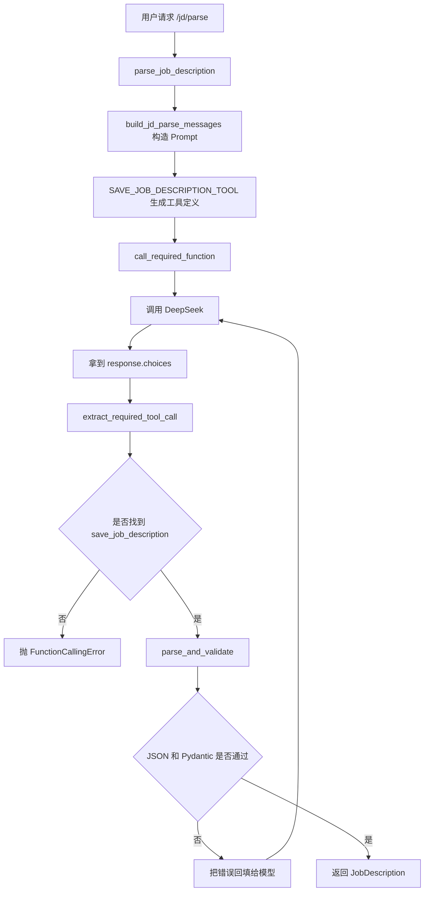
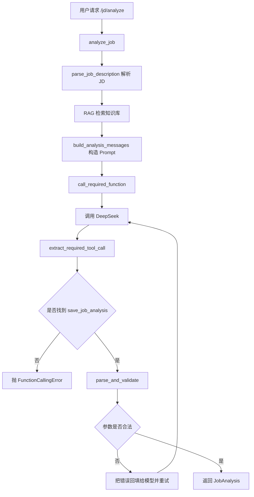

# Day 32 学习笔记

日期：2026-09-13

项目：`ai-job-agent`

目标：把 function calling 从“能调用工具”升级到“能检查工具、能解析参数、能恢复错误、能统一报错”。

## 1. Day 32 做了什么

Day 31 已经统一了结构化输出解析和 Pydantic 校验。Day 32 在这之上补了一个重要缺口：

```text
模型不返回 tool_calls 怎么办
        ->
模型返回了错误工具怎么办
        ->
模型参数非法怎么办
        ->
网络暂时失败怎么办
```

Day 32 新增了 `app/function_calling.py`，让 `/jd/parse` 和 `/jd/analyze` 使用同一个 function calling 执行器。

核心变化：

- `parse_job_description()` 不再自己处理 `client.chat.completions.create()`。
- `generate_analysis()` 也不再自己处理工具响应。
- 两者统一调用 `call_required_function()`。
- 工具参数继续由 Pydantic 生成。
- 字段增加 `min_length=1` 和更清楚的 `description`。

## 2. 今天改了哪些文件

| 文件 | 变化 | 作用 |
|---|---|---|
| `app/function_calling.py` | 新增 | 强制工具调用、错误恢复、统一异常 |
| `app/models.py` | 修改 | 增加字段描述和最小长度约束 |
| `app/llm.py` | 修改 | `/jd/parse` 使用 `call_required_function` |
| `app/agent.py` | 修改 | `/jd/analyze` 使用 `call_required_function` |
| `tests/test_function_calling.py` | 新增 | 验证工具提取、重试、最终失败 |
| `tests/test_llm.py` | 修改 | mock 中补充 `function.name` |
| `tests/test_agent.py` | 修改 | mock 中补充 `function.name` |

## 3. 项目闭环实际流程

### 3.1 JD 解析 `/jd/parse`



核心代码：

```python
return call_required_function(
    client,
    build_jd_parse_messages(jd_text),
    [SAVE_JOB_DESCRIPTION_TOOL],
    "save_job_description",
    JobDescription,
    model_name=os.environ["OPENAI_MODEL"],
    max_attempts=3,
)
```

### 3.2 岗位分析 `/jd/analyze`



`generate_analysis` 中原来的长流程被压缩成：

```python
return call_required_function(
    client,
    build_analysis_messages(job, context, cot=True),
    [ANALYSIS_TOOL],
    "save_job_analysis",
    JobAnalysis,
    model_name=os.environ["OPENAI_MODEL"],
    max_attempts=3,
)
```

## 4. 改动对应的知识点

### 4.1 function calling 在业务中负责什么

function calling 不是让 Python 自动执行函数，而是让模型告诉 Python：

```text
我想调用哪个函数
        ->
我想传什么参数
```

真正执行函数的是 Python 代码。

在本项目中：

- `save_job_description`：模型告诉 Python 它解析出了哪些岗位信息。
- `save_job_analysis`：模型告诉 Python 它生成了哪些分析结果。

### 4.2 `tool_choice` 的作用

Day 32 使用：

```python
tool_choice={
    "type": "function",
    "function": {"name": tool_name},
}
```

这表示强制模型调用指定工具。

普通 `tool_choice="auto"` 表示模型可以自己决定：

- 调用工具。
- 或者直接返回普通文本。

对于结构化提取任务，我们明确知道必须调用 `save_job_description` 或 `save_job_analysis`，所以使用强制调用更稳定。

### 4.3 为什么要检查 `tool_calls`

模型返回的消息可能有两种情况：

```python
message.tool_calls
message.content
```

如果期望工具调用，但模型只返回普通文本，`tool_calls` 就会是空列表。

如果不检查，后续访问 `tool_calls[0]` 会报：

```text
IndexError: list index out of range
```

所以 `extract_required_tool_call()` 先检查：

```python
if not tool_calls:
    raise FunctionCallingError("模型没有返回 tool_calls")
```

### 4.4 为什么要检查工具名

即使有 `tool_calls`，模型也可能调用错误的工具。

例如：

```text
期望 save_job_description
模型却调用了 search_knowledge
```

所以函数会遍历工具调用：

```python
for tool_call in tool_calls:
    if tool_call.function.name == expected_name:
        return tool_call
```

如果找不到，就抛出 `FunctionCallingError`。

### 4.5 什么是错误恢复

以前如果模型参数非法，程序直接失败。

Day 32 的做法是：

```text
第一次调用失败
        ->
把错误信息放回 messages
        ->
让模型重新生成一次
```

这比直接报错更接近真实生产系统。

错误回填时，会构造：

```python
{
    "role": "assistant",
    "content": None,
    "tool_calls": [...]
}
```

以及：

```python
{
    "role": "tool",
    "tool_call_id": call_id,
    "content": "工具参数解析失败：..."
}
```

这样模型能看到自己上一次的调用和失败原因。

### 4.6 `_repair_messages()` 为什么要保留原工具调用

OpenAI 的对话结构要求：

```text
assistant(tool_calls)
        ->
tool(tool_call_id)
```

如果只追加 `tool` 错误消息，却没有对应的 `assistant(tool_calls)`，消息结构就不完整。

`_repair_messages()` 同时追加：

1. 原来的 `assistant(tool_calls)`。
2. 一条 `tool` 错误反馈。

这样下一轮模型调用时，上下文结构仍然合法。

### 4.7 参数设计为什么重要

Day 32 给字段增加了：

```python
company: str = Field(..., min_length=1, description="公司名称")
```

它有两个作用：

- `description`：进入 JSON Schema，帮助模型理解字段含义。
- `min_length=1`：阻止空字符串进入业务。

例如：

```python
JobDescription(company="")
```

会抛出 Pydantic 校验错误。

### 4.8 实际生产中的对标方案

| Day 32 的做法 | 生产中的常见方案 |
|---|---|
| 自定义 `FunctionCallingError` | 统一业务异常、错误码、日志 |
| 非法参数后重试 | LLM 输出修复、重试和降级 |
| 网络异常重试 | exponential backoff、熔断器、限流 |
| 强制调用指定工具 | OpenAI Structured Outputs、JSON mode |
| 从 Pydantic 生成参数 Schema | OpenAPI、JSON Schema、Pydantic 数据契约 |
| 错误回填给模型 | 对话式纠错、工具结果反馈 |

在真实系统中，重试不能无限进行。通常会设置：

- 最大重试次数。
- 每次重试等待时间。
- 超时时间。
- 降级方案。

Day 32 先完成最基础的一层。

## 5. 核心代码逐段解释

### 5.1 `FunctionCallingError`

```python
class FunctionCallingError(RuntimeError):
    """function calling 无法得到可用结果时抛出。"""
```

它继承 `RuntimeError`，所以旧代码中捕获 `RuntimeError` 的逻辑仍然能工作。

### 5.2 `extract_required_tool_call()`

```python
def extract_required_tool_call(message, expected_name: str):
    tool_calls = getattr(message, "tool_calls", None)

    if not tool_calls:
        raise FunctionCallingError("模型没有返回 tool_calls")

    for tool_call in tool_calls:
        if tool_call.function.name == expected_name:
            return tool_call

    actual_names = ", ".join(str(call.function.name) for call in tool_calls)
    raise FunctionCallingError(
        f"模型没有调用期望工具 {expected_name}，实际是 {actual_names}"
    )
```

这里使用 `str(call.function.name)`，而不是直接 `call.function.name`。

原因是：

- 真实数据里 `function.name` 是字符串。
- 测试中使用 `MagicMock` 时，如果忘记设置 `function.name`，它仍然是 `MagicMock`。
- `join()` 只能拼接字符串，不能拼接 `MagicMock`。
- 用 `str()` 转换后，错误信息更安全。

### 5.3 `_tool_call_payload()`

```python
def _tool_call_payload(tool_call) -> dict:
    return {
        "id": getattr(tool_call, "id", None) or "call_repair",
        "type": "function",
        "function": {
            "name": tool_call.function.name,
            "arguments": tool_call.function.arguments or "{}",
        },
    }
```

它把模型返回的工具调用对象，转成 OpenAI 消息里需要的字典结构。

### 5.4 `_repair_messages()`

```python
def _repair_messages(messages: list[dict], tool_call, error) -> list[dict]:
    call_id = getattr(tool_call, "id", None) or "call_repair"

    return [
        *messages,
        {
            "role": "assistant",
            "content": None,
            "tool_calls": [_tool_call_payload(tool_call)],
        },
        {
            "role": "tool",
            "tool_call_id": call_id,
            "content": (
                f"工具参数解析失败：{error}。"
                f"请重新调用 {tool_call.function.name}，"
                "输出合法 JSON，并保证字段符合 Schema。"
            ),
        },
    ]
```

`*messages` 会展开原来的消息列表，再追加两条新消息。

### 5.5 `call_required_function()`

```python
def call_required_function(
    client,
    messages: list[dict],
    tools: list[dict],
    tool_name: str,
    output_model,
    *,
    model_name: str,
    max_attempts: int = 3,
    retry_delay: float = 0,
):
    last_error = None
    current_messages = list(messages)

    for attempt in range(max_attempts):
        try:
            response = client.chat.completions.create(...)
        except (APIConnectionError, APITimeoutError, RateLimitError) as exc:
            last_error = exc
            continue

        message = response.choices[0].message
        tool_call = extract_required_tool_call(message, tool_name)

        try:
            return parse_and_validate(
                tool_call.function.arguments,
                output_model,
            )
        except StructuredOutputError as exc:
            last_error = exc

            if attempt < max_attempts - 1:
                current_messages = _repair_messages(
                    current_messages,
                    tool_call,
                    exc,
                )

    raise FunctionCallingError(
        f"function calling 失败，已尝试 {max_attempts} 次"
    ) from last_error
```

它把三类错误都纳入了同一个函数：

- API 连接错误。
- 超时错误。
- 限流错误。
- 模型没有返回工具调用。
- 工具调用错误。
- JSON 或 Pydantic 校验失败。

## 6. 测试验证了什么

### 6.1 正确工具能被提取

```python
def test_extract_required_tool_call_returns_expected_call():
    ...
    result = extract_required_tool_call(message, "save_job_description")
    assert result is tool_call
```

验证正常路径。

### 6.2 空工具调用会报错

```python
def test_extract_required_tool_call_raises_when_no_tool_calls():
    message.tool_calls = []
    ...
```

验证没有 `tool_calls` 时不会访问 `tool_calls[0]`。

### 6.3 错误工具会报错

```python
def test_extract_required_tool_call_raises_when_wrong_tool():
    tool_call = make_tool_call("other_tool", "{}")
    ...
```

验证工具名不匹配时会被拦截。

### 6.4 第一次成功只调用一次

```python
def test_call_required_function_returns_model_on_first_attempt():
    ...
    assert client.chat.completions.create.call_count == 1
```

正常输入不应该浪费额外请求。

### 6.5 非法 JSON 会重试

```python
def test_call_required_function_retries_after_invalid_json():
    ...
    assert client.chat.completions.create.call_count == 2
```

第一次参数非法，第二次成功。

测试还检查第二次请求中带有：

```text
role="tool"
content 包含 "参数解析失败"
```

### 6.6 所有尝试都失败会统一报错

```python
def test_call_required_function_raises_after_all_attempts_fail():
    ...
    with pytest.raises(FunctionCallingError, match="已尝试 2 次"):
        ...
```

验证重试次数用完后的最终失败。

### 6.7 空摘要会被参数校验拦截

```python
def test_job_analysis_rejects_empty_summary():
    with pytest.raises(ValidationError):
        JobAnalysis(summary="")
```

验证 `min_length=1` 生效。

## 7. 相关报错和原因

### 7.1 `TypeError: sequence item 0: expected str instance, MagicMock found`

这是 Day 32 开发过程中真实遇到的报错。

原因：

```python
tool_call = MagicMock()
tool_call.function.arguments = "..."
```

测试没有设置：

```python
tool_call.function.name = "save_job_description"
```

所以：

```python
tool_call.function.name == expected_name
```

结果是 `False`。

接着：

```python
", ".join(call.function.name for call in tool_calls)
```

把 `MagicMock` 交给 `join()`，导致 `TypeError`。

解决：

- 在测试 mock 中补上 `function.name`。
- 同时把错误信息改成 `str(call.function.name)`，让错误信息更安全。

### 7.2 `FunctionCallingError: 模型没有返回 tool_calls`

原因：

- 模型返回了普通文本，没有调用工具。
- 测试 mock 中 `message.tool_calls = []`。

解决：

- 检查 `tool_choice` 是否正确强制调用工具。
- 检查 Prompt 是否明确要求调用工具。

### 7.3 `FunctionCallingError: 模型没有调用期望工具`

原因：

- 模型调用了工具，但工具名和预期不同。

解决：

- 检查 `tool_name` 是否拼写正确。
- 检查工具定义中的 `name` 是否和预期一致。

### 7.4 `FunctionCallingError: function calling 失败，已尝试 3 次`

原因：

- 每次模型返回的参数都无法通过 JSON 解析或 Pydantic 校验。

解决：

- 查看具体异常链。
- 检查工具 Schema 是否准确。
- 检查 Prompt 是否清晰。
- 考虑增加重试次数或降低任务复杂度。

### 7.5 `ValidationError: summary should have at least 1 character`

原因：

- `summary` 设置了 `min_length=1`。
- 模型返回了空字符串。

解决：

- 在 Prompt 中明确要求非空摘要。
- 或使用 Pydantic 默认值。

### 7.6 本机 pytest 的 `uv` 缓存权限问题

解决：

```bash
UV_CACHE_DIR=/tmp/uv-cache uv run pytest -q
```

## 8. 今天的结果

运行：

```bash
UV_CACHE_DIR=/tmp/uv-cache uv run pytest -q
```

结果：

```text
122 passed
```

说明：

- Day 32 新增的 function calling 错误恢复正常。
- 旧的 JD 解析、岗位分析、结构化输出、Agent 测试全部通过。

## 9. 遗留问题和下一步

当前 `call_required_function()` 已经能重试，但还没有：

- 指数退避。
- 按错误类型决定是否重试。
- 记录每次重试的 trace。
- 超过重试次数后返回降级结果。

Day 33 可以进入模型选择，对比不同模型的成本、延迟和能力。
