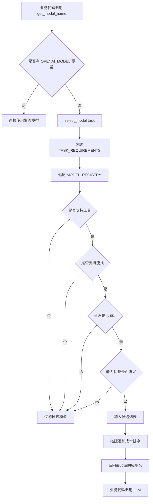
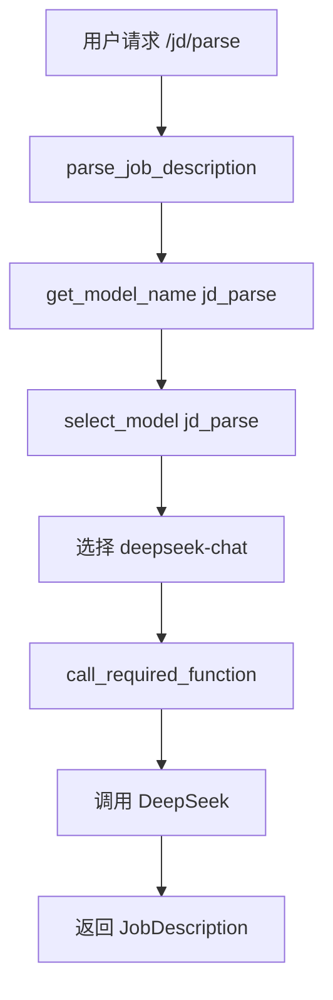
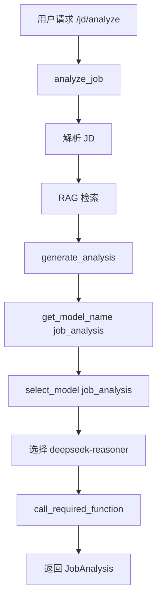
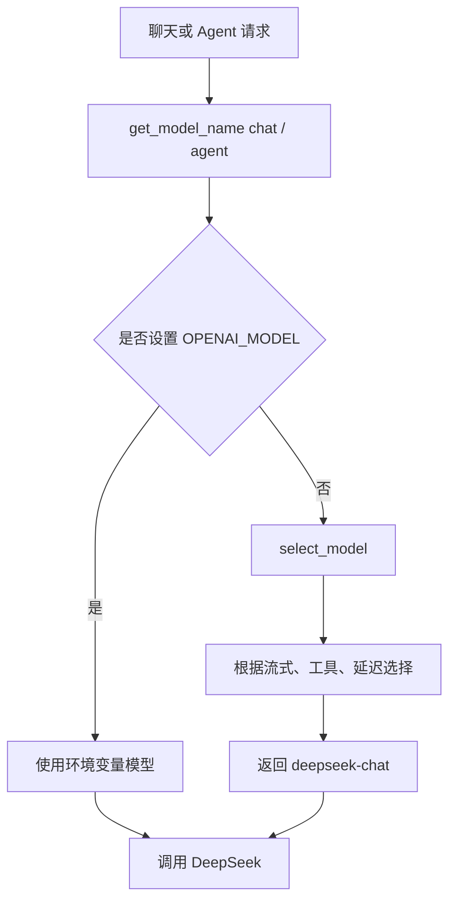

# Day 33 学习笔记

日期：2026-09-13

项目：`ai-job-agent`

目标：把原来散落在各个模块里的 `OPENAI_MODEL` 环境变量读取，升级成一个模型注册表和模型选择器，让不同任务可以选择不同模型。

## 1. Day 33 做了什么

Day 33 之前，项目里到处都写：

```python
model=os.environ["OPENAI_MODEL"]
```

这种写法的问题是：

- 所有任务都用同一个模型。
- 无法表达模型之间有什么能力差异。
- 无法估算成本。
- 无法根据任务选择更合适的模型。

Day 33 新增了 `app/model_registry.py`，集中登记模型信息，并让业务代码通过任务名获取模型。

核心变化：

- `jd_parse` 自动选择 `deepseek-chat`。
- `job_analysis` 自动选择 `deepseek-reasoner`。
- `chat` 自动选择 `deepseek-chat`。
- `agent` 自动选择 `deepseek-chat`。
- 如果设置了 `OPENAI_MODEL`，仍然优先使用该环境变量。

## 2. 今天改了哪些文件

| 文件 | 变化 | 作用 |
|---|---|---|
| `app/model_registry.py` | 新增 | 登记模型、选择模型、估算成本 |
| `app/llm.py` | 修改 | JD 解析使用模型注册表 |
| `app/agent.py` | 修改 | 岗位分析和聊天使用模型注册表 |
| `app/react.py` | 修改 | Agent 循环使用模型注册表 |
| `tests/test_model_registry.py` | 新增 | 验证模型选择、覆盖和成本估算 |

## 3. 项目闭环实际流程

### 3.1 模型选择总流程



### 3.2 JD 解析 `/jd/parse`



当前代码：

```python
model_name=get_model_name("jd_parse", os.getenv("OPENAI_MODEL"))
```

### 3.3 岗位分析 `/jd/analyze`



当前代码：

```python
model_name=get_model_name("job_analysis", os.getenv("OPENAI_MODEL"))
```

### 3.4 聊天和 Agent



## 4. 改动对应的知识点

### 4.1 什么是模型注册表

模型注册表是一个集中保存模型元信息的地方。

每个模型包含：

- 名称。
- 提供商。
- 输入价格。
- 输出价格。
- 上下文窗口。
- 是否支持工具调用。
- 是否支持流式输出。
- 延迟等级。
- 能力标签。

业务代码不再关心具体模型名，而是关心“我需要一个适合什么任务的模型”。

### 4.2 `ModelProfile` 每个字段在业务中负责什么

| 字段 | 业务作用 |
|---|---|
| `name` | 调用 API 时使用的模型名 |
| `provider` | 标识模型由谁提供 |
| `input_cost_per_million` | 估算输入成本 |
| `output_cost_per_million` | 估算输出成本 |
| `context_window` | 判断任务上下文是否放得下 |
| `supports_tools` | 判断是否能 function calling |
| `supports_streaming` | 判断是否能 SSE 流式输出 |
| `latency` | 判断响应速度等级 |
| `capabilities` | 判断是否适合分析、结构化等任务 |

### 4.3 为什么任务要区分模型

不同任务对模型要求不同：

```text
JD 解析
  -> 需要结构化输出
  -> 需要低延迟

岗位分析
  -> 需要复杂推理
  -> 可以接受稍高延迟

聊天
  -> 需要流式输出
  -> 需要低延迟

Agent
  -> 需要工具调用
  -> 需要流式输出
  -> 需要低延迟
```

如果所有任务都用同一个模型，就无法根据任务特点优化成本、延迟和能力。

### 4.4 能力标签是什么

`capabilities` 是一个标签集合，例如：

```python
("chat", "structured", "agent")
```

它不表示模型一定会成功，而是表示模型比较适合这类任务。

Day 33 用能力标签过滤模型：

```python
requirements["capabilities"].issubset(set(profile.capabilities))
```

意思是：

```text
任务要求的所有能力
        ->
必须全部包含在模型能力中
```

例如 `jd_parse` 要求 `structured`，只有 `deepseek-chat` 有该标签。

### 4.5 延迟等级是什么

Day 33 使用：

```python
LATENCY_ORDER = {
    "low": 0,
    "medium": 1,
    "high": 2,
}
```

数字越小，延迟越低。

例如：

- `chat` 要求 `max_latency = "low"`。
- `deepseek-reasoner` 的延迟是 `medium`。
- 因此它不会被选作聊天模型。

### 4.6 成本如何估算

模型价格通常按“每百万 Token”计价。

公式是：

```python
输入成本 = 输入 Token 数 * 输入单价 / 1_000_000
输出成本 = 输出 Token 数 * 输出单价 / 1_000_000
```

例如 `deepseek-chat`：

```text
输入单价：0.27 / 百万 Token
输出单价：1.10 / 百万 Token
```

所以：

```python
estimate_cost("deepseek-chat", 1_000_000, 0)
# 0.27

estimate_cost("deepseek-chat", 0, 1_000_000)
# 1.10
```

### 4.7 环境变量覆盖为什么重要

自动选择很好，但真实生产环境需要灵活切换模型。

`get_model_name()` 的逻辑是：

```python
if override:
    return override

return select_model(task)
```

如果 `.env` 中设置了：

```text
OPENAI_MODEL=deepseek-reasoner
```

那么所有任务都会优先使用 `deepseek-reasoner`，自动选择暂时失效。

这个能力适合：

- 本地调试。
- A/B 测试。
- 紧急切换模型。
- 兼容不同环境配置。

### 4.8 实际生产中的对标方案

| Day 33 的做法 | 生产中的常见方案 |
|---|---|
| 静态模型注册表 | 模型版本管理、模型目录 |
| 根据任务选择模型 | 模型路由、模型网关 |
| 能力标签过滤 | 能力矩阵、模型评估结果 |
| 成本估算 | Token 用量统计、成本看板 |
| 环境变量覆盖 | 配置中心、灰度发布、A/B 测试 |
| 多个模型备选 | 多模型 fallback、降级策略 |

真实项目中还常使用：

- LiteLLM
- OpenRouter
- 企业模型网关
- 可观测性平台

Day 33 完成的是最小版本的模型路由。

## 5. 核心代码逐段解释

### 5.1 `ModelProfile`

```python
@dataclass(frozen=True)
class ModelProfile:
    name: str
    provider: str
    input_cost_per_million: float
    output_cost_per_million: float
    context_window: int
    supports_tools: bool
    supports_streaming: bool
    latency: LatencyTier
    capabilities: tuple[str, ...] = ()
```

`frozen=True` 表示创建后不能修改。

原因是：

```text
模型信息应该稳定
        ->
不能因为某个请求临时改掉全局注册表
```

### 5.2 `MODEL_REGISTRY`

```python
MODEL_REGISTRY: dict[str, ModelProfile] = {
    "deepseek-chat": ModelProfile(...),
    "deepseek-reasoner": ModelProfile(...),
}
```

字典的 key 是模型名，value 是模型信息。

通过模型名可以直接查：

```python
MODEL_REGISTRY["deepseek-chat"]
```

### 5.3 `TASK_REQUIREMENTS`

```python
TASK_REQUIREMENTS = {
    "jd_parse": {
        "requires_tools": True,
        "requires_streaming": False,
        "max_latency": "low",
        "capabilities": {"structured"},
    },
    ...
}
```

它定义了每个任务对模型的最低要求。

选择模型时，只保留满足这些要求的模型。

### 5.4 `select_model()`

```python
def select_model(task: str) -> str:
    requirements = TASK_REQUIREMENTS.get(task)

    if requirements is None:
        raise ModelRegistryError(f"未知任务：{task}")

    candidates = []

    for profile in MODEL_REGISTRY.values():
        if requirements["requires_tools"] and not profile.supports_tools:
            continue

        if requirements["requires_streaming"] and not profile.supports_streaming:
            continue

        if LATENCY_ORDER[profile.latency] > LATENCY_ORDER[requirements["max_latency"]]:
            continue

        if not requirements["capabilities"].issubset(set(profile.capabilities)):
            continue

        candidates.append(profile)

    if not candidates:
        raise ModelRegistryError(f"没有模型满足任务要求：{task}")

    return min(
        candidates,
        key=lambda profile: (
            LATENCY_ORDER[profile.latency],
            profile.input_cost_per_million,
            profile.output_cost_per_million,
        ),
    ).name
```

`continue` 的意思是“跳过当前模型，看下一个模型”。

`min(candidates, key=...)` 会先比较延迟，再比较输入成本，再比较输出成本。

### 5.5 `get_model_name()`

```python
def get_model_name(task: str, override: str | None = None) -> str:
    if override:
        return override

    return select_model(task)
```

业务代码传入：

```python
get_model_name("chat", os.getenv("OPENAI_MODEL"))
```

如果 `.env` 没有设置 `OPENAI_MODEL`，`os.getenv()` 返回 `None`，于是走自动选择。

### 5.6 `estimate_cost()`

```python
def estimate_cost(model_name: str, input_tokens: int, output_tokens: int) -> float:
    profile = get_model_profile(model_name)

    input_cost = input_tokens * profile.input_cost_per_million / 1_000_000
    output_cost = output_tokens * profile.output_cost_per_million / 1_000_000

    return round(input_cost + output_cost, 6)
```

`round(..., 6)` 保留六位小数，避免显示过长的小数。

## 6. 测试验证了什么

### 6.1 JD 解析选择结构化模型

```python
def test_select_model_returns_structured_model_for_jd_parse():
    assert select_model("jd_parse") == "deepseek-chat"
```

`jd_parse` 要求 `structured`，所以选择 `deepseek-chat`。

### 6.2 岗位分析选择推理模型

```python
def test_select_model_prefers_reasoner_for_job_analysis():
    assert select_model("job_analysis") == "deepseek-reasoner"
```

`job_analysis` 要求 `analysis`，所以选择 `deepseek-reasoner`。

### 6.3 聊天和 Agent 选择低延迟模型

```python
def test_select_model_returns_chat_model_for_chat():
    assert select_model("chat") == "deepseek-chat"

def test_select_model_returns_agent_model_for_agent():
    assert select_model("agent") == "deepseek-chat"
```

两个任务都要求低延迟，因此选择 `deepseek-chat`。

### 6.4 覆盖模型名

```python
def test_get_model_name_uses_override():
    assert get_model_name("jd_parse", "custom-model") == "custom-model"
```

验证环境变量覆盖优先于自动选择。

### 6.5 获取模型信息

```python
def test_get_model_profile_returns_profile():
    profile = get_model_profile("deepseek-chat")

    assert profile.provider == "DeepSeek"
    assert profile.supports_tools is True
    assert profile.context_window == 64000
```

验证注册表可以按名称查模型。

### 6.6 成本估算

```python
def test_estimate_cost_calculates_million_token_cost():
    assert estimate_cost("deepseek-chat", 1_000_000, 0) == 0.27
    assert estimate_cost("deepseek-chat", 0, 1_000_000) == 1.10
```

验证每百万 Token 的价格换算。

### 6.7 未知模型和未知任务

```python
def test_estimate_cost_raises_for_unknown_model():
    with pytest.raises(ModelRegistryError, match="未知模型"):
        estimate_cost("not-exist", 100, 100)

def test_select_model_raises_for_unknown_task():
    with pytest.raises(ModelRegistryError, match="未知任务"):
        select_model("not-exist")
```

保证错误配置能快速暴露。

## 7. 相关报错和原因

### 7.1 `ModelRegistryError: 未知模型：not-exist`

原因：

- 传入的模型名不在 `MODEL_REGISTRY` 中。

解决：

- 检查模型名拼写。
- 或者把新模型加入注册表。

### 7.2 `ModelRegistryError: 未知任务：not-exist`

原因：

- 传入的任务名不在 `TASK_REQUIREMENTS` 中。

解决：

- 检查任务名。
- 或者新增一个任务配置。

### 7.3 `ModelRegistryError: 没有模型满足任务要求`

原因：

- 所有模型都被过滤掉了。

例如某个任务要求：

```python
"requires_tools": True
"max_latency": "low"
"capabilities": {"analysis"}
```

但现有模型中没有一个同时满足。

解决：

- 降低任务要求。
- 或增加新模型。

### 7.4 `KeyError: 'OPENAI_MODEL'`

Day 33 之前，如果环境变量没有设置，`os.environ["OPENAI_MODEL"]` 会直接报 `KeyError`。

Day 33 改成：

```python
os.getenv("OPENAI_MODEL")
```

没有设置时返回 `None`，然后走自动模型选择。

### 7.5 价格计算不准确

成本估算依赖注册表中的价格。

如果价格不是最新值，计算结果会不准。

真实生产环境中，价格应定期从供应商配置中同步，或者读取每次 API 返回的 `usage`。

### 7.6 本机 pytest 的 `uv` 缓存权限问题

解决：

```bash
UV_CACHE_DIR=/tmp/uv-cache uv run pytest -q
```

## 8. 今天的结果

运行：

```bash
UV_CACHE_DIR=/tmp/uv-cache uv run pytest -q
```

结果：

```text
131 passed
```

说明：

- 模型注册表和选择逻辑正确。
- 旧有 JD 解析、岗位分析、聊天、Agent 测试全部通过。

## 9. 遗留问题和下一步

当前模型注册表还是静态数据，价格和能力需要手工维护。

后续可以继续做：

- 从环境变量或配置文件加载模型注册表。
- 记录每次请求的实际 Token 用量。
- 根据实际延迟和错误率动态选择模型。
- 多模型 fallback。

Day 34 可以进入 Prompt 评估，开始量化 Prompt 修改是否真的更好。
