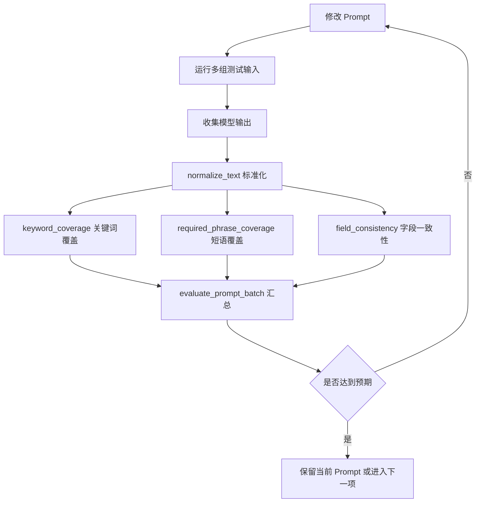
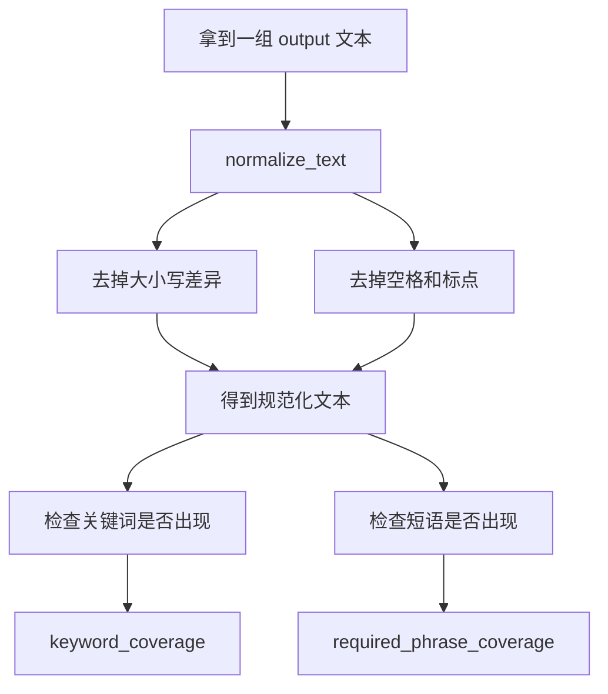
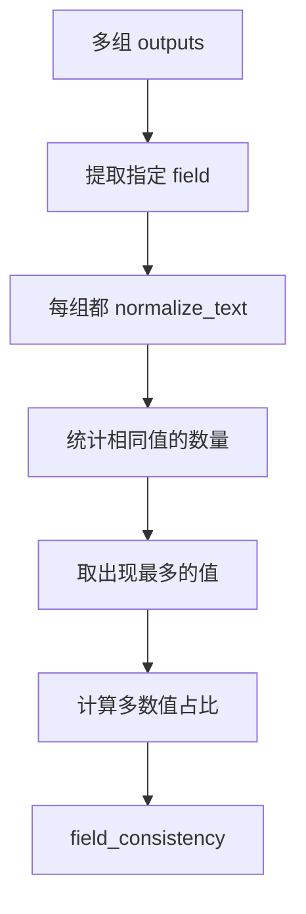

# Day 34 学习笔记

日期：2026-09-13

项目：`ai-job-agent`

目标：给 Prompt 输出增加一个离线评估模块，用来判断 Prompt 改完后，输出是否更一致、更稳定。

## 1. Day 34 做了什么

Day 30 已经把 Prompt 模板化。Day 31 和 Day 32 解决了结构化输出和错误恢复。Day 33 解决了模型选择。

但还有一个问题没有回答：

```text
怎么知道一个 Prompt 改得好不好
```

Day 34 新增了 `app/prompt_evaluate.py`，它不调用真实模型，只对已经收集到的 Prompt 输出做统计。

它可以计算：

- 关键词覆盖率。
- 必需短语覆盖率。
- 多组输出在某个字段上的一致性。
- 多组输出整体通过检查的比例，也就是鲁棒性。

## 2. 今天改了哪些文件

| 文件 | 变化 | 作用 |
|---|---|---|
| `app/prompt_evaluate.py` | 新增 | Prompt 输出评估函数 |
| `tests/test_prompt_evaluate.py` | 新增 | 验证标准化、覆盖率、一致性和鲁棒性 |

Day 34 没有改动 HTTP 接口、前端或模型调用代码。

## 3. 项目闭环实际流程

### 3.1 Prompt 开发迭代闭环



### 3.2 单个输出如何评估



### 3.3 多组输出如何评估一致性



## 4. 改动对应的知识点

### 4.1 什么是 Prompt 评估

Prompt 评估就是回答：

```text
这个 Prompt 产生的输出
        ->
是否稳定
        ->
是否包含必要信息
```

模型输出每次可能不同，所以只看一次结果不够。

通常需要：

1. 准备多组输入。
2. 对每组输入运行多次。
3. 收集输出。
4. 计算一致性和覆盖率。
5. 根据指标决定是否修改 Prompt。

### 4.2 一致性在业务中负责什么

一致性回答的是：

```text
同样的任务
        ->
模型每次输出的关键内容是否接近
```

例如岗位分析中，`summary` 字段如果有时是：

```text
AI Agent 岗位
```

有时又是：

```text
后端岗位
```

说明 Prompt 对字段含义的约束还不够稳定。

### 4.3 鲁棒性在业务中负责什么

鲁棒性回答的是：

```text
输入有一点变化
        ->
模型是否仍然能覆盖必要信息
```

例如：

```text
请分析 AI Agent 岗位
请帮我分析 AI Agent 这个岗位
分析一下 AI Agent 岗位
```

虽然表达方式不同，但 Prompt 应该稳定地输出 `AI Agent`、`Python` 等必要关键词。

### 4.4 为什么要标准化文本

模型输出常常包含：

- 大小写不同。
- 前后空格。
- 标点符号。
- 换行。

直接比较会把这些差异误判成“输出不一致”。

`normalize_text()` 会：

```python
text.lower()
```

然后只保留字母和数字：

```python
char.isalnum()
```

这样：

```text
Hello, World!
```

会变成：

```text
helloworld
```

### 4.5 关键词覆盖率是什么

关键词覆盖率是：

```text
输出中出现了多少个必需关键词
        /
一共要求多少个关键词
```

例如：

```python
output = "需要掌握 Python 和 RAG"
keywords = ["Python", "Docker"]
```

结果是：

```text
1 / 2 = 0.5
```

因为它包含 `Python`，但不包含 `Docker`。

### 4.6 短语覆盖率是什么

短语比关键词更长，检查更严格。

例如：

```python
phrase = "掌握 Python"
```

只有输出中出现连续的“掌握 Python”，才算匹配。

这比只检查 `Python` 更有业务含义。

### 4.7 字段一致性怎么计算

`field_consistency()` 使用 `Counter` 统计每个字段值出现次数。

例如：

```python
outputs = [
    {"summary": "AI Agent 岗位"},
    {"summary": "AI Agent 岗位"},
    {"summary": "后端岗位"},
]
```

标准化后：

```text
aiagent岗位：出现 2 次
后端岗位：出现 1 次
```

多数值是 `aiagent岗位`，占比是：

```text
2 / 3
```

### 4.8 `evaluate_prompt_batch()` 汇总什么

它返回：

| 指标 | 含义 |
|---|---|
| `avg_field_consistency` | 多个字段一致性的平均值 |
| `avg_keyword_coverage` | 所有输出关键词覆盖率的平均值 |
| `avg_required_phrase_coverage` | 所有输出短语覆盖率的平均值 |
| `robustness_rate` | 完全通过全部检查的输出占比 |

`robustness_rate` 是最容易理解的指标：

```text
有多少组输出完全合格
        /
一共有多少组输出
```

### 4.9 实际生产中的对标方案

| Day 34 的做法 | 生产中的常见方案 |
|---|---|
| 关键词和短语检查 | 规则型评估、断言测试 |
| 字段一致性 | 结构化输出回归测试 |
| 多组输出统计 | 评估集、golden dataset |
| Prompt 修改后重新评估 | CI 中的 Prompt 回归测试 |
| 人工看结果 | LLM-as-Judge、人工标注 |
| 只做简单文本匹配 | 语义相似度、Embedding 相似度 |

真实生产项目中，Prompt 评估通常分两层：

- 快速规则检查：成本低，适合 CI。
- 语义评估：成本高，适合发布前人工或强模型评估。

Day 34 先做快速规则检查。

## 5. 核心代码逐段解释

### 5.1 `normalize_text()`

```python
def normalize_text(text: str) -> str:
    return "".join(char for char in text.lower() if char.isalnum())
```

逐字符处理：

- `text.lower()` 把大写转成小写。
- `char.isalnum()` 判断字符是否是字母或数字。
- `"".join(...)` 把保留下来的字符重新拼成字符串。

### 5.2 `keyword_coverage()`

```python
def keyword_coverage(output: str, keywords: list[str]) -> float:
    if not keywords:
        return 1.0

    normalized = normalize_text(output)
    matched = sum(
        1
        for keyword in keywords
        if normalize_text(keyword) in normalized
    )

    return matched / len(keywords)
```

如果没有关键词，返回 `1.0`，表示没有检查项时默认通过。

### 5.3 `required_phrase_coverage()`

```python
def required_phrase_coverage(output: str, phrases: list[str]) -> float:
    if not phrases:
        return 1.0

    normalized = normalize_text(output)
    matched = sum(
        1
        for phrase in phrases
        if normalize_text(phrase) in normalized
    )

    return matched / len(phrases)
```

逻辑和关键词覆盖一样，但检查的是更长短语。

### 5.4 `field_consistency()`

```python
def field_consistency(outputs: list[dict], field: str) -> float:
    if not outputs:
        return 0.0

    values = [
        normalize_text(str(output.get(field, "")))
        for output in outputs
    ]

    _, count = Counter(values).most_common(1)[0]
    return count / len(outputs)
```

`Counter.most_common(1)` 返回出现次数最多的一项。

例如：

```python
Counter(["a", "a", "b"]).most_common(1)
```

结果是：

```python
[("a", 2)]
```

### 5.5 `evaluate_prompt_batch()`

```python
def evaluate_prompt_batch(
    outputs: list[dict],
    fields: list[str],
    keywords: list[str],
    phrases: list[str] | None = None,
) -> dict:
    if not outputs:
        return {...}

    phrases = phrases or []
    ...
```

它分别计算：

- 每个字段的一致性。
- 每个输出文本的关键词覆盖率。
- 每个输出文本的短语覆盖率。
- 通过全部检查的输出占比。

最后汇总成一份报告。

## 6. 测试验证了什么

### 6.1 文本标准化

```python
def test_normalize_text_removes_spaces_and_punctuation():
    assert normalize_text("Hello, World!") == "helloworld"
    assert normalize_text("AI Agent") == "aiagent"
```

验证大小写、空格和标点会被去除。

### 6.2 关键词覆盖率

```python
def test_keyword_coverage_returns_matched_ratio():
    ...
    assert keyword_coverage(output, ["Python", "Docker"]) == 0.5
```

验证包含一个关键词、缺少另一个时，覆盖率是 `0.5`。

### 6.3 短语覆盖率

```python
def test_required_phrase_coverage_uses_normalized_text():
    ...
    assert required_phrase_coverage(output, ["先分析岗位"]) == 1.0
```

验证短语匹配使用标准化后的文本。

### 6.4 字段一致性

```python
def test_field_consistency_returns_majority_ratio():
    ...
    assert field_consistency(outputs, "summary") == 2 / 3
```

验证多数值的占比计算。

### 6.5 空输出列表

```python
def test_field_consistency_returns_zero_for_empty_outputs():
    assert field_consistency([], "summary") == 0.0
```

防止空列表导致除零错误。

### 6.6 批量评估

```python
def test_evaluate_prompt_batch_aggregates_metrics():
    ...
    assert report["avg_field_consistency"] == 1.0
    assert report["avg_keyword_coverage"] == 1.0
    assert report["avg_required_phrase_coverage"] == 0.5
    assert report["robustness_rate"] == 0.5
```

验证多个输出汇总后的完整报告。

### 6.7 空批量评估

```python
def test_evaluate_prompt_batch_returns_zero_for_empty_outputs():
    ...
```

验证空输出列表返回全零报告，而不是报错。

## 7. 相关报错和原因

### 7.1 空输出列表导致除零错误

如果没有提前处理空列表，下面的计算会报错：

```python
sum(keyword_scores) / len(keyword_scores)
```

当 `keyword_scores` 为空时：

```text
ZeroDivisionError
```

Day 34 在 `evaluate_prompt_batch()` 开头检查：

```python
if not outputs:
    return {...}
```

### 7.2 `Counter(...).most_common(1)[0]` 索引错误

如果 `outputs` 为空，`values` 也会为空：

```python
Counter([]).most_common(1)
```

返回：

```python
[]
```

这时访问 `[0]` 会报：

```text
IndexError: list index out of range
```

所以 `field_consistency()` 先判断：

```python
if not outputs:
    return 0.0
```

### 7.3 输入不是字典

如果 `outputs` 里混入字符串或 `None`：

```python
output.get("text", "")
```

会报：

```text
AttributeError: 'str' object has no attribute 'get'
```

解决：

- 确保所有输出都是字典。
- 或者增加类型检查。

### 7.4 关键词区分大小写和标点

如果不做标准化：

```python
"Python" in "需要掌握 python 和 RAG"
```

结果是 `False`。

所以 `normalize_text()` 会先把两边都转换成小写，并去掉标点。

### 7.5 中文没有被正确保留

如果误用 ASCII 过滤：

```python
char.isascii() and char.isalnum()
```

中文会被去掉。

Day 34 只使用：

```python
char.isalnum()
```

因此中文会保留。

### 7.6 本机 pytest 的 `uv` 缓存权限问题

解决：

```bash
UV_CACHE_DIR=/tmp/uv-cache uv run pytest -q
```

## 8. 今天的结果

运行：

```bash
UV_CACHE_DIR=/tmp/uv-cache uv run pytest -q
```

结果：

```text
138 passed
```

说明：

- 新的 Prompt 评估模块正确。
- 旧有的 Prompt、模型调用、Agent 等测试全部通过。

## 9. 遗留问题和下一步

Day 34 的评估还是规则型匹配，不能判断语义是否真正正确。

后续可以继续做：

- 使用 Embedding 计算语义相似度。
- 使用更强的模型作为 LLM-as-Judge。
- 把 Prompt 评估接到 CI 里。
- 建立 golden dataset。

Day 35 可以进入构建 Prompt 库，把 Prompt 模板、版本和调用入口进一步集中管理。
