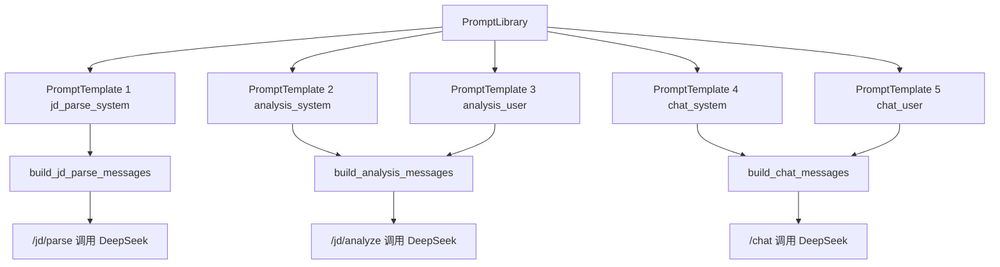
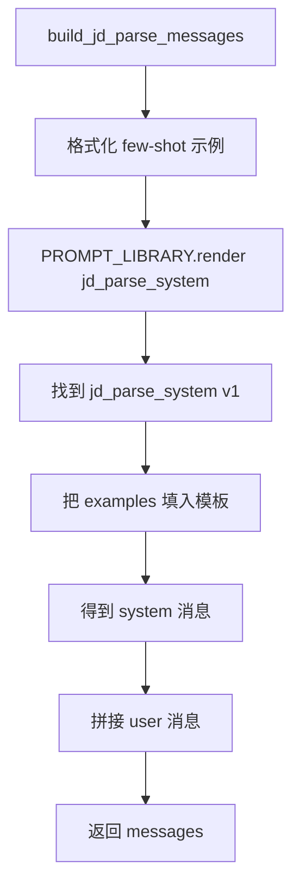
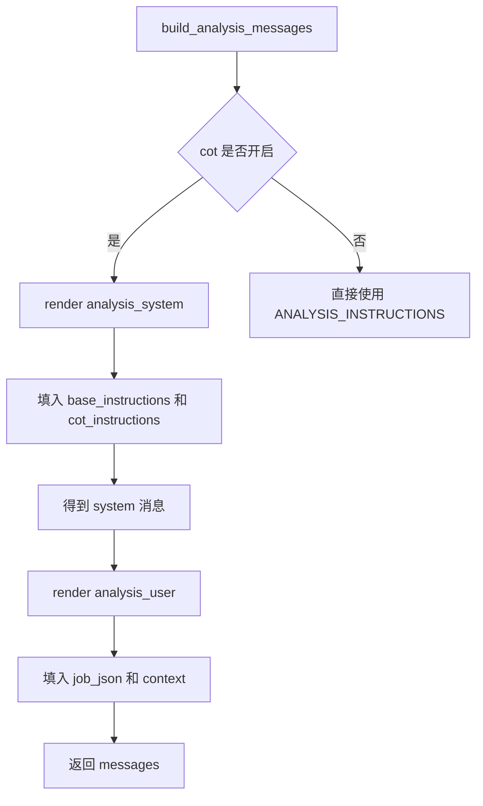
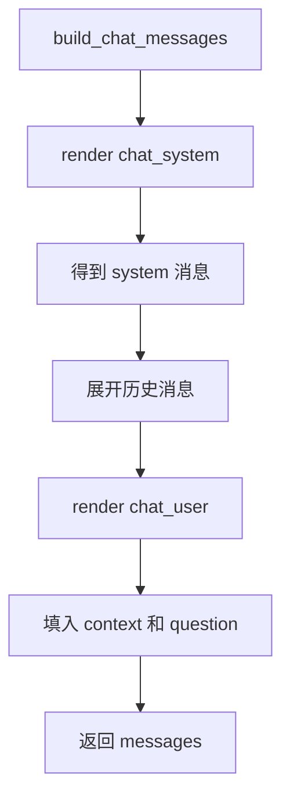

# Day 35 学习笔记

日期：2026-09-13

项目：`ai-job-agent`

目标：把 Day 30 的 Prompt 模板进一步升级成可注册、可版本化、可复用的 Prompt 库。

## 1. Day 35 做了什么

Day 30 已经把 Prompt 集中到 `app/prompts.py`。Day 35 在这个基础上增加了：

- `app/prompt_library.py`：通用的 Prompt 模板管理基础设施。
- 每个 Prompt 都有名称和版本。
- Prompt 可以带变量，渲染时再填充真实内容。
- Day 30 的 JD 解析、岗位分析、聊天 Prompt 全部注册进 `PROMPT_LIBRARY`。

现在 Prompt 的构建方式是：

```text
定义模板
        ->
注册模板
        ->
根据名称和版本找到模板
        ->
填充变量
        ->
得到最终 Prompt
```

## 2. 今天改了哪些文件

| 文件 | 变化 | 作用 |
|---|---|---|
| `app/prompt_library.py` | 新增 | 通用 Prompt 模板注册、查询和渲染 |
| `app/prompts.py` | 修改 | 注册 Prompt 模板，并改为通过模板库构建 Prompt |
| `tests/test_prompt_library.py` | 新增 | 验证模板渲染、错误处理和现有 Prompt 集成 |

## 3. 项目闭环实际流程

### 3.1 Prompt 库到业务调用



### 3.2 JD 解析 Prompt 渲染流程



### 3.3 岗位分析 Prompt 渲染流程



### 3.4 聊天 Prompt 渲染流程



## 4. 改动对应的知识点

### 4.1 什么是 Prompt 模板

Prompt 模板是“带占位符的 Prompt 骨架”。

例如：

```text
你好，{name}
```

`{name}` 是占位符，渲染时再填真实名字：

```python
template.render(name="Codex")
```

结果：

```text
你好，Codex
```

### 4.2 Prompt 名称和版本分别负责什么

Prompt 名称表示这个 Prompt 是干什么的。

例如：

- `jd_parse_system`
- `analysis_system`
- `chat_user`

Prompt 版本表示这是第几版内容。

例如：

```text
jd_parse_system:v1
jd_parse_system:v2
```

名称相同、版本不同的 Prompt 可以并存，方便做 A/B 测试和回滚。

### 4.3 `str.format()` 如何填充变量

Day 35 使用 Python 的字符串格式化：

```python
content = "岗位信息：\n{job_json}\n\n知识库：\n{context}"

content.format(
    job_json="...",
    context="...",
)
```

`{job_json}` 和 `{context}` 会被对应参数替换。

### 4.4 为什么要做成 Prompt 库

如果 Prompt 只是普通字符串，存在这些问题：

- 同一个 Prompt 可能复制到多个文件。
- 改了一个地方，另一个地方忘记改。
- 不知道项目里一共有哪些 Prompt。
- 不知道当前用的是哪个版本。

Prompt 库解决：

```text
统一登记
        ->
按名称和版本查找
        ->
统一渲染
        ->
避免散落和重复
```

### 4.5 `PromptTemplate` 在业务中负责什么

它保存一个 Prompt 的完整信息：

- 名称。
- 版本。
- 内容。
- 描述。

业务代码不直接拼接 Prompt，而是：

```python
PROMPT_LIBRARY.render(
    "jd_parse_system",
    examples=...,
)
```

这样业务代码只关心：

```text
我要哪个 Prompt
        ->
我要填哪些变量
```

### 4.6 `PromptLibrary` 在业务中负责什么

`PromptLibrary` 负责管理所有 Prompt 模板：

- 注册模板。
- 查找模板。
- 渲染模板。
- 列出模板。

它是 Prompt 的“目录”和“入口”。

### 4.7 实际生产中的对标方案

| Day 35 的做法 | 生产中的常见方案 |
|---|---|
| 名称 + 版本 | Prompt 版本号、git tag |
| `PromptTemplate` | LangChain PromptTemplate、模板引擎 |
| `PromptLibrary` | Prompt 管理平台、配置中心 |
| 变量渲染 | 模板引擎、动态配置 |
| 同名不同版本 | A/B 测试、灰度发布、版本回滚 |
| 缺失变量报错 | 模板编译错误、配置校验 |

真实项目中，Prompt 库还可能支持：

- 从数据库或配置中心加载。
- 根据语言和地区选择模板。
- 根据用户上下文动态选择模板。
- 在 CI 中验证模板变量。

Day 35 完成的是最小可用的 Prompt 库。

## 5. 核心代码逐段解释

### 5.1 `PromptTemplate`

```python
class PromptTemplate:
    def __init__(
        self,
        name: str,
        version: str,
        content: str,
        description: str = "",
    ):
        ...
        self.name = name
        self.version = version
        self.content = content
        self.description = description
```

它只是一个数据容器，保存 Prompt 的元信息。

### 5.2 `PromptTemplate.render()`

```python
def render(self, **variables) -> str:
    try:
        return self.content.format(**variables)
    except KeyError as exc:
        raise PromptLibraryError(
            f"渲染 Prompt {self.name} 缺少变量: {exc}"
        ) from exc
```

如果模板需要 `{name}`，但调用时没有传 `name`，`str.format()` 会抛 `KeyError`。

Day 35 把这个错误转成更清晰的 `PromptLibraryError`。

### 5.3 `PromptLibrary.register()`

```python
def register(self, template: PromptTemplate) -> None:
    key = (template.name, template.version)

    if key in self._templates:
        raise PromptLibraryError(...)

    self._templates[key] = template
```

字典的 key 是 `(name, version)`。

这样可以同时存在：

```text
greeting:v1
greeting:v2
```

但同一个名称和版本不能重复注册。

### 5.4 `PromptLibrary.get()`

```python
def get(self, prompt_name: str, version: str = "v1") -> PromptTemplate:
    template = self._templates.get((prompt_name, version))

    if template is None:
        raise PromptLibraryError(f"未知 Prompt：{prompt_name}:{version}")

    return template
```

`prompt_name` 是 Prompt 名称，`version` 默认是 `v1`。

### 5.5 `PromptLibrary.render()`

```python
def render(
    self,
    prompt_name: str,
    version: str = "v1",
    **variables,
) -> str:
    return self.get(prompt_name, version).render(**variables)
```

它先根据名称和版本找到模板，再填充变量。

注意这里参数名是 `prompt_name`，不是 `name`。

原因会在报错章节解释。

### 5.6 `app/prompts.py` 如何注册模板

```python
PROMPT_LIBRARY = PromptLibrary()

PROMPT_LIBRARY.register(
    PromptTemplate(
        name="jd_parse_system",
        version="v1",
        description="JD 解析系统提示",
        content=(
            JD_PARSE_INSTRUCTIONS
            + "\n\n以下示例只用于说明格式，不要照搬示例内容。\n{examples}"
        ),
    )
)
```

这里把原来手动拼接的逻辑拆成了：

1. 固定指令。
2. 一个 `{examples}` 占位符。

渲染时再填 few-shot 示例。

## 6. 测试验证了什么

### 6.1 变量渲染

```python
def test_render_replaces_variables():
    library = make_library()

    assert library.render("greeting", name="Codex") == "你好，Codex"
```

验证 `{name}` 能被替换。

### 6.2 缺失变量

```python
def test_render_raises_when_variable_missing():
    with pytest.raises(PromptLibraryError, match="缺少变量"):
        library.render("greeting")
```

验证缺少变量时给出清晰错误。

### 6.3 未知 Prompt

```python
def test_get_unknown_template_raises():
    with pytest.raises(PromptLibraryError, match="未知 Prompt"):
        library.render("not-exist")
```

验证查询不存在 Prompt 时不会返回 `None`。

### 6.4 重复注册

```python
def test_duplicate_registration_raises():
    with pytest.raises(PromptLibraryError, match="已存在"):
        library.register(...)
```

验证同名同版本不能重复注册。

### 6.5 Day 30 模板全部注册

```python
def test_prompt_library_has_day30_templates():
    assert PROMPT_LIBRARY.get("jd_parse_system").version == "v1"
    ...
```

确认五个 Prompt 都已进入 `PROMPT_LIBRARY`。

### 6.6 JD 解析集成

```python
def test_build_jd_parse_messages_uses_library():
    messages = build_jd_parse_messages("测试 JD")

    assert "示例" in messages[0]["content"]
```

验证 `build_jd_parse_messages` 仍然能生成带 few-shot 示例的 Prompt。

### 6.7 岗位分析集成

```python
def test_build_analysis_messages_uses_library():
    ...
    assert "先完成以下思考" in messages[0]["content"]
    assert "RAG 上下文" in messages[1]["content"]
```

验证 CoT 和知识库上下文仍能正确填充。

### 6.8 聊天集成

```python
def test_build_chat_messages_uses_library():
    ...
    assert "知识库上下文" in messages[2]["content"]
    assert "当前问题" in messages[2]["content"]
```

验证聊天历史、知识库和当前问题的顺序没有回退。

## 7. 相关报错和原因

### 7.1 `TypeError: PromptLibrary.render() got multiple values for argument 'name'`

这是 Day 35 开发过程中真实出现的错误。

原来的代码是：

```python
def render(
    self,
    name: str,
    version: str = "v1",
    **variables,
) -> str:
```

测试调用：

```python
library.render("greeting", name="Codex")
```

这里的冲突是：

- `"greeting"` 会传给位置参数 `name`。
- `name="Codex"` 又作为关键字参数传给 `name`。
- Python 无法判断 `name` 到底是 `"greeting"` 还是 `"Codex"`。

解决：

把第一个参数改名成 `prompt_name`：

```python
def render(
    self,
    prompt_name: str,
    version: str = "v1",
    **variables,
) -> str:
    return self.get(prompt_name, version).render(**variables)
```

这样 `name="Codex"` 会被识别为模板变量，而不是方法参数。

### 7.2 `KeyError: 'name'`

如果模板内容是：

```python
"你好，{name}"
```

但渲染时没有传 `name`：

```python
template.render()
```

`str.format()` 会抛 `KeyError`。

Day 35 把它转成了：

```text
PromptLibraryError: 渲染 Prompt greeting 缺少变量: 'name'
```

### 7.3 `PromptLibraryError: Prompt 已存在`

原因：

```python
register(PromptTemplate(name="greeting", version="v1", ...))
register(PromptTemplate(name="greeting", version="v1", ...))
```

同一个名称和版本注册两次。

解决：

- 删除重复注册。
- 或改成不同版本，例如 `v2`。

### 7.4 `PromptLibraryError: 未知 Prompt`

原因：

```python
library.render("not-exist")
```

名称或版本不存在。

解决：

- 检查 Prompt 名称。
- 检查是否已经注册。
- 检查版本号。

### 7.5 模板中的大括号冲突

如果模板里本来就有大括号，例如：

```text
请输出 {"type": "object"}
```

`str.format()` 会把 `{...}` 当作占位符。

解决：

- 使用双大括号转义，例如 `{{"type": "object"}}`。
- 或者改用 `string.Template`。

当前项目模板没有这个问题。

### 7.6 本机 pytest 的 `uv` 缓存权限问题

解决：

```bash
UV_CACHE_DIR=/tmp/uv-cache uv run pytest -q
```

## 8. 今天的结果

运行：

```bash
UV_CACHE_DIR=/tmp/uv-cache uv run pytest -q
```

结果：

```text
146 passed
```

说明：

- Prompt 库模板注册和渲染正确。
- Day 30 的 Prompt 构造没有回退。
- 旧的模型调用、结构化输出、Agent 等测试全部通过。

## 9. 第 5 周总结

Day 29 到 Day 35 完成了：

| Day | 主题 | 核心成果 |
|---|---|---|
| Day 29 | Token 和 Context | Token 统计和上下文预算 |
| Day 30 | Prompt 模式 | few-shot 和 CoT |
| Day 31 | 结构化输出 | JSON Schema 和 Pydantic |
| Day 32 | function calling | 参数设计和错误恢复 |
| Day 33 | 模型选择 | 模型注册表和成本估算 |
| Day 34 | Prompt 评估 | 一致性和鲁棒性 |
| Day 35 | Prompt 库 | 可复用模板和版本管理 |

第 5 周达到的水平：

```text
能设计稳定、可复用、可评估的 Prompt 体系
```

## 10. 下一步

第 6 周进入 RAG 工程化，重点是：

- Chunking 深入。
- Embedding 模型对比。
- pgvector 或 Qdrant。
- 混合检索和重排。
- Query Rewriting。
- RAG 端到端评估。
- 把 RAG 接入 Agent。
