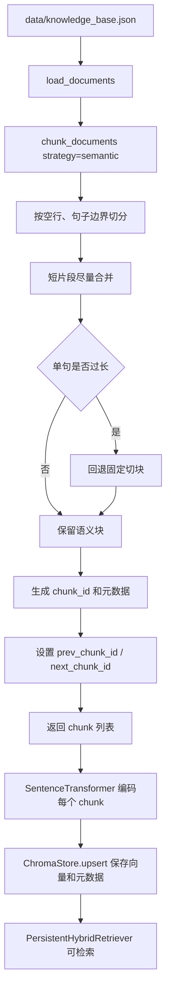
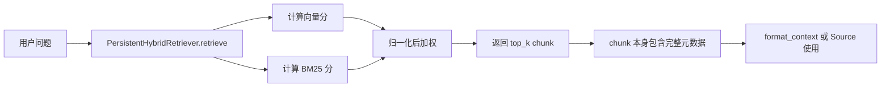

# Day 36 学习笔记

日期：2026-09-14

项目：`ai-job-agent`

目标：把 Demo 级的文本切块升级成生产可追踪的 RAG Chunking。让每个 chunk 不仅是一段文本，还能说明自己来自哪里、属于哪个章节、占多少字符和 token、内容有没有变化，以及前后 chunk 是谁。

## 1. Day 36 做了什么

Day 8 已经实现了最基本的 `chunk_documents()`。当时的目标是：

```text
长文档
  ->
切成小块
  ->
每块做 Embedding
  ->
检索时定位到具体小块
```

但 Day 8 的切块更接近 Demo：

- 固定字符切块可能会把句子切到一半。
- chunk 只有 `doc_id`、`title`、`chunk_index`，无法判断来源和版本。
- 没有 token 统计，无法估算上下文成本。
- 没有内容指纹，无法判断知识库内容是否被修改过。
- 没有 `prev_chunk_id` 和 `next_chunk_id`，无法表达 chunk 之间的顺序关系。

Day 36 做了以下升级：

- 新增语义切块 `chunk_text_semantic()`。
- 让 `chunk_documents()` 默认使用语义切块，并把默认切块参数调整为 `chunk_size=120`、`overlap=24`。
- 给每个 chunk 增加来源、章节、语言、字符数、token 数、内容 hash、前后关系等元数据。
- 让 Chroma 持久化这些新的 chunk 元数据。
- 增加 `app/chunk_cli.py`，用来在不启动服务的情况下直接检查 chunk。

## 2. 今天改了哪些文件

| 文件 | 变化 | 作用 |
|---|---|---|
| `app/chunking.py` | 修改 | 增加语义切块、内容 hash、token 统计和完整 chunk 元数据 |
| `app/vector_store.py` | 修改 | 增加元数据白名单，让 Chroma 保存更多 chunk 信息 |
| `app/rag.py` | 修改 | `build_retriever()` 默认切换到 `semantic` 策略 |
| `app/chunk_cli.py` | 新增 | 用命令行直接查看切块结果和元数据 |
| `data/knowledge_base.json` | 修改 | 给 `doc-fastapi` 补充来源、章节、类型和语言信息 |
| `tests/test_chunking_metadata.py` | 新增 | 验证语义切块、元数据、前后关系和内容 hash |

## 3. 项目闭环实际流程

### 3.1 从原始文档到可检索 chunk



实际调用顺序：

1. `build_retriever()` 从 `data/knowledge_base.json` 读取原始文档。
2. `chunk_documents()` 使用 `semantic` 策略把每篇文档切成多个 chunk。
3. 切块时优先按空行和中文标点边界切分，再尝试把短片段合并到 `chunk_size` 内。
4. 如果某个句子本身超过 `chunk_size`，就回退 `chunk_text_fixed()`，确保不丢内容。
5. 每个 chunk 生成稳定的 `chunk_id`，并补充 `source_uri`、`section`、`language` 等元数据。
6. 同一篇文档内部，设置 `prev_chunk_id` 和 `next_chunk_id`。
7. 后续 `PersistentHybridRetriever` 对每个 chunk 的 `text` 做 Embedding。
8. `ChromaStore.upsert()` 把文本、向量和元数据一起写入 Chroma。

### 3.2 检索时元数据如何被携带



检索函数仍然返回 `{"doc": chunk, "score": ...}`。但现在 `doc` 不再是只带少量字段的字典，而是带有完整生产元数据的 chunk。这样 `/chat` 返回 `sources` 时，以后也能继续扩展为展示来源、章节、语言等信息。

## 4. 改动对应的知识点

### 4.1 为什么切块不能只看“固定字符数”

Day 8 的固定切块逻辑是：

```python
text[start:end]
```

它只关心字符位置，不关心文字是否被切断。

例如：

```text
FastAPI 支持异步路由。
```

如果 `chunk_size` 刚好卡在“异步”后面，就可能切成：

```text
FastAPI 支持异步
```

和：

```text
路由。
```

第一个 chunk 语义不完整，Embedding 也会变得不稳定。

生产级 RAG 会尽量让切块发生在自然边界上，例如：

- 标题。
- 段落。
- 句子。
- Markdown 列表。
- 代码块。

Day 36 先把“空行”和“句子结束标点”作为边界。

### 4.2 什么是语义切块

语义切块的意思是：

```text
优先在语义完整的地方切开
  ->
不要把一句完整的话从中间劈开
```

Day 36 的 `chunk_text_semantic()` 做了两件事：

1. 先按空行把文本拆成块。
2. 再按句号、感叹号、问号、分号等标点把块拆成句子片段。
3. 把较短的句子片段尽量合并。
4. 如果某个句子仍然超过 `max_chars`，才回退固定切块。

它解决的是：

```text
固定切块太粗暴
  ->
句子被切断
  ->
向量表示不稳定
```

### 4.3 `_split_semantic_segments()` 在业务中负责什么

它负责把原始文本拆成“适合合并的语义片段”。

核心代码：

```python
_SENTENCE_SPLIT_RE = re.compile(r"(?<=[。！？!?；;])\s*")
```

这里的正则表达式含义是：

- `。！？!?；;` 是要找的句子结束标点。
- `(?<=...)` 是“向后看”，意思是匹配位置必须在这些标点后面。
- `\s*` 表示同时把后面的空白字符一起处理掉。

最终效果：

```text
第一句。第二句。第三句。
```

会被拆成：

```text
["第一句。", "第二句。", "第三句。"]
```

它不会吃掉句号，因为 `(?<=...)` 只描述位置，不消费句号本身。

### 4.4 为什么单句过长时还要回退固定切块

语义切块有一个边界情况：

```text
某一句没有标点，而且特别长
```

例如日志、URL、长英文单词、没有断句的文本。

如果强制不切，这个 chunk 可能超过上下文预算。所以 `chunk_text_semantic()` 里：

```python
if len(segment) > max_chars:
    chunks.extend(chunk_text_fixed(segment, max_chars, overlap_chars))
```

含义是：

```text
能按语义切就按语义切
  ->
实在切不动，就退回固定切块
  ->
保证 chunk 不会无限变长
```

这是生产系统里常见的“策略降级”。

### 4.5 `content_hash` 在业务中负责什么

`content_hash` 是内容指纹。

实现是：

```python
hashlib.sha1(text.encode("utf-8")).hexdigest()
```

它的作用是：

- 同样内容永远得到同样的 hash。
- 内容只要变一个字符，hash 就会变化。

在真实 RAG 项目中，它用于：

- 判断某个 chunk 是否被修改。
- 判断是否需要重新 Embedding。
- 判断是否需要从向量库中删除旧数据。
- 做增量索引和变更追踪。

当前 Day 36 还没有自动根据 `content_hash` 做增量更新，但先把字段建好，后面 Day 38 做向量库工程化时就可以使用。

### 4.6 `token_count` 在业务中负责什么

模型不是按字符收费，而是按 token 计费。

Day 29 已经做过上下文预算，这里在 chunk 层面补上 token 估算：

```python
def estimate_token_count(text: str) -> int:
    return len(_get_encoding().encode(text))
```

它使用 `cl100k_base` 编码。这个编码不是 DeepSeek 服务端的真实 tokenizer，但足够用来做：

- chunk 大小估算。
- 检索预算判断。
- 成本估算。

实际生产中，如果模型 API 返回了 `usage.prompt_tokens`，应该优先使用服务端真实值。没有真实值时，本地估算仍然有意义。

### 4.7 `@lru_cache` 是什么

代码里有：

```python
@lru_cache(maxsize=1)
def _get_encoding():
    return tiktoken.get_encoding("cl100k_base")
```

`lru_cache` 会把函数结果缓存起来。

如果没有缓存，每次统计 token 都会重新加载 `tiktoken` 编码对象，速度会变慢。

加了 `maxsize=1` 后：

```text
第一次调用：真正执行函数，得到编码对象
  ->
第二次及以后：直接返回缓存对象
```

这适合“结果固定不变，但创建成本较高”的函数。

### 4.8 `source_uri`、`source_type`、`section`、`language` 在业务中负责什么

| 字段 | 业务作用 |
|---|---|
| `source_uri` | 回答“这段内容来自哪个文件或链接”，用于溯源和回查 |
| `source_type` | 说明来源类型，例如 `manual`、`markdown`、`pdf`、`web` |
| `section` | 说明属于哪个章节或主题，例如 `后端`、`部署` |
| `language` | 说明语言，方便后续按语言筛选或选择不同处理策略 |

这些字段不会直接影响向量计算，但会影响检索、过滤、权限和展示。

例如生产系统可以：

```text
只检索 source_type=pdf 的合同
只检索 language=zh 的中文资料
只检索 section=后端 的文档
```

### 4.9 `prev_chunk_id` 和 `next_chunk_id` 在业务中负责什么

它们是 chunk 之间的链表关系。

例如：

```text
doc-a-0
  next -> doc-a-1

doc-a-1
  prev -> doc-a-0
  next -> doc-a-2
```

真实 RAG 中，这可以用来：

- 检索到一个 chunk 后，顺便取出它的前一段和后一段，让模型获得更完整上下文。
- 展示“相关上下文展开”。
- 判断一个文档被切成了多少段。

Day 36 只建立了字段，不改变检索逻辑。这样后续可以继续扩展。

### 4.10 为什么 Chroma 需要元数据白名单

Chroma 的 metadata 通常只接受基础类型，例如字符串、数字、布尔值。

原来的 `ChromaStore.upsert()` 只保存：

```python
{
    "doc_id": chunk["doc_id"],
    "title": chunk["title"],
    "chunk_index": chunk["chunk_index"],
}
```

Day 36 增加了 `_to_chroma_metadata()`，用白名单控制哪些字段可以进入 Chroma：

```python
if isinstance(value, (str, int, float, bool)):
    metadata[key] = value
```

这样做的原因：

- 避免把列表、字典等复杂对象传给 Chroma。
- 避免把 `None` 直接写进 metadata。
- 让数据结构更稳定，不容易因为某个 chunk 多了一个字段而报错。

### 4.11 `build_retriever()` 为什么默认使用 semantic

`app/rag.py` 现在的默认值是：

```python
def build_retriever(
    path: Path,
    strategy: str = "semantic",
    chunk_size: int = 120,
    overlap: int = 24,
)
```

含义是：

```text
项目正常运行
  ->
默认使用语义切块
  ->
但是测试或调试时仍然可以传 strategy="fixed"
```

保留 `strategy` 参数，是为了不把旧的固定切块彻底删掉。很多生产系统也会保留多种切块策略，然后通过配置选择。

## 5. Python 初学者知识点

### 5.1 `hashlib.sha1()` 和 `.hexdigest()`

```python
hashlib.sha1(text.encode("utf-8")).hexdigest()
```

拆开看：

- `text.encode("utf-8")`：把字符串转成 UTF-8 字节。
- `hashlib.sha1(...)`：创建 SHA-1 哈希对象。
- `.hexdigest()`：把哈希结果转成十六进制字符串。

`content_hash("abc")` 会得到一个 40 个字符长的字符串。

### 5.2 `re.compile()` 和正则表达式

```python
_SENTENCE_SPLIT_RE = re.compile(r"(?<=[。！？!?；;])\s*")
```

`re.compile()` 会把正则表达式预先编译，后面可以重复使用。

`r"..."` 是 raw string，意思是反斜杠不要被 Python 当成转义字符处理。这样写正则更安全。

### 5.3 `re.split()`

```python
_SENTENCE_SPLIT_RE.split("第一句。第二句。")
```

它和 `str.split()` 的区别是：

- `str.split("。")` 会丢掉分隔符“。”。
- `re.split(...)` 配合 lookbehind 可以保留“。”在原来的句子里。

### 5.4 `dict.get(key, default)`

```python
doc.get("source_uri", "")
```

含义：

- 如果字典里有 `source_uri`，就返回它。
- 如果没有，就返回默认值 `""`。

这比 `doc["source_uri"]` 更安全，因为直接取值在 key 不存在时会抛 `KeyError`。

### 5.5 `enumerate()`

```python
for index, piece in enumerate(pieces):
```

它会同时给你下标和值。

例如：

```python
for index, piece in enumerate(["a", "b", "c"]):
    print(index, piece)
```

输出：

```text
0 a
1 b
2 c
```

### 5.6 `isinstance()`

```python
isinstance(value, (str, int, float, bool))
```

它判断 `value` 是不是这些类型中的某一个。

在 Day 36 中，它用来保证写入 Chroma 的 metadata 都是基础类型。

### 5.7 `lru_cache`

```python
@lru_cache(maxsize=1)
def _get_encoding():
    ...
```

`@` 是装饰器。它会改变函数行为，让函数结果被缓存。

`maxsize=1` 表示最多缓存一个结果。

## 6. 实际生产中的对标方案

| Day 36 的做法 | 生产中的常见方案 |
|---|---|
| 语义切块 | LangChain RecursiveCharacterTextSplitter、Unstructured、LlamaIndex 的 semantic chunker |
| 固定切块回退 | 超长文本的 fallback 切块策略 |
| `content_hash` | 内容指纹、对象存储 ETag、数据库 checksum |
| `token_count` | 模型 API 返回的 `usage.prompt_tokens` |
| `source_uri` | 文档来源 URI、对象存储 key、数据库主键 |
| `section` | 文档结构解析、目录树、章节编号 |
| `prev_chunk_id` / `next_chunk_id` | 邻接关系、知识图谱边、上下文扩展索引 |
| Chroma metadata 白名单 | 向量库 schema、Pydantic 校验、数据合同 |
| `chunking_version` | ingestion pipeline 版本号、schema migration |
| 手动查看 chunk CLI | 数据质量面板、ingestion 调试工具 |

真实生产项目中，chunking 通常不在请求路径里实时做，而是在单独的 ingestion pipeline 中执行：

```text
数据源
  ->
抓取或上传
  ->
解析文档
  ->
chunking
  ->
embedding
  ->
写入向量库
  ->
记录 ingestion 状态
```

Day 36 仍把 chunking 放在 `build_retriever()` 里，适合当前学习项目。后续进入第 9 周后端工程或第 10 周生产化时，再把它拆成独立的 ingestion 任务。

## 7. 相关报错及原因

### 7.1 `ModuleNotFoundError: No module named 'tiktoken'`

现象：

```text
ModuleNotFoundError: No module named 'tiktoken'
```

原因：

`app/chunking.py` 里新增了：

```python
import tiktoken
```

但当前虚拟环境没有安装 `tiktoken`。

解决：

```bash
uv add tiktoken
```

再运行：

```bash
uv run pytest -q
```

### 7.2 `ValueError: overlap_chars 必须小于 max_chars`

现象：

```text
ValueError: overlap_chars 必须小于 max_chars
```

原因：

如果 `overlap_chars >= max_chars`，下一块回退的位置可能不前进，甚至往前越界，导致死循环或重叠逻辑错误。

解决：

检查调用参数，保证：

```text
overlap_chars < max_chars
```

例如：

```python
chunk_text_semantic(text, max_chars=120, overlap_chars=24)
```

是合法的。

### 7.3 Chroma metadata 报“expected str, int, float or bool”

现象：

```text
Expected metadata value to be a str, int, float or bool
```

原因：

Chroma 的 metadata 不接受 `None`、列表或字典。

Day 36 之前，如果直接把 `prev_chunk_id=None` 写进 metadata，就可能触发类似问题。

解决：

`_to_chroma_metadata()` 中已经做了两件事：

- 跳过 `None`。
- 非基础类型转成字符串。

如果仍然报错，检查是否把整个 chunk 字典直接传给了 Chroma，而不是只传转换后的 metadata。

### 7.4 `data/chroma/` 还是旧数据

现象：

代码已经改成新版本，但通过 `chunk_cli` 或检索看到的内容没有新的元数据。

原因：

`PersistentHybridRetriever` 会先检查 Chroma 里是否已经有当前 chunk 的 id。

如果 chunk id 没变，它会直接加载旧向量，不会重新执行 `upsert()`。

这会导致：

```text
代码升级了
  ->
chunk 结构升级了
  ->
但 Chroma 里还是旧 metadata
```

解决：

开发阶段可以重命名或删除 `data/chroma/`，让服务重新生成：

```bash
rm -rf data/chroma
```

实际生产中不能靠手动删目录，应该根据 `chunking_version` 或 ingestion manifest 自动判断是否需要重建索引。

### 7.5 语义切块测试看起来“没有切”

现象：

传入很长的中文句子，但 `chunk_text_semantic()` 只返回一个很大的 chunk。

原因：

语义切块只在句子标点或空行处切开。

如果一整段没有句号、问号、感叹号、分号，代码会把它当成一个超长 segment，然后才回退固定切块。

如果回退逻辑没有生效，要检查是否满足：

```text
len(segment) > max_chars
```

例如：

```python
text = "没有标点的超长文本" * 10
chunks = chunk_text_semantic(text, max_chars=20, overlap_chars=4)
```

这里 `segment` 很长，应该会进入固定切块分支。

### 7.6 `token_count` 和 DeepSeek 实际 token 不一致

现象：

本地统计的 `token_count` 和 DeepSeek 返回的 `usage.prompt_tokens` 不同。

原因：

本项目使用 `cl100k_base` 做估算，它不是 DeepSeek 服务端完整 tokenizer。

解决：

把 `token_count` 当作应用层估算值，不要当成绝对准确值。生产系统应优先使用模型接口返回的真实 token 数据。

## 8. 测试为什么要这样写

`tests/test_chunking_metadata.py` 没有加载真实 Embedding 模型，也没有访问 DeepSeek 或 Chroma。

它只验证 chunking 的数据逻辑：

1. 语义切块是否保留句子边界。
2. 超长无标点文本是否回退固定切块。
3. chunk 是否携带完整元数据。
4. 前后关系是否只连接同一篇文档。
5. content hash 是否稳定且对内容敏感。

这样的测试快、稳定、不依赖网络和模型下载，适合在开发阶段频繁运行。

运行方式：

```bash
uv run pytest tests/test_chunking.py tests/test_chunking_metadata.py -q
```

确认后：

```bash
uv run pytest -q
```

查看 chunk CLI：

```bash
uv run python -m app.chunk_cli --strategy semantic --max-chars 120 --overlap 24
```

## 9. Day 36 检查清单

- [ ] 理解为什么固定字符切块不够生产级。
- [ ] 理解语义切块优先保留句子边界。
- [ ] 理解单句过长时为什么要回退固定切块。
- [ ] 理解 `content_hash`、`token_count`、`source_uri`、`section` 的作用。
- [ ] 理解 `prev_chunk_id` 和 `next_chunk_id` 的作用。
- [ ] 理解 Chroma metadata 白名单的作用。
- [ ] 知道 `data/chroma/` 旧数据可能导致新元数据不生效。
- [ ] `tests/test_chunking_metadata.py` 已创建并通过。
- [ ] 全量测试通过。

## 10. 明天要做什么

Day 37 进入 Embedding 模型对比：

- 对比中文、多语言和不同规模的 Embedding 模型。
- 理解模型维度、成本、延迟和检索质量。
- 把 Embedding 模型也抽象成可配置能力，而不是直接写死 `BAAI/bge-small-zh-v1.5`。
