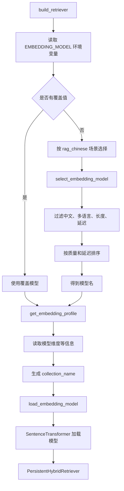
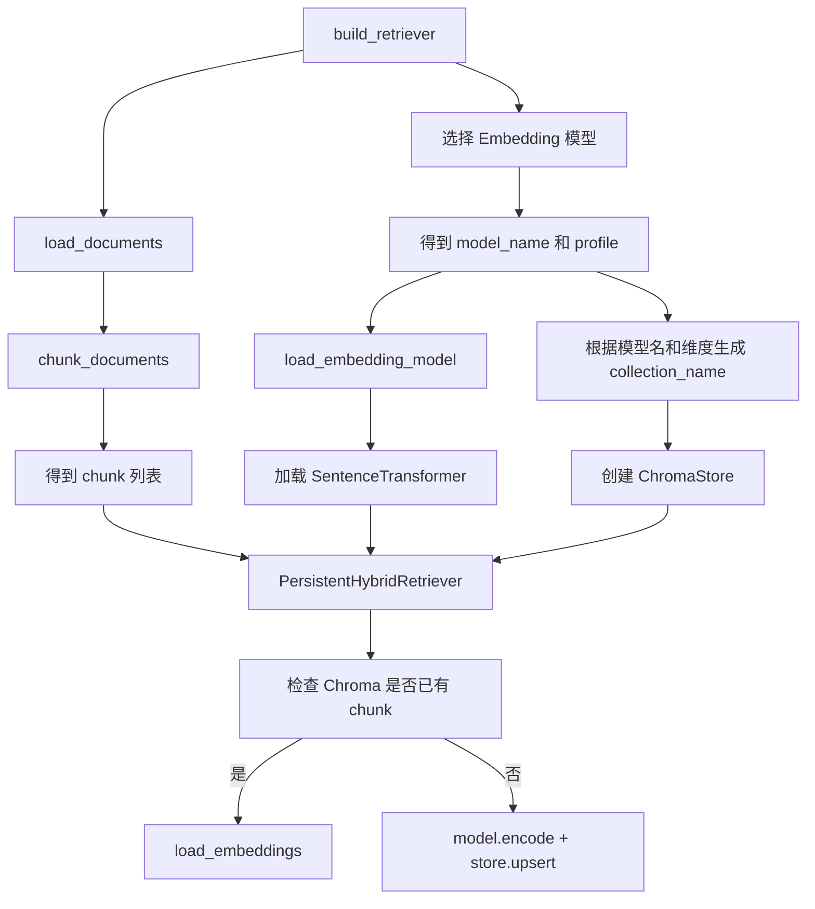

# Day 37 学习笔记

日期：2026-09-14

项目：`ai-job-agent`

目标：把 Embedding 模型从“代码里写死一个模型”，升级成“可配置、可选择、可对比、可隔离”的生产级 Embedding 注册表。

## 1. Day 37 做了什么

Day 36 完成了生产级 chunking。Day 37 要解决的是另一个问题：

```text
RAG 需要 Embedding 模型
  ->
但不同的业务场景需要不同的模型
  ->
不能每次换模型都去改业务代码
```

Day 37 之前，项目里直接写：

```python
DEFAULT_EMBEDDING_MODEL = "BAAI/bge-small-zh-v1.5"
```

这个写法的缺点是：

- 所有场景只能用一个模型。
- 不知道模型输出多少维。
- 不知道模型最大能处理多少 token。
- 不知道它是否适合多语言或长文本。
- 切换模型后，如果维度不同，Chroma 会报错。

Day 37 新增了：

- `app/embedding_registry.py`：登记 Embedding 模型信息，并按场景选择模型。
- `app/embedding_cli.py`：用来列出模型、查看模型信息、编码一段文本。
- `app/rag.py` 的改造：不再写死模型，而是从注册表选择，并按模型和维度生成 Chroma collection。
- `tests/test_embedding_registry.py`：验证模型选择和元数据。

## 2. 今天改了哪些文件

| 文件 | 变化 | 作用 |
|---|---|---|
| `app/embedding_registry.py` | 新增 | 定义 Embedding 模型注册表、模型选择、模型加载 |
| `app/embedding_cli.py` | 新增 | 用命令行查看模型信息并编码文本 |
| `app/rag.py` | 修改 | 使用注册表选择模型，并按模型生成独立 collection |
| `tests/test_embedding_registry.py` | 新增 | 验证模型选择和错误处理 |

## 3. 项目闭环实际流程

### 3.1 从场景到 Embedding 模型



### 3.2 检索启动流程



关键变化是：

```text
原来：build_retriever 直接使用写死的模型
  ->
现在：先根据场景和环境变量选模型
  ->
再根据模型维度生成 collection
  ->
最后才加载模型和向量库
```

## 4. 改动对应的知识点

### 4.1 为什么不能把 Embedding 模型写死

Embedding 模型不是“永远用最贵最强的模型就好”。

不同 RAG 场景对模型的要求不同：

```text
中文知识库
  ->
需要中文能力强

多语言知识库
  ->
需要 multilingual

长文档
  ->
需要 max_sequence_length 足够长

高并发或低延迟场景
  ->
需要模型小、维度低、推理快
```

如果写死一个模型，就无法根据场景平衡质量和成本。

### 4.2 `EmbeddingProfile` 在业务中负责什么

`EmbeddingProfile` 是一个数据合同，用来描述一个 Embedding 模型“能做什么”。

核心字段：

| 字段 | 业务含义 |
|---|---|
| `name` | 从 Hugging Face 加载模型时使用的名称 |
| `provider` | 模型提供方，例如 BAAI |
| `dimension` | 向量维度，影响存储和计算成本 |
| `max_sequence_length` | 单条文本最多处理多少 token |
| `supports_chinese` | 是否适合中文检索 |
| `supports_multilingual` | 是否适合多语言混合检索 |
| `normalize_embeddings` | 是否需要归一化向量 |
| `latency` | 响应快慢等级 |
| `quality_tier` | 检索质量等级 |
| `languages` | 支持的语言标签 |

业务代码不再直接关心具体模型名，而是关心：

```text
我需要一个中文、低延迟、质量还不错的 Embedding 模型
```

### 4.3 `dimension` 在业务中负责什么

`dimension` 是模型把一段文本转成多少维的向量。

例如：

```text
BAAI/bge-small-zh-v1.5：512 维
BAAI/bge-m3：1024 维
MiniLM：384 维
```

维度越高，理论上表达能力可能更强，但：

- 存储更大。
- 计算更慢。
- 向量检索成本更高。

因此生产系统不会盲目追求高维度。

### 4.4 `max_sequence_length` 在业务中负责什么

模型不是无限长度输入。

例如：

```text
MiniLM：最大约 128 token
bge-small-zh-v1.5：最大约 512 token
bge-m3：最大约 8192 token
```

如果 chunk 很长，但模型只支持 128 token，那么超出部分可能被截断，检索效果会变差。

Day 37 把 `max_sequence_length` 登记在模型信息里，方便后续判断：

```text
这个模型能不能处理当前 chunk
```

### 4.5 `normalize_embeddings` 在业务中负责什么

归一化是让向量长度变成 1。

本项目检索时使用：

```python
self.doc_embeddings @ query_embedding
```

这是点积。

如果两个向量都归一化，点积就等价于余弦相似度，分数更容易解释。

Day 37 注册的三个模型都设置：

```python
normalize_embeddings=True
```

所以当前代码可以继续使用点积计算相似度。

### 4.6 `supports_chinese` 和 `supports_multilingual` 分别负责什么

它们用来回答两个不同的问题：

```text
supports_chinese：
这个模型是否适合中文检索？

supports_multilingual：
这个模型是否适合中英或多语言混合检索？
```

例如：

```text
bge-small-zh-v1.5 适合中文
bge-m3 适合中文和多语言
MiniLM 也支持多语言，但质量较弱
```

### 4.7 `latency` 和 `quality_tier` 在业务中负责什么

`latency` 描述响应快慢。

`quality_tier` 描述检索质量高低。

生产系统很少只看一个指标，而是同时看：

```text
这个场景能不能接受中延迟？
  ->
如果能，优先选质量更高的模型

这个场景是否必须低延迟？
  ->
如果是，优先选小模型
```

Day 37 的选择函数通过 `prefer_quality` 控制这个偏好。

### 4.8 `select_embedding_model()` 是如何工作的

它先根据场景条件过滤：

```text
是否要求中文
是否要求多语言
最大长度是否满足
延迟是否满足
```

过滤完成后：

```text
如果 prefer_quality=True
  ->
先按质量从高到低
  ->
再按延迟从低到高
  ->
再按维度从小到大

如果 prefer_quality=False
  ->
先按延迟从低到高
  ->
再按维度从小到大
```

这就是为什么：

```text
rag_chinese 会选择 bge-small-zh-v1.5
rag_multilingual 会选择 bge-m3
rag_low_latency 会选择 MiniLM
rag_long_documents 会选择 bge-m3
```

### 4.9 为什么需要环境变量覆盖

自动选择很好，但生产环境需要灵活切换模型。

`get_embedding_model_name()` 的逻辑是：

```python
if override:
    return override

return select_embedding_model(scenario)
```

如果设置：

```text
EMBEDDING_MODEL=BAAI/bge-m3
```

那么自动选择暂时失效，系统优先使用 `BAAI/bge-m3`。

这个能力适合：

- 本地调试。
- A/B 测试。
- 紧急切换模型。

### 4.10 为什么不同模型要使用不同 Chroma collection

Chroma 的 collection 创建后，向量维度是固定的。

如果：

```text
第一次使用 512 维模型写入 collection
  ->
后来切换到 1024 维模型
  ->
还访问同一个 collection
```

就会报维度不匹配。

Day 37 使用：

```python
def _collection_name_for_model(model_name: str, dimension: int) -> str:
    digest = hashlib.sha1(model_name.encode("utf-8")).hexdigest()[:8]
    return f"job_knowledge_{dimension}_{digest}"
```

这样：

```text
模型不同
  ->
collection 不同

维度不同
  ->
collection 不同
```

不同模型的数据互相隔离。

### 4.11 `load_embedding_model()` 为什么使用 `lru_cache`

代码里：

```python
@lru_cache(maxsize=8)
def load_embedding_model(name: str) -> SentenceTransformer:
    get_embedding_profile(name)
    return SentenceTransformer(name)
```

`SentenceTransformer(name)` 会加载模型，耗时较长。

`lru_cache` 会把同一个模型名对应的模型对象缓存起来，避免重复加载。

`maxsize=8` 表示最多缓存 8 个不同的模型。

### 4.12 `embedding_cli.py` 在业务中负责什么

它不参与 Web 服务，而是一个开发工具。

主要用途：

- 列出注册表中所有模型。
- 查看模型的维度、最大长度、延迟。
- 编码一段文本，确认模型是否正常加载。

运行：

```bash
uv run python -m app.embedding_cli --list
```

或：

```bash
uv run python -m app.embedding_cli --model "BAAI/bge-small-zh-v1.5"
```

## 5. Python 初学者知识点

### 5.1 `Literal`

```python
EmbeddingScenario = Literal[
    "rag_chinese",
    "rag_multilingual",
    "rag_long_documents",
    "rag_low_latency",
]
```

`Literal` 是类型提示，表示这个值只能是括号里的某几个字符串。

它不是运行时强制限制，但能帮助开发者和 IDE 发现拼写错误。

### 5.2 `@dataclass(frozen=True)`

```python
@dataclass(frozen=True)
class EmbeddingProfile:
    ...
```

`dataclass` 会自动生成 `__init__`。

`frozen=True` 表示对象创建后不能修改字段，类似一个不可变数据对象。

这样模型信息不会被意外改坏。

### 5.3 `dict.get()`

```python
requirements = EMBEDDING_REQUIREMENTS.get(scenario)
```

如果 key 不存在，`get()` 返回 `None`，不会像 `requirements[scenario]` 那样直接抛 `KeyError`。

### 5.4 `min(candidates, key=...)`

```python
min(
    candidates,
    key=lambda profile: (
        LATENCY_ORDER[profile.latency],
        profile.dimension,
    ),
)
```

`min()` 本身是找最小值。

`key` 参数告诉 Python 按什么规则比较。

例如：

```text
先比较 latency 对应的数字
  ->
latency 相同时再比较 dimension
```

### 5.5 `lru_cache`

```python
@lru_cache(maxsize=8)
def load_embedding_model(name):
    ...
```

`@` 是装饰器。

它会把函数结果缓存起来，下次使用相同参数时直接返回旧结果，不再重复执行函数。

### 5.6 `hashlib.sha1()`

```python
hashlib.sha1(model_name.encode("utf-8")).hexdigest()[:8]
```

这里不是做安全加密，而是把模型名转成一个短且稳定的字符串，用于 collection 名称。

模型名里有斜杠，例如：

```text
BAAI/bge-m3
```

它不适合直接作为 collection 名称，所以先做 hash，再截取前 8 位。

## 6. 实际生产中的对标方案

| Day 37 的做法 | 生产中的常见方案 |
|---|---|
| `EmbeddingProfile` | 模型卡片、模型元数据表、配置中心 |
| `select_embedding_model()` | 模型路由、场景化模型选择 |
| `EMBEDDING_MODEL` 环境变量 | 配置中心、Feature Flag、A/B 测试 |
| 不同模型使用不同 collection | 模型版本隔离、向量索引版本管理 |
| `load_embedding_model()` 缓存 | 单例模型、模型预热、连接池 |
| `embedding_cli.py` | 模型调试工具、数据质量面板 |
| 本地 SentenceTransformer | 本地模型服务、vLLM、Text Embeddings Inference、API Embedding 服务 |

真实生产项目通常会把 Embedding 拆成独立服务或统一推理层，而不是每个 FastAPI 进程都直接加载一个大型模型。

例如：

```text
Embedding Service
  ->
FastAPI 或 gRPC
  ->
统一模型加载和缓存
  ->
业务代码只调用 HTTP 或 gRPC
```

Day 37 还在学习阶段，所以先把注册表做出来。后续第 9 周后端工程和第 10 周生产化时，可以继续把它拆成独立服务。

## 7. 相关报错及原因

### 7.1 `BAAI/bge-m3` 下载时报网络错误

现象：

```text
OSError: We couldn't connect to 'https://hf-mirror.com'
```

或者：

```text
FileMetadataError: Distant resource does not seem to be on huggingface.co
```

原因：

`BAAI/bge-m3` 还没有下载到本地缓存。

`SentenceTransformer` 尝试从配置的 `HF_ENDPOINT` 下载模型文件，但当前网络无法访问这个地址。

解决：

先确认镜像站是否可以访问：

```bash
curl -I -L --max-time 20 https://hf-mirror.com
```

如果可以访问：

```bash
export HF_ENDPOINT=https://hf-mirror.com
uv run python -m app.embedding_cli --model "BAAI/bge-m3"
```

如果镜像站也无法访问，就先用已经缓存的模型：

```bash
uv run python -m app.embedding_cli --model "BAAI/bge-small-zh-v1.5"
```

生产系统不会在服务启动时现场下载模型，而会提前把模型文件放进镜像或本地缓存。

### 7.2 `EmbeddingRegistryError: 未知 Embedding 场景`

原因：

`select_embedding_model()` 不认识传入的场景名。

解决：

检查场景名是否为：

```text
rag_chinese
rag_multilingual
rag_long_documents
rag_low_latency
```

### 7.3 `EmbeddingRegistryError: 未知 Embedding 模型`

原因：

`EMBEDDING_MODEL` 环境变量写错，或者传入的模型名不在注册表中。

解决：

先运行：

```bash
uv run python -m app.embedding_cli --list
```

对照注册表中的模型名。

### 7.4 Chroma 维度不匹配

现象：

```text
Embedding dimension X does not match collection dimensionality Y
```

原因：

Chroma collection 创建后，向量维度是固定的。

如果切换了不同维度的模型，还访问同一个 collection，就会报错。

Day 37 使用模型名和维度生成 collection 名称来隔离模型。

如果仍然出现这个错误，通常是因为旧的 `data/chroma/` 数据和新代码冲突。

开发阶段可以重命名或删除旧的 Chroma 数据重建，但生产环境不能直接删库，需要通过配置和迁移管理。

### 7.5 长文本被模型截断

现象：

长 chunk 编码没有报错，但检索结果变差。

原因：

每个 Embedding 模型都有 `max_sequence_length`。

超过这个长度，模型可能只处理前 N 个 token，后面的内容被忽略。

解决：

选择 `max_sequence_length` 更长的模型，或者在 Day 36 的 chunking 阶段控制 chunk 大小。

### 7.6 向量没有归一化导致分数不对

现象：

相似度分数范围奇怪，或者排序不稳定。

原因：

如果模型输出没有归一化，点积不等于余弦相似度。

解决：

确认 `EmbeddingProfile.normalize_embeddings` 为 `True`，并在 `encode()` 时传入：

```python
normalize_embeddings=True
```

### 7.7 环境变量写了但没生效

现象：

明明写了：

```text
EMBEDDING_MODEL=BAAI/bge-m3
```

但代码还是选择 `bge-small-zh-v1.5`。

原因：

可能原因有：

- 修改 `.env` 后没有重启进程。
- 运行环境没有加载 `.env`。
- 代码中显式传入了 `embedding_model`，优先级高于环境变量。

解决：

检查代码调用：

```python
build_retriever(..., embedding_model=None)
```

并确认进程重新启动。

## 8. 测试为什么要这样写

`tests/test_embedding_registry.py` 没有加载真实模型，也没有访问网络。

它只验证：

1. 中文场景选择正确模型。
2. 多语言场景选择正确模型。
3. 低延迟场景选择低维模型。
4. 长文本场景选择长上下文模型。
5. 显式覆盖优先于自动选择。
6. 模型元数据完整。
7. 未知场景和未知模型能正确报错。

这样测试速度快、稳定，适合频繁运行。

运行方式：

```bash
uv run pytest tests/test_embedding_registry.py -q
```

确认后：

```bash
uv run pytest -q
```

查看模型列表：

```bash
uv run python -m app.embedding_cli --list
```

## 9. Day 37 检查清单

- [ ] 理解为什么不能把 Embedding 模型写死。
- [ ] 理解 `EmbeddingProfile` 每个字段的业务含义。
- [ ] 理解 `dimension` 对存储和计算的影响。
- [ ] 理解 `max_sequence_length` 对长文本的影响。
- [ ] 理解 `normalize_embeddings` 对相似度计算的影响。
- [ ] 理解中文、多语言、延迟、质量分别影响什么场景。
- [ ] 理解环境变量覆盖的优先级。
- [ ] 理解为什么不同模型要使用不同 collection。
- [ ] 知道 `BAAI/bge-m3` 网络下载失败的原因。
- [ ] `tests/test_embedding_registry.py` 已创建并通过。
- [ ] 全量测试通过。

## 10. 明天要做什么

Day 38 进入 pgvector 或 Qdrant：

- 对比 Chroma、pgvector、Qdrant 的区别。
- 理解向量索引、过滤和持久化。
- 学习生产环境中向量库的迁移和重建机制。
