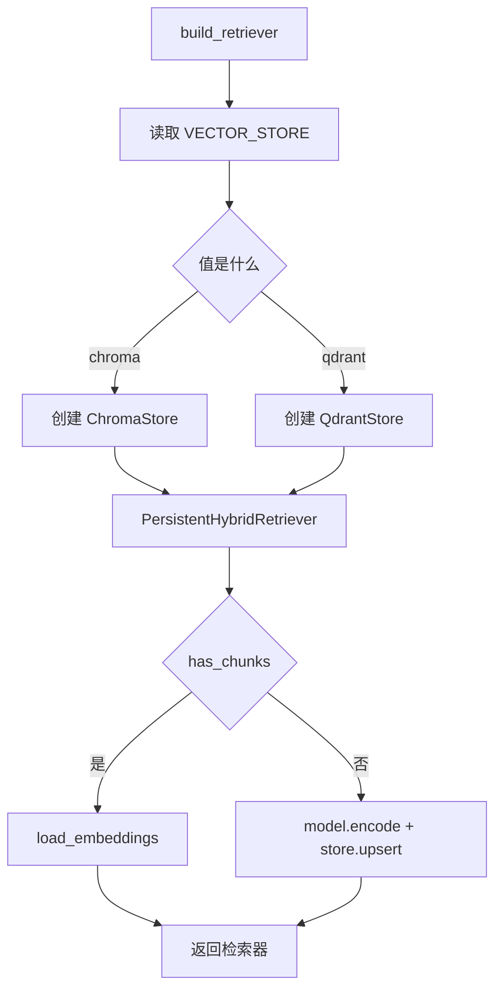
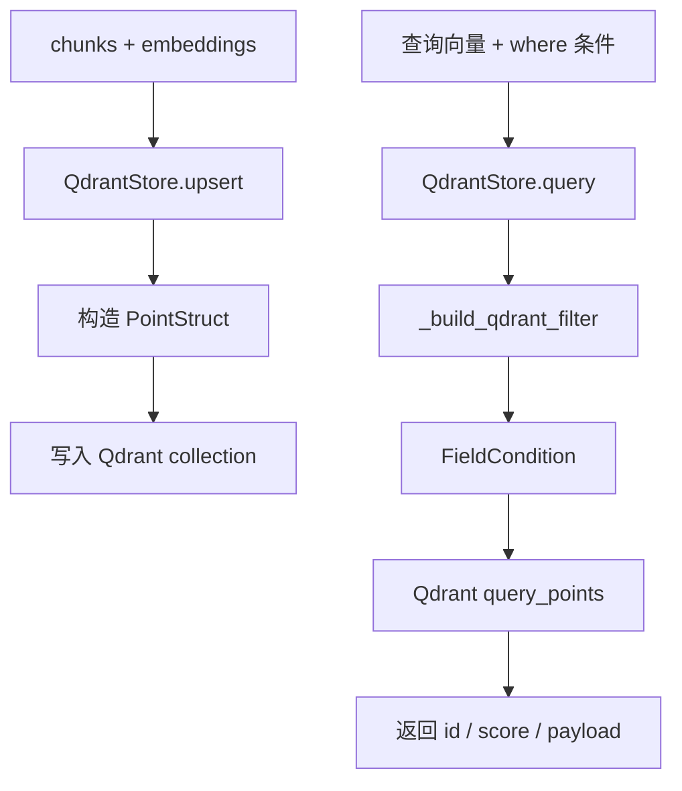

# Day 38 学习笔记

日期：2026-09-14

项目：`ai-job-agent`

目标：把向量库从“只能使用 Chroma”升级成“可以通过配置在 Chroma 和 Qdrant 之间切换”的生产级向量库适配层。

## 1. Day 38 做了什么

Day 10 第一次引入 Chroma，当时的目标是：

```text
向量不要每次重启都重新计算
  ->
把向量和元数据保存到本地
```

Chroma 很适合学习阶段，但真实项目通常需要独立向量数据库服务。

Day 38 做了四件事：

1. 定义统一的 `VectorStore` 协议。
2. 保留 `ChromaStore` 实现。
3. 新增 `QdrantStore` 实现。
4. 增加 `build_vector_store()` 工厂函数，根据 `VECTOR_STORE` 环境变量选择向量库。

同时增加：

- `app/vector_store_cli.py`：用来检查当前会创建哪种向量库。
- `docker-compose.yml` 中的 Qdrant 服务。
- `tests/test_vector_store_helpers.py`：验证 Qdrant 相关逻辑。

## 2. 今天改了哪些文件

| 文件 | 变化 | 作用 |
|---|---|---|
| `app/vector_store.py` | 修改 | 增加 `VectorStore` 协议、`QdrantStore`、工厂函数和过滤转换 |
| `app/rag.py` | 修改 | `build_retriever()` 根据环境变量选择向量库 |
| `app/vector_store_cli.py` | 新增 | 用命令行查看会创建哪种向量库 |
| `docker-compose.yml` | 修改 | 增加 Qdrant 服务 |
| `pyproject.toml` | 修改 | 增加 `qdrant-client` 依赖 |
| `tests/test_persistent_retriever.py` | 修改 | FakeStore 增加 `has_chunks()` |
| `tests/test_vector_store_helpers.py` | 新增 | 验证 Qdrant payload、过滤、读写逻辑 |

## 3. 项目闭环实际流程

### 3.1 向量库选择流程



实际调用顺序：

1. `build_retriever()` 读取 `VECTOR_STORE`。
2. 如果值是 `chroma`，创建本地 `ChromaStore`。
3. 如果值是 `qdrant`，创建远程或本地 `QdrantStore`。
4. `PersistentHybridRetriever` 检查当前 chunk 是否已经存在于向量库。
5. 如果存在，直接读取向量。
6. 如果不存在，先用 Embedding 模型编码，再写入向量库。

### 3.2 Qdrant 写入和查询



Qdrant 里每条向量数据叫一个 Point。

Point 主要由三部分组成：

```text
id：唯一标识，本项目中是 chunk_id
vector：Embedding 向量
payload：元数据，例如 title、section、source_type
```

## 4. 改动对应的知识点

### 4.1 为什么需要 `VectorStore` 协议

协议是一种约定。

它告诉调用方：

```text
无论底层是 Chroma、Qdrant 还是 pgvector
  ->
都必须提供 upsert、load_embeddings、has_chunks、query 这些能力
```

这样 `PersistentHybridRetriever` 不需要知道具体是哪个向量库。

例如它只需要写：

```python
if self.store.has_chunks(chunk_ids):
    ...
```

而不用写：

```python
if isinstance(self.store, ChromaStore):
    ...
elif isinstance(self.store, QdrantStore):
    ...
```

这就是面向接口编程的基本思想。

### 4.2 `ChromaStore` 在业务中负责什么

`ChromaStore` 负责本地 Chroma 数据的写入、读取、判断和查询。

它适合：

- 本地开发。
- 数据量不大的原型。
- 不想额外启动数据库服务时。

缺点是：

- 通常和 Python 进程紧密耦合。
- 不适合多实例共享。
- 生产扩展能力弱。

### 4.3 `QdrantStore` 在业务中负责什么

`QdrantStore` 负责和独立的 Qdrant 服务交互。

它适合：

- 生产环境。
- 多个服务实例共享同一个向量库。
- 需要元数据过滤。
- 需要更好的扩展能力。

### 4.4 Chroma、pgvector、Qdrant 有什么区别

| 向量库 | 特点 | 适合场景 |
|---|---|---|
| Chroma | 嵌入式、简单 | 本地原型、小数据量 |
| pgvector | PostgreSQL 插件 | 公司已有 PostgreSQL，需要 SQL 和向量混合查询 |
| Qdrant | 独立向量数据库 | 生产级 RAG、过滤、扩展 |

Day 38 选择 Qdrant，是因为它作为独立向量数据库最直接。

### 4.5 `collection` 在业务中负责什么

Collection 可以理解成“一个向量数据表”。

同一个项目可以有不同的 collection：

```text
中文知识库 collection
英文知识库 collection
不同 Embedding 模型 collection
```

Day 37 已经根据模型名和维度生成 collection 名称。

Day 38 进一步让 QdrantStore 负责 collection 的创建和管理。

### 4.6 `dimension` 为什么要在 QdrantStore 中明确传入

Qdrant 创建 collection 时必须知道向量维度：

```python
vectors_config=VectorParams(
    size=self.dimension,
    distance=Distance.COSINE,
)
```

因为：

```text
collection 创建后
  ->
向量维度不能随便改变
```

如果 Embedding 模型是 512 维，就必须创建 512 维的 collection。

### 4.7 `Distance.COSINE` 在业务中负责什么

它表示 Qdrant 使用余弦距离来比较向量。

本项目之前的 Chroma 也配置了：

```python
metadata={"hnsw:space": "cosine"}
```

两者保持一致，确保检索语义不会因为切换向量库而突然变化。

### 4.8 `payload` 在业务中负责什么

Qdrant 的 payload 用来保存业务元数据。

例如：

```python
{
  "doc_id": "doc-fastapi",
  "title": "FastAPI 后端开发",
  "section": "后端",
  "source_type": "manual",
  "language": "zh"
}
```

它让向量库不仅能按“向量相似度”检索，还能按“业务条件”过滤。

### 4.9 `_build_qdrant_filter()` 在业务中负责什么

它把普通的 Python 字典转换成 Qdrant 的 Filter 对象。

例如：

```python
{
    "source_type": "manual",
    "section": "后端",
}
```

会转换成：

```text
必须满足：
  source_type = manual
  并且
  section = 后端
```

这种过滤能力是生产级 RAG 的关键能力。

### 4.10 `build_vector_store()` 工厂函数在业务中负责什么

工厂函数负责：

```text
根据配置创建正确的对象
  ->
调用方不需要知道具体创建细节
```

本项目中：

```python
build_vector_store(
    store_type="qdrant",
    collection_name=collection_name,
    dimension=512,
    qdrant_url="http://localhost:6333",
)
```

会返回 `QdrantStore`。

如果以后接入 pgvector，只需要在工厂函数里增加一个分支，调用方基本不用改。

### 4.11 `vector_store_cli.py` 在业务中负责什么

它不参与服务请求，只用于开发检查。

运行：

```bash
uv run python -m app.vector_store_cli --store chroma
```

会输出：

```text
store_type=chroma
collection_name=job_knowledge
store_class=ChromaStore
```

这说明工厂函数成功创建了 `ChromaStore`。

运行：

```bash
uv run python -m app.vector_store_cli --store qdrant --dimension 512
```

会输出：

```text
store_type=qdrant
collection_name=job_knowledge
store_class=QdrantStore
```

这说明工厂函数成功创建了 `QdrantStore`。

注意，这个 CLI 只创建 store 对象，不一定真正连接 Qdrant 服务。完整检索链路还需要后续 Day 39 继续接入。

## 5. Python 初学者知识点

### 5.1 `Protocol`

```python
class VectorStore(Protocol):
    def upsert(...):
        ...
```

`Protocol` 是 Python 的“结构型协议”。

它不要求某个类显式继承它，只要这个类提供了协议里定义的方法，就可以当作该协议使用。

可以理解成：

```text
我不管你是什么类
  ->
只要你有 upsert、load_embeddings、has_chunks、query
  ->
就可以当 VectorStore 用
```

### 5.2 `Any`

```python
def query(...) -> Any:
    ...
```

`Any` 表示“可以是任意类型”。

这里使用 `Any`，是因为 Chroma 和 Qdrant 的查询返回结构不完全一样。

### 5.3 `zip()`

```python
for chunk, embedding in zip(chunks, embeddings):
```

`zip()` 会把两个列表一一配对：

```python
list(zip(["a", "b"], [1, 2]))
# [("a", 1), ("b", 2)]
```

### 5.4 `**kwargs`

```python
def query_points(self, **kwargs):
```

`**kwargs` 表示接收任意多个关键字参数，并保存成一个字典。

在测试的 FakeQdrantClient 中，它让假客户端可以接收真实 Qdrant 客户端会收到的参数。

### 5.5 `set`

```python
existing_ids == set(chunk_ids)
```

`set` 是集合，不关心顺序，只关心元素是否相同。

这里用来判断：

```text
向量库中已有的 id
  ->
是否和当前 chunk_id 完全一致
```

## 6. 实际生产中的对标方案

| Day 38 的做法 | 生产中的常见方案 |
|---|---|
| `VectorStore` 协议 | Repository 模式、统一数据访问接口 |
| `ChromaStore` | 嵌入式本地存储 |
| `QdrantStore` | 独立向量数据库客户端 |
| `build_vector_store()` | 工厂模式、依赖注入容器 |
| `VECTOR_STORE` 环境变量 | 配置中心、Feature Flag |
| `collection` | 向量库 namespace、索引版本 |
| metadata filter | 向量数据库过滤查询、SQL WHERE |
| Docker 持久化卷 | Kubernetes PVC、云存储持久化 |
| `vector_store_cli` | 运维调试工具、健康检查 |

真实项目中，向量库通常是独立部署的基础设施，不是应用代码的一部分。

生产系统还会考虑：

- 向量索引参数，例如 HNSW。
- 分片和副本。
- 数据备份和恢复。
- 索引重建策略。
- 权限和网络隔离。

Day 38 完成的是从嵌入式向量库到独立向量数据库适配层的第一步。

## 7. 相关报错及原因

### 7.1 `NameError: name 'normalized' is not defined`

现象：

```text
NameError: name 'normalized' is not defined
```

原因：

`resolve_vector_store_type()` 里变量名拼写不一致：

```python
normallized = store_type.strip().lower()

if normalized not in {"chroma", "qdrant"}:
```

`normallized` 和 `normalized` 是两个不同的变量。

解决：

统一变量名：

```python
normalized = store_type.strip().lower()

if normalized not in {"chroma", "qdrant"}:
    raise VectorStoreError(...)

return normalized
```

### 7.2 `KeyError: 'chunk_id'`

现象：

```text
KeyError: 'chunk_id'
```

原因：

`_METADATA_KEYS` 不包含 `chunk_id`。

`_to_qdrant_payload()` 只复制白名单里的字段，所以 payload 中没有 `chunk_id`。

这是合理的，因为 Qdrant 已经把 `chunk_id` 保存在 `PointStruct.id` 中，不需要再放进 payload。

解决：

修改测试，不要断言 payload 里有 `chunk_id`：

```python
assert payload["token_count"] == 3
assert "source_uri" not in payload
assert "chunk_id" not in payload
```

### 7.3 `ModuleNotFoundError: No module named 'qdrant_client'`

原因：

`app/vector_store.py` 导入了 `qdrant_client`，但当前环境没有安装。

解决：

```bash
uv add qdrant-client
```

### 7.4 `VectorStoreError: 未知向量库类型`

原因：

`resolve_vector_store_type()` 只接受 `chroma` 和 `qdrant`。

解决：

检查环境变量：

```text
VECTOR_STORE=chroma
```

或：

```text
VECTOR_STORE=qdrant
```

### 7.5 Qdrant 连接失败

现象：

```text
ConnectionError: Could not connect to Qdrant
```

原因：

代码尝试连接 Qdrant，但 Qdrant 服务没有启动，或者 URL 配置错误。

解决：

```bash
docker compose up -d qdrant
```

然后检查：

```bash
curl http://localhost:6333
```

### 7.6 Qdrant collection 维度不匹配

现象：

```text
Collection already exists with different vector parameters
```

原因：

Qdrant collection 创建后，向量维度是固定的。

解决：

使用新的 collection 名称，或者在明确确认可以删除旧数据后重建 collection。

### 7.7 `PersistentHybridRetriever` 里还残留直接访问 `store.collection`

这是 Day 38 还需要清理的一个点。

当前 `app/rag.py` 中还有：

```python
existing_ids = set(self.store.collection.get(ids=chunk_ids)["ids"])
```

这行代码是 Chroma 时代的旧逻辑。

对 Chroma 可以运行，但如果切到 Qdrant，`QdrantStore` 没有 `collection` 属性，会报：

```text
AttributeError: 'QdrantStore' object has no attribute 'collection'
```

正确做法是删掉这一行，只保留：

```python
if self.store.has_chunks(chunk_ids):
    self.doc_embeddings = self.store.load_embeddings(chunk_ids)
else:
    self.doc_embeddings = model.encode(self.texts, normalize_embeddings=True)
    self.store.upsert(chunks, self.doc_embeddings)
```

### 7.8 旧测试 FakeStore 没有 `has_chunks`

现象：

```text
AttributeError: 'FakeStore' object has no attribute 'has_chunks'
```

原因：

`PersistentHybridRetriever` 已经改为调用 `store.has_chunks()`。

解决：

给 `FakeStore` 增加：

```python
def has_chunks(self, chunk_ids):
    return set(chunk_ids) == self.collection.ids
```

## 8. 测试为什么要这样写

`tests/test_vector_store_helpers.py` 没有启动真实 Qdrant 服务，也没有连接真实 Chroma。

它验证：

1. `resolve_vector_store_type()` 能处理大小写和空格。
2. 未知向量库会报错。
3. Qdrant payload 会跳过 `None`。
4. 元数据字典能转换成 Qdrant Filter。
5. Qdrant upsert 会生成正确 Point。
6. `has_chunks()` 能判断 id 是否完整存在。
7. `load_embeddings()` 返回顺序稳定。
8. `query()` 会携带过滤条件和 limit。

这样测试不依赖 Docker 和网络，速度快、稳定。

运行：

```bash
uv run pytest tests/test_vector_store_helpers.py -q
```

确认后：

```bash
uv run pytest -q
```

查看向量库 CLI：

```bash
uv run python -m app.vector_store_cli --store chroma
uv run python -m app.vector_store_cli --store qdrant --dimension 512
```

## 9. Day 38 检查清单

- [ ] 理解 `VectorStore` 协议的作用。
- [ ] 理解 Chroma、pgvector、Qdrant 的区别。
- [ ] 理解 collection 和 dimension 的关系。
- [ ] 理解 Qdrant payload 和 metadata filter。
- [ ] 理解 `build_vector_store()` 工厂函数。
- [ ] 理解 `VECTOR_STORE` 环境变量的作用。
- [ ] 知道 Qdrant 服务需要单独启动。
- [ ] 知道 `store.collection` 旧逻辑在 Qdrant 下会报错。
- [ ] 旧测试和新测试都通过。
- [ ] 两个 `vector_store_cli` 命令能正常输出。

## 10. 明天要做什么

Day 39 进入混合检索和重排：

- 把现有 BM25 和向量检索真正接到新的向量库抽象层。
- 引入 CrossEncoder 精排。
- 理解“粗排 + 精排”的生产级检索链路。
