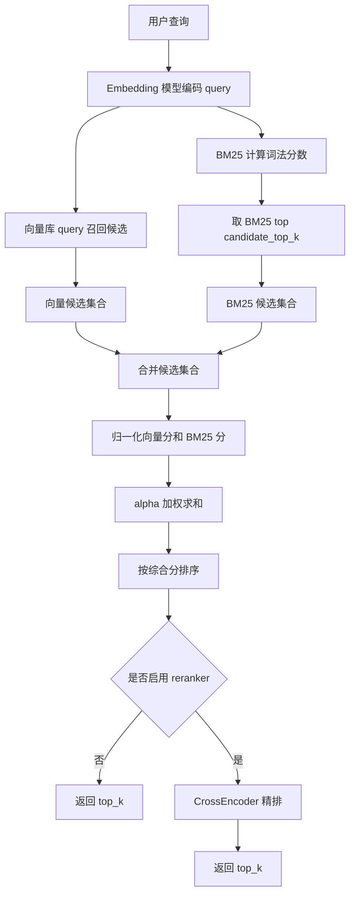
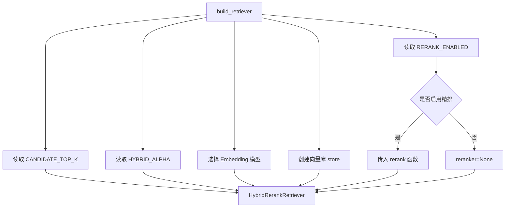

# Day 39 学习笔记

日期：2026-09-14

项目：`ai-job-agent`

目标：把 Day 9 写好的 BM25 混合检索和 CrossEncoder 重排真正接入主流程，形成“粗排 + 精排”的生产级检索链路。

## 1. Day 39 做了什么

Day 9 已经实现了：

- `HybridRetriever`：把向量分和 BM25 分归一化后加权。
- `rerank()`：用 CrossEncoder 对少量候选重新排序。

但当时有两个问题：

```text
rerank() 没有接入 build_retriever()
  ->
实际 /chat 和 /jd/analyze 没有使用精排
```

同时，`HybridRetriever` 和 `PersistentHybridRetriever` 都是把所有文档向量加载到内存里，用 numpy 直接计算。小知识库没问题，但生产环境数据量大了不可行。

Day 39 新增了 `HybridRerankRetriever`：

```text
第一阶段粗排
  ->
向量库召回候选
  ->
BM25 召回候选
  ->
合并候选

第二阶段精排
  ->
CrossEncoder 对候选重新打分
  ->
返回最终 top_k
```

## 2. 今天改了哪些文件

| 文件 | 变化 | 作用 |
|---|---|---|
| `app/rag.py` | 修改 | 新增 `HybridRerankRetriever`，接入 CrossEncoder 精排 |
| `app/rag.py` | 修改 | `build_retriever()` 返回新检索器 |
| `app/rag.py` | 修改 | `rerank()` 使用 `lru_cache` 缓存模型 |
| `app/vector_store.py` | 修改 | `ChromaStore.query()` 统一返回 `{"id", "score"}` |
| `tests/test_hybrid_rerank_retriever.py` | 新增 | 验证候选合并、过滤、精排和排序 |

## 3. 项目闭环实际流程

### 3.1 粗排 + 精排主流程



### 3.2 `build_retriever()` 创建检索器



## 4. 改动对应的知识点

### 4.1 为什么需要两阶段检索

如果对所有文档都跑 CrossEncoder，会非常慢。

CrossEncoder 的优点是准，缺点是需要同时把 query 和候选文本一起送进模型计算。

所以生产系统通常这样设计：

```text
先用便宜的检索方式召回候选
  ->
再用昂贵的精排模型处理少量候选
```

Day 39 的对应关系是：

| 阶段 | 技术 | 作用 |
|---|---|---|
| 粗排 | 向量检索 + BM25 | 快速召回候选 |
| 精排 | CrossEncoder | 对候选重新精确排序 |

### 4.2 `candidate_top_k` 在业务中负责什么

`candidate_top_k` 控制粗排阶段每个通道召回多少候选。

例如：

```python
candidate_top_k=20
```

表示：

```text
向量库返回最多 20 个
BM25 返回最多 20 个
合并去重后再进入下一步
```

它不是最终返回给用户的数量。最终返回数量由 `top_k` 决定。

### 4.3 向量库 `query()` 为什么统一返回 `{"id", "score"}`

Chroma 和 Qdrant 原本返回结构不同。

Chroma 返回：

```python
{
    "ids": [["a", "b"]],
    "distances": [[0.1, 0.2]],
    "documents": [[...]],
    "metadatas": [[...]],
}
```

Qdrant 返回：

```python
[
    {"id": "a", "score": 0.9, "payload": {...}},
    {"id": "b", "score": 0.8, "payload": {...}},
]
```

Day 39 把 Chroma 也转换成：

```python
[
    {"id": "a", "score": 0.9},
    {"id": "b", "score": 0.8},
]
```

这样 `HybridRerankRetriever` 不需要判断底层是什么向量库。

### 4.4 Chroma 的 distance 为什么要变成 score

Chroma 配置的是 cosine 距离：

```text
distance 越小，说明越相关
```

但项目其他地方的分数习惯是：

```text
score 越大，说明越相关
```

所以：

```python
score = 1.0 - distance
```

这样统一成“越大越相关”。

### 4.5 BM25 在粗排阶段负责什么

BM25 是词法匹配。

它关心查询词有没有真的出现在文档里。

Day 39 中：

```python
bm25_scores = np.array(self.bm25.score(query))
bm25_top_indices = np.argsort(bm25_scores)[::-1][: self.candidate_top_k]
```

它只取分数最高的 `candidate_top_k` 个 chunk。

注意：

```text
如果知识库总数少于 candidate_top_k
  ->
BM25 会把所有 chunk 都召回来
```

这不是错误，而是候选数量大于语料总数时的正常结果。

### 4.6 为什么要合并向量候选和 BM25 候选

向量检索和 BM25 各有优势：

```text
向量检索擅长语义相似
BM25 擅长精确词匹配
```

有些查询可能只有一方能召回正确内容。

所以 Day 39 使用：

```python
union_ids = list(set(vector_scores) | bm25_ids)
```

把两边候选合并去重。

### 4.7 `_normalize()` 在粗排中负责什么

向量分和 BM25 分的范围不同，不能直接相加。

例如：

```text
向量分可能最高是 0.9
BM25 分可能最高是 7.8
```

如果直接相加，BM25 会主导结果。

`_normalize()` 把分数压缩到 `0` 到 `1`，然后：

```python
combined_scores = (
    self.alpha * vector_norm
    + (1 - self.alpha) * bm25_norm
)
```

这样两边可以公平加权。

### 4.8 `alpha` 在业务中负责什么

`alpha` 是向量分的权重。

```text
alpha=0.5：向量分和 BM25 各占一半
alpha=1.0：完全只用向量分
alpha=0.0：完全只用 BM25
```

Day 39 允许通过环境变量调整：

```text
HYBRID_ALPHA=0.5
```

### 4.9 CrossEncoder 为什么放在精排阶段

CrossEncoder 更准，但更慢。

它会把：

```python
(query, chunk_text)
```

一起送进模型，而不是分别编码 query 和 chunk。

所以它适合处理少量候选，不适合全库计算。

### 4.10 `rerank()` 在业务中负责什么

它接收粗排候选，返回精排后的 top_k。

```python
def rerank(query, results, top_k=3):
    pairs = [(query, item["doc"]["text"]) for item in results]
    model = _get_reranker_model()
    scores = model.predict(pairs)
    order = np.argsort(scores)[::-1][:top_k]
    return [results[index] for index in order]
```

关键点：

```text
输入是候选列表
  ->
输出是重新排序后的 top_k
```

### 4.11 `lru_cache` 为什么在这里很重要

`_get_reranker_model()` 使用了：

```python
@lru_cache(maxsize=1)
def _get_reranker_model():
    return CrossEncoder("BAAI/bge-reranker-base")
```

如果没有缓存，每次请求都重新加载 CrossEncoder，会非常慢。

有了缓存：

```text
第一次调用加载模型
  ->
之后直接复用
```

### 4.12 `filters` 在业务中负责什么

`HybridRerankRetriever.retrieve()` 支持：

```python
retriever.retrieve(
    "FastAPI 需要掌握什么",
    top_k=3,
    filters={"source_type": "manual"},
)
```

这个过滤条件会传给向量库：

```python
self.store.query(
    query_embedding,
    top_k=self.candidate_top_k,
    where=filters,
)
```

这样可以在检索阶段就排除不符合业务条件的数据。

## 5. Python 初学者知识点

### 5.1 `set` 合并去重

```python
set(vector_scores) | bm25_ids
```

`|` 是集合并集。

它会：

- 合并两个集合。
- 去掉重复元素。

例如：

```python
{"a", "b"} | {"b", "c"}
# {"a", "b", "c"}
```

### 5.2 `zip()`

```python
for chunk_id, combined_score in zip(union_ids, combined_scores):
```

`zip()` 把两个列表一一配对。

例如：

```python
list(zip(["a", "b"], [1, 2]))
# [("a", 1), ("b", 2)]
```

### 5.3 `np.argsort()`

```python
np.argsort(scores)[::-1]
```

`np.argsort()` 返回“从小到大排序后的索引”。

`[::-1]` 把顺序反转，变成“从大到小”。

### 5.4 字典推导式

```python
self._chunks_by_id = {
    chunk["chunk_id"]: chunk
    for chunk in chunks
}
```

它会根据 `chunk_id` 建立映射，之后可以直接：

```python
self._chunks_by_id["doc-a-0"]
```

快速找到对应 chunk。

### 5.5 可调用对象

`reranker` 可以是函数，也可以是带 `__call__` 的对象。

Day 39 测试中的：

```python
class FakeReranker:
    def __call__(self, query, results, top_k):
        ...
```

和普通函数一样，可以直接：

```python
self.reranker(query, candidates, top_k=top_k)
```

## 6. 实际生产中的对标方案

| Day 39 的做法 | 生产中的常见方案 |
|---|---|
| 向量库召回 | Elasticsearch、OpenSearch、Qdrant、Milvus |
| BM25 召回 | Elasticsearch BM25、OpenSearch BM25 |
| 候选合并 | 多路召回、Reciprocal Rank Fusion |
| CrossEncoder 精排 | BGE Reranker、Cohere Rerank、Jina Reranker |
| `candidate_top_k` | 粗排候选数、召回窗口 |
| `HYBRID_ALPHA` | 混合检索权重、A/B 测试参数 |
| `RERANK_ENABLED` | 功能开关、灰度发布 |
| `lru_cache` 模型 | 模型单例、模型服务、模型预热 |

真实项目中，粗排可能不止两路，可能包括：

- 向量检索。
- BM25。
- 标题检索。
- 标签检索。
- 知识图谱检索。

然后通过 RRF 或多路融合生成候选，再交给精排模型。

## 7. 相关报错及原因

### 7.1 `candidate_top_k` 大于语料总数时召回全部文档

现象：

```text
AssertionError: assert {'a', 'b', 'c', 'd'} == {'a', 'c', 'd'}
```

原因：

当知识库只有 4 个 chunk，而 `candidate_top_k=20` 时：

```python
np.argsort(bm25_scores)[::-1][:20]
```

会把 4 个 chunk 全部召回。

这不是代码错误，而是候选数超过语料总数。

解决：

测试中设置：

```python
candidate_top_k=2
```

让它只召回真正靠前的候选。

### 7.2 `NameError: name 'reranker' is not defined`

原因：

在不需要 reranker 的测试中，错误传入了：

```python
reranker=reranker
```

但测试里没有定义 `reranker`。

解决：

检查测试是否真的需要 reranker。

第一个候选合并测试不需要 reranker，只保留：

```python
retriever = HybridRerankRetriever(
    chunks,
    FakeModel(),
    store,
    candidate_top_k=2,
)
```

### 7.3 CrossEncoder 模型下载失败

现象：

```text
OSError: We couldn't connect to 'https://hf-mirror.com'
```

原因：

`BAAI/bge-reranker-base` 没有本地缓存，CrossEncoder 尝试下载模型。

解决：

```bash
export HF_ENDPOINT=https://hf-mirror.com
```

如果仍然下载失败，可以暂时：

```text
RERANK_ENABLED=false
```

生产环境应提前下载模型，避免服务启动时依赖网络。

### 7.4 `store.query() got an unexpected keyword argument 'where'`

原因：

`ChromaStore.query()` 或 `QdrantStore.query()` 还不支持 `where` 参数。

解决：

确认两个 store 的签名都是：

```python
def query(self, query_embedding, top_k, where=None):
```

### 7.5 `KeyError` 表示向量库返回了未知 chunk_id

原因：

向量库返回的 id 不在当前 `chunks` 列表中。

可能原因：

- 知识库文件改了。
- chunk_id 变了。
- 向量库和当前知识库不同步。

解决：

重新构建向量库，或检查 `collection_name` 是否一致。

### 7.6 结果数量少于 `top_k`

原因：

候选数量本来就不足。

例如：

```text
知识库只有 2 个 chunk
  ->
无论如何 top_k=3 都只能返回 2 个
```

解决：

业务代码不能假设结果一定等于 `top_k`。

### 7.7 `RERANK_ENABLED=true` 但精排没有生效

原因：

可能：

- `.env` 修改后没有重启进程。
- `get_retriever()` 被 `lru_cache` 缓存，旧的检索器还在使用。

解决：

重启服务，重新创建检索器。

## 8. 测试为什么要这样写

`tests/test_hybrid_rerank_retriever.py` 没有下载真实模型，也没有启动真实向量库。

它验证：

1. 向量召回和 BM25 召回会合并。
2. 过滤条件会传给向量库。
3. 启用 reranker 后，候选会进入精排。
4. CrossEncoder 分数会重新排序候选。

FakeModel、FakeStore、FakeReranker 分别代替：

```text
Embedding 模型
向量库
CrossEncoder
```

这样测试快、稳定、不依赖外部服务。

运行：

```bash
uv run pytest tests/test_hybrid_rerank_retriever.py -q
```

确认后：

```bash
uv run pytest -q
```

## 9. Day 39 检查清单

- [ ] 理解两阶段检索：粗排 + 精排。
- [ ] 理解 `candidate_top_k` 和 `top_k` 的区别。
- [ ] 理解向量候选和 BM25 候选为什么要合并。
- [ ] 理解 Chroma distance 转 score。
- [ ] 理解 `alpha` 的权重作用。
- [ ] 理解 CrossEncoder 为什么只处理少量候选。
- [ ] 理解 `lru_cache` 缓存 CrossEncoder。
- [ ] 理解 `filters` 如何传给向量库。
- [ ] 新测试文件已创建并通过。
- [ ] 全量测试通过。

## 10. 明天要做什么

Day 40 进入 Query Rewriting：

- 理解为什么要改写用户问题。
- 实现查询扩展、同义改写、多跳问题拆解。
- 让 RAG 检索在用户表达不规范时仍然稳定。
