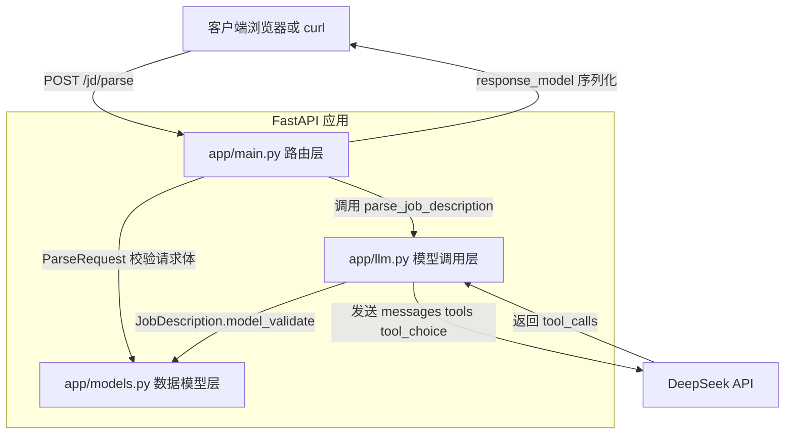

# Day 4 学习笔记

日期：2026-08-17

项目：`ai-job-agent`

目标：把 Day 3 的普通 JSON 输出升级为 DeepSeek function calling，让模型调用 `save_job_description` 工具，并理解工具调用返回结构。

## 1. 当前项目架构图



用一句话描述：

> 客户端把 JD 文本发给 FastAPI，FastAPI 把文本交给 `app/llm.py`，`app/llm.py` 让 DeepSeek 调用 `save_job_description` 工具，最后把工具参数转成 `JobDescription` 返回给客户端。

## 2. 今天改了哪些文件

| 文件 | 是否修改 | 作用 |
|---|---|---|
| `app/llm.py` | 修改 | 从 JSON 输出改为 function calling |
| `tests/test_llm.py` | 修改 | mock 工具调用结果 |
| `app/main.py` | 不修改 | 仍然调用 `parse_job_description` |
| `app/models.py` | 不修改 | 数据结构保持不变 |

## 3. function calling 和普通 JSON 输出的区别

### 3.1 Day 3 普通 JSON 输出

Day 3 的做法是要求模型直接返回 JSON：

```python
response = client.chat.completions.create(
    messages=[...],
    response_format={"type": "json_object"},
)

content = response.choices[0].message.content
data = json.loads(content)
```

模型返回的是一个普通文本，放在 `message.content` 中。

问题：

- 模型可能不严格遵循字段结构
- 模型可能返回额外解释
- 无法直接表达“必须调用某个函数”

### 3.2 Day 4 function calling

Day 4 的做法是定义一个工具：

```python
tools=[SAVE_JOB_DESCRIPTION_TOOL]
tool_choice={"type": "function", "function": {"name": "save_job_description"}}
```

模型不再输出普通文本，而是返回：

```python
message.tool_calls[0]
```

工具调用包含：

- 函数名：`save_job_description`
- 参数：JSON 字符串

这比自由输出 JSON 更稳定，也更接近后续 Agent 的工具调用方式。

### 3.3 对比表

| 维度 | 普通 JSON 输出 | function calling |
|---|---|---|
| 模型返回位置 | `message.content` | `message.tool_calls` |
| 返回内容 | 文本 | 函数名和参数 |
| 结构约束 | 依赖 Prompt | 依赖工具 Schema |
| 扩展多个工具 | 不方便 | 方便 |
| 是否接近 Agent | 不接近 | 接近 |

## 4. tools 和 tool_choice 的作用

### 4.1 tools

`tools` 告诉模型当前有哪些函数可以使用。

本项目只定义一个函数：

```python
SAVE_JOB_DESCRIPTION_TOOL = {
    "type": "function",
    "function": {
        "name": "save_job_description",
        "description": "保存解析后的岗位信息",
        "parameters": {
            "type": "object",
            "additionalProperties": False,
            "properties": {
                "company": {"type": "string"},
                "title": {"type": "string"},
                "seniority": {
                    "type": "string",
                    "enum": ["junior", "mid", "senior", "staff", "unknown"],
                },
                "responsibilities": {"type": "array", "items": {"type": "string"}},
                "requirements": {"type": "array", "items": {"type": "string"}},
                "keywords": {"type": "array", "items": {"type": "string"}},
                "domain": {"type": "string"},
            },
            "required": [
                "company",
                "title",
                "seniority",
                "responsibilities",
                "requirements",
                "keywords",
            ],
        },
    },
}
```

字段含义：

- `type`：声明这是一个函数工具
- `name`：函数名，模型会返回这个名字
- `description`：告诉模型什么时候应该调用
- `parameters`：定义参数 JSON Schema
- `properties`：定义每个参数字段
- `required`：哪些字段必须返回
- `additionalProperties`：是否允许额外字段

### 4.2 tool_choice

`tool_choice` 控制模型如何选择工具。

本项目强制调用：

```python
tool_choice={
    "type": "function",
    "function": {"name": "save_job_description"},
}
```

常见取值：

| 值 | 含义 |
|---|---|
| `"auto"` | 模型自己决定是否调用工具 |
| `"none"` | 不允许调用工具 |
| 指定函数对象 | 强制调用某个具体函数 |

当前项目只有一个工具，所以强制调用 `save_job_description` 是合理的。

## 5. message.tool_calls 的结构

DeepSeek 返回的原始结构类似：

```json
{
  "choices": [
    {
      "message": {
        "content": null,
        "tool_calls": [
          {
            "id": "call_xxx",
            "type": "function",
            "function": {
              "name": "save_job_description",
              "arguments": "{\"company\":\"字节跳动\",\"title\":\"AI Agent 工程师\"}"
            }
          }
        ]
      }
    }
  ]
}
```

访问路径：

```python
response.choices[0].message.tool_calls[0].function.arguments
```

逐段解释：

- `response.choices[0]`：第一个候选结果
- `.message`：模型消息
- `.tool_calls`：工具调用列表
- `[0]`：第一个工具调用
- `.function.name`：函数名
- `.function.arguments`：参数字符串

## 6. tool_call.function.arguments 如何解析

`arguments` 不是 Python 字典，而是 JSON 字符串。

所以需要：

```python
import json

arguments = json.loads(tool_call.function.arguments)
```

`json.loads()` 会把字符串转成 Python 字典。

对应 TypeScript：

```ts
const argumentsObj = JSON.parse(toolCall.function.arguments)
```

最终再交给 Pydantic 校验：

```python
return JobDescription.model_validate(arguments)
```

完整解析流程：

```
flowchart LR
    A[message.tool_calls] --> B[tool_calls[0]]
    B --> C[function.arguments]
    C --> D[json.loads]
    D --> E[Python 字典]
    E --> F[JobDescription.model_validate]
    F --> G[JobDescription 对象]
```

## 7. 如何 mock 函数调用结果

测试中不希望真实调用 DeepSeek，因此使用 `MagicMock` 模拟返回值。

### 7.1 模拟成功返回

```python
from unittest.mock import MagicMock, patch

from app import llm


def test_parse_job_description_uses_function_calling():
    tool_call = MagicMock()
    tool_call.function.arguments = (
        '{"company":"字节跳动",'
        '"title":"AI Agent 工程师",'
        '"seniority":"mid",'
        '"responsibilities":[],'
        '"requirements":["Python"],'
        '"keywords":["Agent"],'
        '"domain":""}'
    )

    message = MagicMock()
    message.tool_calls = [tool_call]

    choice = MagicMock()
    choice.message = message

    response = MagicMock()
    response.choices = [choice]

    with patch.object(
        llm.client.chat.completions,
        "create",
        return_value=response,
    ):
        result = llm.parse_job_description("某 JD 文本")

    assert result.company == "字节跳动"
    assert result.title == "AI Agent 工程师"
```

关键点：

- `MagicMock()` 创建假对象
- 手动设置 `function.arguments`
- 手动设置 `tool_calls`
- 手动设置 `choices`
- `patch.object()` 替换真实的 `create` 方法

### 7.2 模拟没有工具调用的情况

```python
def test_parse_job_description_raises_when_no_tool_calls():
    message = MagicMock()
    message.tool_calls = []

    choice = MagicMock()
    choice.message = message

    response = MagicMock()
    response.choices = [choice]

    with patch.object(
        llm.client.chat.completions,
        "create",
        return_value=response,
    ):
        with pytest.raises(RuntimeError):
            llm.parse_job_description("某 JD 文本")
```

这说明当模型没有调用工具时，代码会抛出 `RuntimeError`。

## 8. 你现在应该形成的整体理解

整个项目可以分成三层：

1. 接口层：`app/main.py`
2. 数据层：`app/models.py`
3. 模型层：`app/llm.py`

请求进入接口层，接口层调用模型层，模型层调用 DeepSeek，DeepSeek 返回工具调用，工具参数被转换成数据层的 Pydantic 对象，最后由接口层返回 JSON。

后面加 RAG、多工具、多 Agent 时，主要变化在 `app/llm.py` 和新增的检索模块，接口层和数据层会相对稳定。

## 9. Day 4 检查清单

- [x] 理解 function calling 和普通 JSON 输出的区别
- [x] 理解 `tools` 的作用
- [x] 理解 `tool_choice` 的作用
- [x] 理解 `message.tool_calls` 的嵌套结构
- [x] 能用 `json.loads()` 解析 `arguments`
- [x] 能写出 mock 工具调用的测试
- [x] `uv run pytest` 全部通过
- [x] 真实 `/jd/parse` 请求成功

## 10. 明天要做什么

Day 5 开始进入 RAG，为 Agent 增加岗位知识库和检索能力。
