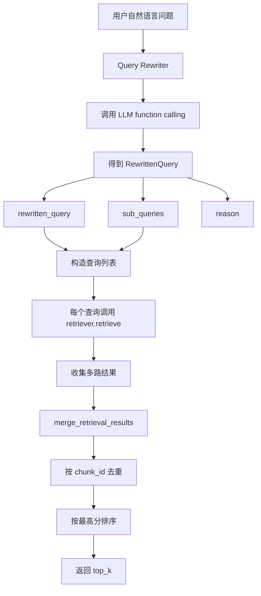
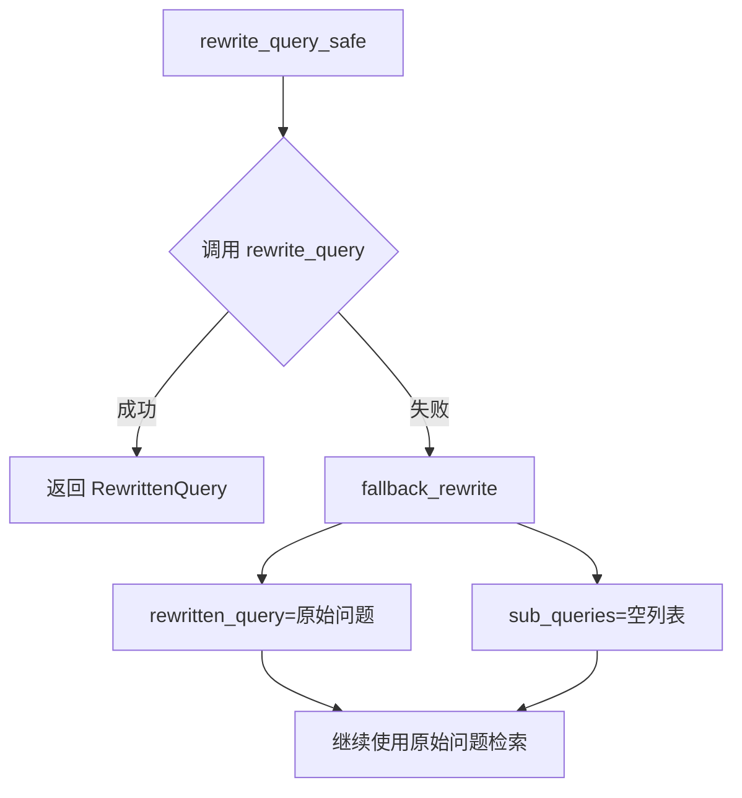

# Day 40 学习笔记

日期：2026-09-14

项目：`ai-job-agent`

目标：把“用户自然语言问题”和“RAG 实际检索查询”分开，通过 Query Rewriting 生成更适合知识库检索的查询。

## 1. Day 40 做了什么

Day 39 已经完成了：

```text
向量检索 + BM25 粗排
  ->
CrossEncoder 精排
```

但还有一个问题没有解决：

```text
用户问得很口语化
  ->
直接用原始问题检索
  ->
可能搜不到知识库里表达更正式的内容
```

Day 40 新增了 `app/query_rewriter.py`，负责：

```text
理解用户问题
  ->
改写主查询
  ->
扩展多个子查询
  ->
分别检索
  ->
合并去重结果
```

同时增加：

- `app/query_rewrite_cli.py`：用来直观查看改写前后的 diff。
- `tests/test_query_rewriter.py`：验证改写、降级和结果合并逻辑。

## 2. 今天改了哪些文件

| 文件 | 变化 | 作用 |
|---|---|---|
| `app/query_rewriter.py` | 新增 | 实现查询改写、多查询检索、结果合并 |
| `app/query_rewrite_cli.py` | 新增 | 查看改写前后的查询和检索结果 |
| `tests/test_query_rewriter.py` | 新增 | 验证改写计划、降级和多路结果合并 |

## 3. 项目闭环实际流程

### 3.1 Query Rewriting 主流程



### 3.2 LLM 改写失败时的降级流程



实际调用顺序：

1. 用户输入问题。
2. `rewrite_query_safe()` 调用 LLM。
3. LLM 通过 function calling 返回 `rewrite_query` 工具调用。
4. Python 用 Pydantic 校验，得到 `RewrittenQuery`。
5. 如果 LLM 调用失败，就降级成原始问题。
6. `multi_query_retrieve()` 拿到 `rewritten_query` 和 `sub_queries`。
7. 对每个查询分别调用检索器。
8. 合并所有结果，按 chunk_id 去重。
9. 同一个 chunk 取最高分。
10. 最后按分数从高到低返回 `top_k`。

## 4. 改动对应的知识点

### 4.1 为什么需要 Query Rewriting

用户的问题通常不适合直接检索。

例如用户问：

```text
“我想转 AI Agent，现在会点 Python，后面该怎么补？”
```

知识库里可能没有这句话，但有：

```text
AI Agent 学习路径
RAG
function calling
Python 后端
```

Query Rewriting 就是让模型把口语问题转成更适合检索的关键词查询。

### 4.2 `RewrittenQuery` 在业务中负责什么

`RewrittenQuery` 是查询改写后的结构化结果。

```python
class RewrittenQuery(BaseModel):
    rewritten_query: str
    sub_queries: list[str] = []
    reason: str = ""
```

字段含义：

| 字段 | 作用 |
|---|---|
| `rewritten_query` | 优化后的主查询 |
| `sub_queries` | 补充查询，覆盖不同角度 |
| `reason` | 为什么这样改写，方便调试 |

### 4.3 `rewritten_query` 和 `sub_queries` 有什么区别

它们对应两种思路：

```text
rewritten_query：
把一句话改得更适合检索

sub_queries：
把一个复杂问题拆成多个子问题
```

例如：

```text
原始问题：
“转 AI Agent 需要补什么？”

rewritten_query：
“AI Agent 工程师 学习路径”

sub_queries：
[
  "AI Agent Python 后端",
  "RAG 检索增强生成",
  "Agent 工具调用",
]
```

### 4.4 `QUERY_REWRITE_TOOL` 在业务中负责什么

它使用 function calling，让模型把改写结果作为工具参数返回。

```python
QUERY_REWRITE_TOOL = {
    "type": "function",
    "function": {
        "name": "rewrite_query",
        "description": "保存查询改写结果",
        "parameters": build_tool_parameters_from_model(RewrittenQuery),
    },
}
```

这样做的好处是：

```text
模型输出 JSON Schema
  ->
Python 用 Pydantic 校验
  ->
结果更稳定
```

### 4.5 `rewrite_query()` 在业务中负责什么

它真正调用 LLM 完成改写。

```python
return call_required_function(
    client,
    build_rewrite_messages(question),
    [QUERY_REWRITE_TOOL],
    "rewrite_query",
    RewrittenQuery,
    model_name=model_name,
    max_attempts=max_attempts,
)
```

它复用了 Day 32 做好的 function calling 执行器，所以自带：

- 强制工具调用。
- JSON 解析。
- Pydantic 校验。
- 错误恢复。

### 4.6 `rewrite_query_safe()` 在业务中负责什么

LLM 不总是可靠。

`rewrite_query_safe()` 做安全降级：

```python
try:
    return rewrite_query(...)
except Exception as exc:
    plan = fallback_rewrite(question)
    plan.reason = f"{plan.reason}: {exc}"
    return plan
```

如果 LLM 改写失败，系统仍然能用原始问题继续检索，不会让整个 RAG 请求失败。

### 4.7 `fallback_rewrite()` 在业务中负责什么

它是兜底方案：

```python
return RewrittenQuery(
    rewritten_query=question,
    sub_queries=[],
    reason="查询改写不可用，使用原始问题降级",
)
```

含义是：

```text
没有改写能力时
  ->
原始问题就是检索查询
```

### 4.8 `merge_retrieval_results()` 在业务中负责什么

多路检索会返回多组结果，可能出现同一个 chunk 被多个查询命中。

`merge_retrieval_results()` 负责：

```text
按 chunk_id 去重
  ->
同一个 chunk 保留最高分
  ->
按分数从高到低排序
```

例如：

```text
查询 1 返回 a: 0.8
查询 2 返回 a: 0.9
查询 2 返回 b: 0.6
```

合并后：

```text
a: 0.9
b: 0.6
```

### 4.9 `multi_query_retrieve()` 在业务中负责什么

它把前面所有步骤串起来：

```text
得到查询计划
  ->
构造查询列表
  ->
逐个检索
  ->
合并结果
```

其中有一个关键设计：

```python
if rewrite_fn is not None:
    plan = rewrite_fn(question)
```

这样可以传入测试用的假改写函数，避免测试依赖真实 LLM。

### 4.10 为什么要用 `rewrite_fn`

`rewrite_fn` 是一个可调用对象。

它的作用是：

```text
把“如何改写”这件事交给调用方决定
```

生产环境可以传真实 `rewrite_query_safe`，测试环境可以传 lambda。

例如测试中：

```python
rewrite_fn=lambda question: plan
```

这样就不需要网络和 DeepSeek API。

### 4.11 `query_rewrite_cli.py` 在业务中负责什么

它让开发者直观看到改写 diff。

```text
原始问题
  ->
改写问题
  ->
子查询
  ->
改写理由
  ->
检索结果
```

这是开发调试工具，不是线上接口。

## 5. Python 初学者知识点

### 5.1 Pydantic `Field(default_factory=list)`

```python
sub_queries: list[str] = Field(
    default_factory=list,
)
```

`default_factory=list` 表示每次创建对象时都生成一个新的空列表，避免多个对象共享同一个列表。

### 5.2 `try / except`

```python
try:
    return rewrite_query(...)
except Exception as exc:
    return fallback_rewrite(question)
```

`try` 里的代码如果抛异常，会进入 `except`。

Day 40 用它实现降级。

### 5.3 字典合并

```python
merged[chunk_id] = {
    "doc": doc,
    "score": score,
}
```

如果同一个 `chunk_id` 已经存在，这行代码会覆盖旧值。

Day 40 通过判断分数高低决定是否覆盖。

### 5.4 `sorted(..., key=..., reverse=True)`

```python
sorted(
    merged.values(),
    key=lambda item: item["score"],
    reverse=True,
)
```

`key` 告诉 Python 按什么字段排序。

`reverse=True` 表示从大到小。

### 5.5 lambda

```python
rewrite_fn=lambda question: plan
```

lambda 是一种短小的匿名函数。

这里等价于：

```python
def rewrite_fn(question):
    return plan
```

### 5.6 `enumerate(..., start=1)`

```python
for index, query in enumerate(plan.sub_queries, start=1):
    print(f"  {index}. {query}")
```

它让下标从 1 开始，适合展示序号。

## 6. 实际生产中的对标方案

| Day 40 的做法 | 生产中的常见方案 |
|---|---|
| LLM Query Rewriting | LLM 查询改写、Query Understanding |
| `sub_queries` | Multi-Query Retrieval、子问题拆解 |
| `rewrite_query_safe()` | 降级策略、fallback |
| `merge_retrieval_results()` | 多路召回融合、RRF |
| `rewrite_fn` 可注入 | 依赖注入、策略模式 |
| function calling 结构化输出 | Structured Output、JSON Mode |
| CLI 查看 diff | 查询调试工具、RAG 调试面板 |

真实生产系统还会考虑：

- 查询改写缓存，避免相同问题重复调用 LLM。
- 用户历史会话参与改写。
- 不同领域使用不同改写 Prompt。
- 改写结果进入可观测性平台。
- A/B 测试改写前后的检索效果。

## 7. 相关报错及原因

### 7.1 `FunctionCallingError`

现象：

```text
FunctionCallingError: function calling 失败
```

原因：

LLM 没有成功返回合法的 `rewrite_query` 工具调用。

解决：

使用 `rewrite_query_safe()`，它会把失败转换成原始问题降级。

### 7.2 `StructuredOutputError`

现象：

```text
StructuredOutputError: Pydantic 校验失败
```

原因：

模型返回的 JSON 不合法，例如：

```text
rewritten_query 为空
sub_queries 不是数组
```

解决：

`call_required_function()` 会重试。如果仍然失败，`rewrite_query_safe()` 会降级。

### 7.3 改写后检索结果比原始问题更少

现象：

原始问题能搜到结果，但改写后结果变少。

原因：

LLM 可能把查询改得过于抽象，或者丢失了关键词。

解决：

生产系统通常保留原始问题作为一路召回，不让改写完全替代原始查询。

当前 Day 40 的模块先完成基础能力，Day 42 接入 Agent 时可以再把原始问题加入多路召回。

### 7.4 `multi_query_retrieve()` 没有调用 LLM

原因：

当以下条件成立时，会使用降级逻辑：

```python
client is None
```

或者：

```python
enable_rewrite is False
```

解决：

确认传入了真实 client：

```python
from app.llm import client

multi_query_retrieve(
    retriever,
    question,
    client=client,
)
```

### 7.5 CLI 只看到模型加载，没有直观结果

原因：

旧版 CLI 把 `multi_query_retrieve()` 当作黑盒，只打印检索结果。

如果结果为空，终端就只剩模型加载日志。

解决：

新版 CLI 先单独拿到 `plan`，打印：

```text
原始问题
改写问题
子查询
改写理由
```

再执行检索。

### 7.6 子查询数量超过预期

现象：

模型返回很多 `sub_queries`。

原因：

Prompt 只是要求最多 3 个，但模型不一定完全遵守。

解决：

在业务代码中显式截断：

```python
queries = queries[:4]
```

表示：

```text
1 个主查询 + 最多 3 个子查询
```

## 8. 测试为什么要这样写

`tests/test_query_rewriter.py` 不调用真实 LLM，也不加载 Embedding 模型。

它验证：

1. 改写 Prompt 包含必要信息。
2. 多路结果会按 chunk_id 去重。
3. 同一个 chunk 多路命中时保留最高分。
4. 没有 client 时降级到原始问题。
5. 传入 `rewrite_fn` 时会执行改写后的查询。
6. LLM 调用失败时安全降级。

FakeRetriever 代替真实检索器，BadClient 模拟 LLM 失败。

运行：

```bash
uv run pytest tests/test_query_rewriter.py -q
```

确认后：

```bash
uv run pytest -q
```

查看改写 diff：

```bash
uv run python -m app.query_rewrite_cli "AI Agent 需要掌握什么" --no-rewrite
uv run python -m app.query_rewrite_cli "AI Agent 需要掌握什么"
```

## 9. Day 40 检查清单

- [ ] 理解为什么需要 Query Rewriting。
- [ ] 理解 `rewritten_query` 和 `sub_queries` 的区别。
- [ ] 理解 `rewrite_query_safe()` 的降级策略。
- [ ] 理解 `multi_query_retrieve()` 的多路召回流程。
- [ ] 理解多路结果如何按 chunk_id 去重。
- [ ] 理解 `rewrite_fn` 可注入设计。
- [ ] 知道如何通过 CLI 查看改写 diff。
- [ ] `tests/test_query_rewriter.py` 已创建并通过。
- [ ] 全量测试通过。

## 10. 明天要做什么

Day 41 进入 RAG 评估体系：

- 建立端到端评估集。
- 对比原始检索、改写检索、精排后的效果。
- 用指标判断 Query Rewriting 是否真的带来了提升。
