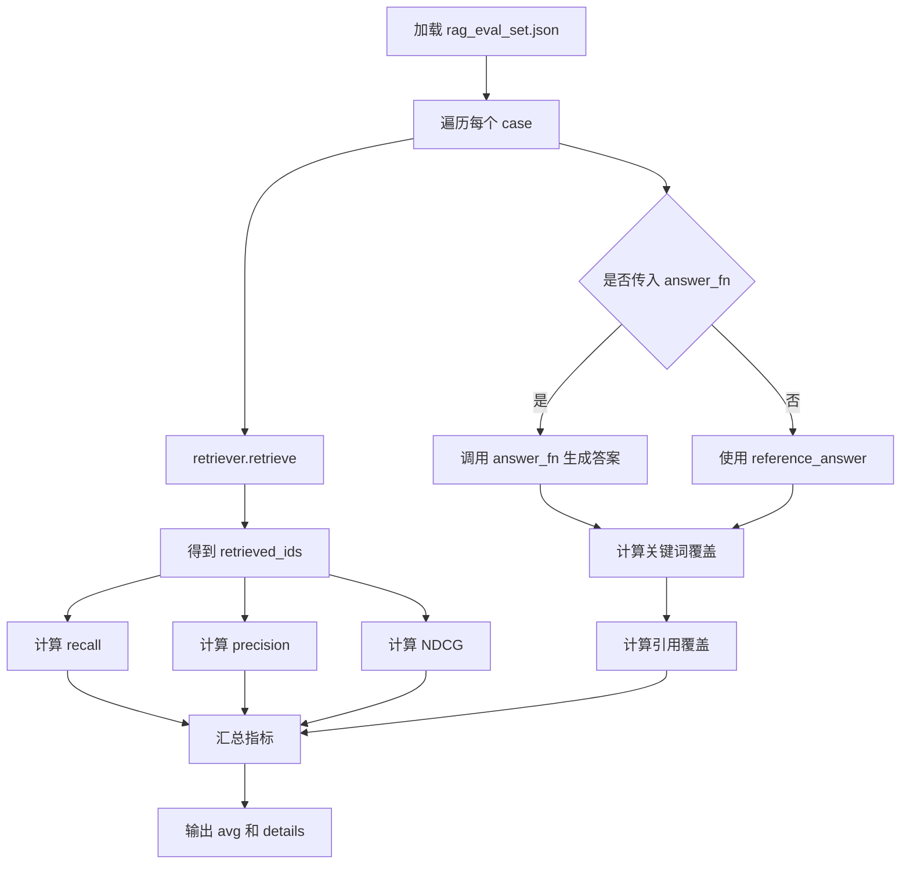
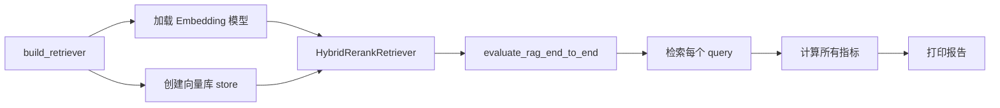

# Day 41 学习笔记

日期：2026-09-15

项目：`ai-job-agent`

目标：把 RAG 评估从“只看检索结果”升级成“检索 + 答案 + 引用”的端到端评估体系。

## 1. Day 41 做了什么

Day 13 做过基础检索评估，指标是：

```text
recall
precision
MRR
```

Day 41 做了两件升级：

1. 增加 NDCG，用来衡量排序质量。
2. 增加答案关键词覆盖和引用覆盖，用来衡量最终回答质量。

新增文件：

- `app/rag_evaluate.py`：端到端 RAG 评估函数。
- `data/rag_eval_set.json`：更完整的 golden dataset。
- `app/rag_eval_cli.py`：运行评估并输出报告。
- `tests/test_rag_end_to_end.py`：离线测试评估逻辑。

## 2. 今天改了哪些文件

| 文件 | 变化 | 作用 |
|---|---|---|
| `app/rag_evaluate.py` | 新增 | 增加 NDCG、答案关键词覆盖和端到端评估 |
| `data/rag_eval_set.json` | 新增 | 定义更完整的 RAG 评估集 |
| `app/rag_eval_cli.py` | 新增 | 运行端到端评估 |
| `tests/test_rag_end_to_end.py` | 新增 | 测试评估指标和端到端报告 |

## 3. 项目闭环实际流程

### 3.1 端到端 RAG 评估流程



### 3.2 CLI 执行流程



## 4. 评估指标详细解释

### 4.1 Recall@k：召回率

来源：

信息检索中的 Recall 表示“所有应该找到的内容里，实际找到了多少”。

公式：

```text
Recall@k = 命中的相关 chunk 数 / 相关 chunk 总数
```

例如：

```text
relevant_chunk_ids = ["a", "b"]
retrieved_ids = ["a", "x", "y"]

命中：a
相关总数：2

Recall@3 = 1 / 2 = 0.5
```

业务含义：

```text
有没有漏掉重要内容
```

实际生产作用：

召回率低意味着系统可能漏掉关键资料，RAG 回答会缺少必要上下文。

### 4.2 Precision@k：精确率

来源：

Precision 表示“返回的结果里，有多少是真正相关的”。

公式：

```text
Precision@k = 命中的相关 chunk 数 / 返回的 chunk 数
```

例如：

```text
retrieved_ids = ["a", "x", "y"]
relevant_chunk_ids = ["a"]

Precision@3 = 1 / 3 = 0.333
```

业务含义：

```text
返回结果里有多少噪声
```

实际生产作用：

精确率低意味着模型上下文里塞了很多无关内容，既浪费 token，也可能让模型被噪声干扰。

当前项目中，每个 query 只标了 1 个相关 chunk，所以：

```text
top_k=3
precision 最高只能是 1/3
```

这不是代码问题，而是评估集设计导致。

### 4.3 MRR：平均倒数排名

来源：

MRR 来自信息检索中的 Mean Reciprocal Rank 平均倒序排名。

它只关心：

```text
第一个正确结果排在第几位
```

公式：

```text
RR = 1 / 第一个正确结果的排名

MRR = 所有 query 的 RR 平均值
```

例如：

```text
query1：正确结果排第 2，RR = 1/2
query2：正确结果排第 1，RR = 1
query3：正确结果排第 1，RR = 1

MRR = (0.5 + 1 + 1) / 3 = 0.833
```

业务含义：

```text
用户最想要的结果是否被排在最前面
```

实际生产作用：

MRR 对问答、推荐和搜索场景都很重要。用户通常只看前 1 到 3 条结果，所以第一个正确结果的位置非常关键。

### 4.4 NDCG@k：归一化折损累计增益

来源：

NDCG 来自搜索排序评估，全称是 Normalized Discounted Cumulative Gain。

拆开理解：

```text
CG：累计增益
DCG：带位置折损的累计增益
NDCG：把 DCG 归一化，方便跨 query 比较
```

核心思想：

```text
相关结果越靠前，分数越高
```

Day 41 的简化公式：

```python
dcg = sum(
    相关值 / log2(position + 1)
)
```

业务含义：

```text
不仅看有没有找到，还看排序好不好
```

实际生产作用：

Recall 和 Precision 不关心顺序，MRR 只看第一个正确结果，NDCG 可以衡量完整排序质量。

例如当前输出：

```text
query1:
retrieved: ['doc-python-0', 'doc-fastapi-0', 'doc-llm-0']
relevant: ['doc-fastapi-0']
```

正确结果排第 2，所以：

```text
NDCG = 0.6309
```

如果正确结果排第 1：

```text
NDCG = 1.0
```

### 4.5 Answer Keyword Coverage：答案关键词覆盖

来源：

这是 RAG 应用层的规则型指标。

它检查答案里是否包含人工标注的必要关键词。

公式：

```text
关键词覆盖 = 命中的必需关键词数 / 必需关键词总数
```

例如：

```text
answer = "需要掌握 Python 和 RAG"
required_keywords = ["Python", "RAG"]

覆盖率 = 2 / 2 = 1.0
```

业务含义：

```text
答案是否覆盖了用户最关心的关键信息
```

实际生产作用：

它比 LLM-as-Judge 简单，但能快速发现答案漏掉核心知识点。

缺点是不能判断答案是否真的正确，只判断有没有提到关键词。

### 4.6 Citation Coverage：引用覆盖

来源：

这是 RAG 系统的忠实度代理指标。

它检查答案中引用的 `[chunk_id]` 是否真的来自本次检索来源。

公式：

```text
引用覆盖 = 合法引用数 / 答案中的总引用数
```

业务含义：

```text
模型有没有引用不存在的来源
```

实际生产作用：

防止模型编造来源。

当前 CLI 中：

```text
reference_answer 没有 [chunk_id]
```

所以：

```text
avg_citation_coverage = 0.000
```

这并不代表检索失败，只代表当前离线答案没有引用格式。

### 4.7 为什么这些指标要一起看

只用一个指标会误判系统。

例如：

```text
Recall 高，但 Precision 低
  ->
虽然该找的都找到了，但混入很多噪声

MRR 高，但 NDCG 低
  ->
第一个结果不错，但后续排序可能不好

关键词覆盖高，但引用覆盖低
  ->
答案可能提到了关键词，但没有可靠来源
```

所以生产系统通常同时看多个指标。

## 5. Python 初学者知识点

### 5.1 `math.log2()`

```python
math.log2(4)
# 2.0
```

它计算以 2 为底的对数。

NDCG 使用它做位置折损。

### 5.2 `enumerate(..., start=...)`

```python
for index, chunk_id in enumerate(retrieved_ids[:k]):
```

它会同时返回下标和值。

NDCG 中下标用来计算位置折扣。

### 5.3 `sum(generator)`

```python
sum(
    value
    for value in values
)
```

这是生成器表达式，会边生成边求和。

### 5.4 `pytest.approx()`

```python
assert result == pytest.approx(0.6309, abs=1e-6)
```

浮点数可能存在精度误差，`approx()` 允许一个小误差范围。

### 5.5 `max(len(eval_set), 1)`

```python
total = max(len(eval_set), 1)
```

这里避免评估集为空时除以 0。

真实生产环境还应该给出更明确的错误提示。

## 6. 实际生产中的对标方案

| Day 41 的做法 | 生产中的常见方案 |
|---|---|
| `rag_eval_set.json` | Golden Dataset、标注数据 |
| Recall / Precision | 检索评估标准指标 |
| MRR | 搜索和问答排序指标 |
| NDCG | 搜索质量评估指标 |
| 关键词覆盖 | 规则型答案检查 |
| 引用覆盖 | Citation Fidelity |
| `answer_fn` | LLM 生成回答后评估 |

真实生产项目还会使用：

```text
LLM-as-Judge
  ->
判断 faithfulness
  ->
判断 answer correctness
  ->
判断 context relevance
```

还会把评估接入：

```text
CI/CD
  ->
每次修改 Prompt 或检索逻辑后自动跑回归
```

以及：

```text
可观测性平台
  ->
记录每个评估 case 的 trace
```

## 7. 相关报错及原因

### 7.1 `ZeroDivisionError`

现象：

```text
ZeroDivisionError
```

原因：

评估集为空时，`len(eval_set)` 为 0。

解决：

Day 41 使用：

```python
total = max(len(eval_set), 1)
```

但生产系统应明确检查评估集是否为空。

### 7.2 `KeyError: 'chunk_id'`

原因：

检索结果里的 `doc` 没有 `chunk_id`。

解决：

使用兼容写法：

```python
result["doc"].get("chunk_id", result["doc"].get("id", "unknown"))
```

### 7.3 `avg_citation_coverage = 0.000`

原因：

当前 `reference_answer` 没有 `[chunk_id]` 引用。

解决：

这不是错误。要得到有意义的引用覆盖，需要传入真实 LLM 回答函数：

```python
evaluate_rag_end_to_end(
    retriever,
    eval_set,
    answer_fn=real_answer_fn,
)
```

### 7.4 `avg_precision@3` 固定为 0.333

原因：

每个 case 只标了 1 个相关 chunk。

```text
1 / 3 = 0.333
```

解决：

扩展评估集，给每个 query 标注多个相关 chunk。

### 7.5 NDCG 没有满分

原因：

相关结果没有排在第 1 位。

解决：

查看 `details` 中的 `retrieved_ids` 和 `relevant_chunk_ids`，定位是哪条查询排序有问题。

### 7.6 CrossEncoder 下载失败

现象：

```text
OSError: We couldn't connect to 'https://hf-mirror.com'
```

原因：

`BAAI/bge-reranker-base` 没有本地缓存。

解决：

临时关闭 rerank：

```bash
RERANK_ENABLED=false uv run python -m app.rag_eval_cli --top-k 3
```

或者提前下载 reranker 模型。

## 8. 测试为什么要这样写

`tests/test_rag_end_to_end.py` 不加载真实模型，也不调用真实 LLM。

它验证：

1. NDCG 对排序位置敏感。
2. 相关结果越靠前，NDCG 越高。
3. 关键词覆盖计算正确。
4. 没有关键词要求时默认满分。
5. 端到端报告包含所有指标。

FakeRetriever 代替真实检索器，`answer_fn` 代替真实 LLM 回答。

运行：

```bash
uv run pytest tests/test_rag_end_to_end.py -q
```

确认后：

```bash
uv run pytest -q
```

运行端到端评估：

```bash
RERANK_ENABLED=false uv run python -m app.rag_eval_cli --top-k 3
```

## 9. Day 41 检查清单

- [ ] 理解 Recall、Precision、MRR、NDCG 的含义和区别。
- [ ] 理解关键词覆盖和引用覆盖的作用。
- [ ] 理解为什么多个指标要一起看。
- [ ] 知道当前评估集的 precision 为什么偏低。
- [ ] 知道当前 citation coverage 为什么为 0。
- [ ] `app/rag_evaluate.py` 已新增。
- [ ] `data/rag_eval_set.json` 已扩展。
- [ ] `app/rag_eval_cli.py` 已新增。
- [ ] `tests/test_rag_end_to_end.py` 已创建并通过。
- [ ] 全量测试通过。

## 10. 明天要做什么

Day 42 进入第 6 周最后一天：RAG 接入 Agent。

- 把 Query Rewriting 接入 Agent 检索工具。
- 把端到端评估接到 Agent 流程。
- 完成第 6 周总结、测试和 Git 提交。
