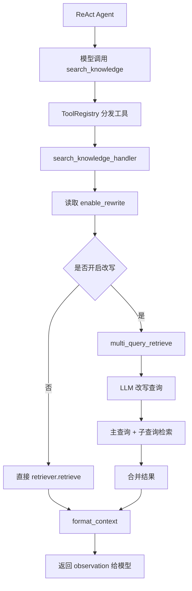
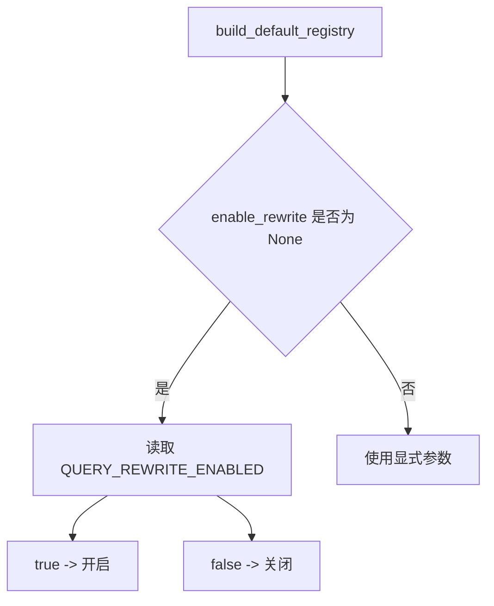

# Day 42 学习笔记

日期：2026-09-15

项目：`ai-job-agent`

目标：把 Day 40 做好的 Query Rewriting 接入 Agent 的 `search_knowledge` 工具，完成第 6 周 RAG 工程化的最后一个闭环。

## 1. Day 42 做了什么

Day 40 已经实现了查询改写模块，但它还是独立模块，没有进入 Agent 工具。

Day 42 做了三件事：

1. `search_knowledge()` 支持开启 Query Rewriting。
2. `build_default_registry()` 读取 `QUERY_REWRITE_ENABLED` 环境变量。
3. 关闭改写时保持原来的直接检索行为，避免错误被吞掉。

最终闭环是：

```text
Agent 决定调用 search_knowledge
  ->
search_knowledge 判断是否开启改写
  ->
开启：先改写，再多路检索
  ->
关闭：直接检索原始问题
  ->
格式化检索结果
  ->
返回给 Agent
```

## 2. 今天改了哪些文件

| 文件 | 变化 | 作用 |
|---|---|---|
| `app/tools.py` | 修改 | `search_knowledge` 接入 Query Rewriting |
| `tests/test_agent_rag_integration.py` | 新增 | 测试改写开启、关闭和环境变量读取 |
| `tests/conftest.py` | 新增 | 测试环境默认关闭 Query Rewriting |

## 3. 项目闭环实际流程

### 3.1 Agent 调用 search_knowledge



### 3.2 环境变量控制流程



## 4. 改动对应的知识点

### 4.1 `search_knowledge()` 在业务中负责什么

它是 Agent 的核心检索工具。

用户通过 Agent 提问时，模型会决定是否需要调用：

```text
search_knowledge
```

Day 42 之前，它只做一件事：

```python
retriever.retrieve(query, top_k=3)
```

Day 42 之后，它可以根据配置决定：

```text
直接检索
  ->
或先改写再检索
```

### 4.2 `enable_rewrite` 在业务中负责什么

`enable_rewrite` 是查询改写开关。

```text
True：使用 multi_query_retrieve
False：直接使用 retriever.retrieve
```

关闭改写时保留直接检索，有两个原因：

1. 向后兼容旧测试。
2. 避免改写链路掩盖检索器真实错误。

### 4.3 `query_rewrite_client` 在业务中负责什么

它把 LLM client 注入给查询改写逻辑。

测试时可以传：

```python
query_rewrite_client=None
```

生产环境中，工具注册表会把真实 `client` 传进去。

### 4.4 为什么关闭改写时直接调用检索器

Day 42 第一次实现时，即使关闭改写，也调用：

```python
multi_query_retrieve(..., client=None)
```

但 `multi_query_retrieve()` 会吞掉检索器异常。

例如 `BrokenRetriever` 抛出异常时：

```text
multi_query_retrieve 捕获异常
  ->
返回空结果
  ->
format_context([]) 返回空字符串
  ->
Agent 看不到错误
```

最终改为：

```python
if enable_rewrite and query_rewrite_client is not None:
    results = multi_query_retrieve(...)
else:
    results = retriever.retrieve(query, top_k=3)
```

这样关闭改写时，检索器错误会正常抛给 React 的 `_execute_tool()`，转换成“执行失败”。

### 4.5 `build_default_registry()` 在业务中负责什么

它负责创建 Agent 的默认工具集。

Day 42 增加了一个参数：

```python
def build_default_registry(
    enable_rewrite: bool | None = None,
) -> ToolRegistry:
```

如果调用方没传 `enable_rewrite`，它从环境变量读取：

```python
os.getenv("QUERY_REWRITE_ENABLED", "false")
```

### 4.6 `search_knowledge_handler` 在业务中负责什么

它是一个闭包函数：

```python
def search_knowledge_handler(arguments, retriever):
    return search_knowledge(
        arguments,
        retriever,
        query_rewrite_client=client,
        enable_rewrite=enable_rewrite,
    )
```

为什么需要这个闭包？

因为工具注册表里的 handler 只会被传入：

```text
arguments
retriever
```

它不会自动传入：

```text
client
enable_rewrite
```

闭包把这两个额外参数提前固定下来。

### 4.7 为什么要用 `os.getenv()` 而不是写死

生产环境需要灵活控制是否开启查询改写。

写死：

```python
enable_rewrite = True
```

会导致每次改配置都要改代码。

使用环境变量：

```text
QUERY_REWRITE_ENABLED=true
```

只需要改配置并重启服务。

### 4.8 为什么默认值是 `false`

为了向后兼容。

如果没有显式设置环境变量，本地开发、旧测试和简单运行都不会触发额外 LLM 调用。

生产环境可以显式：

```text
QUERY_REWRITE_ENABLED=true
```

## 5. Python 初学者知识点

### 5.1 闭包

```python
def build_default_registry(enable_rewrite):
    def search_knowledge_handler(arguments, retriever):
        return search_knowledge(
            arguments,
            retriever,
            enable_rewrite=enable_rewrite,
        )
```

内部函数可以访问外部函数的变量 `enable_rewrite`，这就是闭包。

### 5.2 `os.getenv()`

```python
os.getenv("QUERY_REWRITE_ENABLED", "false")
```

从环境变量读取字符串。

如果环境变量不存在，返回默认值 `"false"`。

### 5.3 布尔环境变量解析

```python
value in {"1", "true", "yes"}
```

把字符串转成布尔判断。

支持：

```text
1
true
yes
```

### 5.4 `monkeypatch.setenv()`

测试中：

```python
monkeypatch.setenv("QUERY_REWRITE_ENABLED", "true")
```

只在当前测试中临时设置环境变量，测试结束自动恢复。

### 5.5 `mock.assert_not_called()`

```python
mock_retrieve.assert_not_called()
```

它验证某个 mock 没有被调用。

Day 42 用它验证关闭改写时不会调用 `multi_query_retrieve()`。

## 6. 实际生产中的对标方案

| Day 42 的做法 | 生产中的常见方案 |
|---|---|
| `QUERY_REWRITE_ENABLED` | Feature Flag、灰度发布 |
| `enable_rewrite` 参数 | 策略开关、依赖注入 |
| 关闭改写时直接检索 | 降级路径、fallback |
| `search_knowledge_handler` 闭包 | 工具绑定配置、Adapter |
| 测试环境默认关闭 | 测试隔离、环境变量管理 |

真实生产项目中，查询改写通常还会：

- 记录原始查询和改写结果。
- 根据用户会话历史改写。
- 缓存改写结果。
- 对改写效果做 A/B 测试。

## 7. 相关报错及原因

### 7.1 `NameError: name 'retriever' is not defined`

原因：

第一次写成了：

```python
def search_knowledge_handler(arguments: retriever):
```

Python 把 `retriever` 当成类型注解中的名字。

正确写法：

```python
def search_knowledge_handler(arguments, retriever):
```

### 7.2 `StopIteration`

原因：

`.env` 里有：

```text
QUERY_REWRITE_ENABLED=true
```

旧 React 测试 mock 的模型响应不够用。

因为 `search_knowledge` 内部又调用了一次 LLM 做查询改写，额外消耗了 mock 的 `side_effect`。

解决：

新增 `tests/conftest.py`：

```python
import pytest


@pytest.fixture(autouse=True)
def disable_query_rewrite_by_default(monkeypatch):
    monkeypatch.setenv("QUERY_REWRITE_ENABLED", "false")
```

### 7.3 `observation=''`

原因：

`multi_query_retrieve()` 吞掉了检索器异常，返回空列表。

解决：

关闭改写时直接调用：

```python
results = retriever.retrieve(query, top_k=3)
```

让异常正常抛出。

### 7.4 `AttributeError: 'NoneType' object has no attribute 'kwargs'`

原因：

测试预期 `multi_query_retrieve()` 被调用，但关闭改写时代码走的是直接检索，mock 没有被调用。

所以：

```python
mock_retrieve.call_args
```

是 `None`。

解决：

修改测试：

```python
mock_retrieve.assert_not_called()
```

### 7.5 环境变量已设置，但改写没生效

原因：

可能进程没有重启，或 `.env` 没被加载。

解决：

重启服务，并确认 `python-dotenv` 已通过 `load_dotenv()` 加载。

## 8. 测试为什么要这样写

`tests/test_agent_rag_integration.py` 验证：

1. 开启改写时调用 `multi_query_retrieve()`。
2. 关闭改写时不调用 `multi_query_retrieve()`。
3. `build_default_registry()` 会读取环境变量。

`tests/conftest.py` 负责全局测试隔离，避免真实 `.env` 干扰旧测试。

运行：

```bash
uv run pytest tests/test_agent_rag_integration.py -q
```

确认后：

```bash
uv run pytest -q
```

## 9. Day 42 检查清单

- [ ] `search_knowledge()` 已接入 Query Rewriting。
- [ ] 关闭改写时保持直接检索。
- [ ] 检索器错误不会被 `multi_query_retrieve()` 吞掉。
- [ ] `build_default_registry()` 会读取 `QUERY_REWRITE_ENABLED`。
- [ ] 测试环境默认关闭 Query Rewriting。
- [ ] 新测试文件已创建并通过。
- [ ] 全量测试通过。

## 10. 第 6 周总结

第 6 周从 Day 36 到 Day 42，完成了 RAG 工程化的完整链路：

| Day | 主题 | 核心成果 |
|---|---|---|
| Day 36 | Chunking 深入 | 语义切块和生产元数据 |
| Day 37 | Embedding 模型对比 | 模型注册表和场景选择 |
| Day 38 | pgvector 或 Qdrant | 向量库适配层 |
| Day 39 | 混合检索和重排 | 粗排 + 精排 |
| Day 40 | Query Rewriting | 查询改写和多路召回 |
| Day 41 | RAG 评估体系 | 端到端评估指标 |
| Day 42 | RAG 接入 Agent | 检索工具化 |

至此，第 6 周目标“能建设可评估的生产级 RAG”已经闭环。

下周进入第 7 周：多 Agent 架构。
