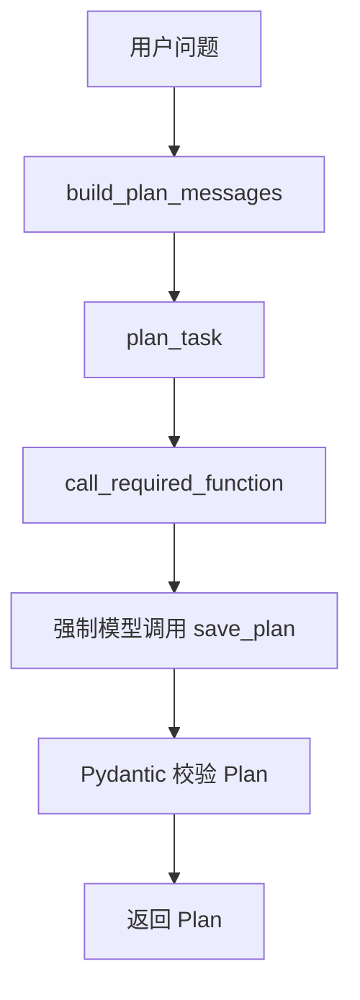
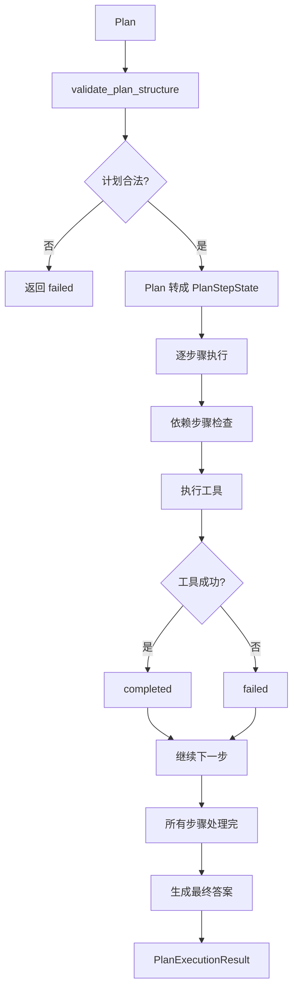
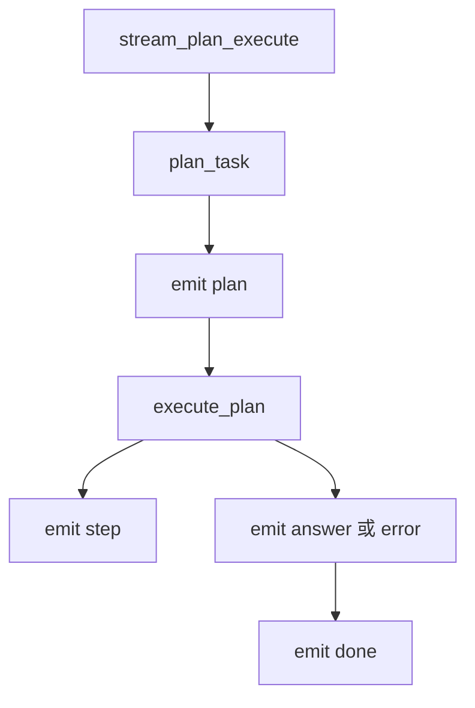

# Day 43 学习笔记

日期：2026-09-15

项目：`ai-job-agent`

目标：在现有单 ReAct Agent 的基础上，增加 Plan-and-Execute 能力，让 Agent 先规划，再按步骤执行，并把每一步的状态结构化保存下来。

## 1. Day 43 做了什么

Day 42 的 Agent 还是单循环 ReAct：

```text
模型分析 -> 调用工具 -> 得到结果 -> 再分析 -> 再调用工具
```

这种方式对简单问题够用，但任务复杂时会出现：

- 模型每一步都在重新决定下一步。
- 没有明确的计划，不方便审计。
- 步骤失败后，不容易看清哪些步骤被跳过。
- 无法很好地表达步骤之间的依赖关系。

Day 43 新增了 Plan-and-Execute：

```text
用户问题
  ->
Planner 生成计划
  ->
校验计划结构
  ->
Executor 按顺序执行步骤
  ->
记录每步状态
  ->
生成最终答案
```

最终实现的效果是：

```text
Planner 输出一个 Plan
  ->
Executor 把 Plan 转成 PlanStepState
  ->
每步执行后标记 completed / failed / skipped
  ->
最终把执行轨迹交给模型生成答案
```

## 2. 今天改了哪些文件

| 文件 | 变化 | 作用 |
|---|---|---|
| `app/models.py` | 修改 | 增加 Plan 和 PlanStep 等数据模型 |
| `app/prompts.py` | 修改 | 增加 Planner 和最终答案 Prompt |
| `app/tool_executor.py` | 新增 | 统一工具执行和错误处理 |
| `app/llm_client.py` | 新增 | 统一模型调用重试逻辑 |
| `app/plan_execute.py` | 新增 | Planner、计划校验、Executor、流式输出 |
| `app/tools.py` | 修改 | ToolRegistry 增加 list_tools() |
| `app/model_registry.py` | 修改 | 增加 planner 和 plan_final_answer 两个任务 |
| `app/main.py` | 修改 | 增加 /agent/plan/stream 接口 |
| `app/plan_execute_cli.py` | 新增 | 命令行验证计划和执行结果 |
| `tests/test_plan_execute.py` | 新增 | 离线测试规划、执行、兜底和 SSE |

## 3. 项目闭环实际流程

### 3.1 规划流程



### 3.2 执行流程



### 3.3 流式接口流程



## 4. 核心概念

### 4.1 ReAct 和 Plan-and-Execute 的区别

ReAct 是边想边做：

```text
做一步 -> 看结果 -> 再想下一步 -> 再做
```

Plan-and-Execute 是先做计划，再按计划执行：

```text
先写完整计划 -> 按步骤执行 -> 最后汇总
```

项目里两者并存：

```text
/agent/stream        使用 ReAct
/agent/plan/stream   使用 Plan-and-Execute
```

生产环境中，简单任务用 ReAct，复杂任务用 Plan-and-Execute。

### 4.2 Plan 是什么

`Plan` 是模型生成的计划：

```python
class Plan(BaseModel):
    goal: str
    steps: list[PlanStep]
```

它只描述“要做什么”，不包含执行状态。

### 4.3 PlanStep 是什么

`PlanStep` 表示计划中的一个步骤：

```python
class PlanStep(BaseModel):
    id: str
    goal: str
    tool: str
    input: str = ""
    depends_on: list[str] = []
```

字段含义：

| 字段 | 作用 |
|---|---|
| `id` | 步骤编号，例如 step-1 |
| `goal` | 这一步要完成什么 |
| `tool` | 这一步调用哪个工具 |
| `input` | 工具输入，例如检索关键词 |
| `depends_on` | 依赖哪些前面的步骤 |

### 4.4 PlanStepState 是什么

`PlanStepState` 继承 `PlanStep`，额外增加运行状态：

```python
class PlanStepState(PlanStep):
    status: Literal["pending", "running", "completed", "failed", "skipped"]
    observation: str = ""
```

状态含义：

| 状态 | 含义 |
|---|---|
| `pending` | 还没执行 |
| `running` | 正在执行 |
| `completed` | 执行成功 |
| `failed` | 执行失败 |
| `skipped` | 依赖步骤失败，跳过 |

生产上要严格区分“模型输出”和“运行状态”。如果让模型直接输出 `status`，模型可能伪造状态，也会污染工具 Schema。

### 4.5 PlanExecutionResult 是什么

它是最终执行结果：

```python
class PlanExecutionResult(BaseModel):
    plan: Plan
    steps: list[PlanStepState]
    answer: str = ""
    error: str = ""
    status: Literal["completed", "failed", "stopped"]
```

它把原计划、每步状态、最终答案和错误信息放在一起，方便前端展示和后续可观测性。

## 5. 每个改动在业务中负责什么

### 5.1 app/models.py

新增了 Plan 相关的 Pydantic 模型。

Pydantic 在这里负责：

```text
把模型返回的 JSON 转成 Python 对象
  ->
自动检查字段类型
  ->
不合法就抛 ValidationError
```

对于 Python 初学者，可以理解为：Pydantic 是强类型的 dict。普通 dict 容易拼错 key，Pydantic 能提前发现问题。

### 5.2 app/prompts.py

新增了四个 Prompt：

| Prompt | 作用 |
|---|---|
| `plan_system` | 告诉模型它是 Planner |
| `plan_user` | 把用户问题传给 Planner |
| `plan_final_system` | 告诉模型根据执行轨迹生成答案 |
| `plan_final_user` | 把问题和执行轨迹传给最终答案模型 |

`build_plan_messages()` 返回：

```python
[
    {"role": "system", "content": system},
    {"role": "user", "content": user},
]
```

### 5.3 app/tool_executor.py

旧代码在 `react.py` 里有一个 `_execute_tool()`，它用字符串判断成功失败。

Day 43 抽出了 `execute_registered_tool()`，并返回明确的结果对象：

```python
@dataclass
class ToolExecutionResult:
    ok: bool
    observation: str
```

这样后续代码不需要通过字符串前缀判断成功失败。

生产对标：

```text
返回结构化结果
  ->
比字符串拼接更稳定
```

### 5.4 app/llm_client.py

`chat_completion_with_retry()` 负责：

```text
调用 LLM
  ->
遇到网络错误、超时、限流时重试
```

Python 初学者重点理解：

```python
for attempt in range(max_retries):
    try:
        return client.chat.completions.create(...)
    except (APIConnectionError, APITimeoutError, RateLimitError):
        if attempt < max_retries - 1:
            time.sleep(0.1 * (attempt + 1))
```

它不是无限重试，最多重试 `max_retries` 次。

### 5.5 app/plan_execute.py 的 plan_task()

`plan_task()` 是 Planner 的入口。

它做了三件事：

1. 生成 Planner Prompt。
2. 使用 `SAVE_PLAN_TOOL` 强制模型调用 `save_plan`。
3. 用 `call_required_function()` 解析并校验 `Plan`。

`SAVE_PLAN_TOOL` 的 Schema 来自 `Plan`：

```python
build_tool_parameters_from_model(Plan)
```

这样 Prompt 和 Pydantic 模型保持一个数据源，不会两边定义不一致。

### 5.6 validate_plan_structure()

它负责检查计划是否真的能执行：

- 目标不能为空。
- 至少有一个步骤。
- 步骤数量不能超过上限。
- 步骤 ID 不能重复。
- 工具必须存在。
- 工具必须属于 Day 43 允许范围。
- `search_knowledge` 不能完全没有输入。
- 依赖步骤必须已经出现。

这是 Plan-and-Execute 的安全边界。不能模型返回什么就执行什么。

### 5.7 _resolve_step_input()

DeepSeek 有时会漏掉 `search_knowledge.input`。

这个函数做兜底：

```python
def _resolve_step_input(step: PlanStepState) -> str:
    if step.tool == "search_knowledge":
        return step.input.strip() or step.goal.strip()
    return step.input
```

含义是：

```text
如果 input 为空，就用 goal 作为检索 query
```

这不是随意编造输入，而是把明确的任务目标转成检索词。

生产对标：

```text
降级策略
  ->
系统不因模型偶尔漏字段而完全失败
```

### 5.8 execute_plan()

`execute_plan()` 是执行器核心。

它的主要流程：

```text
校验计划
  ->
转成 PlanStepState
  ->
逐步骤检查依赖
  ->
执行工具
  ->
标记状态
  ->
全部成功后生成最终答案
```

如果某一步失败，后续依赖它的步骤会变成 `skipped`，不会继续调用工具。

### 5.9 _generate_final_answer()

它把执行轨迹拼成文本，然后让模型生成最终答案。

执行轨迹类似：

```text
[1] 先浏览知识库中已有的学习主题，了解可检索的范围
tool=list_knowledge_titles input=
status=completed
observation=Python 基础
LLM 应用开发
RAG
...
```

最终答案模型会基于这些信息回答，而不是凭空回答。

### 5.10 stream_plan_execute()

它负责生成 SSE 事件：

```text
plan
  ->
step
  ->
answer
  ->
done
```

目前它是先执行完，再统一发送 step 事件。真正的边执行边发送会放到 Day 47 长任务执行中处理。

### 5.11 app/plan_execute_cli.py

CLI 负责本地调试：

```bash
uv run python -m app.plan_execute_cli "我想转 AI Agent，需要补什么？"
```

它会把计划、执行轨迹、最终答案全部打印出来。

### 5.12 app/model_registry.py

新增了两个任务：

| 任务 | 为什么需要 |
|---|---|
| `planner` | 需要工具调用和结构化输出 |
| `plan_final_answer` | 只需要普通文本生成 |

如果不加这两个任务，`get_model_name("planner", ...)` 会抛 `ModelRegistryError`。

### 5.13 app/main.py

新增：

```python
@app.post("/agent/plan/stream")
def agent_plan_stream(request: AgentStreamRequest):
    ...
```

它和 `/agent/stream` 并存。

同时补上了缺失的 import：

```python
from app.agent import get_retriever
from app.plan_execute import stream_plan_execute
from app.tools import build_default_registry
```

## 6. 为什么这次改了很多次

### 6.1 第一次报错：空 input

现象：

```text
状态：failed
错误：步骤 step-2 缺少 search_knowledge 输入
```

原因：

DeepSeek 生成计划时，给 `search_knowledge` 步骤填了：

```python
input = ""
```

而执行器校验规则要求：

```python
search_knowledge 必须有 input
```

这说明 Planner 没有理解 `input` 字段必须填。

解决方法：

- 在 Prompt 中明确写清输入规则。
- 在工具目录中写清 `input` 是否必填。
- 在 `PlanStep.input` 的 Pydantic description 中写清使用规则。

### 6.2 第二次报错：修复循环导致 function calling 失败

现象：

```text
规划失败，已尝试 3 次；最后错误：function calling 失败，已尝试 1 次
```

原因：

第一次为了修复空 input，加了 `_append_plan_repair_message()`：

```python
messages = [
    system,
    user,
    user,
    user,
]
```

连续追加多个 `user` 消息后，DeepSeek 最终没有调用 `save_plan` 工具。

这说明生产开发中，不能随便往 OpenAI messages 里追加消息，尤其是 function calling 场景。

解决方法：

删除修复循环，让 `plan_task()` 只调用一次 Planner。

### 6.3 最终修复：执行器做输入兜底

删除修复循环后，仍然要处理模型偶尔漏掉 `input` 的情况。

最终采用：

```python
_resolve_step_input(step)
```

执行器在真正调用工具前，把空 `input` 替换成 `step.goal`。

这个方案比反复调用模型更稳定。

## 7. 测试为什么要这样写

`tests/test_plan_execute.py` 使用 mock 隔离 LLM 和真实检索器。

### 7.1 test_plan_task_returns_validated_plan()

验证 `plan_task()` 会调用 `call_required_function()`，并要求工具名是 `save_plan`。

### 7.2 test_execute_plan_marks_steps_completed_and_generates_answer()

验证正常路径：

```text
所有步骤 completed
  ->
生成最终答案
```

### 7.3 test_execute_plan_marks_failed_step_failed()

验证工具失败时，结果状态为 `failed`。

### 7.4 test_execute_plan_skips_step_when_dependency_failed()

验证依赖步骤失败时，后续步骤不会执行，而是标记 `skipped`。

### 7.5 test_stream_plan_execute_emits_expected_events()

验证 SSE 顺序是：

```text
plan -> step -> step -> answer -> done
```

### 7.6 test_execute_plan_uses_goal_when_search_input_is_empty()

验证 `_resolve_step_input()` 的兜底逻辑。

这一步很重要，因为它是本次最终修复的关键行为。

## 8. Day 43 检查清单

- [ ] PlanStep 和 Plan 已加入 models.py
- [ ] PlanStepState 和 PlanExecutionResult 已加入 models.py
- [ ] Planner Prompt 已注册
- [ ] 最终答案 Prompt 已注册
- [ ] ToolRegistry.list_tools() 已提供
- [ ] ToolExecutionResult 已提供
- [ ] chat_completion_with_retry() 已提供
- [ ] plan_task() 能生成 Plan
- [ ] validate_plan_structure() 能拦截非法计划
- [ ] execute_plan() 能标记 completed/failed/skipped
- [ ] search_knowledge 空 input 时使用 goal 兜底
- [ ] stream_plan_execute() 能输出 SSE
- [ ] /agent/plan/stream 已新增并补全 import
- [ ] tests/test_plan_execute.py 已通过
- [ ] 全量测试通过

## 9. 当前已知限制

### 9.1 SSE 还不是真正边执行边发送

当前 `stream_plan_execute()` 是先调用 `execute_plan()`，再一次性发送 step。

后续 Day 47 会改成生成器逐条 yield。

### 9.2 search_knowledge 输入兜底没有记录原因

当前如果使用 `goal` 兜底，只更新了 `input`，没有额外字段说明“发生了降级”。

生产上通常会记录：

```text
input_was_empty=true
fallback_used=true
```

这样排查问题时能知道模型原本没有填 input。

### 9.3 Planner 只允许只读工具

Day 43 只允许：

```python
PLANNER_TOOL_NAMES = {"search_knowledge", "list_knowledge_titles"}
```

`apply_job` 这种需要人工审批的工具没有放进 Planner。

这是故意限制，后续 Day 44 到 Day 45 会专门处理多 Agent 和危险工具。

## 10. 下一步

Day 44 会在 Day 43 的基础上引入 Supervisor。

到时 Planner 不再直接生成工具步骤，而是先决定把任务交给哪个 Worker Agent。
