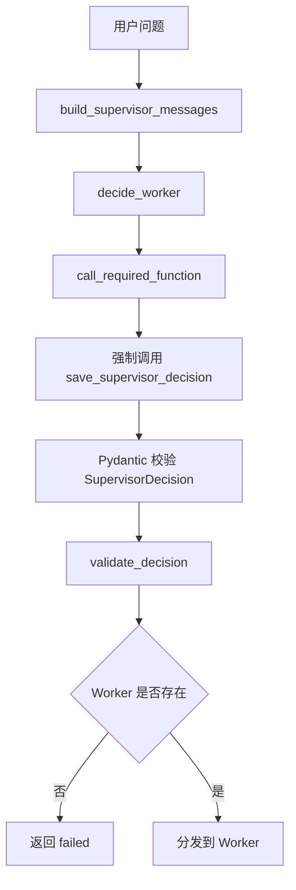
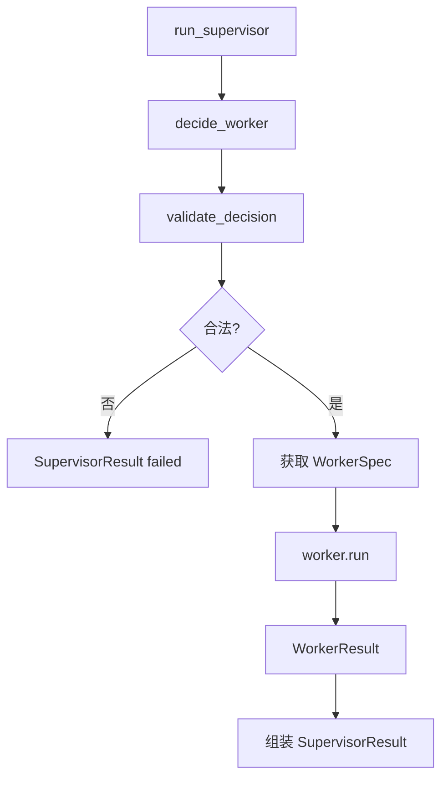
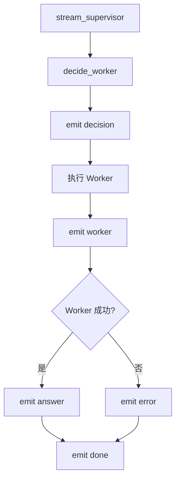

# Day 44 学习笔记

日期：2026-09-15

项目：`ai-job-agent`

目标：在 Day 43 的 Plan-and-Execute 之上增加 Supervisor 模式，让系统先判断任务类型，再把任务分发给对应的 Worker。

## 1. Day 44 做了什么

Day 43 完成的是：

```text
用户问题
  ->
Planner 生成计划
  ->
Executor 执行计划
  ->
生成答案
```

这个模式的问题在于：无论用户问什么，都走同一套 Planner 和同一套工具。

Day 44 增加了一层 Supervisor：

```text
用户问题
  ->
Supervisor 判断任务类型
  ->
选择 knowledge 或 jd_analysis Worker
  ->
Worker 完成具体任务
  ->
Supervisor 汇总结果
```

Day 44 新增了两个 Worker：

| Worker | 负责什么 |
|---|---|
| `knowledge` | 知识库问答、学习路径咨询 |
| `jd_analysis` | 解析 JD 并生成岗位分析 |

Supervisor 不直接执行工具，它只做路由。

## 2. 今天改了哪些文件

| 文件 | 变化 | 作用 |
|---|---|---|
| `app/models.py` | 修改 | 增加 SupervisorDecision、WorkerResult、SupervisorResult |
| `app/prompts.py` | 修改 | 增加 Supervisor 路由 Prompt |
| `app/workers.py` | 新增 | 定义 WorkerSpec、WorkerRegistry 和两个 Worker |
| `app/supervisor.py` | 新增 | Supervisor 决策、校验、执行和 SSE |
| `app/model_registry.py` | 修改 | 增加 supervisor 任务 |
| `app/supervisor_cli.py` | 新增 | 本地命令行验证 Supervisor |
| `app/main.py` | 修改 | 增加 /agent/supervisor/stream |
| `tests/test_supervisor.py` | 新增 | 离线测试路由、执行和 SSE |

## 3. 项目闭环实际流程

### 3.1 Supervisor 决策流程



### 3.2 Supervisor 执行流程



### 3.3 SSE 流程



## 4. 核心概念

### 4.1 Supervisor 是什么

Supervisor 是“主管 Agent”。

它不负责具体执行，只负责：

```text
理解用户问题
  ->
判断应该交给谁
  ->
把任务和上下文交给对应 Worker
```

可以把 Supervisor 理解成项目经理，Worker 是具体工程师。

### 4.2 Worker 是什么

Worker 是负责具体任务的 Agent。

Day 44 有两个 Worker：

```text
knowledge Worker
  ->
处理知识库问答

jd_analysis Worker
  ->
处理 JD 解析和岗位分析
```

不同 Worker 可以拥有不同 Prompt、不同工具和不同输出结构。

### 4.3 Supervisor 和 Planner 的区别

| | Day 43 Planner | Day 44 Supervisor |
|---|---|---|
| 职责 | 生成工具步骤 | 选择 Worker |
| 输出 | Plan | SupervisorDecision |
| 是否执行工具 | 不执行 | 不执行 |
| 面对的对象 | 工具 | Worker |
| 目标 | 把任务拆成步骤 | 把任务分给专业 Agent |

### 4.4 SupervisorDecision 是什么

它是 Supervisor 的路由决策：

```python
class SupervisorDecision(BaseModel):
    worker: str
    goal: str
    context: str = ""
    reason: str = ""
```

字段含义：

| 字段 | 作用 |
|---|---|
| `worker` | 选择哪个 Worker |
| `goal` | 交给 Worker 的具体目标 |
| `context` | 原始上下文，例如 JD 文本 |
| `reason` | 为什么这样选择，方便审计 |

### 4.5 WorkerResult 是什么

它是 Worker 执行后的结果：

```python
class WorkerResult(BaseModel):
    worker: str
    status: Literal["completed", "failed"]
    answer: str = ""
    error: str = ""
```

无论 Worker 成功还是失败，都返回同一个结构。

生产上这样做的好处是：Supervisor 不需要判断 Worker 内部抛了什么异常，只需要看 `status` 和 `error`。

### 4.6 SupervisorResult 是什么

它是最终返回给调用方的结果：

```python
class SupervisorResult(BaseModel):
    decision: SupervisorDecision
    worker_result: WorkerResult
    answer: str = ""
    status: Literal["completed", "failed"]
```

它把：

```text
路由决策
  ->
Worker 结果
  ->
最终答案
```

全部放在一个对象里，方便前端展示和测试断言。

## 5. 每个改动在业务中负责什么

### 5.1 app/models.py

新增了三个模型：

- `SupervisorDecision`
- `WorkerResult`
- `SupervisorResult`

它们分别对应：

```text
Supervisor 怎么路由
Worker 执行得怎么样
最终系统返回什么
```

### 5.2 app/prompts.py

新增了 Supervisor Prompt：

```python
SUPERVISOR_INSTRUCTIONS = """你是 Supervisor。
只负责判断交给哪个 Worker，不直接回答用户问题。
只能从可用 Worker 中选择一个。
..."""
```

还增加了：

```python
def build_supervisor_messages(
    question: str,
    worker_catalog: str,
) -> list[dict]:
    ...
```

这个函数负责生成：

```python
[
    {"role": "system", "content": system},
    {"role": "user", "content": user},
]
```

### 5.3 app/workers.py

这个文件是 Day 44 的核心。

#### WorkerSpec

```python
@dataclass(frozen=True)
class WorkerSpec:
    name: str
    description: str
    run: Callable
```

`WorkerSpec` 描述一个 Worker：

| 字段 | 作用 |
|---|---|
| `name` | Worker 名称 |
| `description` | Worker 能做什么 |
| `run` | Worker 的执行函数 |

`frozen=True` 表示创建后不能修改，避免运行过程中 Worker 配置被意外改动。

#### WorkerRegistry

```python
class WorkerRegistry:
    def __init__(self):
        self._workers: dict[str, WorkerSpec] = {}
```

它负责注册和查找 Worker。

和 Day 42 的 `ToolRegistry` 是同一个思路：

```text
注册表统一管理可调用对象
  ->
运行时按名字查找
```

#### run_knowledge_worker()

它负责知识库问答。

核心逻辑：

```python
registry = build_default_registry()
plan = plan_task(question, registry)
result = execute_plan(question, plan, registry, retriever, approve_tool_call)
```

也就是说，knowledge Worker 复用 Day 43 的 Plan-and-Execute。

#### run_jd_analysis_worker()

它负责 JD 分析。

核心逻辑：

```python
jd_text = decision.context.strip() or decision.goal.strip()
analysis = analyze_job(jd_text, retriever)
```

它复用之前已经做好的 `analyze_job()`，不是重新实现 JD 分析。

#### build_default_worker_registry()

它注册默认的两个 Worker。

以后如果要增加 Worker，只需要在注册表里加一项，不需要修改 Supervisor 主流程。

### 5.4 app/supervisor.py

#### decide_worker()

它调用 LLM，让模型返回 `SupervisorDecision`。

关键代码：

```python
call_required_function(
    client=client,
    messages=messages,
    tools=[SUPERVISOR_DECISION_TOOL],
    tool_name="save_supervisor_decision",
    output_model=SupervisorDecision,
    ...
)
```

这样 Supervisor 的输出不是自由文本，而是经过 Pydantic 校验的对象。

#### validate_decision()

它检查两件事：

1. `goal` 不能为空。
2. `worker` 必须存在于 WorkerRegistry。

生产上不能让模型随便返回一个不存在的 Worker 名称。

#### run_supervisor()

它是非流式主流程：

```text
决策 -> 校验 -> 获取 Worker -> 执行 Worker -> 返回结果
```

#### stream_supervisor()

它是流式版本，SSE 顺序是：

```text
decision -> worker -> answer -> done
```

### 5.5 app/model_registry.py

增加了：

```python
"supervisor",
```

以及：

```python
    "supervisor": {
        "requires_tools": True,
        "requires_streaming": False,
        "max_latency": "low",
        "capabilities": {"structured"},
    },
```

Supervisor 需要工具调用和结构化输出，但不需要流式输出。

### 5.6 app/supervisor_cli.py

CLI 会打印：

```text
Supervisor 决策
Worker 状态
最终答案
```

这样不用启动 FastAPI 也能看到路由结果。

### 5.7 app/main.py

新增：

```python
@app.post("/agent/supervisor/stream")
def agent_supervisor_stream(request: AgentStreamRequest):
    ...
```

同时补了：

```python
from app.supervisor import stream_supervisor
```

## 6. Python 初学者知识点

### 6.1 dataclass

```python
from dataclasses import dataclass

@dataclass(frozen=True)
class WorkerSpec:
    name: str
    description: str
    run: Callable
```

`dataclass` 会自动生成 `__init__`。

也就是说，不需要手写：

```python
def __init__(self, name, description, run):
    self.name = name
    ...
```

### 6.2 Callable

```python
run: Callable
```

`Callable` 表示这个字段是一个“可以被调用的东西”，通常是函数。

Worker 的 `run` 字段保存的就是函数：

```python
run=run_knowledge_worker
```

注意这里没有加括号，因为不是调用函数，而是把函数本身存起来。

### 6.3 `or` 的默认值用法

```python
worker_registry = worker_registry or build_default_worker_registry()
```

等价于：

```python
if worker_registry is None:
    worker_registry = build_default_worker_registry()
```

这是 Python 里常见的默认值写法。

### 6.4 model_dump_json()

```python
decision.model_dump_json()
```

Pydantic 会把对象转成 JSON 字符串。

它和 `model_dump()` 的区别是：

```text
model_dump()      返回 Python dict
model_dump_json() 返回 JSON 字符串
```

SSE 中需要字符串，所以使用 `model_dump_json()`。

## 7. 实际生产中的对标方案

| Day 44 的做法 | 生产中的常见方案 |
|---|---|
| Supervisor 选择 Worker | 路由 Agent、意图识别、任务分发器 |
| WorkerRegistry | 服务注册表、依赖注入容器 |
| WorkerSpec | Worker 定义、服务描述 |
| SupervisorDecision | 结构化路由决策 |
| WorkerResult | Worker 统一响应体 |
| validate_decision() | 路由白名单、输入校验 |
| knowledge Worker 复用 Plan-and-Execute | 子 Agent 内部使用自己的执行策略 |

真实生产系统还会增加：

- Worker 超时和重试。
- Worker 并发执行。
- Worker 结果缓存。
- Supervisor 对多个 Worker 结果的汇总。
- Worker 权限隔离。

这些会在后续 Day 45 到 Day 49 逐步加入。

## 8. Day 44 开发中常见报错及原因

### 8.1 ModelRegistryError: 未知任务：supervisor

原因：

`supervisor.py` 调用了：

```python
get_model_name("supervisor", ...)
```

但 `app/model_registry.py` 没有增加 `supervisor` 任务。

解决：

在 `TaskName` 和 `TASK_REQUIREMENTS` 中增加 `supervisor`。

### 8.2 NameError: name 'stream_supervisor' is not defined

原因：

`app/main.py` 添加了 `/agent/supervisor/stream`，但没有 import：

```python
from app.supervisor import stream_supervisor
```

解决：

补上 import。

### 8.3 AttributeError: 'WorkerRegistry' object has no attribute 'worker_names'

原因：

`validate_decision()` 调用了 `worker_registry.worker_names()`，但注册表类没有这个方法。

解决：

在 `WorkerRegistry` 中增加：

```python
def worker_names(self) -> list[str]:
    return list(self._workers)
```

### 8.4 ValueError: Worker 已注册

原因：

同一个 Worker 被注册了两次。

解决：

检查 `build_default_worker_registry()`，确认每个 Worker 只注册一次。

### 8.5 模型返回未知 Worker

现象：

```text
未知 Worker: xxx
```

原因：

模型返回了一个 WorkerRegistry 中不存在的名字。

解决：

这是 `validate_decision()` 的正常拦截。生产上应该记录该错误，并让模型重新生成决策，或者返回默认 Worker。

## 9. 测试为什么要这样写

`tests/test_supervisor.py` 有 5 个测试。

### 9.1 test_build_default_worker_registry_contains_expected_workers()

验证默认注册表包含：

```text
knowledge
jd_analysis
```

### 9.2 test_decide_worker_uses_required_function()

验证 `decide_worker()` 使用 function calling，并要求工具名是：

```text
save_supervisor_decision
```

### 9.3 test_validate_decision_rejects_unknown_worker()

验证 Supervisor 会拒绝不存在的 Worker。

### 9.4 test_run_supervisor_routes_to_knowledge_worker()

验证主流程会把任务交给 knowledge Worker，并返回最终答案。

### 9.5 test_stream_supervisor_emits_expected_events()

验证 SSE 顺序：

```text
decision -> worker -> answer -> done
```

这些测试使用 mock，不访问真实 LLM 和 Embedding。

## 10. Day 44 检查清单

- [ ] SupervisorDecision、WorkerResult、SupervisorResult 已加入 models.py
- [ ] Supervisor Prompt 已注册
- [ ] WorkerSpec 已实现
- [ ] WorkerRegistry 已实现
- [ ] knowledge Worker 已实现
- [ ] jd_analysis Worker 已实现
- [ ] decide_worker() 已实现
- [ ] validate_decision() 已实现
- [ ] run_supervisor() 已实现
- [ ] stream_supervisor() 已实现
- [ ] model_registry 增加 supervisor 任务
- [ ] supervisor_cli.py 已创建
- [ ] /agent/supervisor/stream 已新增
- [ ] tests/test_supervisor.py 已通过
- [ ] 全量测试通过

## 11. 当前已知限制

### 11.1 一次只调用一个 Worker

当前 Supervisor 只能选择一个 Worker。

生产上复杂任务可能需要多个 Worker 协作，Day 45 的 Handoff 会处理这个问题。

### 11.2 Worker 没有独立超时

当前 Worker 如果内部卡住，Supervisor 只能等它结束。

生产上需要给 Worker 设置超时和取消机制。

### 11.3 knowledge Worker 仍复用 Day 43 的 Planner

目前 knowledge Worker 没有完全独立的 Prompt 和工具边界，只是复用 Plan-and-Execute。

后续可以把 Worker 的 Prompt、工具和输出契约做得更独立。

## 12. 下一步

Day 45 会实现 Handoff：

```text
Worker A 执行到一半
  ->
发现自己不适合继续
  ->
把任务交回 Supervisor
  ->
Supervisor 重新选择 Worker B
```
