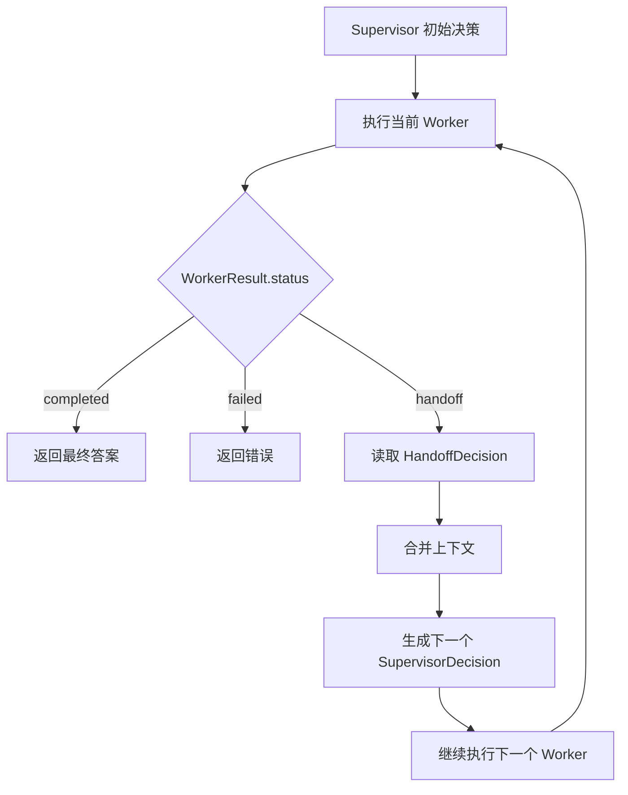
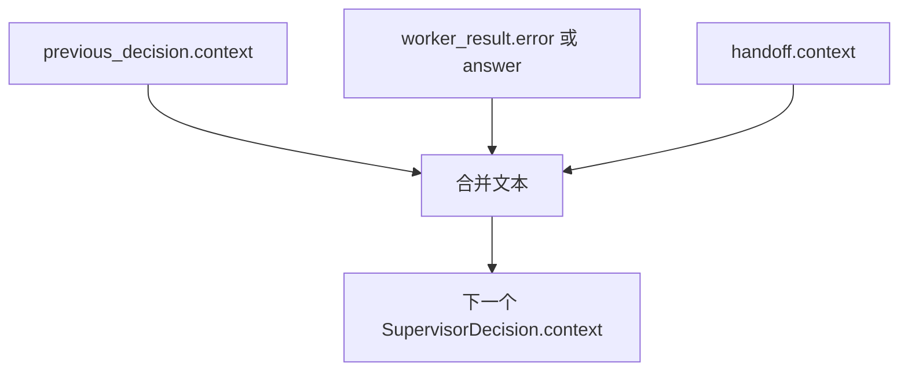

# Day 45 学习笔记

日期：2026-09-15

项目：`ai-job-agent`

目标：在 Day 44 Supervisor 模式上增加 Handoff，让 Worker 可以把任务交接给另一个 Worker。

## 1. Day 45 做了什么

Day 44 的 Supervisor 只能执行一次路由：

```text
Supervisor 选择 Worker
  ->
Worker 执行
  ->
返回 completed 或 failed
```

如果 Worker 发现当前任务不适合自己，只能失败。

Day 45 增加 Handoff：

```text
Supervisor 选择 Worker A
  ->
Worker A 发现更适合 Worker B
  ->
Worker A 返回 handoff
  ->
Supervisor 把上下文交给 Worker B
  ->
Worker B 继续执行
```

这样系统可以自动纠正错误路由。

## 2. 今天改了哪些文件

| 文件 | 变化 | 作用 |
|---|---|---|
| `app/models.py` | 修改 | 增加 HandoffDecision，扩展 WorkerResult 和 SupervisorResult |
| `app/workers.py` | 修改 | knowledge 和 jd_analysis 支持返回 Handoff |
| `app/supervisor.py` | 修改 | Supervisor 支持 Handoff 循环 |
| `app/supervisor_cli.py` | 修改 | 打印 Handoff 链 |
| `tests/test_supervisor.py` | 修改 | 增加 Handoff 测试 |

## 3. 项目闭环实际流程

### 3.1 Handoff 主流程



### 3.2 上下文合并流程



## 4. 核心概念

### 4.1 Handoff 是什么

Handoff 是“任务交接”。

一个 Worker 执行时发现：

```text
这个问题不是我最擅长的
  ->
另一个 Worker 更适合
```

它不直接失败，而是返回一个 Handoff 请求：

```text
请把任务交给 jd_analysis
```

Supervisor 收到后，把任务和上下文转交给目标 Worker。

### 4.2 HandoffDecision 是什么

```python
class HandoffDecision(BaseModel):
    target_worker: str
    goal: str = ""
    context: str = ""
    reason: str = ""
```

字段含义：

| 字段 | 作用 |
|---|---|
| `target_worker` | 要交接给哪个 Worker |
| `goal` | 交接后的目标 |
| `context` | 给下一个 Worker 的补充上下文 |
| `reason` | 为什么交接，方便审计 |

### 4.3 WorkerResult 的三种状态

Day 45 后，`WorkerResult.status` 支持：

```text
completed
failed
handoff
```

| 状态 | 含义 |
|---|---|
| `completed` | Worker 成功完成 |
| `failed` | Worker 失败 |
| `handoff` | Worker 请求交接给另一个 Worker |

### 4.4 SupervisorResult.handoffs

`SupervisorResult` 新增：

```python
handoffs: list[HandoffDecision] = Field(default_factory=list)
```

它记录完整交接链。

例如：

```text
knowledge -> jd_analysis
```

生产上，这个字段可以用于：

- 审计为什么换 Worker。
- 计算 Handoff 次数。
- 分析模型路由是否稳定。
- 前端展示 Agent 交接过程。

### 4.5 为什么需要 MAX_HANDOFFS

如果没有上限，两个 Worker 可能互相交接：

```text
knowledge -> jd_analysis -> knowledge -> jd_analysis ...
```

最终形成死循环。

Day 45 增加：

```python
def _max_handoffs() -> int:
    raw = os.getenv("MAX_HANDOFFS", "3")
    ...
    return max(1, min(value, 10))
```

含义：

```text
最多交接 3 次
  ->
超过就停止并返回失败
```

生产系统中，这个上限通常还会和超时时间、成本预算一起控制。

## 5. 每个改动在业务中负责什么

### 5.1 app/models.py

增加 `HandoffDecision`。

修改 `WorkerResult`：

```python
status: Literal["completed", "failed", "handoff"]
handoff: HandoffDecision | None = None
```

修改 `SupervisorResult`：

```python
handoffs: list[HandoffDecision] = Field(default_factory=list)
```

### 5.2 app/workers.py

增加了 `_looks_like_jd()`：

```python
JD_MARKERS = (
    "招聘",
    "岗位职责",
    "任职要求",
    "要求掌握",
    "职位描述",
)


def _looks_like_jd(text: str) -> bool:
    normalized = text.lower()
    return any(marker in normalized for marker in JD_MARKERS)
```

`run_knowledge_worker()` 开头：

```python
if _looks_like_jd(question):
    return WorkerResult(
        worker="knowledge",
        status="handoff",
        handoff=HandoffDecision(
            target_worker="jd_analysis",
            ...
        ),
    )
```

`run_jd_analysis_worker()` 开头：

```python
if not _looks_like_jd(jd_text):
    return WorkerResult(
        worker="jd_analysis",
        status="handoff",
        handoff=HandoffDecision(
            target_worker="knowledge",
            ...
        ),
    )
```

这两个判断让 Worker 能识别“当前任务是否应该自己做”。

### 5.3 app/supervisor.py

#### _max_handoffs()

从环境变量读取最大 Handoff 次数：

```python
raw = os.getenv("MAX_HANDOFFS", "3")
```

#### _decision_from_handoff()

它负责生成下一个 Worker 的 `SupervisorDecision`。

核心是把多个上下文拼起来：

```python
context_parts = [
    previous_decision.context,
    worker_result.error or worker_result.answer,
    handoff.context,
]
```

这样下一个 Worker 能看到：

- 上一个 Worker 收到的上下文。
- 上一个 Worker 的结果或错误。
- 本次 Handoff 的补充说明。

#### run_supervisor()

现在使用循环处理 Handoff：

```python
for _ in range(max_handoffs + 1):
    worker_result = worker.run(...)

    if worker_result.status == "handoff":
        current_decision = _decision_from_handoff(...)
        continue

    return SupervisorResult(...)
```

#### stream_supervisor()

SSE 事件增加：

```text
handoff
```

有一次 Handoff 时，事件顺序是：

```text
decision -> worker -> handoff -> decision -> worker -> answer -> done
```

### 5.4 app/supervisor_cli.py

CLI 增加：

```python
if result.handoffs:
    print("Handoff 链：")
    for index, handoff in enumerate(result.handoffs, start=1):
        print(f"  {index}. {handoff.target_worker}: {handoff.reason}")
```

这样本地运行也能看到交接过程。

## 6. Python 初学者知识点

### 6.1 Literal 类型

```python
status: Literal["completed", "failed", "handoff"]
```

`Literal` 表示这个字段只能取这几个固定值。

它比普通 `str` 更严格，Pydantic 会拒绝其他值。

### 6.2 Optional 字段

```python
handoff: HandoffDecision | None = None
```

表示：

```text
handoff 可以是 HandoffDecision
  ->
也可以是 None
```

没有 Handoff 时，这个字段是 `None`。

### 6.3 默认空列表要用 Field

```python
handoffs: list[HandoffDecision] = Field(default_factory=list)
```

不能写成：

```python
handoffs: list[HandoffDecision] = []
```

因为 Python 的默认参数如果是可变对象，可能会在多个实例之间共享。

Pydantic 推荐使用：

```python
Field(default_factory=list)
```

### 6.4 `or` 在默认值中的使用

```python
max_handoffs = max_handoffs or _max_handoffs()
```

如果调用方没有传 `max_handoffs`，就使用环境变量默认值。

### 6.5 continue 在循环中的作用

```python
for _ in range(max_handoffs + 1):
    ...

    if worker_result.status == "handoff":
        current_decision = _decision_from_handoff(...)
        continue

    return SupervisorResult(...)
```

`continue` 表示跳过本次循环剩余代码，直接进入下一轮循环。

在这里它的作用是：

```text
发生 Handoff 后
  ->
不返回结果
  ->
继续执行下一个 Worker
```

## 7. 实际生产中的对标方案

| Day 45 的做法 | 生产中的常见方案 |
|---|---|
| Worker 返回 Handoff | Agent 之间的任务转移 |
| HandoffDecision | Handoff 协议或消息对象 |
| 上下文合并 | 共享消息历史、任务上下文传递 |
| MAX_HANDOFFS | 最大跳转次数、防循环保护 |
| SupervisorResult.handoffs | 交接审计日志 |
| stream 增加 handoff 事件 | 前端展示 Agent 交接过程 |

真实生产系统还会增加：

- Handoff 超时。
- Handoff 幂等。
- 交接前校验目标 Worker 权限。
- 对交接频率做限流。
- 记录每次交接的 token 和延迟。

## 8. Day 45 开发中常见报错及原因

### 8.1 TypeError: stream_supervisor() got an unexpected keyword argument 'max_handoffs'

原因：

`tests/test_supervisor.py` 调用了：

```python
stream_supervisor(
    ...,
    max_handoffs=2,
)
```

但 `stream_supervisor()` 的签名没有增加：

```python
max_handoffs: int | None = None
```

解决：

在函数签名中增加 `max_handoffs` 参数。

### 8.2 NameError: name 'current_decision' is not defined

原因：

只改了签名，但函数体还没有初始化：

```python
current_decision = decision
```

解决：

在 `yield sse_event("decision", ...)` 之前设置：

```python
current_decision = decision
handoffs: list[HandoffDecision] = []
```

### 8.3 NameError: name 'max_handoffs' is not defined

原因：

函数体使用了 `max_handoffs`，但没有：

```python
max_handoffs = max_handoffs or _max_handoffs()
```

解决：

在 `decide_worker()` 调用之前完成默认值初始化。

### 8.4 两个 Worker 互相 Handoff，测试或程序卡住

原因：

没有 `MAX_HANDOFFS`，或者 `max_handoffs` 参数没有生效。

解决：

使用 `_max_handoffs()` 限制最大次数，并在循环超过上限后返回失败。

## 9. 测试为什么要这样写

`tests/test_supervisor.py` 增加或修改了这些测试：

### 9.1 test_run_supervisor_routes_to_knowledge_worker_without_handoff()

验证没有 Handoff 时，旧行为没有变化。

### 9.2 test_run_supervisor_follows_handoff_to_next_worker()

验证：

```text
knowledge Worker 发起 Handoff
  ->
Supervisor 执行 jd_analysis Worker
```

### 9.3 test_run_supervisor_stops_after_max_handoffs()

验证 Handoff 循环有上限，不会无限执行。

### 9.4 test_stream_supervisor_emits_handoff_events()

验证一次 Handoff 的 SSE 顺序：

```text
decision -> worker -> handoff -> decision -> worker -> answer -> done
```

## 10. Day 45 检查清单

- [ ] HandoffDecision 已加入 models.py
- [ ] WorkerResult 支持 completed/failed/handoff
- [ ] SupervisorResult 增加 handoffs
- [ ] knowledge Worker 支持 Handoff
- [ ] jd_analysis Worker 支持 Handoff
- [ ] Supervisor 支持 Handoff 循环
- [ ] 每次 Handoff 合并上下文
- [ ] MAX_HANDOFFS 防止无限循环
- [ ] SSE 增加 handoff 事件
- [ ] CLI 打印 Handoff 链
- [ ] tests/test_supervisor.py 已更新并通过
- [ ] 全量测试通过

## 11. 当前已知限制

### 11.1 Handoff 判断还是简单关键词规则

当前 `_looks_like_jd()` 只是关键词匹配。

生产上会使用更稳定的分类模型或 LLM 决策。

### 11.2 上下文合并比较简单

当前只是用空行拼接字符串。

生产上可能需要结构化上下文、消息角色和来源标记。

### 11.3 Worker 没有独立的 Handoff 超时

当前 Worker 如果卡住，Supervisor 只能等它结束。

后续 Day 47 长任务执行会加入超时和恢复。

## 12. 下一步

Day 46 会用 LangGraph 或 Agents SDK 重写 Supervisor 和 Handoff。

目标是把手写的循环逻辑变成状态图，让节点、边、状态和恢复机制更清晰。
