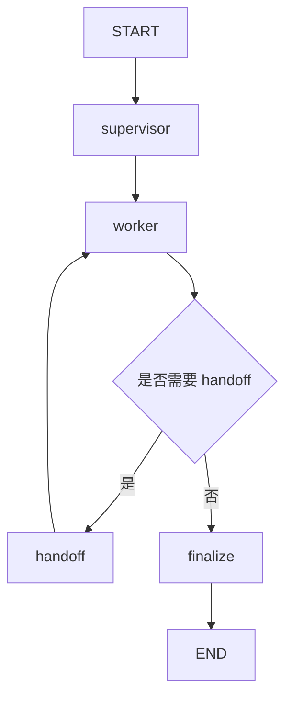
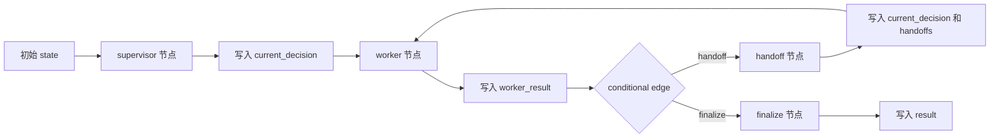

# Day 46 学习笔记

日期：2026-09-15

项目：`ai-job-agent`

目标：用 LangGraph 把 Day 44 和 Day 45 手写的 Supervisor、Worker、Handoff 流程重写成显式状态图。

## 1. Day 46 做了什么

Day 45 的 Supervisor 和 Handoff 是手写循环：

```text
for _ in range(max_handoffs + 1):
    worker_result = worker.run(...)

    if worker_result.status == "handoff":
        continue
    ...
```

Day 46 把它改成 LangGraph 状态图：

```text
START
  ->
supervisor
  ->
worker
  ->
判断是否需要 handoff
  ->
handoff 或 finalize
  ->
END
```

LangGraph 的核心价值不是“让代码更短”，而是把控制流显式化。

## 2. 今天改了哪些文件

| 文件 | 变化 | 作用 |
|---|---|---|
| `pyproject.toml` | 修改 | 增加 langgraph 依赖 |
| `app/supervisor.py` | 修改 | 暴露 get_max_handoffs 和 decision_from_handoff |
| `app/supervisor_graph.py` | 新增 | LangGraph 状态图、节点和流式包装 |
| `app/supervisor_graph_cli.py` | 新增 | 本地命令行验证图执行 |
| `app/main.py` | 修改 | 增加 /agent/graph/stream |
| `tests/test_supervisor_graph.py` | 新增 | 测试节点、路由和包装函数 |

## 3. 项目闭环实际流程

### 3.1 状态图结构



### 3.2 状态在节点之间流转



## 4. 核心概念

### 4.1 LangGraph 是什么

LangGraph 是 LangChain 生态里用来构建有状态 Agent 工作流的框架。

它把程序流程建模成：

```text
节点 Node
边 Edge
状态 State
条件边 Conditional Edge
```

简单类比：

| LangGraph 概念 | 对应理解 |
|---|---|
| Node | 一个处理步骤或函数 |
| Edge | 从一个节点到另一个节点 |
| State | 在节点之间传递的数据 |
| Conditional Edge | 根据状态决定走哪条路 |

### 4.2 StateGraph 是什么

Day 46 使用：

```python
from langgraph.graph import StateGraph

graph = StateGraph(SupervisorGraphState)
```

`StateGraph` 表示一个带状态的图。

每个节点接收 state，返回一个局部更新：

```python
return {"current_decision": decision.model_dump()}
```

LangGraph 会把这些更新合并回总状态。

### 4.3 SupervisorGraphState 是什么

```python
class SupervisorGraphState(TypedDict, total=False):
    question: str
    current_decision: dict
    worker_result: dict
    handoffs: list[dict]
    handoff_count: int
    result: dict
```

字段含义：

| 字段 | 作用 |
|---|---|
| `question` | 用户问题 |
| `current_decision` | 当前要执行的 SupervisorDecision |
| `worker_result` | 当前 Worker 执行结果 |
| `handoffs` | 已发生的 Handoff 链 |
| `handoff_count` | 当前 Handoff 次数 |
| `result` | 最终 SupervisorResult |

### 4.4 节点 Node 是什么

Day 46 有四个节点：

| 节点 | 负责什么 |
|---|---|
| `supervisor_node` | 初始路由决策 |
| `worker_node` | 执行当前 Worker |
| `handoff_node` | 构造下一个 Worker 决策 |
| `finalize_node` | 生成最终 SupervisorResult |

### 4.5 条件边 Conditional Edge 是什么

```python
graph.add_conditional_edges(
    "worker",
    build_should_handoff(max_handoffs),
    {
        "handoff": "handoff",
        "finalize": "finalize",
    },
)
```

含义是：

```text
worker 节点执行完后
  ->
调用 build_should_handoff()
  ->
如果返回 "handoff"，去 handoff 节点
  ->
如果返回 "finalize"，去 finalize 节点
```

## 5. 每个改动在业务中负责什么

### 5.1 pyproject.toml

增加：

```toml
"langgraph>=1.2.11",
```

这是 Day 46 的新依赖。

### 5.2 app/supervisor.py

把两个私有函数改成公共函数：

```python
def get_max_handoffs() -> int:
    ...

def decision_from_handoff(...) -> SupervisorDecision:
    ...
```

这样 LangGraph 版本和旧的手动循环版本共享同一套 Handoff 规则，不复制逻辑。

### 5.3 app/supervisor_graph.py

这是 Day 46 的核心文件。

#### supervisor_node()

它负责第一次路由：

```python
decision = decide_worker(state["question"], worker_registry)
return {"current_decision": decision.model_dump()}
```

#### worker_node()

它负责执行当前 Worker：

```python
worker = worker_registry.get_worker(decision.worker)
worker_result = worker.run(decision, retriever, approve_tool_call)
return {"worker_result": worker_result.model_dump()}
```

#### handoff_node()

它负责发生 Handoff 时生成下一个决策：

```python
next_decision = decision_from_handoff(...)
handoffs = [*state["handoffs"], handoff.model_dump()]
```

#### finalize_node()

它负责生成最终 `SupervisorResult`。

#### build_supervisor_graph()

它负责注册节点和边，并返回编译后的图。

#### run_graph_supervisor()

它负责非流式执行：

```python
final_state = graph.invoke(state)
return SupervisorResult.model_validate(final_state["result"])
```

#### stream_graph_supervisor()

它负责把 LangGraph 的流式更新转换成项目的 SSE 事件。

## 6. Python 初学者知识点

### 6.1 TypedDict

```python
from typing import TypedDict

class SupervisorGraphState(TypedDict, total=False):
    question: str
    ...
```

`TypedDict` 是带类型提示的 dict。

`total=False` 表示字段不是全部必填，因为状态是逐步补全的。

### 6.2 functools.partial

```python
from functools import partial

graph.add_node(
    "worker",
    partial(
        worker_node,
        worker_registry=worker_registry,
        retriever=retriever,
        approve_tool_call=approve_tool_call,
    ),
)
```

`partial` 可以提前固定函数的部分参数。

LangGraph 节点通常只接收 `state`，所以需要把其他依赖提前绑定进去。

### 6.3 graph.invoke 和 graph.stream

```python
final_state = graph.invoke(state)
```

`invoke` 一次性执行完整个图。

```python
for update in graph.stream(state, stream_mode="updates"):
    ...
```

`stream` 每执行一个节点，就返回一部分更新，适合 SSE。

## 7. 实际生产中的对标方案

| Day 46 的做法 | 生产中的常见方案 |
|---|---|
| StateGraph | 工作流引擎、状态机 |
| Node | 工作流步骤或 Task |
| Edge | 任务依赖关系 |
| Conditional Edge | 路由条件、条件分支 |
| State | 工作流上下文 |
| graph.invoke | 同步执行整个流程 |
| graph.stream | 流式执行和可观测性 |

真实生产系统还会：

- 给节点配置重试策略。
- 给状态加 checkpoint。
- 对每个节点设置超时。
- 记录节点级耗时和 token。
- 支持并行节点。

这些会在 Day 47 和 Day 49 继续补。

## 8. Day 46 开发中常见报错及原因

### 8.1 SyntaxError: keyword argument repeated

现象：

```text
SyntaxError: keyword argument repeated: worker_result
```

原因：

`finalize_node()` 中给 `SupervisorResult()` 传了两次 `worker_result`：

```python
result = SupervisorResult(
    ...,
    worker_result=worker_result,
    ...,
    worker_result=WorkerResult(...),
)
```

解决：

先构造 `failed_worker_result`，再只传一次：

```python
failed_worker_result = WorkerResult(...)

result = SupervisorResult(
    ...,
    worker_result=failed_worker_result,
    ...,
)
```

### 8.2 RemoteProtocolError: Server disconnected without sending a response

现象：

```text
httpx.RemoteProtocolError:
Server disconnected without sending a response.
```

原因：

`stream_graph_supervisor()` 在 `try` 外面构建图，而构建图会初始化 retriever。

retriever 会加载 Hugging Face Embedding 模型，网络失败后异常没有变成 SSE error，服务端在发送响应前断开。

解决：

把 `build_supervisor_graph()` 放进 `try` 里：

```python
try:
    graph = build_supervisor_graph(...)

    for update in graph.stream(...):
        ...
except Exception as exc:
    yield sse_event("error", f"LangGraph 执行失败：{exc}")

yield sse_event("done", "")
```

这样即使模型加载失败，客户端也能收到 error 和 done 事件。

## 9. 生产环境如何预防 Embedding 模型下载问题

这是 Day 46 最重要的生产知识点之一。

### 9.1 问题本质

本地开发时，代码常常直接：

```python
SentenceTransformer("BAAI/bge-small-zh-v1.5")
```

如果本地没有缓存，它会访问 Hugging Face 下载模型。

生产环境不能依赖“服务器可以随时访问 Hugging Face”。

### 9.2 方案一：构建镜像时提前下载模型

生产部署应该把模型下载放到 Docker 构建阶段。

示意：

```dockerfile
FROM python:3.12-slim

RUN python -c "from sentence_transformers import SentenceTransformer; SentenceTransformer('BAAI/bge-small-zh-v1.5')"
```

这样容器启动时不需要访问外网。

### 9.3 方案二：把模型放到对象存储或本地目录

生产环境可以提前下载模型，然后挂载到容器：

```bash
docker run \
  -v /models/bge-small-zh-v1.5:/models/bge-small-zh-v1.5 \
  ...
```

代码改为：

```python
SentenceTransformer("/models/bge-small-zh-v1.5")
```

### 9.4 方案三：设置 Hugging Face 镜像

国内环境可以使用镜像：

```bash
export HF_ENDPOINT=https://hf-mirror.com
```

或者写入 `.env`：

```text
HF_ENDPOINT=https://hf-mirror.com
```

### 9.5 方案四：离线模式

如果模型已经下载到本地，可以：

```bash
export HF_HUB_OFFLINE=1
```

这样 Hugging Face Hub 不会访问网络。

### 9.6 方案五：启动时健康检查

服务启动后，应该有一个健康检查确认 Embedding 模型已加载。

例如：

```python
@app.get("/health")
def health():
    if retriever is None:
        raise HTTPException(status_code=503, detail="retriever not ready")
    return {"status": "ok"}
```

生产环境可以用 Kubernetes 的 readinessProbe 检查模型是否加载成功。

### 9.7 最佳实践

生产环境推荐组合：

```text
Docker 构建阶段下载模型
  ->
模型放进镜像或持久化卷
  ->
运行时设置 HF_HUB_OFFLINE=1
  ->
启动后做 readiness check
```

不要把首次下载模型放到用户请求路径上。

## 10. 测试为什么要这样写

`tests/test_supervisor_graph.py` 有 6 个测试。

### 10.1 test_supervisor_node_stores_decision()

验证初始节点会生成 `current_decision`。

### 10.2 test_worker_node_runs_selected_worker()

验证 worker 节点会把任务交给当前决策指定的 Worker。

### 10.3 test_handoff_node_builds_next_decision()

验证 Handoff 节点会生成下一个 Worker 的决策，并记录交接链。

### 10.4 test_finalize_node_returns_completed_result()

验证 finalize 节点会生成正确的 `SupervisorResult`。

### 10.5 test_run_graph_supervisor_uses_compiled_graph()

验证包装函数会调用编译后的图，并把状态转回 Pydantic 对象。

### 10.6 test_stream_graph_supervisor_emits_expected_events()

验证 LangGraph 更新能正确转换成 SSE 事件。

## 11. Day 46 检查清单

- [ ] langgraph 已加入 pyproject.toml
- [ ] supervisor.py 暴露 get_max_handoffs()
- [ ] supervisor.py 暴露 decision_from_handoff()
- [ ] SupervisorGraphState 已定义
- [ ] supervisor_node 已实现
- [ ] worker_node 已实现
- [ ] handoff_node 已实现
- [ ] finalize_node 已实现
- [ ] build_supervisor_graph() 已实现
- [ ] run_graph_supervisor() 已实现
- [ ] stream_graph_supervisor() 已实现
- [ ] supervisor_graph_cli.py 已创建
- [ ] /agent/graph/stream 已新增
- [ ] tests/test_supervisor_graph.py 已通过
- [ ] 全量测试通过

## 12. 当前已知限制

### 12.1 图还没有 checkpoint

当前状态图没有持久化 checkpoint。

Day 47 会加入 checkpoint，支持中断后恢复。

### 12.2 节点没有独立重试策略

当前节点失败后会直接进入 SSE error。

生产上需要对网络类节点配置重试。

### 12.3 Embedding 模型仍在请求路径上初始化

当前 `build_supervisor_graph()` 会触发 retriever 初始化。

Day 49 生产化时应把模型加载放到应用启动阶段。

## 13. 下一步

Day 47 会实现长任务执行：

- checkpoint
- 状态恢复
- 中断处理
- 超时控制
- 节点级重试
