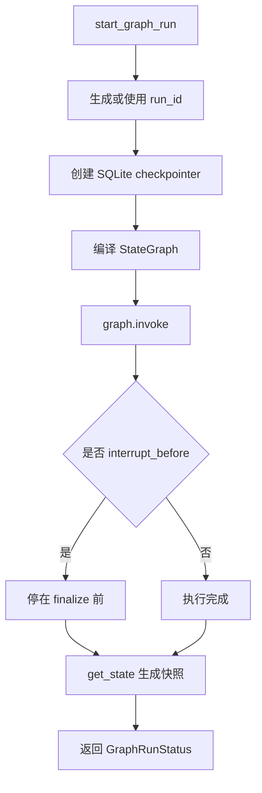
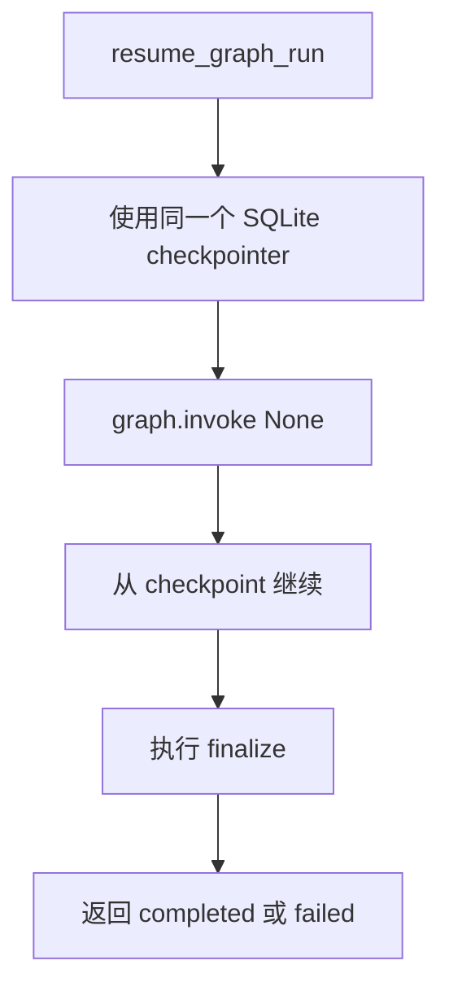
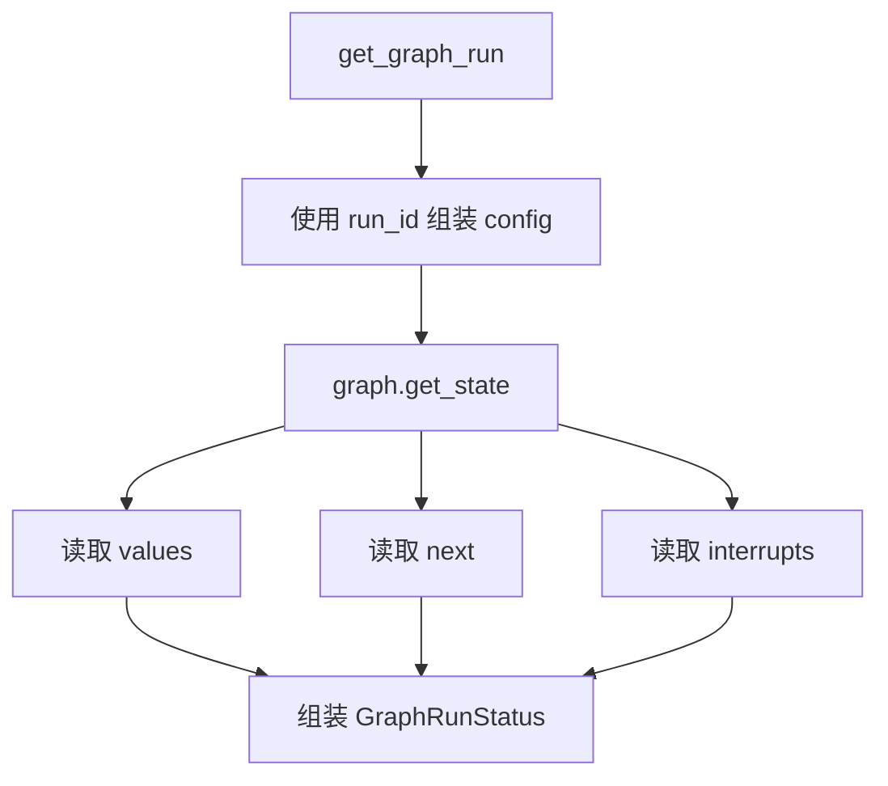

# Day 47 学习笔记

日期：2026-09-16

项目：`ai-job-agent`

目标：给 Day 46 的 LangGraph Supervisor 状态图增加长任务执行能力，包括 checkpoint、状态查询、中断和恢复。

## 1. Day 47 做了什么

Day 46 的图只能一次性跑完：

```text
graph.invoke(state)
  ->
返回最终结果
```

如果任务运行到一半进程退出，状态就丢了。

Day 47 增加了：

```text
run_id
  ->
checkpoint
  ->
interrupt_before
  ->
resume
  ->
state query
```

最终效果是：

```text
start_graph_run()
  ->
运行到指定节点前暂停
  ->
get_graph_run() 查看状态
  ->
resume_graph_run() 从暂停处继续
```

## 2. 今天改了哪些文件

| 文件 | 变化 | 作用 |
|---|---|---|
| `app/models.py` | 修改 | 增加 GraphRunStatus |
| `app/supervisor_graph.py` | 修改 | 增加 SQLite checkpointer、start、resume、state |
| `app/supervisor_graph_cli.py` | 修改 | 增加 start/resume/state 子命令 |
| `tests/test_supervisor_graph_checkpoint.py` | 新增 | 测试运行快照、中断和恢复 |

## 3. 项目闭环实际流程

### 3.1 长任务启动流程



### 3.2 恢复流程



### 3.3 状态查询流程



## 4. 核心概念

### 4.1 Checkpoint 是什么

Checkpoint 是图的“存档”。

它保存了：

- 当前状态。
- 接下来要执行的节点。
- 中断信息。

没有 Checkpoint，长任务一旦中断，只能从头开始。

### 4.2 Checkpointer 是什么

Checkpointer 是保存和读取 Checkpoint 的组件。

Day 47 使用 SQLite：

```python
from langgraph.checkpoint.sqlite import SqliteSaver

conn = sqlite3.connect(CHECKPOINT_DB_PATH)
checkpointer = SqliteSaver(conn)
```

它比 `MemorySaver` 更适合真实运行，因为数据会写到磁盘。

### 4.3 run_id 和 thread_id

LangGraph 用 config 区分不同运行：

```python
config = {
    "configurable": {
        "thread_id": run_id
    }
}
```

`run_id` 是业务层 ID，`thread_id` 是 LangGraph 内部用来查找 checkpoint 的 key。

### 4.4 interrupt_before 是什么

```python
graph.compile(
    checkpointer=checkpointer,
    interrupt_before=["finalize"],
)
```

含义是：

```text
执行到 finalize 节点之前
  ->
暂停
```

生产场景：

- 投递岗位前人工确认。
- 执行写操作前二次审核。
- 长任务关键节点前等待外部系统。

### 4.5 resume 是什么

```python
graph.invoke(None, config=config)
```

这里的 `None` 不是重新输入，而是：

```text
使用 checkpointer 里保存的状态继续执行
```

### 4.6 GraphRunStatus 是什么

```python
class GraphRunStatus(BaseModel):
    run_id: str
    status: Literal["running", "completed", "failed", "interrupted"]
    state: dict = Field(default_factory=dict)
    next_nodes: list[str] = Field(default_factory=list)
    result: SupervisorResult | None = None
    error: str = ""
```

它是给业务层看的运行快照。

字段含义：

| 字段 | 作用 |
|---|---|
| `run_id` | 本次任务 ID |
| `status` | 当前状态 |
| `state` | 当前图状态 |
| `next_nodes` | 接下来要执行的节点 |
| `result` | 已完成时的最终结果 |
| `error` | 失败原因 |

## 5. 每个改动在业务中负责什么

### 5.1 app/models.py

新增 `GraphRunStatus`。

它让 API 和 CLI 可以用一个统一对象返回运行状态。

### 5.2 app/supervisor_graph.py

#### get_default_checkpointer()

创建 SQLite checkpointer：

```python
conn = sqlite3.connect(
    CHECKPOINT_DB_PATH,
    check_same_thread=False,
)
return SqliteSaver(conn)
```

所有 CLI 进程都使用同一个数据库文件：

```text
data/langgraph_checkpoints.sqlite
```

这样 `start`、`state`、`resume` 才能共享 checkpoint。

#### _run_config()

生成 LangGraph 需要的 config：

```python
return {"configurable": {"thread_id": run_id}}
```

#### _snapshot_from_graph()

调用：

```python
snapshot = graph.get_state(config)
```

然后读取：

- `snapshot.values`
- `snapshot.next`
- `snapshot.interrupts`

最后组装成 `GraphRunStatus`。

#### start_graph_run()

负责启动一个长任务。

#### resume_graph_run()

负责从 checkpoint 继续。

#### get_graph_run()

负责查询当前状态。

### 5.3 app/supervisor_graph_cli.py

新增三个子命令：

```bash
start
state
resume
```

并打印 `run_id`，方便后续查询和恢复。

## 6. Python 初学者知识点

### 6.1 sqlite3.connect()

```python
import sqlite3

conn = sqlite3.connect(
    CHECKPOINT_DB_PATH,
    check_same_thread=False,
)
```

它创建一个 SQLite 数据库连接。

`check_same_thread=False` 是为了允许同一个连接在不同线程中使用。

### 6.2 uuid.uuid4().hex

```python
run_id = uuid.uuid4().hex
```

它生成一个随机的十六进制字符串，例如：

```text
77c795e1234e49bcba7b369c126630ac
```

适合作为任务 ID。

### 6.3 graph.invoke(None, config=config)

普通调用：

```python
graph.invoke(state, config=config)
```

表示从初始状态开始。

恢复调用：

```python
graph.invoke(None, config=config)
```

表示从 checkpoint 继续。

### 6.4 snapshot.next

LangGraph 的 `get_state()` 返回一个 `StateSnapshot`。

`snapshot.next` 表示接下来要执行的节点。

例如：

```python
("finalize",)
```

说明下一步是 `finalize`。

## 7. 实际生产中的对标方案

| Day 47 的做法 | 生产中的常见方案 |
|---|---|
| SQLite checkpointer | Redis、Postgres、DynamoDB |
| run_id | traceId、workflowId |
| interrupt_before | 人工审批节点、关键写操作前暂停 |
| resume | 工作流恢复、断点续跑 |
| GraphRunStatus | 任务状态查询接口 |
| get_state | 工作流实例状态查询 |

真实生产系统还会：

- 给 checkpoint 设置过期时间。
- 对 checkpoint 做版本管理。
- 在容器重启后自动恢复。
- 使用分布式锁避免同一个 run_id 被同时恢复。

## 8. Day 47 开发中常见报错及原因

### 8.1 MemorySaver 导致 state 和 resume 查不到 checkpoint

现象：

```text
start 正常，state 显示 failed
resume 报 Received no input for __start__
```

原因：

`MemorySaver` 只保存在当前进程内存中。

`start`、`state`、`resume` 是三个不同进程，各自创建了一个新的 `MemorySaver`，看不到彼此的 checkpoint。

解决：

换成 SQLite checkpointer，让多个进程读写同一个数据库文件。

### 8.2 Invalid checkpointer provided

现象：

```text
TypeError: Invalid checkpointer provided.
Received _GeneratorContextManager.
```

原因：

```python
SqliteSaver.from_conn_string(path)
```

返回的是上下文管理器，不是 checkpointer 对象。

解决：

改用：

```python
conn = sqlite3.connect(path, check_same_thread=False)
checkpointer = SqliteSaver(conn)
```

### 8.3 CLI unrecognized arguments

现象：

```text
error: unrecognized arguments: 我想转 AI Agent，需要补什么？ --interrupt-before finalize
```

原因：

旧 CLI 只接受一个 `question` 参数，没有 `start/resume/state` 子命令。

解决：

使用 `argparse` 的 `subparsers` 增加子命令。

## 9. 测试为什么要这样写

`tests/test_supervisor_graph_checkpoint.py` 使用 FakeGraph 和 FakeSnapshot，避免真实 LangGraph 和 SQLite。

### 9.1 test_start_graph_run_returns_interrupted_snapshot()

验证 interrupt_before 后，状态是 `interrupted`，并且 `next_nodes` 包含 `finalize`。

### 9.2 test_resume_graph_run_returns_completed_snapshot()

验证 resume 后能得到 completed 结果。

### 9.3 test_get_graph_run_returns_current_snapshot()

验证可以通过 run_id 查询当前状态。

## 10. Day 47 检查清单

- [ ] GraphRunStatus 已加入 models.py
- [ ] build_supervisor_graph() 支持 checkpointer
- [ ] build_supervisor_graph() 支持 interrupt_before
- [ ] start_graph_run() 已实现
- [ ] resume_graph_run() 已实现
- [ ] get_graph_run() 已实现
- [ ] SQLite checkpointer 已配置
- [ ] CLI 支持 start/resume/state
- [ ] run_id 会打印出来
- [ ] tests/test_supervisor_graph_checkpoint.py 已通过
- [ ] 全量测试通过

## 11. 当前已知限制

### 11.1 SQLite 只适合单机验证

生产环境高并发下应使用 Postgres、Redis 或 DynamoDB。

### 11.2 没有自动恢复机制

当前需要手动调用 resume。

生产上可以通过定时任务扫描 `interrupted` 状态并自动恢复。

### 11.3 没有节点级超时

当前节点如果卡住，图会一直等待。

后续可以给节点增加 timeout 和 retry 策略。

## 12. 下一步

Day 48 会增加多 Agent 共享记忆，让不同 Worker 和不同 run 之间能读写结构化状态。
