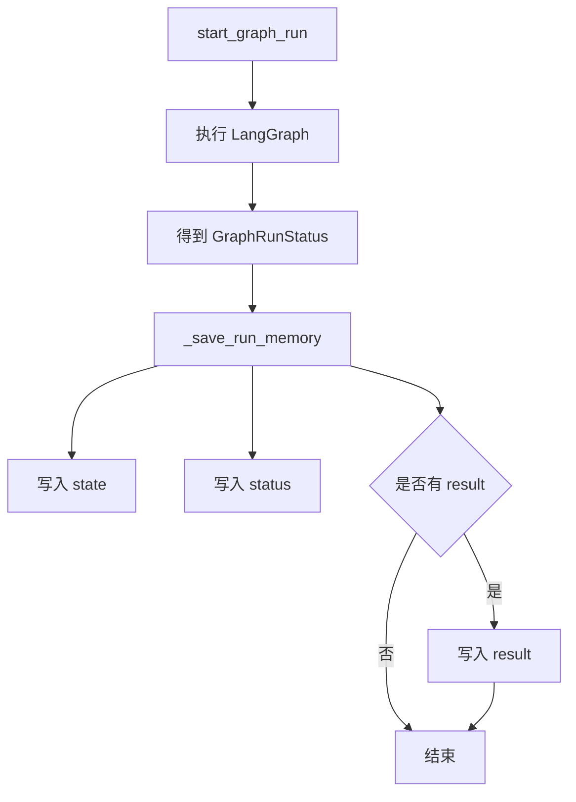
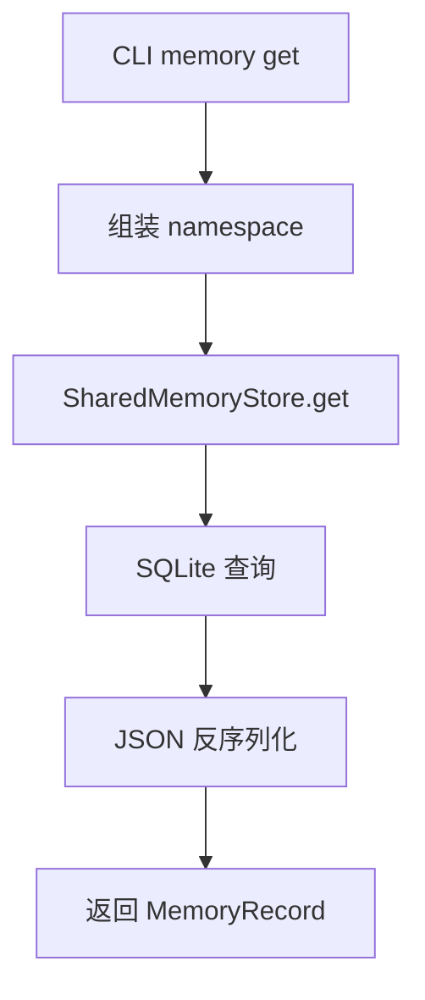
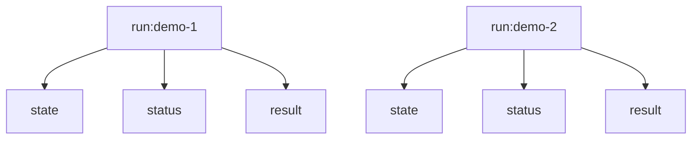

# Day 48 学习笔记

日期：2026-09-16

项目：`ai-job-agent`

目标：给多 Agent 系统增加共享记忆，让不同 run、不同 Worker 可以读取和写入结构化状态。

## 1. Day 48 做了什么

Day 47 的 checkpoint 解决的是：

```text
当前 run 执行到哪一步
```

但它主要服务 LangGraph 内部恢复。

Day 48 增加的是：

```text
不同 run 和不同 Agent 之间的共享信息
```

实现了一个 SQLite 持久化的 `SharedMemoryStore`。

现在系统可以把 run 的状态、最终结果写入共享记忆：

```text
run:demo-1/status
run:demo-1/state
run:demo-1/result
```

并且可以通过 CLI 或 API 查询。

## 2. 今天改了哪些文件

| 文件 | 变化 | 作用 |
|---|---|---|
| `app/models.py` | 修改 | 增加 MemoryRecord |
| `app/shared_memory.py` | 新增 | SQLite 共享记忆存储 |
| `app/supervisor_graph.py` | 修改 | start/resume 后写入 run memory |
| `app/supervisor_graph_cli.py` | 修改 | 增加 memory get/list/delete |
| `app/main.py` | 修改 | 增加 memory API |
| `tests/test_shared_memory.py` | 新增 | 测试记忆存储和 graph 集成 |

## 3. 项目闭环实际流程

### 3.1 写入记忆流程



### 3.2 读取记忆流程



### 3.3 namespace 隔离



不同 run 的数据存在不同 namespace 下，互不影响。

## 4. 核心概念

### 4.1 共享记忆是什么

共享记忆是多个 Agent 或多个任务可以共同访问的数据区。

它解决：

```text
Worker A 产生的结果，Worker B 如何复用
```

例如：

```text
knowledge Worker 查出了学习路径
  ->
写入 run memory
  ->
后续 Agent 可以读取
```

### 4.2 MemoryRecord 是什么

```python
class MemoryRecord(BaseModel):
    memory_id: str
    namespace: str
    key: str
    value: Any
    created_at: str
    updated_at: str
```

它是一条记忆记录。

字段含义：

| 字段 | 作用 |
|---|---|
| `memory_id` | 唯一 ID |
| `namespace` | 隔离空间 |
| `key` | 记忆名称 |
| `value` | 记忆内容 |
| `created_at` | 创建时间 |
| `updated_at` | 更新时间 |

### 4.3 namespace 是什么

namespace 是记忆的隔离空间。

Day 48 使用：

```text
run:{run_id}
```

例如：

```text
run:demo-1
run:demo-2
```

生产上还会扩展为：

```text
user:123
agent:knowledge
thread:abc
```

### 4.4 key 是什么

key 是 namespace 内的记忆名称。

同一个 namespace 下，key 唯一。

例如：

```text
run:demo-1/status
run:demo-1/result
```

### 4.5 SharedMemoryStore 是什么

它是共享记忆的存储实现。

提供：

```text
set
get
list_namespace
delete
```

底层使用 SQLite。

## 5. 每个改动在业务中负责什么

### 5.1 app/models.py

增加 `MemoryRecord`。

它负责统一记忆记录的数据结构。

### 5.2 app/shared_memory.py

这是 Day 48 的核心文件。

#### set()

负责新增或覆盖一条记忆。

使用 SQLite 的：

```sql
UNIQUE(namespace, key)
```

保证同一个 namespace 下同一个 key 只有一条。

#### get()

按 namespace 和 key 查询单条记录。

#### list_namespace()

查询某个 namespace 下的所有记录。

#### delete()

删除指定记录。

### 5.3 app/supervisor_graph.py

增加了：

```python
def _save_run_memory(
    memory_store,
    run_id: str,
    snapshot: GraphRunStatus,
) -> None:
    ...
```

`start_graph_run()` 和 `resume_graph_run()` 在得到 `GraphRunStatus` 后，把它写入共享记忆。

### 5.4 app/supervisor_graph_cli.py

增加：

```text
memory list
memory get
memory delete
```

方便本地查看共享记忆。

### 5.5 app/main.py

增加：

```text
GET /agent/memory/{run_id}
GET /agent/memory/{run_id}/{key}
DELETE /agent/memory/{run_id}/{key}
```

让前端或其他服务可以查询记忆。

## 6. Python 初学者知识点

### 6.1 sqlite3 和 SQL

`SharedMemoryStore` 使用标准库 `sqlite3`。

不需要安装额外数据库。

核心 SQL：

```sql
CREATE TABLE IF NOT EXISTS agent_memory (...)
```

表示如果表不存在就创建。

### 6.2 UNIQUE 约束

```sql
UNIQUE(namespace, key)
```

表示：

```text
namespace + key 的组合不能重复
```

所以重复 set 同一个 key 时，会覆盖旧值。

### 6.3 json.dumps 和 json.loads

写入时：

```python
value_json = json.dumps(value, ensure_ascii=False)
```

把 Python 对象转成 JSON 字符串。

读取时：

```python
value=json.loads(row[3])
```

把 JSON 字符串转回 Python 对象。

### 6.4 threading.RLock

```python
self._lock = threading.RLock()
```

`RLock` 是线程锁，用来避免多个线程同时写 SQLite。

生产上如果使用 Redis，会由 Redis 自身提供并发控制。

## 7. 实际生产中的对标方案

| Day 48 的做法 | 生产中的常见方案 |
|---|---|
| SQLite 文件 | Redis、Postgres、DynamoDB |
| namespace | tenantId、userId、threadId |
| key | 记忆键 |
| MemoryRecord | 记忆对象 |
| set/get/list/delete | 记忆服务 API |
| run:{run_id} | 工作流实例上下文 |

真实生产系统还会增加：

- TTL 过期。
- 权限控制。
- 写入审计日志。
- 多租户隔离。
- 记忆压缩和摘要。

## 8. Day 48 开发中常见报错及原因

### 8.1 No module named app.shared_memory

原因：

`app/shared_memory.py` 还没创建。

解决：

创建该文件，并实现 `SharedMemoryStore`。

### 8.2 TypeError: Object of type X is not JSON serializable

原因：

`SharedMemoryStore.set()` 内部使用：

```python
json.dumps(value)
```

如果传入 Pydantic 对象，不能直接序列化。

解决：

调用前先转换：

```python
memory.set(namespace, "result", result.model_dump())
```

### 8.3 sqlite3.OperationalError: no such table

原因：

没有执行建表 SQL。

解决：

在 `SharedMemoryStore.__init__()` 中执行：

```python
CREATE TABLE IF NOT EXISTS agent_memory (...)
```

### 8.4 不同 run 的数据串了

原因：

namespace 没有按 run_id 区分。

解决：

统一使用：

```python
namespace = f"run:{run_id}"
```

## 9. 测试为什么要这样写

`tests/test_shared_memory.py` 有 5 个测试。

### 9.1 test_memory_store_set_and_get()

验证基础写入和读取。

### 9.2 test_memory_store_overwrites_existing_key()

验证同一个 key 会覆盖旧值。

### 9.3 test_memory_store_list_namespace()

验证 namespace 下能列出多条记录。

### 9.4 test_memory_store_delete()

验证删除后读取不到。

### 9.5 test_start_graph_run_writes_run_memory()

验证 graph run 完成后会写入 state、status、result。

测试使用 SQLite `:memory:`，不产生磁盘文件。

## 10. Day 48 检查清单

- [ ] MemoryRecord 已加入 models.py
- [ ] SharedMemoryStore 已实现
- [ ] SQLite 表已创建
- [ ] set/get/list/delete 已实现
- [ ] namespace 隔离已实现
- [ ] start_graph_run 写入 run memory
- [ ] resume_graph_run 更新 run memory
- [ ] CLI 支持 memory list/get/delete
- [ ] API 支持 memory list/get/delete
- [ ] tests/test_shared_memory.py 已通过
- [ ] 全量测试通过

## 11. 当前已知限制

### 11.1 失败路径没有写入记忆

当前 `start_graph_run()` 在 graph.invoke 抛异常时，直接返回 snapshot，没有调用 `_save_run_memory()`。

生产上失败状态也应该写入记忆，方便排查。

### 11.2 记忆没有 TTL

当前记录不会自动过期。

生产上通常会给短期记忆设置 TTL。

### 11.3 记忆值依赖 JSON 可序列化

调用方需要先把 Pydantic 对象转成 dict。

## 12. 下一步

Day 49 会做生产级多 Agent 设计收尾，重点处理：

- 隔离
- 幂等
- 超时
- 审计
- 成本控制
