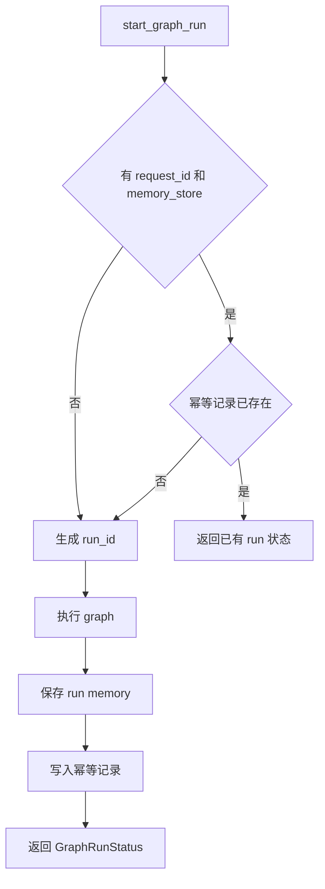
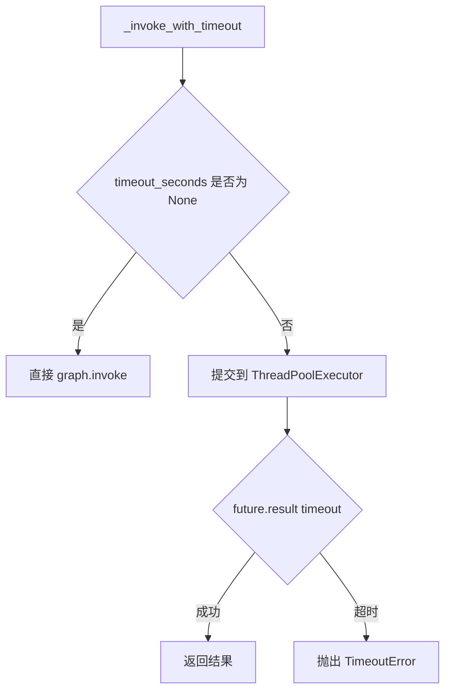
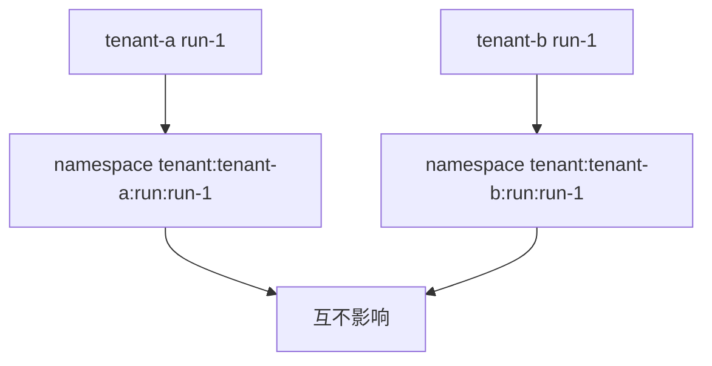

# Day 49 学习笔记

日期：2026-09-16

项目：`ai-job-agent`

目标：给多 Agent 系统补上生产化关键能力，包括租户隔离、幂等和超时控制。

## 1. Day 49 做了什么

Day 48 已经能共享记忆，但还存在几个生产级问题：

```text
没有租户隔离
  ->
不同用户或业务可能互相影响

没有幂等
  ->
同一个请求重试可能创建多个 run

没有超时
  ->
图节点卡住时请求会一直等待
```

Day 49 完成：

```text
tenant_id 隔离
  ->
request_id 幂等
  ->
timeout_seconds 超时
```

## 2. 今天改了哪些文件

| 文件 | 变化 | 作用 |
|---|---|---|
| `app/models.py` | 修改 | GraphRunStatus 增加 request_id 和 tenant_id |
| `app/supervisor_graph.py` | 修改 | 增加隔离、幂等、超时 |
| `app/supervisor_graph_cli.py` | 修改 | CLI 支持生产参数 |
| `app/main.py` | 修改 | API 支持生产参数 |
| `tests/test_production_guardrails.py` | 新增 | 测试隔离、幂等、超时 |
| `tests/test_shared_memory.py` | 修改 | 测试适配租户 namespace |

## 3. 项目闭环实际流程

### 3.1 带幂等的 start 流程



### 3.2 带超时的 graph 执行流程



### 3.3 租户隔离流程



## 4. 核心概念

### 4.1 幂等 Idempotency 是什么

幂等表示同一个请求执行一次和执行多次，结果一致。

Day 49 中：

```text
request_id=request-1
```

第一次调用会创建 run，并保存：

```text
request-1 -> run-abc
```

第二次用同一个 `request_id` 调用时，不创建新 run，而是直接返回 `run-abc` 的状态。

生产场景：

- 网络超时后客户端重试。
- 用户重复点击按钮。
- 消息队列重复投递。

### 4.2 租户隔离 Tenant Isolation 是什么

租户隔离表示不同租户的数据不能互相访问。

Day 49 使用：

```text
tenant:{tenant_id}:run:{run_id}
```

例如：

```text
tenant:user-a:run:run-1
tenant:user-b:run:run-1
```

两个租户的 run 即使 run_id 相同，也互不影响。

生产场景：

- SaaS 多租户系统。
- 不同业务线共享同一服务。
- 测试环境和生产环境隔离。

### 4.3 超时 Timeout 是什么

超时表示任务执行超过指定时间后，调用方不再等待。

Day 49 使用：

```python
_invoke_with_timeout(graph, state, config, timeout_seconds)
```

如果图执行超过 `timeout_seconds`，会抛出：

```text
TimeoutError
```

并返回 `status=failed`。

生产场景：

- 防止单个请求占用资源过久。
- 防止 LLM 调用卡住导致服务雪崩。
- 给用户一个明确的失败反馈。

## 5. 每个改动在业务中负责什么

### 5.1 app/models.py

`GraphRunStatus` 增加：

```python
request_id: str | None = None
tenant_id: str = "default"
```

这让 API 和 CLI 能返回完整的运行上下文。

### 5.2 app/supervisor_graph.py

#### _invoke_with_timeout()

负责在指定时间内执行 graph。

核心逻辑：

```python
executor = concurrent.futures.ThreadPoolExecutor(max_workers=1)

try:
    future = executor.submit(graph.invoke, ...)
    return future.result(timeout=timeout_seconds)
except concurrent.futures.TimeoutError as exc:
    raise TimeoutError(...)
finally:
    executor.shutdown(wait=False, cancel_futures=True)
```

注意：

```text
这是软超时
```

调用方会及时返回，但底层线程可能仍在运行。

生产级硬超时需要进程隔离或 LangGraph Run Control。

#### _run_namespace()

生成租户级 run namespace：

```python
f"tenant:{tenant_id}:run:{run_id}"
```

#### _idempotency_namespace()

生成幂等 namespace：

```python
f"tenant:{tenant_id}:idempotency"
```

#### start_graph_run()

增加三个参数：

```python
request_id: str | None = None
tenant_id: str = "default"
timeout_seconds: float | None = None
```

并实现：

- 幂等检查。
- 租户隔离。
- 超时执行。
- 成功、失败、超时都写入 memory。

#### resume_graph_run()

增加：

```python
tenant_id: str = "default"
timeout_seconds: float | None = None
```

恢复时同样支持超时和租户隔离。

#### get_graph_run()

增加：

```python
tenant_id: str = "default"
```

返回的 `GraphRunStatus` 会带上 `tenant_id`。

### 5.3 app/supervisor_graph_cli.py

增加：

```text
--request-id
--tenant-id
--timeout-seconds
```

### 5.4 app/main.py

`GraphRunRequest` 和 `GraphResumeRequest` 增加生产参数，并在接口中传递。

Memory API 也改成：

```text
tenant:{tenant_id}:run:{run_id}
```

## 6. Python 初学者知识点

### 6.1 ThreadPoolExecutor

```python
executor = concurrent.futures.ThreadPoolExecutor(max_workers=1)
```

它创建一个线程池，让同步阻塞任务在另一个线程中运行。

`future.result(timeout=...)` 可以设置等待时间。

### 6.2 cancel_futures

```python
executor.shutdown(wait=False, cancel_futures=True)
```

含义：

- `wait=False`：不等待线程池中的线程结束。
- `cancel_futures=True`：取消尚未开始的任务。

但已经运行中的线程无法被强制取消。

### 6.3 幂等 key

幂等记录使用：

```text
tenant:{tenant_id}:idempotency
```

`request_id` 作为 key。

这样可以避免不同租户使用相同 `request_id` 时互相冲突。

### 6.4 租户 namespace

```python
namespace = f"tenant:{tenant_id}:run:{run_id}"
```

这是字符串拼接的 namespace，不是数据库表。

生产上如果使用 Redis，通常会用类似：

```text
tenant:{tenant_id}:run:{run_id}
```

作为 key。

## 7. 实际生产中的对标方案

| Day 49 的做法 | 生产中的常见方案 |
|---|---|
| request_id 幂等 | 数据库唯一索引、Redis SETNX |
| tenant namespace | 多租户数据库隔离、tenant_id 分区 |
| timeout_seconds | HTTP timeout、工作流超时 |
| ThreadPoolExecutor | 异步任务队列、进程池 |
| 幂等记录写 memory | 幂等表 |

真实生产系统还会：

- 使用分布式锁处理并发幂等。
- 使用 Redis 或数据库实现硬超时。
- 给超时任务做补偿或告警。
- 对租户做配额限制。

## 8. Day 49 开发中常见报错及原因

### 8.1 _snapshot_from_graph() got an unexpected keyword argument 'request_id'

原因：

`start_graph_run()` 已经给 `_snapshot_from_graph()` 传了 `request_id`，但函数签名没有增加这个参数。

解决：

```python
def _snapshot_from_graph(
    ...,
    request_id: str | None = None,
    tenant_id: str = "default",
):
    ...
```

### 8.2 _save_run_memory() missing 1 required positional argument

原因：

`_save_run_memory()` 的参数顺序是：

```text
memory_store
tenant_id
run_id
snapshot
```

但调用时写成了：

```python
_save_run_memory(memory_store, run_id, snapshot)
```

解决：

```python
_save_run_memory(memory_store, tenant_id, run_id, snapshot)
```

### 8.3 测试读取不到 memory

现象：

```text
assert None is not None
```

原因：

代码已经改成：

```text
tenant:default:run:demo-run-memory
```

但测试还在读：

```text
run:demo-run-memory
```

解决：

测试改为：

```python
memory.get("tenant:default:run:demo-run-memory", "state")
```

### 8.4 ThreadPoolExecutor 超时后仍然等待

原因：

如果使用：

```python
with ThreadPoolExecutor(max_workers=1) as executor:
    ...
```

退出 `with` 时会等待线程池结束，超时失效。

解决：

不使用 `with`，改成：

```python
executor = ThreadPoolExecutor(max_workers=1)
try:
    ...
finally:
    executor.shutdown(wait=False, cancel_futures=True)
```

## 9. 测试为什么要这样写

`tests/test_production_guardrails.py` 有 4 个测试。

### 9.1 test_invoke_with_timeout_returns_result()

验证正常执行时超时包装不会影响结果。

### 9.2 test_start_graph_run_times_out()

验证超时时返回 `failed`，不会一直等待。

### 9.3 test_start_graph_run_is_idempotent()

验证相同 `request_id` 第二次调用不会创建新 run。

### 9.4 test_run_namespace_isolation()

验证租户 namespace 正确隔离。

## 10. Day 49 检查清单

- [ ] GraphRunStatus 增加 request_id
- [ ] GraphRunStatus 增加 tenant_id
- [ ] _invoke_with_timeout() 已实现
- [ ] start_graph_run 支持 timeout_seconds
- [ ] resume_graph_run 支持 timeout_seconds
- [ ] request_id 幂等已实现
- [ ] tenant namespace 隔离已实现
- [ ] 失败路径也写入 memory
- [ ] CLI 增加生产参数
- [ ] API 增加生产参数
- [ ] tests/test_production_guardrails.py 已通过
- [ ] tests/test_shared_memory.py 已更新
- [ ] 全量测试通过

## 11. 当前已知限制

### 11.1 ThreadPoolExecutor 是软超时

调用方会超时返回，但底层线程可能还在运行。

生产级硬超时需要进程级隔离或 LangGraph Run Control。

### 11.2 幂等依赖 shared memory

如果 shared memory 不可用，幂等也无法生效。

生产上通常使用 Redis 或数据库唯一索引。

### 11.3 超时任务缺少补偿机制

当前超时只返回 failed，没有重试或补偿。

后续可以加入任务恢复和告警。

## 12. 下一步

第 7 周多 Agent 架构到这里已经完整闭环。

Day 50 起进入第 8 周 MCP、工具生态和安全。
