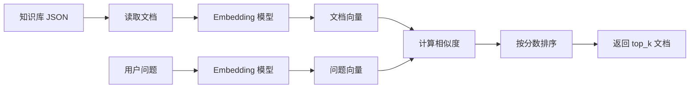

# Day 5 学习笔记

日期：2026-08-20

项目：`ai-job-agent`

目标：搭建一个最小 RAG 检索链路，把岗位知识库文本转成向量，并通过相似度找出和问题最相关的知识片段。

今天不接入 LLM 回答，只完成检索部分。

## 1. Day 5 做了什么

### 1.1 新增依赖

```bash
uv add sentence-transformers numpy
```

### 1.2 新增文件

| 文件 | 作用 |
|---|---|
| `data/knowledge_base.json` | 岗位知识库 |
| `app/rag.py` | RAG 检索逻辑 |
| `app/rag_cli.py` | 命令行检索入口 |
| `tests/test_rag.py` | 测试检索逻辑 |

### 1.3 当前 RAG 流程



## 2. 核心知识

### 2.1 RAG 是什么

RAG 是 Retrieval-Augmented Generation，中文叫检索增强生成。

它解决的问题：

- 模型不知道私有数据
- 模型可能产生幻觉
- 上下文窗口放不下全部资料

完整 RAG 流程：

```text
资料 -> 切分 -> 向量化 -> 向量库
问题 -> 向量化 -> 相似度检索 -> 取出资料 -> 交给模型回答
```

Day 5 只完成前半段，即向量化和相似度检索。

### 2.2 DeepSeek 不做 Embedding

DeepSeek 主要提供对话生成能力，不负责把文字转成向量。

所以本项目使用本地 Embedding 模型：

```python
DEFAULT_EMBEDDING_MODEL = "BAAI/bge-small-zh-v1.5"
```

这个模型可以把中文文本转成向量。

### 2.3 什么是 Embedding

文字不能直接计算相似度，所以需要转成数字向量。

例如：

```text
"Python 工程师" -> [0.21, 0.87, 0.14, ...]
"Java 工程师"   -> [0.18, 0.23, 0.79, ...]
```

语义越接近，向量方向越接近。

### 2.4 如何计算相似度

本项目先把所有向量归一化，然后使用点积：

```python
scores = self.doc_embeddings @ query_embedding
```

归一化后，点积接近 1 表示相似，接近 0 表示不相似。

## 3. 核心代码说明

### 3.1 读取知识库

```python
def load_documents(path: Path) -> list[dict]:
    with path.open("r", encoding="utf-8") as file:
        return json.load(file)
```

- 打开 JSON 文件
- 读取并返回 Python 列表

### 3.2 初始化检索器

```python
class RAGRetriever:
    def __init__(self, documents: list[dict], model):
        self.documents = documents
        self.model = model
        self.texts = [doc["text"] for doc in documents]
        self.doc_embeddings = model.encode(
            self.texts,
            normalize_embeddings=True,
        )
```

解释：

- 保存原始文档
- 保存模型
- 取出每篇文档的 `text`
- 把所有文档一次性编码成向量

### 3.3 检索

```python
def retrieve(self, query: str, top_k: int = 3) -> list[dict]:
    query_embedding = self.model.encode(
        [query],
        normalize_embeddings=True,
    )[0]

    scores = self.doc_embeddings @ query_embedding

    top_indices = np.argsort(scores)[::-1][:top_k]

    return [
        {
            "doc": self.documents[index],
            "score": float(scores[index]),
        }
        for index in top_indices
    ]
```

解释：

- 把问题编码成向量
- `[0]` 取出唯一的问题向量
- `@` 计算文档向量和问题向量的点积
- `np.argsort()` 返回从小到大排序的索引
- `[::-1]` 反转成从大到小
- `[:top_k]` 取前几个
- 返回对应文档和分数

## 4. Python 语法知识点

### 4.1 with open

```python
with path.open("r", encoding="utf-8") as file:
    return json.load(file)
```

`with` 会自动关闭文件，即使读取过程中发生异常。

### 4.2 列表推导式

```python
self.texts = [doc["text"] for doc in documents]
```

相当于 TypeScript：

```ts
const texts = documents.map((doc) => doc.text)
```

### 4.3 numpy 数组

`numpy` 是 Python 的数值计算库，类似前端里的向量或矩阵运算库。

普通列表不支持 `@`，numpy 数组支持矩阵乘法。

### 4.4 np.argsort

```python
np.argsort(scores)
```

返回的是排序后的索引，而不是排序后的值。

例如：

```python
scores = [0.2, 0.9, 0.5]
np.argsort(scores)
```

返回：

```text
[0, 2, 1]
```

表示最小值的索引是 0，第二小的是 2，最大的是 1。

## 5. 遇到的问题

### 5.1 安装 sentence-transformers 很慢

现象：

`uv add sentence-transformers` 下载很久。

原因：

- 这个包依赖 `torch`、`transformers` 等大型库
- `torch` 可能有几百 MB 甚至更大
- 默认访问 PyPI 官方源，科学上网不一定会更快

解决：

使用国内 PyPI 镜像：

```bash
export UV_DEFAULT_INDEX=https://pypi.tuna.tsinghua.edu.cn/simple
uv add sentence-transformers numpy
```

如果代理影响镜像速度，先关闭代理：

```bash
unset http_proxy
unset https_proxy
unset all_proxy
```

### 5.2 ValueError: matmul: Input operand 1 has a mismatch

错误信息：

```text
ValueError: matmul: Input operand 1 has a mismatch in its core dimension 0
size 1 is different from 512
```

原因：

问题向量写成了：

```python
query_embedding = self.model.encode(
    [query],
    normalize_embeddings=True,
)
```

`encode([query])` 返回形状 `(1, 512)`，是二维数组。

而文档向量形状是 `(文档数量, 512)`。

`(文档数量, 512) @ (1, 512)` 无法进行矩阵乘法。

解决：

加 `[0]`：

```python
query_embedding = self.model.encode(
    [query],
    normalize_embeddings=True,
)[0]
```

这样问题向量形状变成 `(512,)`，矩阵乘法才能正常执行。

### 5.3 TypeError: unsupported operand type(s) for @: 'list' and 'list'

错误信息：

```text
TypeError: unsupported operand type(s) for @: 'list' and 'list'
```

原因：

测试中的 `FakeModel.encode()` 返回普通 Python 列表：

```python
return [
    [1.0, 0.0, 0.0],
    [0.0, 1.0, 0.0],
    [0.0, 0.0, 1.0],
]
```

普通列表不支持 `@`。

解决：

让 FakeModel 返回 numpy 数组：

```python
import numpy as np

class FakeModel:
    def encode(self, texts, normalize_embeddings=True):
        vectors = {
            "python": [1.0, 0.0, 0.0],
            "docker": [0.0, 1.0, 0.0],
            "rag": [0.0, 0.0, 1.0],
        }
        return np.array([vectors[text] for text in texts])
```

### 5.4 Hugging Face 模型下载慢

首次运行检索 CLI 时会下载 Embedding 模型。

如果模型下载慢，可以设置国内镜像：

```bash
export HF_ENDPOINT=https://hf-mirror.com
```

然后重新运行：

```bash
uv run python -m app.rag_cli "AI Agent 需要哪些技能"
```

## 6. 测试策略

`tests/test_rag.py` 不加载真实模型，而是使用 FakeModel：

```python
class FakeModel:
    def encode(self, texts, normalize_embeddings=True):
        vectors = {
            "python": [1.0, 0.0, 0.0],
            "docker": [0.0, 1.0, 0.0],
            "rag": [0.0, 0.0, 1.0],
        }
        return np.array([vectors[text] for text in texts])
```

这样测试速度快，也不会下载模型。

真实模型只在命令行运行时使用：

```bash
uv run python -m app.rag_cli "AI Agent 需要哪些技能"
```

## 7. Day 5 检查清单

- [ ] 安装 `sentence-transformers` 和 `numpy`
- [ ] 创建知识库 JSON
- [ ] 创建 `app/rag.py`
- [ ] 创建 `app/rag_cli.py`
- [ ] 创建 `tests/test_rag.py`
- [ ] 修复问题向量维度问题
- [ ] 修复 FakeModel 返回列表的问题
- [ ] 所有测试通过
- [ ] 命令行检索能返回合理结果
- [ ] 理解 Embedding 和相似度计算

## 8. 明天要做什么

Day 6 会把 RAG 检索结果接入 Agent 流程，让模型根据检索到的知识片段生成更准确的回答。
