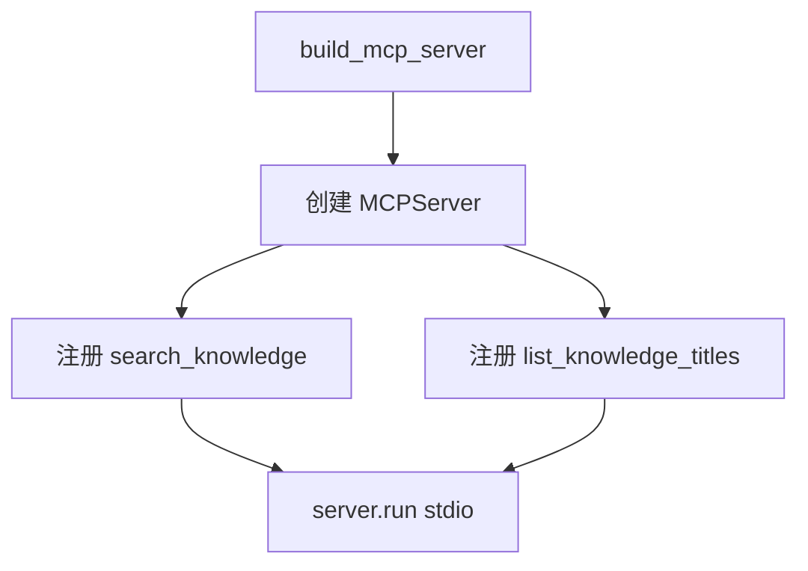
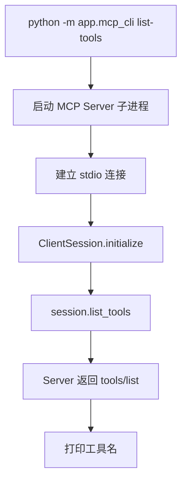
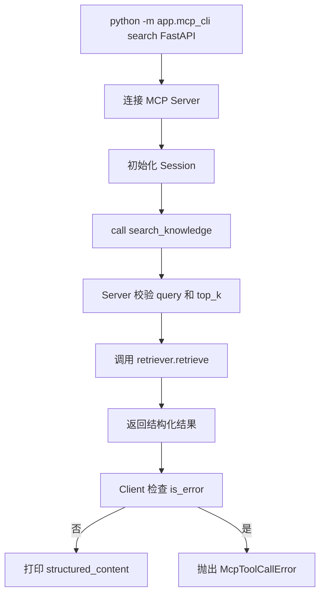
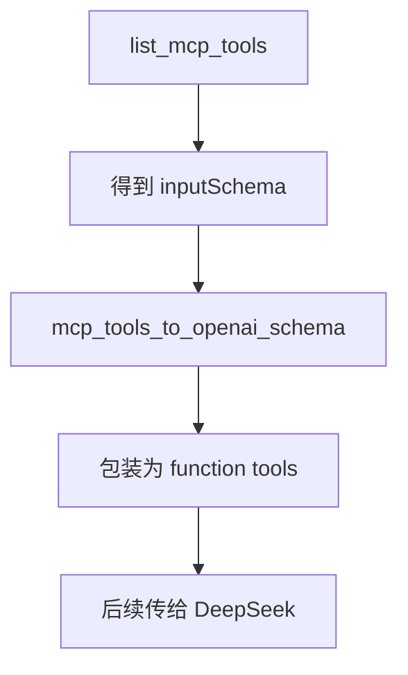

# Day 50 学习笔记

日期：2026-09-16

项目：`ai-job-agent`

主题：MCP 原理、第一个只读 MCP Server、本地 MCP Client 和工具发现

## 1. Day 50 做了什么

Day 49 已经把多 Agent 的租户隔离、幂等和软超时补上。Day 50 进入第 8 周 MCP、工具生态和安全。

今天的目标不是把 MCP 协议重新实现一遍，而是：

```text
理解 MCP 是什么
  ->
使用官方 Python MCP SDK
  ->
把项目里的知识库能力暴露成 MCP Tool
  ->
用本地 MCP Client 发现和调用这些 Tool
  ->
为 Day 52 接入 Agent 做准备
```

今天完成：

```text
app/mcp_tools.py
  ->
纯业务工具层和数据结构

app/mcp_server.py
  ->
把工具暴露为 MCP Server

app/mcp_client.py
  ->
发现和调用 MCP Tool

app/mcp_cli.py
  ->
命令行调试工具

tests/test_mcp_tools.py
  ->
覆盖工具注册、参数校验和 Schema 转换
```

## 2. 今天改了哪些文件

| 文件 | 变化 | 作用 |
|---|---|---|
| `pyproject.toml` | 修改 | 增加 `mcp[cli]>=2.2.0` |
| `uv.lock` | 修改 | 锁定 MCP SDK 及其依赖版本 |
| `app/mcp_tools.py` | 新增 | 定义 MCP Tool 业务逻辑和工具目录 |
| `app/mcp_server.py` | 新增 | 创建只读知识库 MCP Server |
| `app/mcp_client.py` | 新增 | 使用官方 SDK 发现和调用工具 |
| `app/mcp_cli.py` | 新增 | 提供本地命令行调试入口 |
| `tests/test_mcp_tools.py` | 新增 | 测试工具层、参数边界和 Schema 转换 |

## 3. MCP 是什么

### 3.1 一句话理解

MCP 是 AI 模型和外部工具之间的标准接口。

可以把 MCP 理解成 AI Agent 世界的 USB-C 或 HTTP 接口：

```text
以前：
每个 AI 产品都要单独对接数据库、GitHub、CRM、文件系统、浏览器、办公软件

现在：
这些能力都可以做成 MCP Server
AI 产品通过标准协议连接这些 MCP Server
```

### 3.2 为什么需要 MCP

AI Agent 不能只靠模型自己完成任务，它需要读数据、改数据、执行动作。

如果每个 Agent 都用不同的方式连接外部系统，会出现：

- 每个工具接口都不一致。
- 同一个工具无法在多个 Agent 中复用。
- 每接入一个新工具都要写一套适配代码。
- 安全和权限模型难以统一。

MCP 解决的是：

```text
工具提供方
  ->
只需要实现一次 MCP Server

工具消费方
  ->
通过统一协议发现和调用工具
```

### 3.3 MCP 的三个核心角色

| 角色 | 业务中的含义 |
|---|---|
| Host | 最终承载 Agent 的产品，例如聊天软件、IDE、企业内部平台 |
| Client | Host 内部负责连接 MCP Server 的组件 |
| Server | 提供工具、资源或提示词的服务 |

例如在 Cursor、Claude Desktop 这类产品中：

```text
Claude Desktop / Cursor = Host
Host 内部的 MCP Client = Client
GitHub MCP Server = Server
```

### 3.4 MCP 的核心原语

#### Tool

Tool 是模型可以调用的动作。

例如：

- 搜索知识库。
- 创建工单。
- 执行 SQL。
- 打开网页。

每个 Tool 有：

```text
name
description
input schema
执行逻辑
返回结果
```

#### Resource

Resource 是可被读取的数据。

例如：

- 一份文档。
- 一个数据库表结构。
- 一条订单详情。

Tool 和 Resource 的区别：

```text
Tool 表示动作
Resource 表示数据
```

#### Prompt

Prompt 是 Server 提供给 Host 的提示词模板。

它适合把某类任务的标准提示词封装起来，让不同 Agent 复用。

#### 其他能力

MCP 还支持：

- Sampling：Server 请求 Host 的模型完成一次生成。
- Roots：Client 告诉 Server 自己有哪些工作目录或数据源。
- Logging：Server 输出结构化日志。
- Elicitation：Server 请求用户输入。
- Auth：OAuth 授权。

## 4. MCP 在不同 AI Agent 产品中的用法

### 4.1 编程 Agent

产品例如 Cursor、Codex、Copilot、Claude Code。

典型 MCP Server：

- Filesystem MCP Server
- Git MCP Server
- Terminal MCP Server
- Browser MCP Server
- Package registry MCP Server

业务价值：

```text
用户说“帮我修复这个测试”
Agent 先发现可用的 MCP 工具
再读取文件
再运行测试
再修改代码
```

MCP 让编程 Agent 不依赖某个 IDE 私有 API，也能获得同一套文件、终端和 Git 能力。

### 4.2 企业知识库和办公 Agent

产品例如企业微信助手、钉钉智能助手、Notion AI、内部问答平台。

典型 MCP Server：

- Notion MCP Server
- Google Drive MCP Server
- SharePoint MCP Server
- PostgreSQL MCP Server
- Elasticsearch MCP Server

业务价值：

```text
用户问“第三季度华东区销售情况”
Agent 通过 MCP 查询数据库
再通过 MCP 读取分析文档
最后生成答案
```

以前这些数据源需要每个产品单独接入，现在可以统一封装成 MCP Server。

### 4.3 客服 Agent

产品例如智能客服、售后机器人、工单助手。

典型 MCP Server：

- CRM MCP Server
- 工单系统 MCP Server
- 订单系统 MCP Server
- 知识库 MCP Server

业务价值：

```text
用户说“帮我查一下订单状态”
Agent 先读取用户上下文
再调用订单查询 Tool
再根据订单状态决定是否转人工
```

MCP 可以把危险操作统一暴露为 Tool，并由 Host 做权限控制和审批。

### 4.4 数据分析 Agent

产品例如数据问答机器人、BI 助手、运营分析助手。

典型 MCP Server：

- SQL MCP Server
- Metabase MCP Server
- Excel MCP Server
- Data warehouse MCP Server

业务价值：

```text
自然语言
  ->
Agent 理解指标
  ->
通过 MCP 查询数据库
  ->
返回表格或图表
```

### 4.5 浏览器和自动化 Agent

产品例如研究 Agent、竞品分析 Agent、电商运营 Agent。

典型 MCP Server：

- Playwright MCP Server
- Chrome DevTools MCP Server
- 电商平台 MCP Server
- 广告平台 MCP Server

业务价值：

```text
Agent 可以打开网页、截图、点击、抓取内容
再通过另一个 MCP Server 写回表格或发布到运营系统
```

## 5. MCP 和 OpenAI Function Calling 的关系

这是初学者最容易混淆的地方。

### 5.1 OpenAI Function Calling 是什么

它让模型输出：

```text
我要调用哪个函数
参数是什么
```

但它不负责真正执行函数，也不负责工具如何被服务端发现。

### 5.2 MCP 是什么

MCP 负责：

```text
Server 暴露哪些工具
工具参数是什么
Client 如何发现工具
Client 如何远程调用工具
结果如何返回
```

### 5.3 两者如何配合

一个常见的生产流程是：

```text
MCP Client 从 MCP Server 获取工具列表
  ->
把 MCP Tool 的 inputSchema 转换成 OpenAI function schema
  ->
把 OpenAI function schema 传给模型
  ->
模型返回 tool_calls
  ->
Host 再通过 MCP Client 调用真实 MCP Server
```

Day 50 已经实现：

```python
mcp_tools_to_openai_schema(tools)
```

这个函数就是把 MCP 工具定义转换成 OpenAI 工具格式。

## 6. 本项目为什么需要 MCP

项目原来的工具注册方式在 `app/tools.py` 中：

```text
ToolRegistry
  ->
内部硬编码工具
```

这种方式的缺点是：

- 工具和 Agent 在同一个进程里。
- 前端、后台和其他 Agent 不能独立复用这些工具。
- 工具权限和安全边界不清晰。
- 新增工具必须改这个项目的代码。

使用 MCP 后，知识库检索可以独立成一个工具服务：

```text
ai-job-agent FastAPI 服务
  ->
连接 ai-job-agent MCP Server
  ->
发现 search_knowledge
  ->
调用知识库检索
```

Day 50 只暴露两个只读工具：

```text
search_knowledge
list_knowledge_titles
```

暂时不暴露 `apply_job`，因为它会产生外部动作，Day 53 会补权限和审批。

## 7. Day 50 项目闭环实际流程

### 7.1 Server 构建流程



### 7.2 Client 发现工具流程



### 7.3 Client 调用工具流程



### 7.4 MCP 转 OpenAI Schema 流程



## 8. 每个改动在业务中负责什么

### 8.1 pyproject.toml

增加：

```toml
"mcp[cli]>=2.2.0"
```

`mcp` 是运行时 SDK，`cli` extra 会提供 `mcp dev`、`mcp inspect` 等开发命令。

### 8.2 app/mcp_tools.py

这是 Day 50 的纯业务层，不依赖 MCP SDK。

它负责：

- 定义 `KnowledgeHit` 和 `KnowledgeSearchResult`。
- 校验检索参数。
- 调用 `retriever.retrieve()`。
- 把检索结果转换成稳定结构。
- 读取知识库标题。
- 管理工具目录。

好处：

```text
业务逻辑可以独立测试
不会因为 MCP SDK 升级而全部重写
```

### 8.3 app/mcp_server.py

这是 MCP 服务端入口。

它使用：

```python
from mcp.server.mcpserver import MCPServer
```

注意：

```text
mcp 1.x 使用 FastMCP
mcp 2.x 使用 MCPServer
```

`build_mcp_server()` 返回一个 `MCPServer`，注册两个 Tool。

### 8.4 app/mcp_client.py

这是本地 MCP 客户端。

它负责：

- 使用 `StdioServerParameters` 配置子进程。
- 使用 `stdio_client()` 建立连接。
- 使用 `ClientSession` 初始化会话。
- 发现和调用工具。
- 检查 MCP 返回的 `is_error`。
- 把 MCP `inputSchema` 转成 OpenAI function schema。

### 8.5 app/mcp_cli.py

这是手动调试入口，提供：

```text
list-tools
search
list-titles
openai-schema
```

### 8.6 tests/test_mcp_tools.py

它主要测试纯业务层，避免测试时真的启动子进程和加载 Embedding 模型。

## 9. Python 初学者知识点

### 9.1 MCP Server

MCP Server 是一个提供能力的服务。

在本项目中：

```python
server = MCPServer(
    name="ai-job-agent",
    instructions="...",
    version="0.1.0",
)
```

`name` 是服务名，`instructions` 是给 Host 或模型看的说明。

### 9.2 @server.tool

这是装饰器。

它的作用：

```text
把普通 Python 函数注册成 MCP Tool
```

例如：

```python
@server.tool(name="search_knowledge")
def search_knowledge_tool(query: str, top_k: int = 3):
    ...
```

模型看到的工具名是 `search_knowledge`，不是 Python 函数名。

### 9.3 stdio transport

stdio 表示标准输入输出。

本地开发时，MCP Client 会启动 MCP Server 子进程，通过 stdin/stdout 交换 JSON 消息。

生产环境服务端不会用 stdio 连接远程客户端，而会使用 HTTP 或 SSE transport。

### 9.4 ClientSession

它表示 Client 和 Server 之间的一个会话。

调用工具前通常需要：

```python
await session.initialize()
```

然后才能：

```python
await session.list_tools()
await session.call_tool(name, arguments)
```

### 9.5 structured_content

MCP 2.x 的 Tool 可以返回结构化内容。

如果服务端 Tool 有结构化输出，Client 优先读取：

```python
result.structured_content
```

否则读取：

```python
result.content
```

### 9.6 inputSchema

`inputSchema` 是工具的输入参数结构。

它和 OpenAI function calling 里的 `parameters` 很接近。

Day 50 的转换函数就是做这个桥接。

## 10. 实际生产中的对标方案

| Day 50 的做法 | 生产中的常见方案 |
|---|---|
| 本地 stdio 连接 | Streamable HTTP 或 SSE 远程连接 |
| 无鉴权 | OAuth、API Key、mTLS |
| 只读知识库工具 | 可写工具加权限、审批、审计 |
| 单机 MCP Server | 多副本部署、负载均衡、服务发现 |
| 手动 CLI 调试 | `mcp inspect`、平台测试面板、可观测系统 |
| 只暴露两个工具 | 工具注册平台、权限中心、版本管理 |
| 返回结构化 JSON | 统一 Response Schema 和错误码 |

生产级 MCP 系统通常还会做：

- 工具超时和熔断。
- 工具调用限流。
- 敏感参数脱敏。
- 调用审计日志。
- Server 版本兼容性。
- 多租户隔离。

## 11. MCP 的其他替代方案

### 11.1 直接 OpenAI Function Calling

适合：

- 工具数量少。
- 工具和 Agent 在同一个服务内。
- 不需要跨产品复用工具。

缺点：

- 工具不是独立服务。
- 新 Agent 接入时需要重复定义工具。

### 11.2 内部工具注册中心

企业可以自己维护一个工具平台。

优点：

- 可完全定制权限和审计。
- 不依赖 MCP 标准。

缺点：

- 生态不通用。
- 每个新客户端都要写适配。

### 11.3 REST API 或 gRPC 服务

适合：

- 服务需要稳定版本。
- 调用方不一定是 Agent。

缺点：

- 对模型工具发现和动态调用支持不如 MCP 直接。

### 11.4 Agent SDK 自带工具

例如 LangChain Tools、OpenAI Tools、CrewAI Tools。

适合：

- 快速原型。
- 单一框架内部使用。

缺点：

- 工具和框架绑定。
- 跨 Agent 复用性差。

### 11.5 A2A 协议

A2A 主要解决 Agent 和 Agent 之间的协作，MCP 主要解决 Agent 和工具、数据之间的连接。

两者不是完全替代关系，很多生产系统会同时使用。

## 12. 开发中遇到的报错及原因

### 12.1 ModuleNotFoundError: No module named 'mcp.server.fastmcp'

原因：

当前项目安装的是：

```text
mcp>=2.2.0
```

在 MCP 2.x 中，`FastMCP` 已经改名为 `MCPServer`。

解决：

```python
from mcp.server.mcpserver import MCPServer
```

### 12.2 uv run pytest 报 Failed to initialize cache

现象：

```text
Failed to initialize cache at `/Users/zhitong/.cache/uv`
Operation not permitted
```

原因：

当前沙箱或用户缓存目录权限限制了 `uv` 写缓存。

解决：

使用项目已经创建好的虚拟环境：

```bash
.venv/bin/python -m pytest tests/test_mcp_tools.py -q
```

### 12.3 ImportError: cannot import name ...

原因：

最初 `app/mcp_tools.py`、`app/mcp_client.py`、`app/mcp_cli.py` 是空文件，`tests/test_mcp_tools.py` 找不到对应函数和类。

解决：

补齐四个模块的完整实现。

### 12.4 search_knowledge 抛 ValueError

可能原因：

```text
query 为空字符串
top_k 小于 1 或大于 10
retriever 未传入
```

这些是刻意做的输入边界校验。

测试中分别覆盖：

```python
search_knowledge("   ", ...)
search_knowledge("FastAPI", top_k=0, ...)
```

### 12.5 使用 FastMCP 后运行 server 没反应

如果还按 MCP 1.x 的示例写：

```python
from mcp.server.fastmcp import FastMCP
```

导入阶段就会失败，而不是运行到 `server.run()`。

应先确认 SDK 主版本，再选择对应 API。

## 13. Day 50 检查清单

- [ ] `mcp[cli]>=2.2.0` 已加入依赖
- [ ] `app/mcp_tools.py` 已实现结构化数据模型
- [ ] `search_knowledge` 已校验空 query
- [ ] `search_knowledge` 已校验 top_k 范围
- [ ] `list_knowledge_titles` 已支持路径注入
- [ ] `McpToolCatalog` 已拒绝重复工具
- [ ] `to_openai_tools` 已生成 OpenAI 格式
- [ ] `app/mcp_server.py` 使用 MCP 2.x 的 `MCPServer`
- [ ] 只暴露只读工具，不暴露 `apply_job`
- [ ] `app/mcp_client.py` 使用官方 `stdio_client`
- [ ] `app/mcp_cli.py` 能发现和调用工具
- [ ] `tests/test_mcp_tools.py` 已通过
- [ ] 全量测试无回归风险

## 14. 当前已知限制

### 14.1 本地 stdio 只适合开发调试

stdio 连接的是本地子进程，不能直接作为远程生产 API。

后续 Day 51 或生产部署时，应改为 Streamable HTTP 或 SSE transport。

### 14.2 工具没有鉴权和权限

当前两个工具只读，风险较低。

后续暴露写操作前，必须加入身份认证、Scope 和审批。

### 14.3 工具没有版本和发布机制

生产 MCP Server 需要稳定的工具名、Schema 和版本策略，避免模型依赖的工具突然变化。

### 14.4 没有远程可观测性

当前 CLI 只打印结果。

生产环境需要记录每次工具发现的来源、参数、结果、耗时和错误。

## 15. 下一步

Day 51 将把 Day 50 的 MCP Server 扩展成完整工具服务：

- 增加 Resources。
- 增加 Prompts。
- 完善错误协议。
- 增加 Server 配置。
- 增加 transport 级别的集成测试。

Day 52 再把 MCP 工具动态接入现有 Agent，让 Agent 通过工具发现和调用，而不是继续使用硬编码的 `ToolRegistry`。
