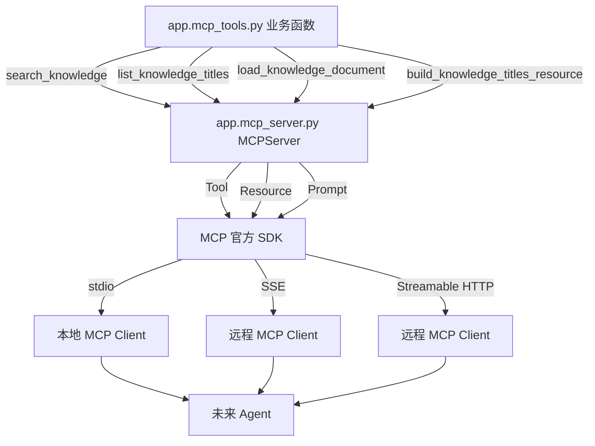
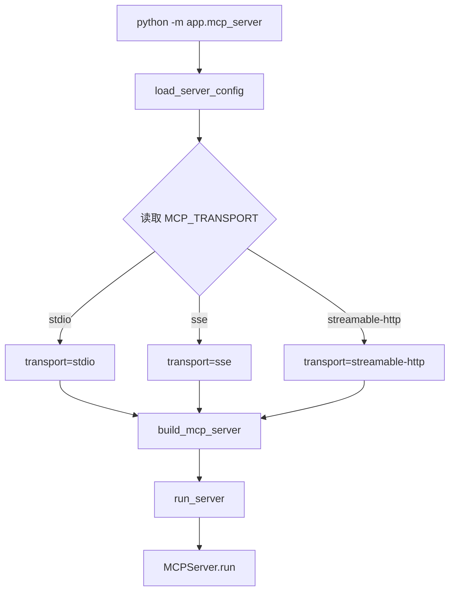
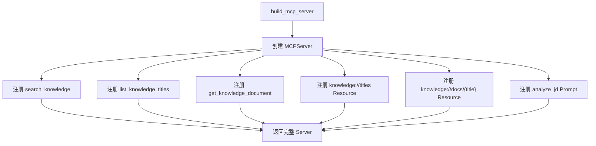
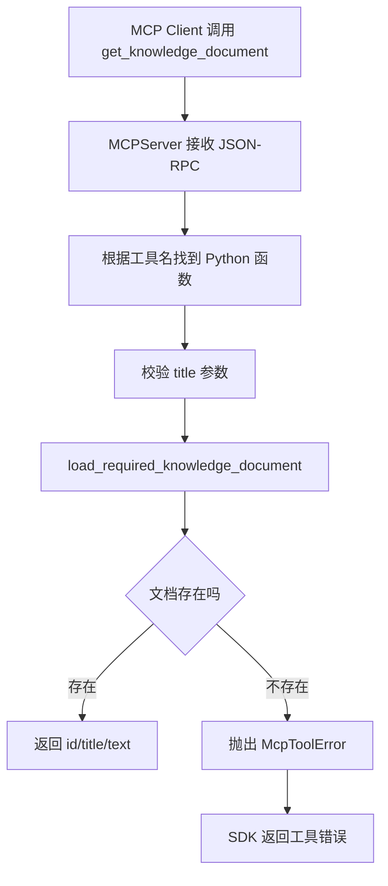
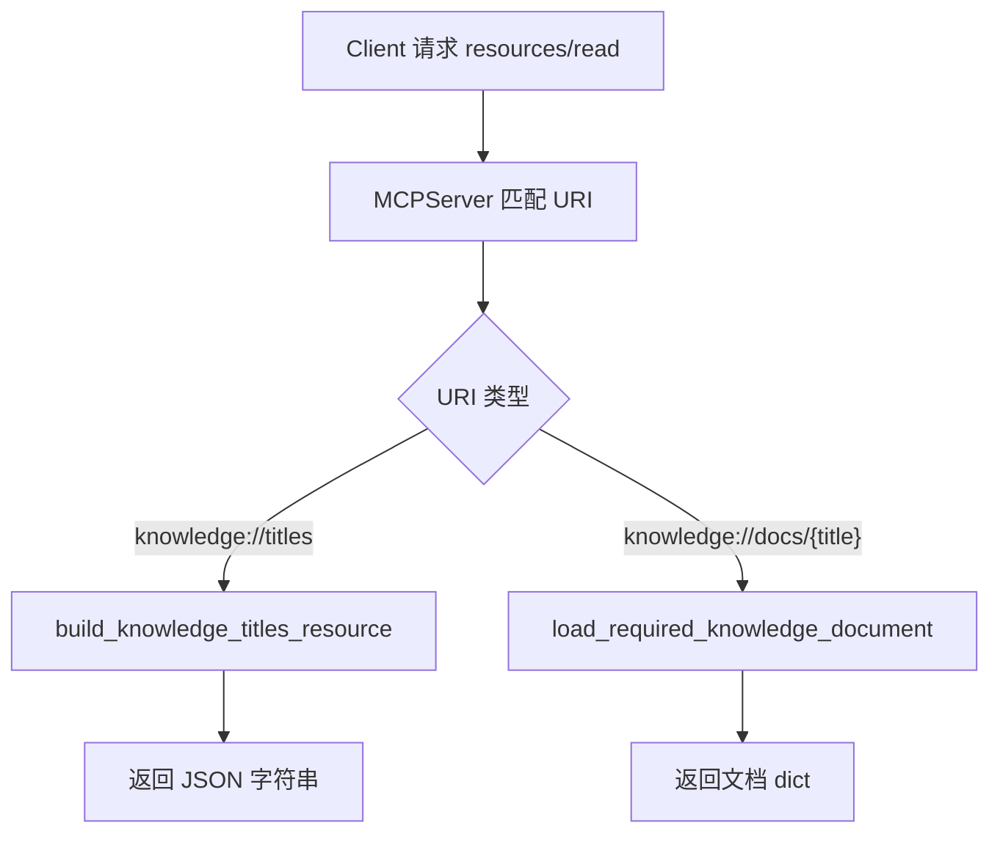
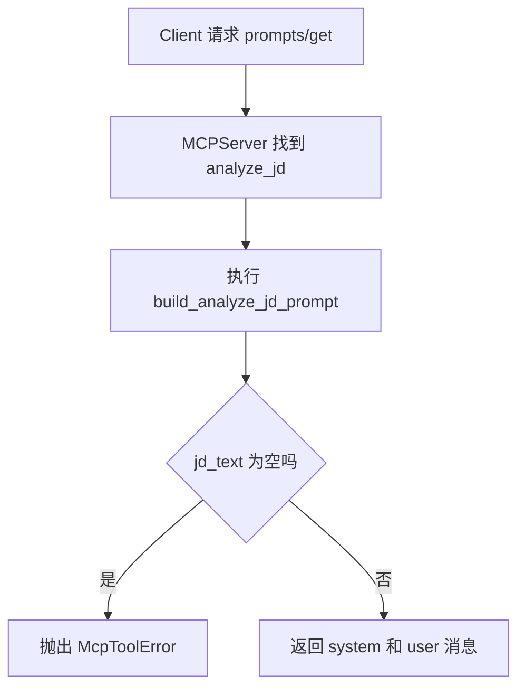

# Day 51 学习笔记

日期：2026-09-16

项目：`ai-job-agent`

主题：完整 MCP Server、Tool、Resource、Prompt、Transport 和配置管理

## 1. Day 51 做了什么

Day 50 只完成了 MCP Server 的最小闭环：

```text
MCPServer
  ->
两个 Tool
  ->
stdio transport
```

Day 51 把它升级成更接近生产形态的服务：

```text
可配置 Server
  ->
多个 Tool
  ->
多个 Resource
  ->
一个 Prompt
  ->
支持 stdio、SSE、Streamable HTTP
  ->
统一业务错误
```

## 2. Day 51 改了哪些文件

| 文件 | 变化 | 作用 |
|---|---|---|
| `app/mcp_tools.py` | 修改 | 增加知识文档读取和 Resource 数据构建 |
| `app/mcp_server.py` | 修改 | 增加配置、Resource、Prompt、transport 切换 |
| `tests/test_mcp_server.py` | 新增 | 测试配置、文档读取、Prompt、Server 构建 |

## 3. 当前改动和 MCP 框架的具体关系

这个项目里有三层：

```text
业务能力层
  app/mcp_tools.py

协议接入层
  app/mcp_server.py

框架协议层
  mcp 官方 SDK
```

它们不是同一个东西。

### 3.1 业务能力层

`app/mcp_tools.py` 负责：

- 读取知识库。
- 检索知识。
- 转换数据格式。
- 管理工具目录。

它不关心自己是 MCP Tool、FastAPI 接口，还是普通函数。

### 3.2 协议接入层

`app/mcp_server.py` 负责：

- 创建 `MCPServer`。
- 用装饰器把普通函数注册成 MCP Tool。
- 注册 Resource。
- 注册 Prompt。
- 选择 transport。

它把业务函数包装成 MCP 协议可以理解的服务。

### 3.3 框架协议层

官方 `mcp` SDK 负责：

- JSON-RPC 消息解析。
- stdio、SSE、Streamable HTTP 通信。
- 工具发现。
- 工具调用。
- 错误返回。

我们不需要自己处理这些协议细节。

### 3.4 关系流程图



## 4. Day 51 项目闭环实际流程

### 4.1 Server 配置加载流程



### 4.2 构建 MCP Server 流程



### 4.3 Tool 调用流程

以 `get_knowledge_document` 为例：



### 4.4 Resource 读取流程



### 4.5 Prompt 获取流程



## 5. 核心概念解释

### 5.1 MCPServer

`MCPServer` 是 MCP 2.x 中的服务端对象。

它负责：

- 保存 Tool。
- 保存 Resource。
- 保存 Prompt。
- 启动 transport。

本项目中：

```python
server = MCPServer(
    name=config.name,
    instructions=config.instructions,
    version=config.version,
    log_level=config.log_level,
)
```

业务含义：

```text
MCPServer 相当于一个对外提供能力的服务进程
```

### 5.2 Tool

Tool 是模型可以调用的动作。

本项目有三个 Tool：

```text
search_knowledge
list_knowledge_titles
get_knowledge_document
```

它们的区别：

| Tool | 业务动作 |
|---|---|
| `search_knowledge` | 语义检索知识库 |
| `list_knowledge_titles` | 列出可学习主题 |
| `get_knowledge_document` | 按标题读取一篇知识文档 |

### 5.3 Resource

Resource 是模型可以读取的数据。

本项目有两个 Resource：

```text
knowledge://titles
knowledge://docs/{title}
```

Resource 和 Tool 的区别：

```text
Tool 表示“做一件事”
Resource 表示“读一份数据”
```

生产上，Resource 适合暴露：

- 文档。
- 数据表结构。
- 配置。
- 订单详情。

### 5.4 Prompt

Prompt 是服务端提供给调用方的提示词模板。

本项目有一个 Prompt：

```text
analyze_jd
```

它根据 JD 文本生成 system 和 user 消息，未来 Agent 可以直接复用它。

### 5.5 Transport

Transport 是 MCP Client 和 Server 之间的通信方式。

| Transport | 使用场景 |
|---|---|
| `stdio` | 本地子进程，开发调试 |
| `sse` | 简单远程通信 |
| `streamable-http` | 生产服务，HTTP 部署 |

生产环境优先使用 `streamable-http`。

### 5.6 McpToolError

这是项目自定义的工具业务错误。

它的作用是：

```text
把“业务失败”和“协议错误”区分开
```

例如文档不存在时，不是抛 KeyError，而是抛：

```python
McpToolError("knowledge document not found: Python")
```

这样调用方可以明确知道是业务数据问题。

## 6. 每个改动在业务中负责什么

### 6.1 app/mcp_tools.py

新增：

```python
load_knowledge_document()
build_knowledge_titles_resource()
```

`load_knowledge_document()` 负责按标题查找一篇知识文档。

`build_knowledge_titles_resource()` 负责生成标题 Resource 内容。

它们都是纯业务函数，不依赖 MCP SDK。

### 6.2 app/mcp_server.py

新增：

- `McpServerConfig`
- `load_server_config()`
- `McpToolError`
- `load_required_knowledge_document()`
- `build_analyze_jd_prompt()`
- `build_mcp_server()`
- `run_server()`

这些代码把业务函数转换成 MCP 服务能力。

### 6.3 tests/test_mcp_server.py

覆盖：

- 配置默认值。
- 非法 transport。
- 文档读取。
- 文档不存在。
- Resource 数据。
- Prompt 内容。
- MCPServer 构建。

## 7. 实际生产对标方案

| Day 51 的做法 | 生产中的常见方案 |
|---|---|
| 环境变量配置 | 配置中心，例如 Consul、Nacos、Kubernetes ConfigMap |
| 本地 stdio | Streamable HTTP 或 gRPC 网关 |
| 无鉴权 | OAuth、API Key、mTLS |
| 只读工具 | 写工具增加权限和审批 |
| 内存注册 Tool | 工具平台、数据库工具目录、动态加载 |
| `McpToolError` | 统一错误码、错误分类、告警 |
| 单实例 Server | 多副本、服务发现、负载均衡 |

生产系统还会考虑：

- 工具超时。
- 工具限流。
- 审计日志。
- Schema 版本。
- 灰度发布。

## 8. Day 51 开发中遇到的报错及原因

### 8.1 直接运行 stdio 模式一直卡住没有输出

现象：

```bash
.venv/bin/python -m app.mcp_server
```

终端没有输出，进程一直等待。

原因：

`stdio` transport 不会打印普通日志，它等待 MCP Client 通过 stdin 发送 JSON-RPC 消息。

这是正常行为，不是死锁。

解决：

使用 MCP Client 验证：

```bash
.venv/bin/python -m app.mcp_cli list-tools
```

或者启动 Streamable HTTP 模式：

```bash
MCP_TRANSPORT=streamable-http \
MCP_PORT=8010 \
.venv/bin/python -m app.mcp_server
```

### 8.2 ModuleNotFoundError: No module named 'mcp.server.fastmcp'

原因：

当前安装的是 `mcp>=2.2.0`。

MCP 2.x 把 `FastMCP` 改名成了 `MCPServer`。

解决：

```python
from mcp.server.mcpserver import MCPServer
```

### 8.3 ValueError: unsupported MCP transport

原因：

`MCP_TRANSPORT` 配置成了 SDK 不支持的字符串。

例如：

```bash
MCP_TRANSPORT=grpc .venv/bin/python -m app.mcp_server
```

解决：

只能使用：

```text
stdio
sse
streamable-http
```

### 8.4 McpToolError: knowledge document not found

原因：

`get_knowledge_document` 或 `knowledge://docs/{title}` 传入的标题在知识库中不存在。

解决：

先通过 `list_knowledge_titles` 获取真实标题，再读取文档。

### 8.5 McpToolError: jd_text must not be empty

原因：

`analyze_jd` Prompt 收到了空 JD。

解决：

在调用前检查 JD 文本，或让上层接口先做参数校验。

## 9. Day 51 检查清单

- [ ] `app/mcp_tools.py` 已增加文档读取函数
- [ ] `app/mcp_tools.py` 已增加 Resource 数据函数
- [ ] `app/mcp_server.py` 已增加 `McpServerConfig`
- [ ] `app/mcp_server.py` 已支持三个 Tool
- [ ] `app/mcp_server.py` 已支持两个 Resource
- [ ] `app/mcp_server.py` 已支持一个 Prompt
- [ ] `app/mcp_server.py` 已支持三种 transport
- [ ] `McpToolError` 已用于业务错误
- [ ] `tests/test_mcp_server.py` 已通过
- [ ] stdio 模式使用 MCP Client 验证
- [ ] Streamable HTTP 模式可以启动

## 10. 当前已知限制

### 10.1 还没有鉴权

当前 MCP Server 可以直接调用，不检查身份。

Day 53 会增加工具权限和审批。

### 10.2 还没有 HTTP Client

`app/mcp_client.py` 目前只支持 stdio。

Day 52 需要增加 Streamable HTTP 客户端。

### 10.3 工具仍以本地函数为主

生产环境通常会从数据库或工具平台动态加载 Tool，而不是全部硬编码在 Python 文件里。

## 11. 下一步

Day 52 将让 Agent 动态连接 MCP Server：

```text
发现 MCP 工具
  ->
把 inputSchema 转成 OpenAI function schema
  ->
Agent 选择工具
  ->
MCP Client 调用工具
  ->
把结果返回给 Agent
```
