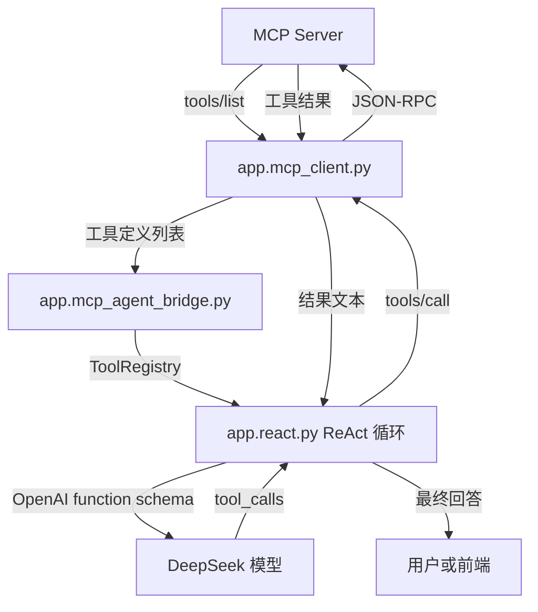
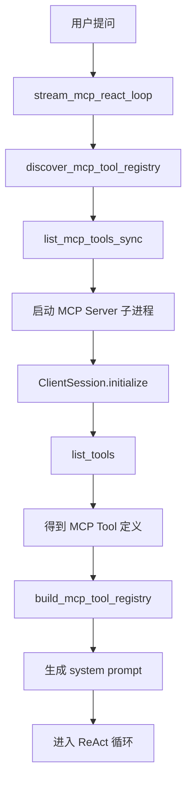
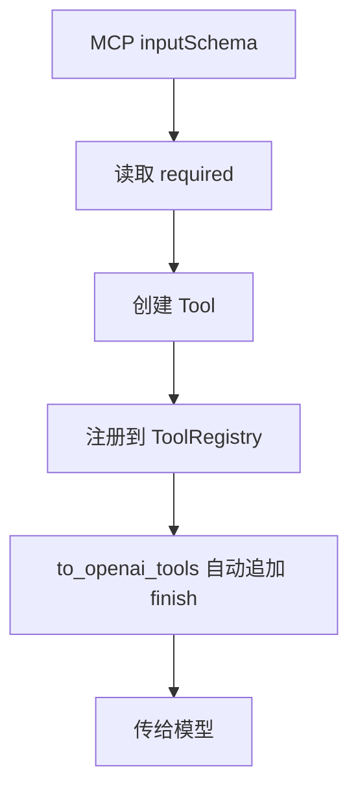
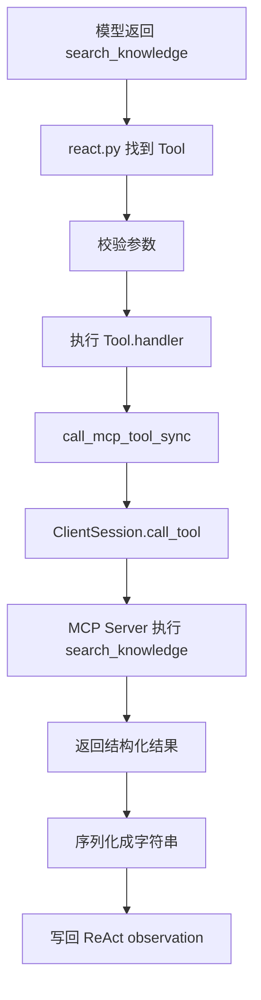

# Day 52 学习笔记

日期：2026-09-16

项目：`ai-job-agent`

主题：Agent 连接 MCP，动态发现工具并调用 MCP Server

## 1. Day 52 做了什么

Day 50 和 Day 51 完成了 MCP Server 和本地 MCP Client。

但当时的 Agent 仍然使用 `app/tools.py` 里的硬编码工具：

```text
Agent
  ->
build_default_registry()
  ->
本地 ToolRegistry
```

Day 52 的目标是让 Agent 改为：

```text
Agent
  ->
发现 MCP Server 工具
  ->
动态构建 ToolRegistry
  ->
模型选择工具
  ->
通过 MCP Client 调用真实 MCP Server
```

## 2. Day 52 改了哪些文件

| 文件 | 变化 | 作用 |
|---|---|---|
| `app/mcp_agent_bridge.py` | 新增 | 把 MCP 工具转换成 Agent 可用的 ToolRegistry |
| `app/mcp_agent.py` | 新增 | 提供 MCP 版 Agent 循环入口 |
| `app/mcp_agent_cli.py` | 新增 | 命令行调用 MCP Agent |
| `app/react.py` | 修改 | 支持注入外部 registry 和 system prompt |
| `app/main.py` | 修改 | 增加 `/agent/mcp/stream` 接口 |
| `tests/test_mcp_agent_bridge.py` | 新增 | 测试 MCP 工具桥接逻辑 |

## 3. 当前改动和 MCP 框架的具体关系

### 3.1 三个层次

```text
业务层
  app.mcp_tools.py

桥接层
  app.mcp_agent_bridge.py

Agent 执行层
  app.mcp_agent.py
  app.react.py
```

### 3.2 具体职责

#### 业务层

`app.mcp_tools.py` 负责真实业务：

- 知识库检索。
- 读取文档。
- 生成 Resource。

#### 桥接层

`app.mcp_agent_bridge.py` 负责把 MCP 工具转换成 Agent 认识的工具格式。

它解决的是：

```text
MCP Tool 的 inputSchema
  ->
OpenAI function calling 的 parameters

MCP Tool 的远程调用
  ->
本地 Tool.handler
```

#### Agent 执行层

`app.mcp_agent.py` 和 `app.react.py` 负责：

- 调用模型。
- 处理 tool_calls。
- 执行工具。
- 拼装上下文。
- 输出最终答案。

### 3.3 关系流程图



## 4. Day 52 项目闭环实际流程

### 4.1 MCP Agent 启动流程



### 4.2 工具注册流程



### 4.3 工具调用流程



## 5. 核心概念解释

### 5.1 ToolRegistry

`ToolRegistry` 是项目里 Agent 使用的工具容器。

它负责：

- 保存工具。
- 根据名字找工具。
- 把工具转成 OpenAI function schema。

Day 52 不替换它，而是用 MCP 工具动态填充它。

### 5.2 Tool

`Tool` 是 Agent 认识的一个工具描述。

它包含：

```text
name
description
parameters
handler
input_field
requires_approval
```

在 MCP 场景中：

- `name` 来自 MCP Tool name。
- `description` 来自 MCP Tool description。
- `parameters` 来自 MCP `inputSchema`。
- `handler` 是调用 MCP Client 的函数。

### 5.3 bridge 桥接层

桥接层解决一个关键问题：

```text
MCP 世界和 OpenAI function calling 世界的字段不完全一样
```

MCP 使用：

```json
{
  "name": "search_knowledge",
  "inputSchema": {}
}
```

OpenAI function calling 使用：

```json
{
  "type": "function",
  "function": {
    "name": "search_knowledge",
    "parameters": {}
  }
}
```

桥接层负责完成这个转换。

### 5.4 handler

`handler` 是 Agent 真正执行工具时调用的函数。

本地工具 handler 直接运行 Python 函数。

MCP 工具 handler 会：

```text
启动 MCP Client
  ->
发送 tools/call
  ->
接收结果
  ->
序列化成字符串
```

### 5.5 system prompt

Day 52 的 system prompt 是根据 MCP 工具动态生成的：

```text
模型只看到当前 MCP Server 真正提供的工具
```

这样做的好处：

- 不把已删除工具告诉模型。
- 不同环境可以暴露不同工具。
- 减少模型幻觉调用不存在的工具。

### 5.6 stream_mcp_react_loop

它和普通 `stream_react_loop` 的区别：

```text
普通版本使用 build_default_registry()
MCP 版本使用 discover_mcp_tool_registry()
```

其余 ReAct 执行逻辑完全复用。

## 6. 每个改动在业务中负责什么

### 6.1 app/mcp_agent_bridge.py

核心文件。

它负责：

- 接收 MCP 工具列表。
- 创建 `Tool`。
- 注册到 `ToolRegistry`。
- 创建远程 handler。
- 生成 MCP Agent system prompt。

### 6.2 app/mcp_agent.py

对外提供：

```text
run_mcp_react_loop()
stream_mcp_react_loop()
```

它让调用方像使用普通 Agent 一样使用 MCP Agent。

### 6.3 app/react.py

这次没有重写 ReAct，而是增加两个参数：

```python
registry=None
system_prompt=REACT_SYSTEM_PROMPT
```

这样本地工具和 MCP 工具可以共用同一套循环逻辑。

### 6.4 app/mcp_agent_cli.py

提供命令行验证：

```bash
.venv/bin/python -m app.mcp_agent_cli "FastAPI 需要掌握什么"
```

### 6.5 app/main.py

增加：

```text
POST /agent/mcp/stream
```

让前端可以通过 SSE 调用 MCP Agent。

## 7. 实际生产对标方案

| Day 52 的做法 | 生产中的常见方案 |
|---|---|
| 每次请求重新发现工具 | 缓存工具列表，定时刷新 |
| stdio 子进程调用 | Streamable HTTP 长连接或 gRPC |
| 每次工具调用启动新 Client | 连接池、持久化 Session |
| `requires_approval=False` | 权限中心标记危险工具 |
| 本地单进程调试 | 多副本、服务发现、负载均衡 |
| 工具结果 JSON 字符串 | 结构化 ToolResult 和错误码 |
| 无鉴权 | OAuth、API Key、mTLS |

生产系统还需要：

- 工具调用超时。
- 工具调用限流。
- 重试和熔断。
- 审计日志。
- 工具版本兼容。

## 8. Day 52 开发中遇到的报错及原因

### 8.1 run_react_loop() got an unexpected keyword argument 'registry'

原因：

`app/mcp_agent.py` 调用了：

```python
run_react_loop(..., registry=registry, system_prompt=system_prompt)
```

但 `app/react.py` 还没有增加这两个参数。

解决：

修改 `run_react_loop` 和 `stream_react_loop` 的函数签名，增加：

```python
registry=None,
system_prompt=REACT_SYSTEM_PROMPT,
```

### 8.2 NameError: name 'system_prompt' is not defined

原因：

函数签名增加了 `system_prompt`，但消息列表还在写：

```python
{"role": "system", "content": REACT_SYSTEM_PROMPT}
```

说明只改了参数，没有改成使用参数。

解决：

```python
{"role": "system", "content": system_prompt}
```

### 8.3 ImportError: cannot import name 'stream_mcp_react_loop'

原因：

`app/mcp_agent.py` 不存在，或函数名写错。

解决：

确认文件存在，并包含：

```python
def stream_mcp_react_loop(...):
    ...
```

### 8.4 MCP Client 调用工具失败

可能原因：

- MCP Server 没有启动。
- `app.mcp_server` 有导入错误。
- 工具名拼错。
- MCP Server 的 `stdio` 被普通终端直接运行，导致 stdin/stdout 被占用。

解决：

先验证工具发现：

```bash
.venv/bin/python -m app.mcp_cli list-tools
```

再运行 Agent。

### 8.5 模型调用了不存在的工具

原因：

system prompt 里的工具列表和实际传给模型的 tools 不一致。

解决：

确保使用同一个动态 `registry`：

```python
registry, system_prompt = _build_registry_and_prompt()
tools = registry.to_openai_tools()
```

不要一个来自 MCP，一个来自旧 `build_default_registry()`。

## 9. Day 52 检查清单

- [ ] `app/mcp_agent_bridge.py` 已新增
- [ ] `app/mcp_agent.py` 已新增
- [ ] `app/mcp_agent_cli.py` 已新增
- [ ] `app/react.py` 支持 registry 注入
- [ ] `app/react.py` 支持 system prompt 注入
- [ ] `app/main.py` 已增加 MCP Agent SSE 接口
- [ ] `tests/test_mcp_agent_bridge.py` 已通过
- [ ] MCP 工具能被动态发现
- [ ] 工具结果能写回 Agent 上下文
- [ ] Day 50、Day 51 测试不回归

## 10. 当前已知限制

### 10.1 stdio 子进程不是生产方案

当前每次工具调用都通过 `call_mcp_tool_sync` 启动 MCP Client。

生产环境应该使用 Streamable HTTP，并复用 HTTP Client 和 Session。

### 10.2 没有工具权限

当前远程工具全部：

```python
requires_approval=False
```

后续暴露写工具时，必须改成权限和审批模型。

### 10.3 没有工具缓存

当前每次 Agent 请求都会重新发现工具。

生产系统应该缓存工具列表，并支持定时刷新和版本切换。

## 11. 下一步

Day 53 开始处理 MCP 工具权限：

```text
工具 Scope
  ->
危险工具识别
  ->
审批
  ->
最小权限
```
