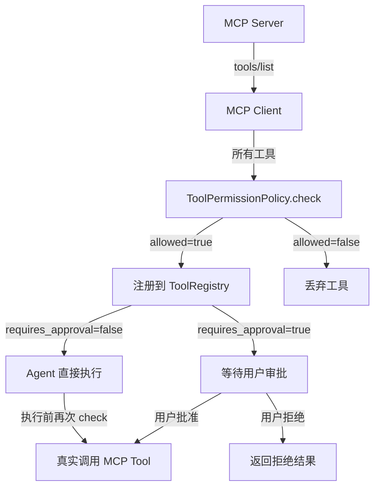
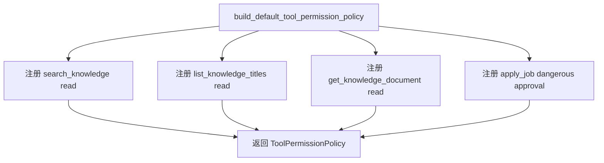
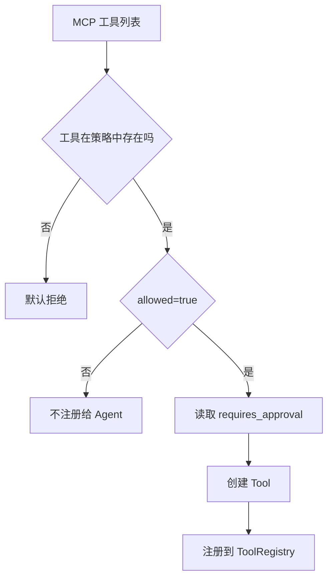
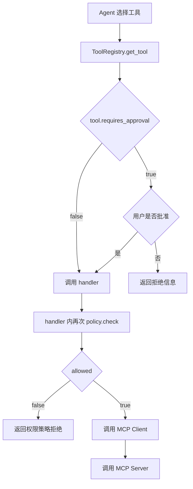

# Day 53 学习笔记

日期：2026-09-16

项目：`ai-job-agent`

主题：MCP 工具权限、审批和最小权限

## 1. Day 53 做了什么

Day 52 已经让 Agent 可以动态发现和调用 MCP 工具，但当时所有 MCP 工具都是：

```python
requires_approval=False
```

这意味着：

```text
只要 MCP Server 暴露了工具
Agent 就可以直接执行
没有统一权限控制
```

Day 53 增加集中式工具权限策略：

```text
未知工具默认拒绝
  ->
只读工具放行
  ->
危险工具需要审批
  ->
注册时过滤一次
  ->
执行前再校验一次
```

## 2. Day 53 改了哪些文件

| 文件 | 变化 | 作用 |
|---|---|---|
| `app/tool_policy.py` | 新增 | 定义工具权限规则和策略引擎 |
| `app/mcp_agent_bridge.py` | 修改 | 把权限策略接入 MCP 工具注册和执行 |
| `tests/test_tool_policy.py` | 新增 | 测试默认拒绝、审批、禁用和双重校验 |

## 3. 当前改动和 MCP 框架的关系

Day 52 的关系是：

```text
MCP Server
  ->
MCP Client
  ->
ToolRegistry
  ->
Agent
```

Day 53 在 `MCP Client -> ToolRegistry` 之间加入权限层：

```text
MCP Server
  ->
MCP Client
  ->
ToolPermissionPolicy
  ->
ToolRegistry
  ->
Agent
```

也就是说，MCP Server 提供的工具不是全部直接给 Agent，而是先经过权限策略过滤。

### 权限层流程图



## 4. Day 53 项目闭环实际流程

### 4.1 权限策略构建流程



### 4.2 工具注册流程



### 4.3 工具执行流程



## 5. 核心概念解释

### 5.1 ToolPermissionRule

它是一条工具权限规则。

字段含义：

| 字段 | 作用 |
|---|---|
| `tool_name` | 工具名 |
| `risk` | 风险等级：read、write、dangerous |
| `requires_approval` | 是否需要人工确认 |
| `allowed` | 是否允许注册和执行 |
| `reason` | 拒绝或审批原因 |

例如：

```python
ToolPermissionRule(
    tool_name="apply_job",
    risk="dangerous",
    requires_approval=True,
    allowed=True,
    reason="投递岗位会影响外部系统，需要人工确认",
)
```

### 5.2 ToolPermissionDecision

它是一次权限判断的结果。

字段：

```text
allowed
requires_approval
reason
```

业务含义：

```text
allowed 表示能不能做
requires_approval 表示做之前要不要问用户
reason 表示为什么允许、拒绝或需要审批
```

### 5.3 ToolPermissionPolicy

它是权限策略引擎。

负责：

- 保存所有工具规则。
- 根据工具名查找规则。
- 返回权限判断结果。

### 5.4 白名单和最小权限

Day 53 默认策略是白名单：

```text
没有配置的工具
  ->
默认拒绝
```

这符合生产系统的最小权限原则：

```text
只开放业务确实需要的工具
```

### 5.5 双层校验

Day 53 做了两次权限检查：

```text
第一次：注册工具时
  ->
被禁用工具不会暴露给模型

第二次：执行工具前
  ->
即使代码绕过注册表，也不能真正执行
```

这样可以防止：

- 工具列表缓存过期。
- 权限策略在运行时发生变化。
- 外部调用直接触发 handler。

### 5.6 为什么未知工具要默认拒绝

如果 MCP Server 未来新增了一个工具，但 Agent 没有明确允许它，它就不应该自动可用。

默认拒绝能防止：

```text
新工具没有权限评估
  ->
就被模型调用
```

## 6. 每个改动在业务中负责什么

### 6.1 app/tool_policy.py

这是 Day 53 的核心文件。

它负责：

- 定义权限规则。
- 保存权限规则。
- 执行权限判断。
- 提供默认白名单策略。

### 6.2 app/mcp_agent_bridge.py

修改点：

- `build_mcp_tool_registry()` 接受 `permission_policy`。
- 注册工具前先调用 `policy.check()`。
- 被禁用工具跳过。
- `Tool.requires_approval` 来自权限策略。
- 远程 handler 执行前再次调用 `policy.check()`。

### 6.3 tests/test_tool_policy.py

覆盖：

- 默认允许只读工具。
- 危险工具需要审批。
- 未知工具默认拒绝。
- 自定义策略可以禁用工具。
- 注册表会隐藏禁用工具。
- 执行前会再次校验权限。

## 7. 实际生产对标方案

| Day 53 的做法 | 生产中的常见方案 |
|---|---|
| 本地策略类 | RBAC、ABAC、策略引擎 |
| `requires_approval` | 审批工作流、工单系统 |
| 白名单工具 | 权限中心、工具目录 |
| `risk` 等级 | 数据分级、操作分级 |
| 注册时过滤 | API Gateway 或工具网关拦截 |
| 执行时再校验 | 服务端强制执行，不信任客户端 |
| `reason` 文本 | 审计日志、错误码 |

生产系统还会：

- 按用户或租户分配工具 Scope。
- 记录谁在什么时间批准了什么操作。
- 对高危操作做二次认证。
- 对审批超时做自动拒绝。

## 8. Day 53 开发中遇到的报错及原因

### 8.1 StopIteration

现象：

```text
FAILED tests/test_tool_policy.py::test_remote_handler_checks_policy_before_execution - StopIteration
```

原因：

`build_mcp_tool_registry()` 会遍历所有 MCP 工具，并对每个工具调用一次：

```python
policy.check(name)
```

测试里的 `make_tools()` 返回两个工具：

```text
search_knowledge
apply_job
```

所以 `Mock.side_effect` 的两个返回值在注册阶段就被消费完了。

随后 handler 又调用：

```python
permission_policy.check(tool_name, arguments)
```

这是第三次调用，导致 `side_effect` 没有值，抛出 `StopIteration`。

解决：

让测试只构建一个工具：

```python
registry = build_mcp_tool_registry(
    make_tools()[:1],
    executor=executor,
    permission_policy=policy,
)
```

这样注册时一次、执行时一次，正好对应两个 `side_effect` 返回值。

### 8.2 duplicate tool permission rule

原因：

同一个工具被重复加入权限策略。

解决：

一个工具只配置一次规则。

### 8.3 unknown tool

原因：

策略中找不到这个工具。

这是 Day 53 的预期行为：

```text
未知工具默认拒绝
```

如果业务确实要开放这个工具，必须在策略中显式增加规则。

### 8.4 工具被跳过但没有报错

原因：

`build_mcp_tool_registry()` 发现 `allowed=False` 后直接 `continue`。

这会让被禁用工具不出现在 Agent 工具列表里。

这是正常行为，不是 Bug。

## 9. Day 53 检查清单

- [ ] `app/tool_policy.py` 已新增
- [ ] `ToolPermissionRule` 已定义
- [ ] `ToolPermissionDecision` 已定义
- [ ] `ToolPermissionPolicy.check()` 已实现
- [ ] 未知工具默认拒绝
- [ ] 只读工具默认放行
- [ ] 危险工具需要审批
- [ ] `app/mcp_agent_bridge.py` 已接入权限策略
- [ ] 被禁用工具不注册给 Agent
- [ ] 执行前会再次校验
- [ ] `tests/test_tool_policy.py` 已通过

## 10. 当前已知限制

### 10.1 权限规则还没有按用户区分

当前策略是全局规则，不区分租户或用户。

后续需要加入 Scope：

```text
user A 可以 search_knowledge
user B 不可以 apply_job
```

### 10.2 审批还没有审计日志

当前只记录 `approve=True/False`，没有记录：

- 谁审批的。
- 什么时候审批的。
- 审批的是什么参数。

### 10.3 参数级权限还没有实现

当前 `policy.check()` 接收了 `arguments`，但还没有根据参数内容做规则。

Day 54 会做提示注入和参数级防御。

## 11. 下一步

Day 54 进入提示注入防御：

```text
输入隔离
  ->
系统边界
  ->
工具参数清洗
  ->
不可信数据控制
```
