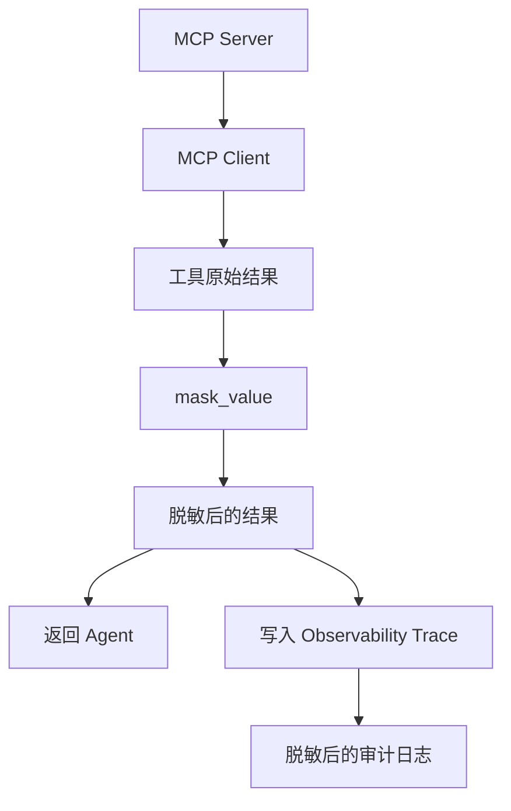
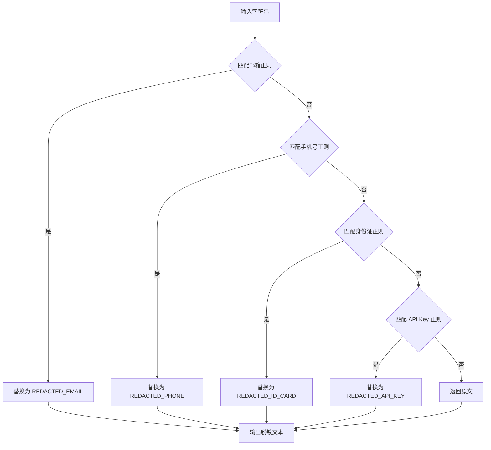
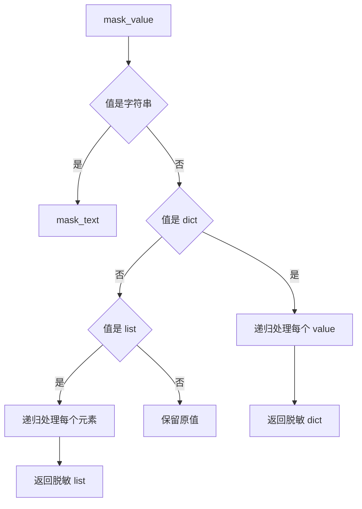
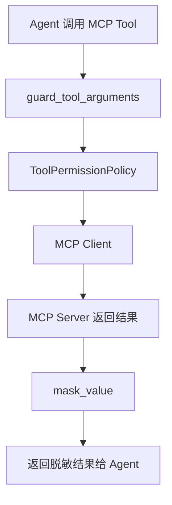
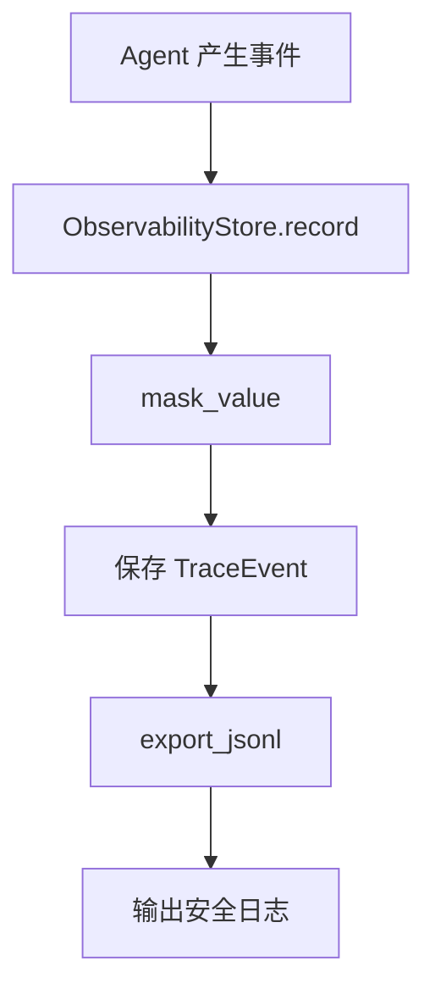

# Day 55 学习笔记

日期：2026-09-17

项目：`ai-job-agent`

主题：敏感数据脱敏、审计日志和日志安全

## 1. Day 55 做了什么

Day 54 解决了提示注入和工具参数清洗，但没有处理：

```text
用户问题里包含邮箱
工具参数里包含手机号
Trace 日志写入原始数据
MCP 工具结果返回原始敏感信息
```

Day 55 增加：

```text
邮箱脱敏
  ->
手机号脱敏
  ->
身份证脱敏
  ->
API Key 脱敏
  ->
Trace 写入前脱敏
  ->
MCP 工具结果返回前脱敏
  ->
审计日志记录脱敏后事件
```

## 2. Day 55 改了哪些文件

| 文件 | 变化 | 作用 |
|---|---|---|
| `app/sensitive_data.py` | 新增 | 敏感数据识别、脱敏、审计日志 |
| `app/observability.py` | 修改 | Trace 写入前脱敏 |
| `app/mcp_agent_bridge.py` | 修改 | MCP 工具结果返回前脱敏 |
| `tests/test_sensitive_data.py` | 新增 | 测试脱敏和审计记录 |

## 3. 当前改动和 MCP 框架的关系

Day 54 的 MCP 工具执行链路是：

```text
Agent
  ->
guard_user_input
  ->
guard_tool_arguments
  ->
ToolPermissionPolicy
  ->
MCP Client
  ->
MCP Server
```

Day 55 在工具结果和日志两个位置加入脱敏：

```text
MCP Server
  ->
MCP Client
  ->
mask_value
  ->
Agent
```

同时：

```text
ObservabilityStore.record
  ->
mask_value
  ->
持久化 Trace
```

### 敏感数据脱敏流程图



## 4. Day 55 项目闭环实际流程

### 4.1 敏感数据识别流程



### 4.2 递归脱敏流程



### 4.3 MCP 工具结果脱敏流程



### 4.4 Trace 日志脱敏流程



## 5. 核心概念解释

### 5.1 敏感数据

敏感数据是不能原样出现在日志、模型上下文和审计记录中的数据。

本项目当前识别：

- 邮箱。
- 中国大陆手机号。
- 身份证号。
- API Key、Secret、Token。

### 5.2 脱敏

脱敏是把敏感数据替换成安全占位符。

例如：

```text
test@example.com
```

变成：

```text
[REDACTED_EMAIL]
```

脱敏后，数据仍然可以用于分析，但不会泄露真实内容。

### 5.3 mask_text

`mask_text()` 负责处理单个字符串。

它按顺序应用多个正则表达式：

```text
email
phone
id_card
api_key
```

每命中一个模式，就用对应占位符替换。

### 5.4 mask_value

`mask_value()` 负责处理任意嵌套结构。

规则：

```text
字符串 -> mask_text
dict -> 递归处理 value
list -> 递归处理每个元素
其他 -> 保留原值
```

### 5.5 为什么要在 Trace 写入前脱敏

Trace 会被持久化，甚至可能导出到外部系统。

如果 Trace 包含原始邮箱或手机号，就会造成数据泄露。

所以必须在 `ObservabilityStore.record()` 里统一脱敏，而不是依赖每个调用方手动脱敏。

### 5.6 为什么要在 MCP 工具结果返回前脱敏

MCP 工具可能从数据库、外部 API 或文档中返回敏感信息。

如果不脱敏：

```text
敏感数据会进入 Agent 上下文
  ->
可能被模型继续引用
  ->
也可能被写入后续 Trace
```

因此在 MCP 工具结果返回 Agent 前先脱敏。

### 5.7 AuditLogger

`AuditLogger` 是审计日志记录器。

它负责：

- 记录事件类型。
- 记录时间。
- 自动脱敏事件数据。
- 支持导出 JSONL。

Day 55 先创建这个基础组件，后续可以接入提示注入拦截、权限拒绝、工具失败等安全事件。

## 6. 每个改动在业务中负责什么

### 6.1 app/sensitive_data.py

核心文件。

它提供：

```text
mask_text()
mask_value()
AuditLogger
audit_logger
```

### 6.2 app/observability.py

修改：

- `start_trace()` 写入 question 前脱敏。
- `record()` 写入事件 data 前脱敏。

这样所有 Trace 都默认安全。

### 6.3 app/mcp_agent_bridge.py

修改：

```python
result = executor(tool_name, arguments)
result = mask_value(result)
```

这样 MCP 工具结果返回 Agent 前已经脱敏。

### 6.4 tests/test_sensitive_data.py

覆盖：

- 邮箱和手机号脱敏。
- 嵌套数据脱敏。
- Trace 脱敏。
- 审计日志脱敏。
- MCP 工具结果脱敏。

## 7. 实际生产对标方案

| Day 55 的做法 | 生产中的常见方案 |
|---|---|
| 正则脱敏 | PII 识别服务、NER 模型 |
| `[REDACTED_EMAIL]` | 假名化、Tokenization |
| Trace 写入前脱敏 | 日志采集端统一脱敏 |
| MCP 工具结果脱敏 | API 网关或数据出口脱敏 |
| 内存审计日志 | Kafka、Elasticsearch、ClickHouse |
| 正则匹配 | 数据分级和策略引擎 |
| JSONL 导出 | 集中式日志平台 |

生产系统还会：

- 对 Secret 使用 KMS 或 Vault。
- 设置日志保留时间。
- 限制谁可以访问原始数据。
- 对脱敏操作本身做审计。

## 8. Day 55 开发中遇到的报错及原因

### 8.1 ImportError: cannot import name 'mask_value'

原因：

`app/observability.py` 或 `app/mcp_agent_bridge.py` 已经使用：

```python
from app.sensitive_data import mask_value
```

但 `app/sensitive_data.py` 还没创建。

解决：

先新增 `app/sensitive_data.py`。

### 8.2 Trace 中仍然出现邮箱

原因：

可能只在某个调用方做了脱敏，但没有在 `ObservabilityStore.record()` 统一脱敏。

解决：

在 `record()` 内部统一调用：

```python
data=mask_value(data)
```

### 8.3 MCP 工具结果仍然包含敏感信息

原因：

可能把脱敏放在 JSON 序列化之后，或者根本没有处理工具结果。

解决：

在 `_build_remote_handler` 中：

```python
result = executor(tool_name, arguments)
result = mask_value(result)
```

再做序列化。

### 8.4 数字或布尔值被错误转换

原因：

如果脱敏函数不判断类型，可能把数字转换成字符串。

解决：

`mask_value()` 对非字符串、非 dict、非 list 的值直接返回原值。

### 8.5 API Key 正则误伤普通文本

现象：

普通文本中出现 `token:` 后被脱敏。

原因：

API Key 正则比较宽泛。

解决：

生产上应结合字段名、数据分类和更精确的规则，而不是只靠一个正则。

## 9. Day 55 检查清单

- [ ] `app/sensitive_data.py` 已新增
- [ ] 邮箱脱敏已实现
- [ ] 手机号脱敏已实现
- [ ] 身份证脱敏已实现
- [ ] API Key 脱敏已实现
- [ ] `mask_value()` 支持递归
- [ ] Trace 写入前脱敏
- [ ] MCP 工具结果返回前脱敏
- [ ] `AuditLogger` 已实现
- [ ] `tests/test_sensitive_data.py` 已通过

## 10. 当前已知限制

### 10.1 正则脱敏不是语义脱敏

当前只能识别固定格式。

生产系统还需要识别姓名、地址、银行卡、公司内部敏感字段等。

### 10.2 审计日志还在内存里

当前 `AuditLogger` 只保存到内存。

生产环境需要写入持久化日志系统。

### 10.3 没有 Secret 管理

当前只是把 API Key 在日志中脱敏。

生产环境还需要用 Vault、KMS 或 Secret Manager 管理真实密钥。

## 11. 下一步

Day 56 进入红队测试：

```text
对抗输入
  ->
越权用例
  ->
敏感数据泄露用例
  ->
异常工具调用
  ->
安全回归测试
```
