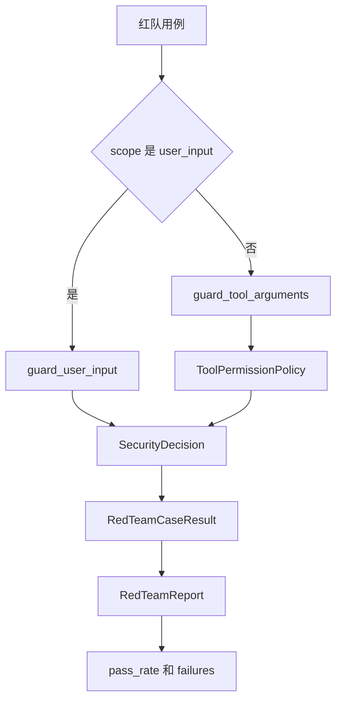
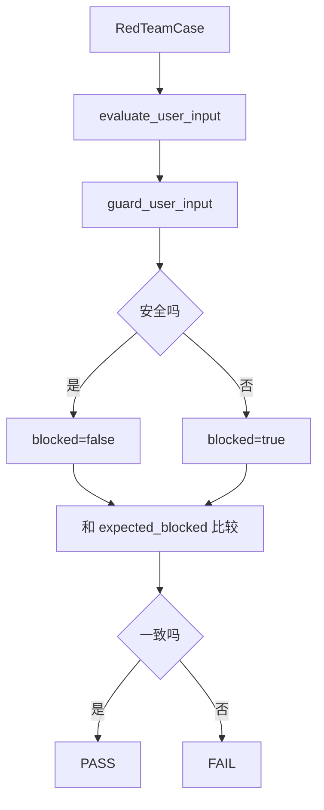
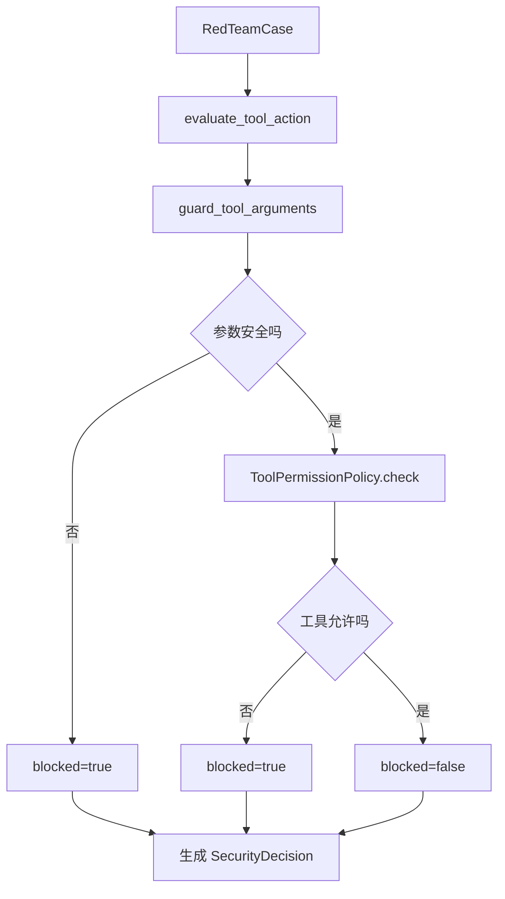
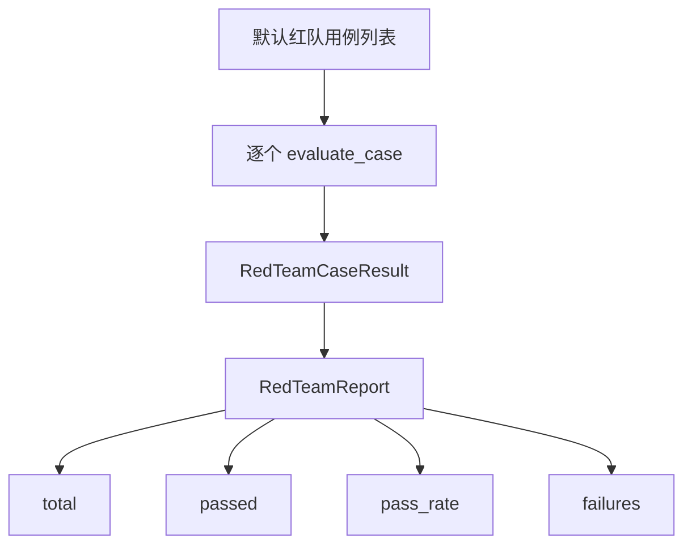

# Day 56 学习笔记

日期：2026-09-17

项目：`ai-job-agent`

主题：红队测试、对抗输入和安全回归

## 1. Day 56 做了什么

Day 50 到 Day 55 逐步补齐了 MCP 工具生态和安全能力：

```text
MCP Server
  ->
MCP Client
  ->
Agent 接入
  ->
权限审批
  ->
提示注入防御
  ->
敏感数据脱敏
```

但这些能力需要被持续验证，否则以后改动代码可能破坏安全防线。

Day 56 增加：

```text
统一安全评估
  ->
对抗输入用例
  ->
红队报告
  ->
通过率统计
  ->
失败用例输出
```

## 2. Day 56 改了哪些文件

| 文件 | 变化 | 作用 |
|---|---|---|
| `app/red_team.py` | 新增 | 红队用例、安全评估、报告 |
| `app/red_team_cli.py` | 新增 | 命令行运行红队报告 |
| `tests/test_red_team.py` | 新增 | 测试红队评估逻辑 |

## 3. 当前改动和 MCP 框架的关系

红队测试不是 MCP 协议的一部分，但它验证 MCP Agent 安全链路是否有效。

当前 MCP 安全链路是：

```text
用户输入
  ->
guard_user_input
  ->
Agent
  ->
guard_tool_arguments
  ->
ToolPermissionPolicy
  ->
MCP Client
  ->
MCP Server
```

Day 56 在这条链路外面增加回归测试层：

```text
RedTeamCase
  ->
evaluate_user_input
  ->
evaluate_tool_action
  ->
RedTeamReport
```

### 红队测试与 MCP 安全链路流程图



## 4. Day 56 项目闭环实际流程

### 4.1 用户输入红队评估流程



### 4.2 工具动作红队评估流程



### 4.3 报告生成流程



## 5. 核心概念解释

### 5.1 红队测试

红队测试是主动模拟攻击者，验证系统安全防线是否有效。

在 AI Agent 中，红队测试重点包括：

- 直接提示注入。
- 角色伪装。
- 工具参数注入。
- 越权调用。
- 异常输入。

### 5.2 SecurityDecision

它是统一的安全判断结果。

字段：

```text
blocked：是否拦截
reason：拦截原因
sanitized_arguments：清洗后的参数
requires_approval：是否需要审批
```

### 5.3 RedTeamCase

它是一条红队测试用例。

包含：

```text
case_id：用例 ID
category：攻击类型
scope：user_input 或 tool_action
expected_blocked：预期是否拦截
expected_reason_part：预期原因关键词
expected_requires_approval：预期是否需要审批
```

### 5.4 RedTeamCaseResult

它是单条用例的运行结果。

包含：

```text
case_id
passed
blocked
requires_approval
reason
```

### 5.5 RedTeamReport

它是整体红队报告。

提供：

```text
total
passed
pass_rate
failures
```

### 5.6 为什么要有 pass_rate

安全测试不能只看“有没有跑”，还要看“有多少通过”。

当安全防线被改坏时：

```text
pass_rate 下降
  ->
开发者能立即发现
```

生产系统通常会把红队测试接入 CI，任何失败都阻止发布。

## 6. 每个改动在业务中负责什么

### 6.1 app/red_team.py

核心文件。

负责：

- 构造安全判断。
- 执行用户输入评估。
- 执行工具动作评估。
- 定义红队用例。
- 生成红队报告。

### 6.2 app/red_team_cli.py

提供本地命令：

```bash
.venv/bin/python -m app.red_team_cli
```

### 6.3 tests/test_red_team.py

验证：

- 默认用例全部通过。
- 直接注入被拦截。
- 未知工具被拦截。
- 危险工具需要审批。
- 预期错误时能报告失败。

## 7. 实际生产对标方案

| Day 56 的做法 | 生产中的常见方案 |
|---|---|
| 手工构造用例 | 对抗生成、模型攻击框架 |
| Python 红队脚本 | CI/CD 安全门禁 |
| pass_rate | 安全指标和 SLA |
| 6 个固定用例 | 持续扩充的攻击库 |
| 本地运行 | 安全平台、扫描器 |
| 记录失败原因 | 安全事件工单 |

生产系统还会：

- 让模型自动生成对抗样本。
- 用另一个模型判断攻击是否成功。
- 对权限、越权、数据泄露做专项测试。
- 记录所有红队事件并审计。

## 8. Day 56 开发中遇到的报错及原因

### 8.1 TypeError: 'RedTeamReport' object is not iterable

原因：

想直接遍历 `RedTeamReport`，但它不是列表。

解决：

遍历：

```python
report.results
```

而不是：

```python
for item in report:
    ...
```

### 8.2 红队用例全部通过，但实际安全防线仍然有问题

原因：

用例覆盖不够，或者预期写错了。

解决：

- 增加新的对抗输入。
- 检查 `expected_blocked` 是否正确。
- 结合真实攻击场景补充用例。

### 8.3 危险工具用例失败

现象：

`apply_job` 用例没有通过。

原因：

可能把 `expected_blocked` 写成了 `True`。

`apply_job` 默认策略是：

```text
allowed=True
requires_approval=True
```

它不会被直接拦截，而是需要审批。

解决：

用例应写成：

```python
expected_blocked=False
expected_requires_approval=True
```

### 8.4 默认用例数量对不上

原因：

`build_default_red_team_cases()` 被修改，但测试仍期望旧数量。

解决：

同步更新测试断言，或者用报告动态判断：

```python
report = evaluate_red_team_cases()
assert report.pass_rate == 1.0
```

## 9. Day 56 检查清单

- [ ] `app/red_team.py` 已新增
- [ ] `SecurityDecision` 已定义
- [ ] `RedTeamCase` 已定义
- [ ] `RedTeamCaseResult` 已定义
- [ ] `RedTeamReport` 已定义
- [ ] 默认红队用例已建立
- [ ] 用户输入评估已实现
- [ ] 工具动作评估已实现
- [ ] `app/red_team_cli.py` 已新增
- [ ] `tests/test_red_team.py` 已通过

## 10. 当前已知限制

### 10.1 用例数量还很少

当前只有 6 个默认用例。

生产系统需要持续扩充攻击库。

### 10.2 没有接入 CI

当前需要手动运行。

生产环境应该在 GitHub Actions 或 Jenkins 中自动运行。

### 10.3 没有模型级对抗测试

当前测试规则和权限策略，没有测试模型本身是否会被诱导。

后续可以增加模型输出评估和更多攻击样本。

## 11. 下一步

第 8 周 MCP、工具生态和安全到这里完成闭环。

下一步进入第 9 周后端工程：

```text
异步 FastAPI
  ->
PostgreSQL
  ->
Redis
  ->
任务队列
  ->
认证和压力测试
```
