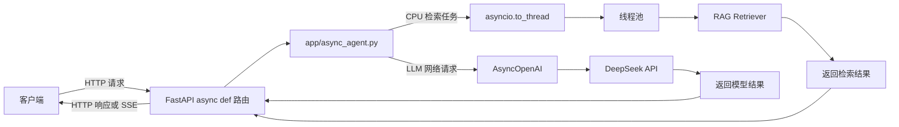
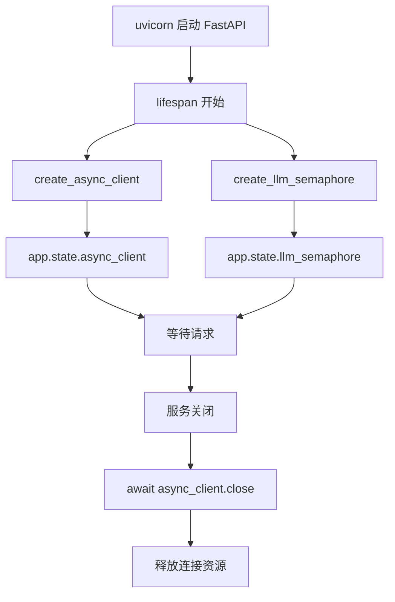
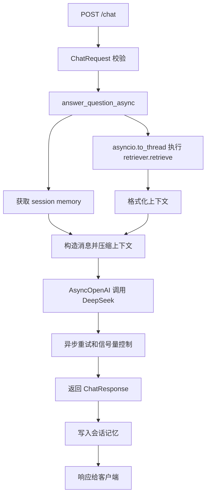
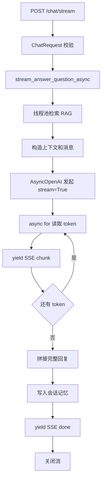
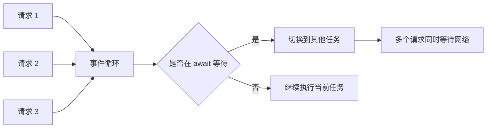
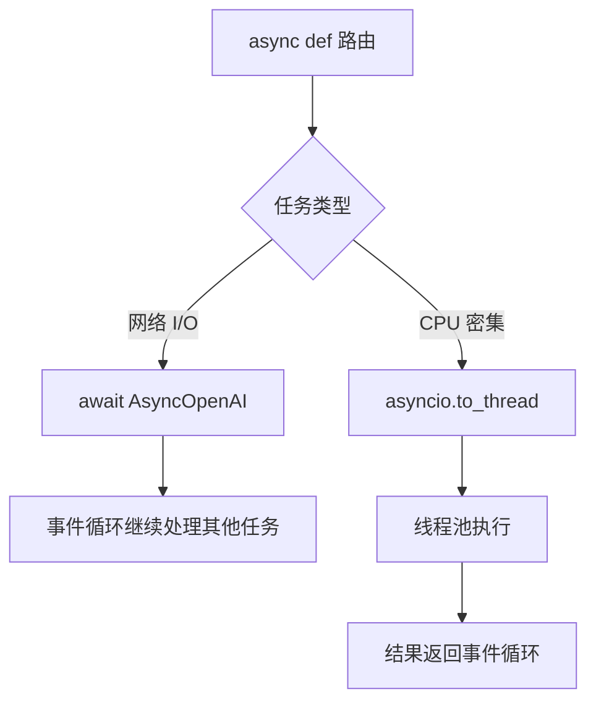

# Day 57 学习笔记

日期：2026-09-17

项目：`ai-job-agent`

主题：异步 FastAPI、并发请求和异步 LLM 调用

## 1. Day 57 做了什么

Day 56 之前，项目已经完成：

```text
LLM 调用
  ->
RAG 检索
  ->
ReAct Agent
  ->
多 Agent
  ->
MCP
  ->
安全测试
```

但后端 API 仍然是学习项目形态：

```text
同步 FastAPI 路由
  ->
同步 OpenAI 客户端
  ->
time.sleep 重试
  ->
同步 RAG 检索
```

这种写法在本地单请求时可以工作，但当多个用户同时请求时，会出现事件循环阻塞或线程池被占满的问题。

Day 57 增加：

```text
AsyncOpenAI
  ->
异步重试
  ->
异步 function calling
  ->
异步 Agent 主链路
  ->
异步 FastAPI 路由
  ->
并发测试
```

## 2. Day 57 改了哪些文件

| 文件 | 变化 | 作用 |
|---|---|---|
| `app/async_llm.py` | 新增 | 创建 `AsyncOpenAI` 客户端、LLM 并发信号量、异步重试 |
| `app/async_function_calling.py` | 新增 | 异步版结构化输出和 function calling |
| `app/async_agent.py` | 新增 | JD 解析、岗位分析、聊天问答的异步主链路 |
| `app/main.py` | 修改 | 核心 API 路由改为 `async def`，增加 lifespan |
| `tests/test_async_backend.py` | 新增 | 测试异步重试、并发重叠和 SSE 异步流 |
| `tests/test_api.py` | 修改 | 为异步路由补 app state，并更新 mock 目标 |
| `tests/test_streaming_api.py` | 修改 | 流式接口 mock 改为异步生成器 |

## 3. 当前改动和后端服务的关系

Day 57 不是给 Agent 增加业务功能，而是把业务主链路从“同步等待”改成“异步等待”。



核心思想：

```text
等待网络时不让事件循环傻等
  ->
执行 CPU 任务时放到线程池
  ->
用信号量限制上游压力
```

## 4. Day 57 项目闭环实际流程

### 4.1 服务启动流程

FastAPI 启动时先执行 `lifespan`：



`app.state` 是 FastAPI 在应用生命周期内共享的全局状态容器。

### 4.2 `/chat` 非流式请求流程



### 4.3 `/chat/stream` 流式请求流程



### 4.4 并发请求与事件循环



当多个请求同时等待 DeepSeek 时，事件循环可以不断切换任务，而不是让每个请求独占一个线程。

### 4.5 阻塞任务处理流程



## 5. 核心概念解释

### 5.1 async def、await 和事件循环

`async def` 定义的是协程函数。

协程不是线程，而是一个可以被暂停和恢复的任务。

`await` 表示：

```text
我现在要等待一个耗时操作
  ->
事件循环可以先去处理其他任务
  ->
等结果回来后，再回到这里继续执行
```

类比：

```text
同步函数：
一个人打电话时，必须等电话结束才能做其他事。

异步函数：
一个人可以同时接多个电话，等待对方说话时先处理另一个电话。
```

Python 代码：

```python
async def example():
    result = await slow_network_request()
    return result
```

`await slow_network_request()` 时，当前任务暂停，事件循环切换到其他任务。

### 5.2 AsyncOpenAI

`OpenAI` 是同步客户端。

调用它时，当前 Python 线程会阻塞，直到模型返回。

`AsyncOpenAI` 是异步客户端。

调用它时：

```text
发起网络请求
  ->
await
  ->
事件循环可以处理其他请求
  ->
模型返回后继续
```

两者功能类似，但调用方式不同：

```python
# 同步
response = client.chat.completions.create(...)

# 异步
response = await async_client.chat.completions.create(...)
```

### 5.3 asyncio.to_thread

`asyncio.to_thread()` 把同步阻塞函数放到线程池中执行。

适用于：

- 本地 Embedding 计算。
- 读取大文件。
- 调用不支持 async 的旧 SDK。
- CPU 密集计算。

本项目用它处理 RAG 检索：

```python
results = await asyncio.to_thread(
    retriever.retrieve,
    query,
    top_k=top_k,
)
```

这样 Embedding 不会阻塞事件循环。

### 5.4 asyncio.Semaphore

信号量用于限制同时执行的任务数量。

本项目设置：

```text
LLM_MAX_CONCURRENCY=10
```

表示最多同时有 10 个请求等待或调用 LLM。

作用：

- 防止把 DeepSeek API 打爆。
- 保护自己的服务器资源。
- 让突发流量排队，而不是全部同时冲进去。

### 5.5 lifespan

`lifespan` 管理服务启动和关闭时要做的资源操作。

启动时：

```text
创建 AsyncOpenAI 客户端
  ->
创建 LLM 并发信号量
```

关闭时：

```text
关闭 AsyncOpenAI 客户端
  ->
释放网络连接
```

这比在模块顶层创建全局客户端更接近生产做法。

### 5.6 异步重试、指数退避和抖动

网络失败时不能马上无脑重试。

指数退避：

```text
第 1 次失败后等 0.1 秒
  ->
第 2 次失败后等 0.2 秒
  ->
第 3 次失败后等 0.4 秒
```

抖动是在等待时间中加入随机值：

```python
delay = base_delay * (2 ** attempt)
jitter = random.uniform(0, delay * 0.25)
await asyncio.sleep(delay + jitter)
```

目的：

- 避免大量请求在同一时间重试。
- 减少对上游服务的二次冲击。
- 让失败恢复更平滑。

### 5.7 异步生成器和 StreamingResponse

普通生成器使用 `yield` 返回一个值后暂停。

异步生成器使用：

```python
async for item in async_stream:
    yield item
```

FastAPI 的 `StreamingResponse` 可以接收异步生成器，持续向客户端输出 SSE 事件。

好处：

- 模型生成一个 token，就返回一个 token。
- 用户不需要等完整答案生成完。
- 客户端断开时，异步流会收到取消信号。

### 5.8 FastAPI 中的 async def 和 def

```python
@app.get("/example")
async def async_route():
    return await async_work()
```

异步路由在事件循环中运行，适合网络 I/O。

```python
@app.get("/example")
def sync_route():
    return blocking_work()
```

同步路由会被 FastAPI 放入线程池运行。

两者区别：

```text
async def：
适合等待网络、数据库、Redis。
不要在内部放 time.sleep 或同步 OpenAI 调用。

def：
适合旧同步代码。
FastAPI 会放到线程池，但线程池数量有限。
```

Day 57 先把核心主链路改成 `async def`，复杂 Agent 流式接口暂时保留 `def`，避免一次性改崩 LangGraph、MCP 和状态机。

## 6. 每个改动在业务中负责什么

### 6.1 app/async_llm.py

负责异步 LLM 客户端和网络层：

- 创建 `AsyncOpenAI`。
- 创建 LLM 并发信号量。
- 执行异步模型调用。
- 处理网络错误重试。
- 使用 `asyncio.sleep` 做退避。

### 6.2 app/async_function_calling.py

负责异步结构化输出：

- 异步调用 function calling。
- 校验工具调用是否出现。
- 解析并校验 Pydantic 模型。
- JSON 错误时构造修复消息重试。

### 6.3 app/async_agent.py

负责主业务异步链路：

- 异步解析 JD。
- 异步生成岗位分析。
- 异步聊天问答。
- 异步流式回答。
- 使用线程池处理 RAG 检索。

### 6.4 app/main.py

负责 HTTP 层：

- 注册 FastAPI 应用。
- 管理 lifespan。
- 把请求转发给异步业务函数。
- 保持原有复杂 Agent 接口继续可用。

### 6.5 tests/test_async_backend.py

负责验证异步改造是否真正生效：

- 验证异步重试不阻塞。
- 验证 `/chat` 返回正常。
- 验证多个请求会重叠执行。
- 验证 `/chat/stream` 返回 SSE。

## 7. 实际生产对标方案

| Day 57 的做法 | 生产中的常见方案 |
|---|---|
| `AsyncOpenAI` | 异步 HTTP 客户端、连接池 |
| `asyncio.to_thread` | 独立 Worker、进程池、GPU 服务 |
| `asyncio.Semaphore` | 网关限流、上游配额、连接池上限 |
| lifespan | 服务启动初始化、依赖注入、优雅关闭 |
| 异步重试加抖动 | Resilience4j、Tenacity、重试策略中心 |
| 异步 SSE | WebSocket、gRPC streaming、消息队列推送 |
| 本地并发测试 | Locust、k6、JMeter、集成压测 |
| FastAPI 单进程 | Gunicorn 多 Worker、Kubernetes 多副本 |

生产系统还会：

- 使用多进程部署，而不是只依赖单进程事件循环。
- 给 LLM 调用设置总预算、超时和熔断。
- 将 Embedding 服务独立部署，避免和 API 服务抢 CPU。
- 使用 Redis 或网关统一限流。
- 通过 OpenTelemetry 记录每次异步等待的耗时。

## 8. Day 57 开发中遇到的报错及原因

### 8.1 uv run 报 Failed to initialize cache

现象：

```text
Failed to initialize cache at `/Users/zhitong/.cache/uv`
Operation not permitted
```

原因：

`uv` 需要写自己的缓存目录，但当前环境没有写权限。

这发生在 `ruff` 和 `pytest` 执行之前，不是 Python 代码错误。

解决：

```bash
UV_CACHE_DIR=/tmp/uv-cache uv run pytest -q
```

或者直接使用项目虚拟环境：

```bash
.venv/bin/ruff check ...
.venv/bin/pytest ...
```

### 8.2 Ruff I001 import block is un-sorted

原因：

import 顺序不符合 isort 规则，通常是导入块后空行数量不对。

解决：

```bash
.venv/bin/ruff check --fix app/main.py
```

或者手动调整导入顺序和空行。

### 8.3 Ruff B023 Function definition does not bind loop variable

原因：

在循环里定义了嵌套函数，并捕获了 `kwargs` 或 `current_messages`。

这可能导致嵌套函数读取到错误的值。

解决：

不要定义嵌套的 `_create()`。

直接在 `if semaphore` 和 `else` 两个分支里写调用逻辑。

### 8.4 AttributeError: 'ChatRequest' object has no attribute 'app'

原因：

代码写成了：

```python
request.app.state.async_client
```

但这里的 `request` 是 Pydantic 请求体模型 `ChatRequest`，不是 FastAPI 的 `Request`。

解决：

直接使用应用全局状态：

```python
app.state.async_client
```

### 8.5 AttributeError: 'State' object has no attribute 'async_client'

原因：

测试使用 `TestClient(app)` 时没有触发 `lifespan`，所以 `app.state` 中还没有 `async_client`。

真实服务由 `uvicorn` 启动时会执行 lifespan。

解决：

在旧测试中增加 fixture：

```python
@pytest.fixture(autouse=True)
def seed_app_state():
    app.state.async_client = MagicMock()
    app.state.llm_semaphore = MagicMock()
```

### 8.6 异步并发测试超时

原因：

测试中的 fake 函数签名没有和真实函数对齐。

主路由会传入：

```text
client
session_id
question
semaphore
```

如果 fake 函数仍写成旧签名：

```python
async def fake_answer(session_id, question, retriever=None):
    ...
```

就会导致参数不匹配，请求无法进入预期逻辑。

解决：

改成：

```python
async def fake_answer(
    client,
    session_id,
    question,
    retriever=None,
    semaphore=None,
):
    ...
```

## 9. Day 57 检查清单

- [ ] `app/async_llm.py` 已新增
- [ ] `AsyncOpenAI` 客户端已创建
- [ ] LLM 并发信号量已实现
- [ ] 异步重试使用 `asyncio.sleep`
- [ ] 指数退避和抖动已实现
- [ ] `app/async_function_calling.py` 已新增
- [ ] `app/async_agent.py` 已新增
- [ ] `/jd/parse` 已改成 `async def`
- [ ] `/jd/analyze` 已改成 `async def`
- [ ] `/chat` 已改成 `async def`
- [ ] `/chat/stream` 已改成异步流
- [ ] lifespan 已接入
- [ ] `tests/test_async_backend.py` 已通过
- [ ] 全量测试已通过

## 10. 当前已知限制

### 10.1 复杂 Agent 接口仍是同步线程池

`/agent/stream`、`/agent/plan/stream`、`/agent/supervisor/stream` 等接口仍使用 `def` 路由。

FastAPI 会放入线程池，短期可以工作，但高并发下线程池可能成为瓶颈。

后续应逐步把 Agent 内部循环也异步化。

### 10.2 信号量主要保护请求发起阶段

当前信号量包裹的是模型调用创建过程。

对完整流式输出的 token 消费过程，还需要在后续任务队列和流控设计中继续完善。

### 10.3 会话记忆仍在进程内

`SessionStore` 还是内存字典。

多进程或多副本部署时会丢失共享状态，Day 59 引入 Redis 后解决。

### 10.4 本地检索仍占 API 服务 CPU

`asyncio.to_thread` 能避免阻塞事件循环，但不会增加 CPU 算力。

生产上应把 Embedding 和检索拆成独立服务。

## 11. 下一步

Day 58 进入 PostgreSQL：

```text
数据库连接
  ->
连接池
  ->
事务
  ->
迁移
  ->
持久化会话和业务数据
```
